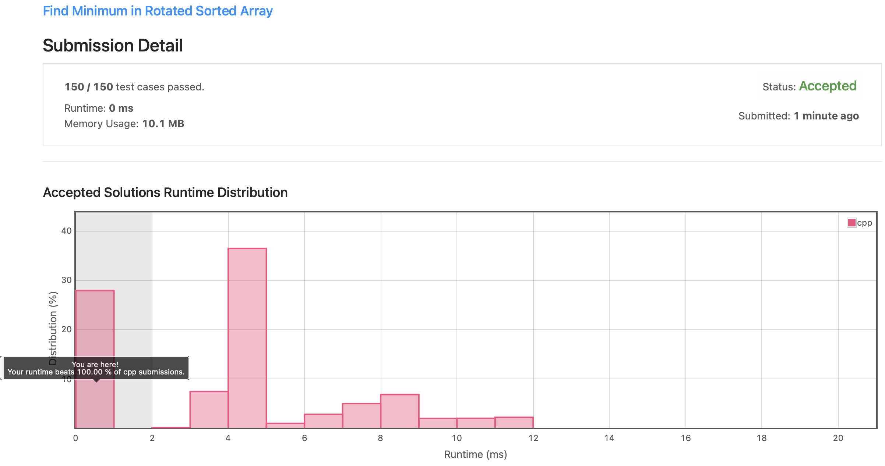

# Leetcode 153. Find Minimum in Rotated Sorted Array (C++)

Date: 2021.09.20

## 문제

https://leetcode.com/problems/find-minimum-in-rotated-sorted-array/

- input: 오름차순 정렬 후 rotation된 정수형 배열 nums
- output: 주어진 배열에서 min 값 출력
- constraint: 시간 복잡도 O(log n) 내로 작성

## 알고리즘

### 이진 탐색

정렬 후 특정 횟수만큼 회전된 배열 중 최솟값을 찾는 문제로, 최솟값이 위치하는 상대 위치를 따라서 이진 탐색을 하다보면 쉽게 풀 수 있는 문제다.

Divde and conquer를 적용하여 다음과 같은 순서로 코드를 구현했다.

1. middle 값을 기준으로 왼쪽과 오른쪽의 오름차순 여부를 판단한다.

    - 왼쪽, 오른쪽 모두 오름차순에 해당된다면, 전체 배열이 오름차순으로 정렬된 상태로 가장 왼쪽의 값이 최솟값이다.
    - 어느 한 방향만 오름차순에 해당된다면, 오름차순으로 정렬되지 않은 방향에 최솟값이 위치한다.

2. 탐색을 계속하며 최솟값을 업데이트한다.

### 시간 복잡도

Divide and conquer 방식을 사용할 경우 탐색을 반복할 때마다 탐색 대상이 1/2 씩 줄어든다. 따라서 본 코드는 O(log n)의 시간 복잡도를 갖는다.

## 제출 코드 (C++)

```C++
class Solution {
private:
    int left, right;
    int min;
public:
    int findMin(vector<int>& nums) {
        left = 0, right = nums.size()-1;
        min = nums[0];
        
        while(left <= right){

            //원소가 하나일 경우 min 없데이트
            if(left == right){
                if(nums[left] < min) min = nums[left];
                break;
            }
            
            // middle 값 선정 후 min 업데이트
            int middle = (left + right) / 2;
            if(nums[middle] < min) min = nums[middle];
            
            // middle을 기준으로 좌우의 오름차순 여부 판단
            // 좌우 모두 오름차순일 경우 가장 left 값이 min
            if(nums[left] <= nums[middle] && nums[middle] <= nums[right]){
                if(nums[left] < min) min = nums[left];                
                break;
            }
            // 한 방향만 오름차순일 경우 오름차순이 아닌 방향에 min 위치
            else if(nums[left] <= nums[middle])
                left = middle+1;
            else
                right = middle-1; 
        }
        
        return min;
    }
};
```

