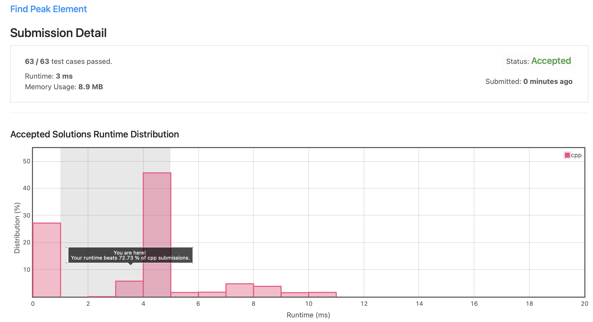

# Leetcode 162. Find Peak Element (C++)

Date: 2021.09.20

## 문제

https://leetcode.com/problems/find-peak-element/

- input: 정수형 배열 nums
- output: 주어진 배열에서 peek index 중 하나 출력
- constraint: 시간 복잡도 O(log n) 내로 작성

## 알고리즘

### 이진 탐색

정렬되지 않은 배열에서 peek 원소를 찾는 문제다. peek 원소란 본인의 데이터 값이 좌우에 있는 데이터 값보다 큰 원소를 말한다. Divde and conquer를 적용하여 다음과 같은 순서로 코드를 구현했다.

1. middle 값을 기준으로 middle 값이 peek인지 확인한다.

    - 만약 middle의 index가 0 또는 n-1 이라면, 즉, 배열의 양 끝에 존재한다면 각각 오른쪽 또는 왼쪽의 데이터와만 비교한다.

2. middle 값의 바로 왼쪽과 오른쪽 원소의 peek 가능성 여부를 판단한다.

    - peek 가능성이 있는 방향으로 이동하여 탐색을 반복한다.
  
3. 탐색을 반복하다가 peek 원소를 찾을 경우 해당 index를 반환하고 프로그램을 종료한다.

### 시간 복잡도

Divide and conquer 방식을 사용할 경우 탐색을 반복할 때마다 탐색 대상이 1/2 씩 줄어든다. 따라서 본 코드는 O(log n)의 시간 복잡도를 갖는다.

## 제출 코드 (C++)

```C++
class Solution {
public:
    int findPeakElement(vector<int>& nums) {
          
        int n = nums.size();
        int left = 0, right = n-1;

        while(left <= right){
            
            int middle = (left + right) / 2;
            
            if((middle == 0 || nums[middle] > nums[middle-1]) &&
               (middle == n-1 || nums[middle] > nums[middle+1])){
                return middle;
            }
            if(nums[middle+1] > nums[middle])
                left = middle + 1;
            else
                right = middle - 1;
            
        }
        return -1;
    }
};
```

