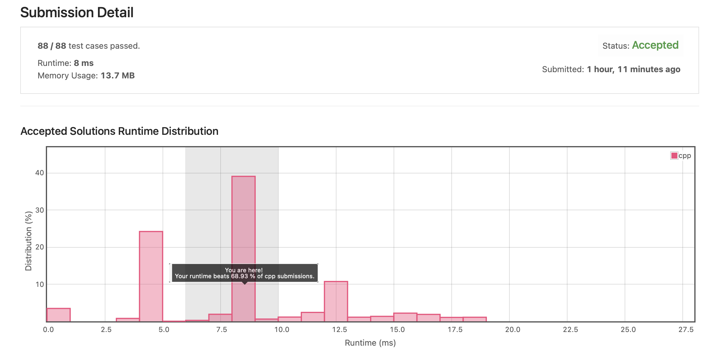
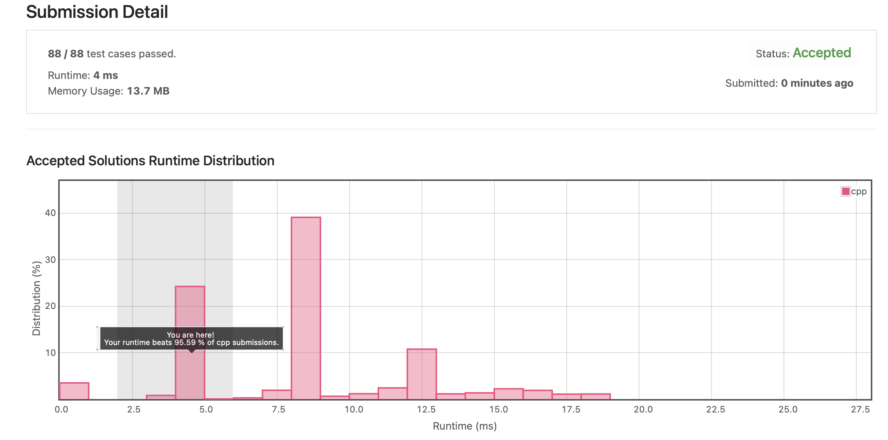
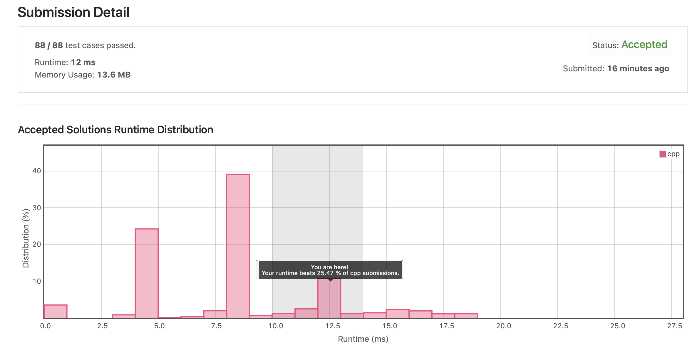

# Leetcode 34. Find First and Last Position of Element in Sorted Array (C++)

## 문제

https://leetcode.com/problems/find-first-and-last-position-of-element-in-sorted-array/

- input: 오름차순 정렬된 정수형 배열 nums, 정수 target
- output: 주어진 배열에서 target이 위치한 처음과 끝 index를 정수 배열으로 반환
- constraint: 시간 복잡도 O(log n) 내로 작성

## 알고리즘

### 이진 탐색

O(log n)의 시간 복잡도로 코드를 작성해야 했기 때문에 Divide and Conquer 방식으로 이진 탐색을 구현했다.

target에 해당되는 index가 여러개 있을 수 있기 때문에, target 하나 찾더라도 좌우에 target 값이 얼마나 더 있는지 확인하는 과정이 필요했다. 이렇게 접근하면 코드가 복잡하고 비효율적이 될 것 같아, target 값을 갖는 가장 작은 index를 찾는 searchLeft 함수와 target 값을 갖는 가장 오른쪽 index를 찾는 searchRight 함수를 따로 구현했다.

### 시간 복잡도

Divide and conquer 방식을 사용할 경우, 탐색을 반복할 때마다 탐색 대상이 1/2 씩 줄어든다. 따라서 각 searchLeft(), searchRight() 함수는 log n의 시간 복잡도를 갖고, 최종적으로 2*log n 의 시간 복잡도를 갖는 코드를 작성할 수 있다. 

## 1차 작성 코드 (C++)

```C++
class Solution {
public:
    vector<int> searchRange(vector<int>& nums, int target) {        

        vector<int> index = {-1, -1};
        
        if(nums.size()==0) return index;
        
        if(nums[0]==target)
            index[0] = 0;
        else
            searchLeft(nums, 0, nums.size()-1, target, index);
        
        if(nums[nums.size()-1]==target)
            index[1] = nums.size()-1;
        else
            searchRight(nums, 0, nums.size()-1, target, index);
        
        return index;
    }
    
    static void searchLeft(vector<int>& nums, int first, int last, int target, vector<int>& index){

        if(first > last) return;
        
        else if(first == last){
            if(nums[first] == target) index[0] = first;
            return;
        }
        
        int middle = (first + last) / 2;

        if(nums[middle] < target)
            searchLeft(nums, middle+1, last, target, index);
        
        else if(nums[middle] > target)
            searchLeft(nums, first, middle-1, target, index);
        
        else{
            if(nums[middle-1] == target)
                searchLeft(nums, first, middle-1, target, index);
            else
                index[0] = middle;
        }

    }
    
    static void searchRight(vector<int>& nums, int first, int last, int target, vector<int>& index){
        
        if(first > last) return;
        
        else if(first == last){
            if(nums[first] == target) index[1] = last;
            return;
        }
        
        int middle = (first + last) / 2;

        if(nums[middle] < target)
            searchRight(nums, middle+1, last, target, index);
        
        else if(nums[middle] > target)
            searchRight(nums, first, middle-1, target, index);
        
        else{
            if(nums[middle+1] == target)
                searchRight(nums, middle+1, last, target, index);
            else
                index[1] = middle;
        }
        
    }
};
```



## 회고 및 수정 (C++)

### 1. Left, Right 함수를 하나의 함수로 표현하기

제출 후에 코드를 다시 보니, SearchLeft와 SearchRight 함수의 대부분이 겹친다는 것을 알게 되었다. 두 함수를 하나의 함수로 표현하면 더 효율적인 코드가 되지 않을까? 라고 생각했고, searchLeft와 searchRight 를 합친 searchLR 을 새로 작성했다.

변경한 부분은 아래 두 가지다.

1. searchLeft와 searchRight 함술를 searchLR로 통합
2. Left, Right range 중 어느 것을 탐색 중인지 확인하기 위해 함수 인자에 mode 추가

```C++
class Solution {
public:
    vector<int> searchRange(vector<int>& nums, int target) {        

        vector<int> index = {-1, -1};
        
        if(nums.size()==0) return index;
        
        if(nums[0]==target)
            index[0] = 0;
        else
            searchLR(nums, 0, nums.size()-1, target, index, 0);
                
        if(nums[nums.size()-1]==target)
            index[1] = nums.size()-1;
        else
            searchLR(nums, 0, nums.size()-1, target, index, 1);
        
        return index;
    }
    
    //변경한 함수 (searchLeft + searchRight)
    static void searchLR(vector<int>& nums, int first, int last, int target, vector<int>& index, int mode){

        if(first > last) return;
        
        else if(first == last){
            if(nums[first] == target) index[mode] = first;
            return;
        }
        
        int middle = (first + last) / 2;
        
        if(nums[middle] < target)
            searchLR(nums, middle+1, last, target, index, mode);
        
        else if(nums[middle] > target)
            searchLR(nums, first, middle-1, target, index, mode);
        
        // target을 찾았을 때만 mode값 활용
        else{
            if(mode==0 && nums[middle-1] == target)
                searchLR(nums, first, middle-1, target, index, mode);
            else if(mode==1 && nums[middle+1] == target)
                searchLR(nums, middle+1, last, target, index, mode);
            else{
                index[mode] = middle;
            }
        }

    }
};
```

Runtime이 8ms 에서 4ms로 감소했다.




### 2. Right 범위를 구할 때, 사전에 구한 Left 값을 참조하기

내가 사용한 알고리즘은

1. target에 해당하는 left range를 구하고
2. 그 후에 target값에 해당되는 right range를 구한다.
   
이 때, right range를 구할 때 탐색을 1에서 구한 left range부터 시작하게 한다면, 더 빠른 탐색이 가능할 것이라고 생각하고 탐색을 시작할 index에 0 대신 index[0] 값을 넣어줬다.

변경한 부분은 아래 두 가지다.

1. searchLR 함수를 호출할 때 0을 index[0]으로 변경
2. searchLR 함수 내에서 first가 -1인지 검사하는 부분 추가

결론적으로 아래 코드는 Runtime이 12ms로, 첫 번째 작성한 코드보다도 훨씬 느리게 동작했다. 변경 사항 중 어떤 부분이 runtime을 늘어나게 만드는 건지 아직 이해가 잘 안 가지만 더 찾아봐야할 것 같다.

```C++
class Solution {
public:
    vector<int> searchRange(vector<int>& nums, int target) {        

        vector<int> index = {-1, -1};
        
        if(nums.size()==0) return index;
        
        if(nums[0]==target)
            index[0] = 0;
        else
            searchLR(nums, 0, nums.size()-1, target, index, 0);
                
        if(nums[nums.size()-1]==target)
            index[1] = nums.size()-1;
        else
            //변경한 부분. 0 대신 index[0]을 넘겨줬다.
            searchLR(nums, index[0], nums.size()-1, target, index, 1);
        
        return index;
    }
    
    static void searchLR(vector<int>& nums, int first, int last, int target, vector<int>& index, int mode){

        //변경한 부분. first 가 -1일 경우 함수 종료.
        if(first == -1 || first > last) return;
        
        else if(first == last){
            if(nums[first] == target) index[mode] = first;
            return;
        }
        
        int middle = (first + last) / 2;
        
        if(nums[middle] < target)
            searchLR(nums, middle+1, last, target, index, mode);
        
        else if(nums[middle] > target)
            searchLR(nums, first, middle-1, target, index, mode);
        
        else{
            if(mode==0 && nums[middle-1] == target)
                searchLR(nums, first, middle-1, target, index, mode);
            else if(mode==1 && nums[middle+1] == target)
                searchLR(nums, middle+1, last, target, index, mode);
            else{
                index[mode] = middle;
            }
        }

    }
};
```

