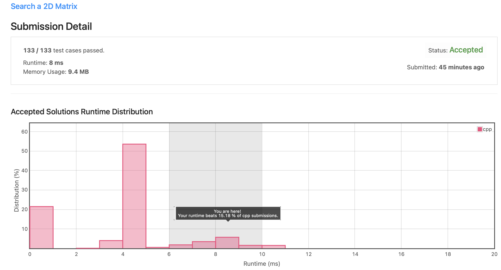
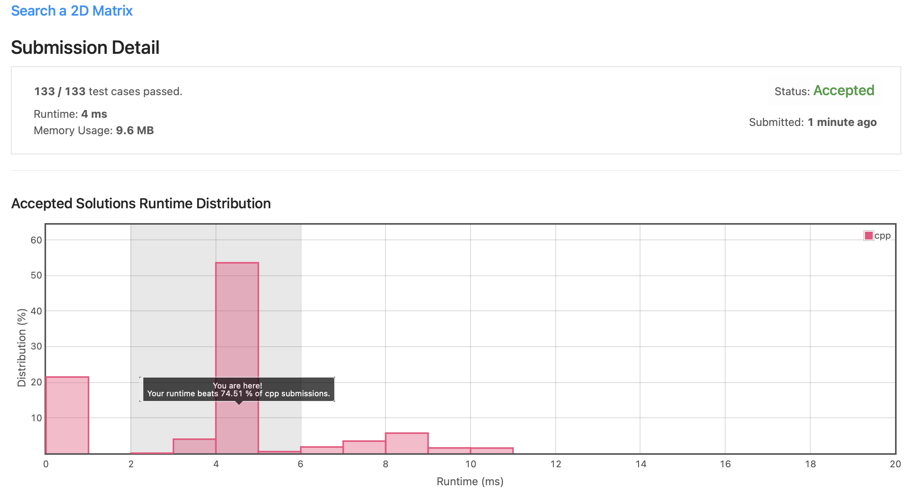

# Leetcode 74. Search a 2D Matrix (C++)

Date: 2021.09.17

## 문제

https://leetcode.com/problems/search-a-2d-matrix/

- input: 오름차순 정렬된 정수형 2차원 배열 matrix, 정수 target
- output: 주어진 배열에서 target이 위치하면 true, 아니면 false 반환

## 알고리즘

### 이진 탐색

간단하게 풀 수 있는 문제였다. 2차원 배열이긴 하나 이미 오름차순으로 정렬되어 있어 이진 탐색을 쉽게 적용할 수 있다. 배열의 크기는 최대 100x100으로 사실 for문으로 순차 탐색을 해도 충분히 풀 수 있는 문제였다.

Divde and conquer를 적용하여 다음과 같은 순서로 코드를 구현했다.

1. 첫 번째 column에 위치한 숫자들을 탐색하며 target이 위치할 가능성이 있는 row 선택
2. 선택한 row에서 target을 찾으면 true 반환, 찾지 못하면 false 반환

### 시간 복잡도

Divide and conquer 방식을 사용할 경우, 탐색을 반복할 때마다 탐색 대상이 1/2 씩 줄어든다. Col 방향 탐색, Row 방향 탐색 각각 log n의 시간 복잡도를 갖는다.

## 제출 코드 (C++)

### Binary Search


```C++
class Solution {
public:
    bool searchMatrix(vector<vector<int>>& matrix, int target) {
        
        int tr = -1;
        int first = 0, last = matrix.size()-1;
        
        while(first <= last){
            int middle = (first + last) / 2;  
            
            if(matrix[middle][0] > target)
                last = middle - 1;
            else if(middle + 1 < matrix.size() && matrix[middle + 1][0] <= target)
                first = middle + 1;
            else{
                tr = middle;
                break;
            }
        }
        if(tr == -1) return false;

        first = 0, last = matrix[0].size()-1;
        while(first <= last){
            
            int middle = (first + last) / 2;  
            
            if(matrix[tr][middle] > target)
                last = middle - 1;
            else if(matrix[tr][middle] < target)
                first = middle + 1;
            else{
                return true;
            }
        }
        
        return false;
    }    
};
```


### Sequential Search

참고용으로 순차 탐색 코드도 같이 올려둔다.

```C++
class Solution {
public:
    bool searchMatrix(vector<vector<int>>& matrix, int target) {
        
        int curr = -1;
        for(int i = 0; i < matrix.size(); i++){
            if(matrix[i][0] <= target && matrix[i][c-1] >= target){
                curr = i;
                break;
            }
        }        
        if(curr== -1) return false;
        
        for(int i = 0; i < matrix[0].size(); i++){
            if(matrix[curr][i] == target) return true;
            else if(matrix[curr][i] > target) return false;
        }
        
        return false;
    }
};
```



## 회고 및 수정 (C++)

Row와 Col을 굳이 구분하지 않고 연속된 리스트처럼 생각하고 다시 코드를 작성했다. 특별히 런타임이 빨라진 것은 아니지만 코드는 훨씬 간결해졌다.

```C++
class Solution {
public:
    bool searchMatrix(vector<vector<int>>& matrix, int target) {
                
        int r = matrix.size();
        int c = matrix[0].size();
        if(r == 0 || c == 0) return false;
        
        int first = 0, last = r*c - 1;
        
        while(first <= last){
            int middle = (first + last) / 2;
            int cur = matrix[middle/c][middle%c];
            
            if(cur > target)
                last = middle - 1;
            else if(cur < target)
                first = middle + 1;
            else{
                return true;
            }
        }
        
        return false;
    }    
};
```

