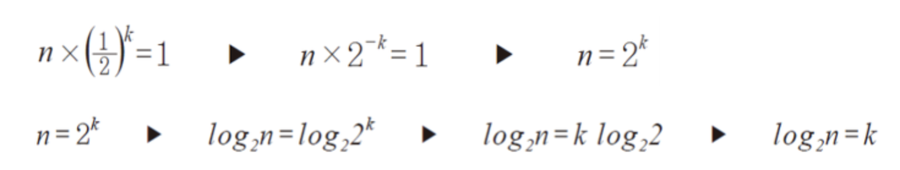

# Binary Search

## 이진 탐색(Binary Search)이란?

이진 탐색은 **정렬된 배열**에서 적용할 수 있는 고속 탐색 기법이다.

## 이진 탐색 과정

이진 탐색은 전체 배열을 반으로 나누고, 반으로 나눈 두 영역 중 찾고자 하는 타겟이 없는 영역을 제거하는 과정을 반복함으로써 타겟 값을 탐색한다.

크기가 N인 배열이 있다고 생각해보자. 타겟이 있을 가능성이 있는 index 범위를 (left, right)라고 하자.

1. (left, right) 값을 (0, N-1)으로 초기화한다.
2. (left, right) 범위의 중간 지점을 mid로 잡고, mid 값을 기준으로 타겟의 상대 위치를 판단한다.
   
   - 타겟이 mid 값보다 작다면, (left, right) 범위를 (left, mid-1) 으로 업데이트한다.
   - 타겟이 mid 값보다 크다면, (left, right) 범위를 (mid+1, right) 으로 업데이트한다.
   - 타겟이 mid 값과 같다면, 탐색이 완료되었다.

3. 업데이트된 범위를 기준으로 2번 과정을 반복한다.

   - 만약 left > right 인 상황이 온다면, 타겟이 없는 것으로 판단하고 탐색을 종료한다.

아래 자료를 보면 이진 탐색을 시각적으로 이해할 수 있을 것이다.

- Average Case

    

- Worst Case

    

- Best Case

    

## 이진탐색 Pseudo Code

### Pseudo Code 1. Recursive 
```C++
BinarySearch(arr[], Left, Right, target) {

	if (Left > Right) return -1;

    Mid = (Left + Right)/2);
    
    if (target == A[Mid]) return Mid;
    else if (target < A[Mid]) BinarySearch(A, Left, Mid-1, x);
    else (target > A[Mid]) BinarySearch(A, Mid+1, Right, x);

}
```

### Pseudo Code 2. Non-recurvise (While문 사용)
```C++
BinarySearch(arr[], Left, Right, target) {

    while(Left <= Right){

        Mid = (Left + Right)/2);
    
        if (target == A[Mid]) return Mid;
        else if (target < A[Mid]) Right = Mid - 1;
        else (target > A[Mid]) Left = Mid + 1;

    }

}
```

## 이진 탐색 성능

이진 탐색은 평균적으로 O(log n)의 시간 복잡도를 갖는다.

이진 탐색에서는 탐색을 반복할 때마다 탐색 대상이 1/2 씩 줄어든다. 데이터의 개수가 n인 배열에서, 탐색 대상을 1/2씩 줄이는 과정을 k번 반복하여 결국 1개의 탐색 대상만을 남겼다고 생각해보자. 이것을 수식으로 나타내면 첫 번째 식을 얻을 수 있다. 첫 번째 수식을 시간인 k를 기준으로 정리하면, k = log n 이라는 시간 복잡도를 얻을 수 있다.



### Time Complexity

- Best Case: O(1)
- Worst Case: O(log n)
- Average Case: O(log n)

### Space Complexity

- Non-recursive: O(1)
- Recursive: O(log n)

