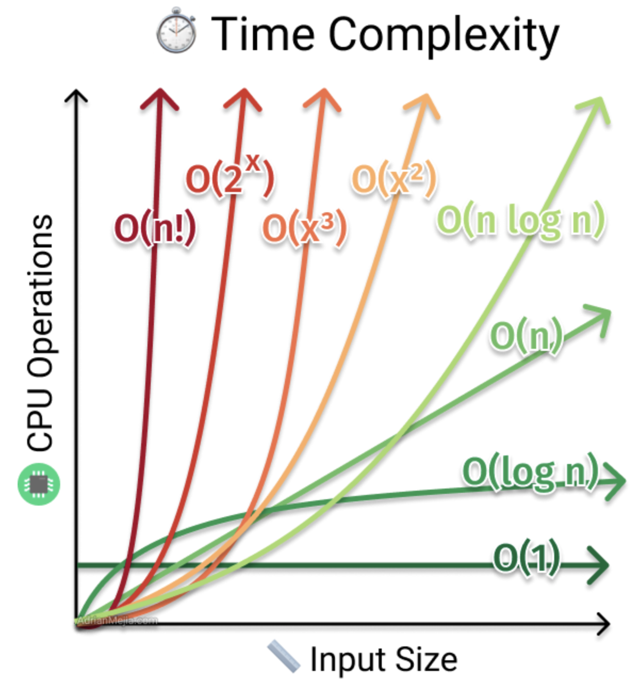
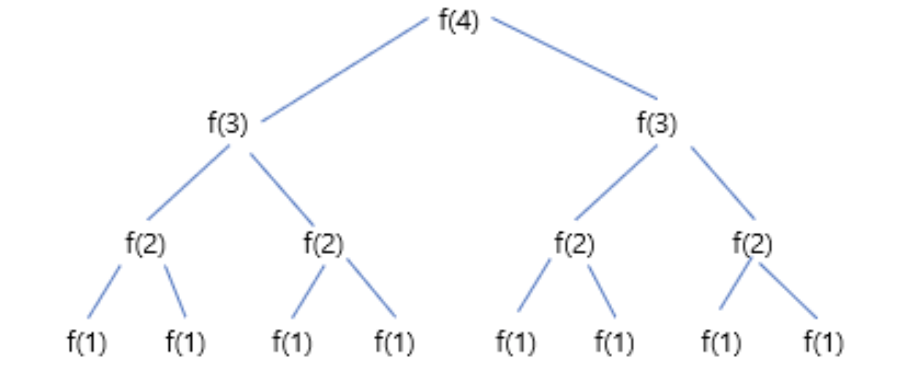

# Big O

## 이 페이지를 읽으면 알 수 있는 것

- 시간 복잡도, 공간 복잡도는 무엇인가?
- Big-O, Big-$\theta$, Big-$\Omega$ 의 차이는 무엇인가?
- 상환 시간이란 무엇인가?
- O(logN)과 O(2<sup>N</sup>)의 시간 복잡도는 어떻게 구할 수 있는가?

## 시간 복잡도 (Big-O)

### Big O는 왜 중요한가?

USB에 있는 파일을 다른 지역에 살고 있는 친구에게 가능한 한 빨리 보려고 한다면, 어떻게 보내야 할까? 많은 사람들이 이메일 등 온라인을 통한 전송 방법을 생각하겠지만, 경우에 따라 이것은 가장 좋은 방법이 아닐 수도 있다.

만약 파일 크기가 작다면 당연히 온라인을 통한 전송이 빠를 것이다. 하지만 파일 크기가 1테라 바이트라면 어떨까? 1테라 바이트의 데이터를 온라인으로 전송하기 위해서는 하루 이상 소요될 수도 있다. 이 경우에는 아무리 거리가 멀더라도 USB를 비행기를 태워 보내는 것이 더 빠른 방법일 수 있다.

이것이 Big-O에 대한 개념이다. 우리는 데이터 전송이라는 알고리즘의 실행 시간을 다음과 같이 설명할 수 있다.

- 온라인 전송: O(s), s는 파일의 크기다. 파일의 크기에 따라 전송 시간이 선형적으로 증가한다. (단순하게 가정했다.)
- 비행기를 통한 전송: O(1), 파일의 크기가 증가한다고 해서 전송 시간이 늘어나지 않는다.

상수의 값이 얼마나 큰지, 선형식의 기울기가 어떤지는 중요하지 않다. 숫자가 커지다 보면 선형식은 언젠가 반드시 상수를 뛰어넘게 된다. 가장 흔하게 사용되는 시간 복잡도는 O($logN$), O($NlogN$), O($N$), O($N^2$), O($2^N$) 등이 있다.

### Big-O, Big-$\theta$, Big-$\Omega$

알고리즘의 수행 시간을 표기할 때 Big-O, Big-$\theta$, Big-$\Omega$를 사용한다.

- O(Big-O)
  - Big-O는 시간의 상한을 나타낸다. O(N)의 시간 복잡도를 가지는 어떤 알고리즘은 O($N^2$), O($2^N$) 등으로도 나타낼 수 있다. 즉, 알고리즘의 수행 시간은 이들 중 하나보다 빠르기만 하면 되는 것이다.
- $\Omega$(Big-$\Omega$)
  - Big-$\Omega$는 시간의 하한을 나타낸다. $\Omega$(N)인 알고리즘은 $\Omega$(1) 또는 $\Omega$($logN$)으로도 표현할 수 있다. 즉, 알고리즘이 $\Omega$ 수행 시간보다 빠를 수 없음을 표시한다.
- $\theta$(Big-$\theta$)
  - Big-$\theta$는 O와 $\Omega$ 모두를 의미한다. 즉, 어떤 알고리즘의 수행 시간이 O(N)이면서 $\Omega$(N)이라면, 이 알고리즘의 수행 시간을 $\theta$(N)이라고 표현할 수 있다.

## 공간 복잡도

알고리즘에서는 시간뿐 아니라 메모리 또한 신경을 써야 한다. 크기가 n인 배열을 만들고자 한다면, O(n)의 공간이 필요하고, n X n 크기의 2차원 배열을 만들고자 한다면 O($n^2$)의 공간이 필요하다. 재귀 함수에서 호출하는 스택 공간 또한 공간 복잡도 계산에 포함된다.

예를 들어 아래 코드는 O(n) 시간과 O(n) 공간을 사용한다. 호출될 때마다 스택의 깊이가 깊어지기 때문이다.

```C
int sum(int n) {
  if (n <= 0) {
    return 0;
  }
  return n + sum(n-1);
}
```

참고로, 아래 코드처럼 단순히 함수를 n 번 호출했다고 해서 공간 복잡도가 증가하는 것은 아니다. 아래 코드는 함수를 O(n) 번 호출하지만, 함수들이 스택에 동시에 존재하는 것이 아니기 때문에 O(1)의 공간 복잡도를 갖는다.


```C
int sum(int n) {
  int sum = 0;
  for(int i = 0; i < n; i++) {
    sum += pairsum(i, i+1);
  }
  return sum;
}
```

## 주의할 점

### 상수항과 계수는 무시하기

big-O는 데이터의 크기에 따라 수행 시간이 증가하는 비율을 표현해 주는 도구이기 때문에, O(N)과 O(2N)을 구분하지 않고 O(N)으로 표기한다.

### 지배적이지 않은 항은 무시하기

O($N^2+N$)과 같이 다항식의 경우 최고차 항만 남겨도 된다. 즉, O($N^2+N$)는 O($N^2$)으로, O($N+logN$)은 O(N)으로 표기한다. 하지만 두 개의 변수가 개입하는 경우, 두 변수를 하나로 합치지는 않는다. O($B^2+A$)는 더 이상 단순화할 수 없다.



### 여러 단계로 이루어진 알고리즘: 덧셈 vs 곱셈

아래 두 경우는 시간 복잡도를 어떻게 표현할 수 있을까?

```C
# case 1
for(int a : arrA) {
  print(a);
}

for(int b : arrB) {
  print(b);
}
```

```C
# case 2
for(int a : arrA) {
  for(int b: arrB) {
    print(a + "," + b);
  }
}
```

case 1에서는 A의 일을 처리한 후에 B의 일을 수행하기 때문에 전체 수행 시간은 O(A+B)가 된다. case 2의 경우 A의 각 원소에 대해 B의 일을 수행하므로, 전체 수행 시간은 O(A*B)가 된다. 정리하면 다음과 같다.

- 알고리즘이 "A의 일을 모두 끝마친 후에 B의 일을 수행하라"의 형태라면 A와 B의 수행 시간을 더해야 한다.
- 알고리즘이 "A의 일을 할 때마다 B의 일을 수행하라"의 형태라면 A와 B의 수행 시간을 곱해야 한다.

## 상환 시간

ArrayList는 크기가 자유롭게 조절되는 자료구조이다. 원소 삽입 시 필요에 따라 배열의 크기를 증가시킬 수 있다. 배열의 용량이 모두 찼을 때, ArrayList는 기존보다 크기가 두 배 더 큰 배열을 만든 후, 이전 배열의 모든 원소를 새 배열로 복사한다.

ArrayList의 삽입 연산의 수행 시간을 생각해 보자. 일반적으로 배열에 충분한 공간이 있을 경우 삽입 연산은 O(1)의 수행 시간을 갖는다. 하지만, 배열이 가득 차 있다면? 크기가 2N인 새로운 배열을 만들고 기존 배열을 모두 복사해야 하기 때문에, 이 경우 삽입 연산은 O(N)이 소요된다.

그렇다면 삽입 연산의 전체 수행 시간은 어떻게 표현할 수 있을까? 여기서 **상환 시간**이라는 개념을 적용하면 쉽게 구할 수 있다. 상환 시간이란, 최악의 경우는 가끔 발생하지만 한번 발생하면 그 후로 꽤 오랫동안 나타나지 않으므로 수행 시간을 분할 상환한다는 개념이다.

크기가 N인 ArrayList는 자료가 N개 들어왔을 때마다 배열이 가득 차 O(N)의 삽입 연산을 수행한다. 즉, O(N)을 N의 시간으로 분할 상환한다면 삽입 한 번에 필요한 시간은 O(1)이 되는 것이다.

## LogN 수행 시간

O(LogN) 수행 시간에 대해 알아보자. 어떻게 LogN이라는 수행 시간이 나올 수 있는지 언뜻 보기에는 쉽게 이해가 되지는 않는다.

O(LogN)의 수행 시간을 갖는 알고리즘은 대표적으로 이진 탐색(Binary Search)이 있다. 이진 탐색은 N개의 정렬된 원소가 있는 배열에서 사용하는 고속 탐색 기법으로, 탐색을 반복할수록 탐색 대상이 절반으로 줄어드는 특징을 갖는다.

- 이진 탐색 개념 바로가기: [Binary Search](/Algorithm/BinarySearch/README.md)

초기 탐색 대상은 N개의 원소지만, 단계가 지날수록 탐색 대상은 N/2, N/4, N/8 ... 1으로 감소한다. 이를 역으로 생각해서 탐색 대상이 1 .. N/4, N/2, N 으로 증가하는 형태라고 생각해 보자. '숫자 1에 2를 몇 번을 곱해야 N이 될까?'를 수식으로 표현하면 다음과 같다.

- $1 * 2^K = N$

이 수식을 수행 횟수, 즉 수행 시간인 K에 대해 정리하면 아래와 같은 시간 복잡도를 얻을 수 있다.

- $K = log_2N$

어떤 문제에서 원소의 개수가 절반씩 줄어든다면, 그 문제의 수행 시간은 O(logN)일 가능성이 높다.

## 재귀함수에서의 수행 시간 (N<sup>2</sup>)

다음 코드의 수행 시간을 구해보자.

```C
int f(int n){
  if (n <= 1){
    return 1;
  }
  return f(n - 1) + f(n - 1);
}
```
f 함수가 두 번 호출된 것을 보고 성급히 O($N^2$)라고 결론을 내렸다면 틀렸다. 수행 시간을 추측하지 말고 직접 계산해 봐야만 한다.



깊이가 깊어질수록 함수를 호출하는 횟수는 2배씩 늘어난다. 깊이가 N이라면 전체 노드의 개수는 $2^0 + 2^1 + 2^2 + ... + 2^N$ 이고, 식을 정리하면 f 함수는 O($2^N$)의 시간 복잡도를 갖는다.

다수의 호출로 이루어진 재귀 함수의 수행 시간은 O(분기<sup>깊이</sup>)의 시간 복잡도를 갖는 경우가 많다. 

## Reference

모든 설명과 예시는 아래 책을 참고했다.

- Cracking the Code Interview / Gayle Laakmann McDowell