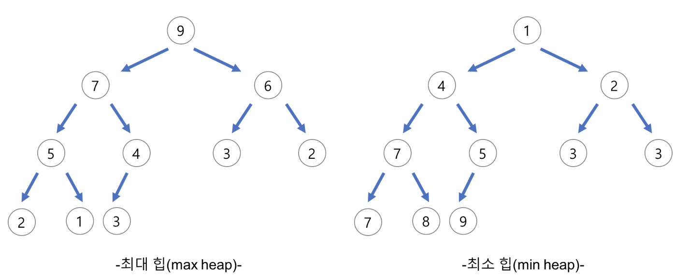
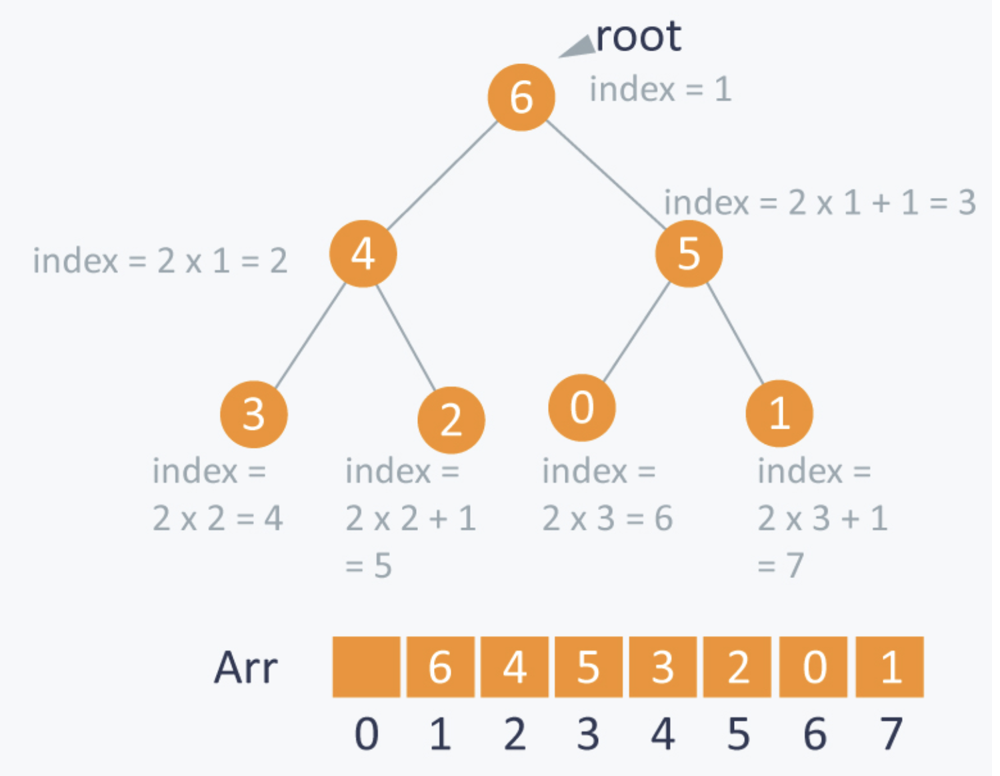

# Binary Heap

## 이 페이지를 읽으면 알 수 있는 것

- 이진 힙이란 무엇인가?
- 이진 힙의 시간 복잡도는 무엇인가?
- 이진 힙의 동작은 어떻게 구현할 수 있는가? (C++)

## 이진 힙(Binary heaps)

이진 힙은 완전 이진 트리를 기본으로 하는 자료 구조로, 여러 개의 값들 중에서 최댓값이나 최솟값을 빠르게 찾아는 데 특화되어 있다. 힙은 느슨한 정렬 상태를 갖고 있으며, 정렬 상태가 오름차순이면 최소힙(min-heaps), 내림차순이면 최대힙(max-heaps)라고 불린다.



- 최대 힙(Max-heaps)
  
  - 부모 노드의 값이 자식 노드의 값보다 크거나 같은 완전 이진 트리
  - 루트는 트리 전체에서 가장 큰 값을 가진다.

- 최소 힙(Min-heaps)

  - 부모 노드의 값이 자식 노드의 값보다 작거나 같은 완전 이진 트리 
  - 루트는 트리 전체에서 가장 작은 값을 가진다.

## 힙의 구현

- 힙은 주로 배열로 구현된다.
- 구현을 쉽게 하기 위해 인덱스 1부터 사용하며, 각 인덱스는 왼쪽 상단부터 차례로 노드의 위치를 의미한다.
- 힙에서 부모 노드와 자식 노드의 인덱스 관계는 다음과 같다.

    

    - 왼쪽 자식 노드의 인덱스 = 부모 노드의 인덱스 * 2
    - 오른쪽 자식 노드의 인덱스 = 부모 노드의 인덱스 * 2 + 1
    - 부모 노드의 인덱스 = 자식 노드의 인덱스 / 2

## 시간 복잡도

- 최솟값/최댓값 탐색: O(1)
- 삽입: O(log n)
- 삭제: O(log n)

## 활용 예시

- 힙 정렬 (Heap Sort)
- 우선순위 큐 (Priority Queue)

## 최소힙 동작

### 최소값 탐색

최소힙에서 최소 원소를 찾는 것은 아주 간단하다. 최소 원소는 항상 루트에 존재하므로 루트 값을 반환하면 된다. 탐색의 시간 복잡도는 O(1)이다.

```C++
int findMin(){
    if(isEmpty()){
        cout << "Heap is Empty." << endl;
        return -1;
    }

    return heap[1];
}
```

### 최소힙 삽입

최소힙에 원소를 삽입한다고 가정해보자. 힙에 원소를 삽입할 때는 언제나 트리의 가장 밑바닥에서부터 삽입을 시작한다. 완전 트리의 속성에 위배되지 않게 마지막 노드로 삽입한 후, 해당 노드가 자리를 찾을 때까지 부모 노드와 교환한다. 힙에 있는 노드의 수를 n이라고 할 때, 삽입 연산은 O(log n) 시간이 소요된다.

```C++
void InsertHeap(int element){

    if(isFull()){
        cout << "Heap is full." << endl;
        return ;
    }

    int idx = ++heap_size;

    while(idx > 1 && heap[idx/2] > element){
        heap[idx] = heap[idx/2];
        idx /= 2;
    }
    heap[idx] = element;
}
```

### 최소힙 탐색 및 삭제

최솟값을 제거하기 위해서는 루트 노드의 값을 제거하고, 트리의 가장 마지막 노드를 루트 노드와 교환한다. 그 후 루트 노드를 자식 노드와 교환해가며 자리를 찾아 준다. 최소 힙에서는 주로 더 작은 값을 가진 자식과 교환해 나간다. 이 알고리즘 또한 O(log n)의 시간이 소요된다.

```C++
int DeleteHeap(){

    if(isEmpty()){
        cout << "Heap is empty." << endl;
        return -1;
    }

    int min = heap[1];
    int tmp = heap[heap_size--];
    int parent = 1, child = 2;

    while(child <= heap_size){
        if(child + 1 <= heap_size && heap[child] > heap[child+1])
            child++;
        
        if(heap[child] > tmp) 
            break;

        heap[parent] = heap[child];
        parent = child;
        child = parent * 2;

    }
    heap[parent] = tmp;
    return min;
}
```

## 최소힙 전체 코드 (C++)

```C++
#include<iostream>
using namespace std;

#define MAX_SIZE 100

class MinHeap{
private:
    int heap[MAX_SIZE];
    int heap_size;

public:

    MinHeap() : heap_size(0) {};
    ~MinHeap() {};

    bool isEmpty(){
        if(heap_size == 0) return true;
        else return false;
    }

    bool isFull(){
        if(heap_size == MAX_SIZE) return true;
        else return false;
    }

    int findMin(){
        if(isEmpty()){
            cout << "Heap is Empty." << endl;
            return -1;
        }

        return heap[1];
    }

    void InsertHeap(int element){

        if(isFull()){
            cout << "Heap is full." << endl;
            return ;
        }

        int idx = ++heap_size;

        while(idx > 1 && heap[idx/2] > element){
            heap[idx] = heap[idx/2];
            idx /= 2;
        }
        heap[idx] = element;
    }

    int DeleteHeap(){

        if(isEmpty()){
            cout << "Heap is empty." << endl;
            return -1;
        }

        int min = heap[1];
        int tmp = heap[heap_size--];
        int parent = 1, child = 2;

        while(child <= heap_size){
            if(child + 1 <= heap_size && heap[child] > heap[child+1])
                child++;
            
            if(heap[child] > tmp) 
                break;

            heap[parent] = heap[child];
            parent = child;
            child = parent * 2;

        }
        heap[parent] = tmp;
        return min;
    }

};

int main(){
    MinHeap h;

    h.InsertHeap(9);
    h.InsertHeap(3);
    h.InsertHeap(7);
    h.InsertHeap(4);
    h.InsertHeap(5);

    cout << "min: " << h.findMin() << endl; // min: 3

    h.DeleteHeap();
    cout << "min: " << h.findMin() << endl; // min: 4

    h.DeleteHeap();
    cout << "min: " << h.findMin() << endl; // min: 5

    return 0;
}
```

## Reference

- https://gmlwjd9405.github.io/2018/05/10/data-structure-heap.html
- https://www.hackerearth.com/practice/notes/heaps-and-priority-queues/