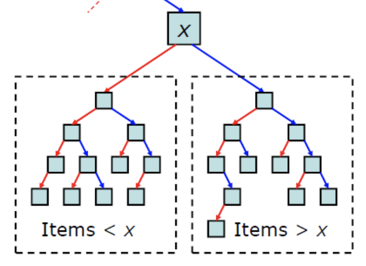
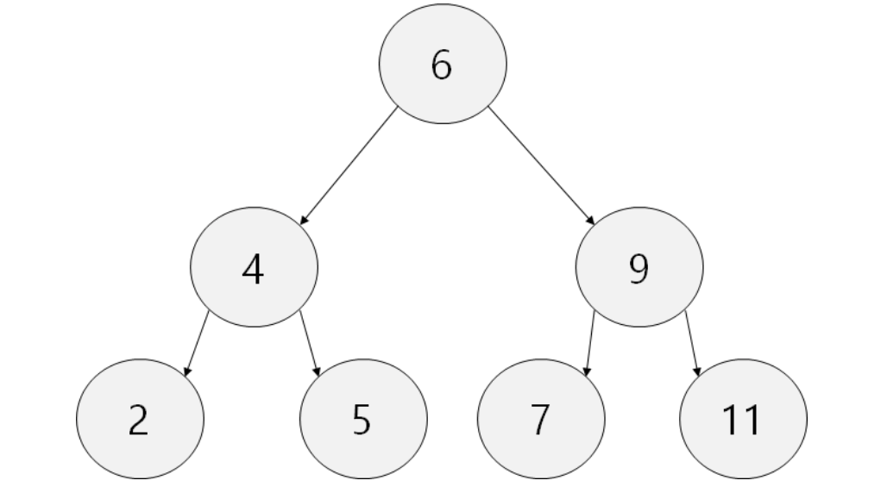
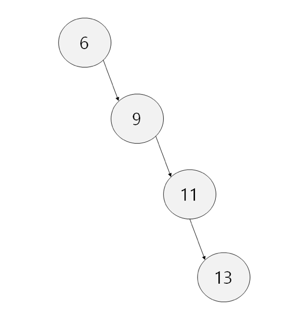
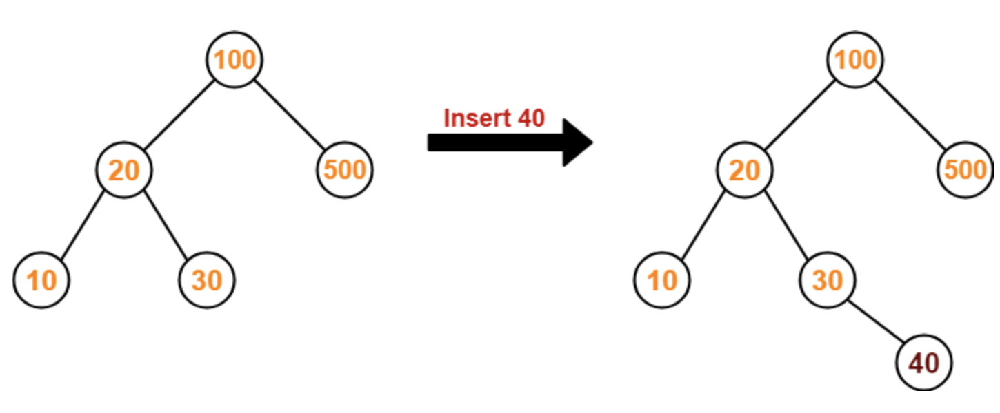
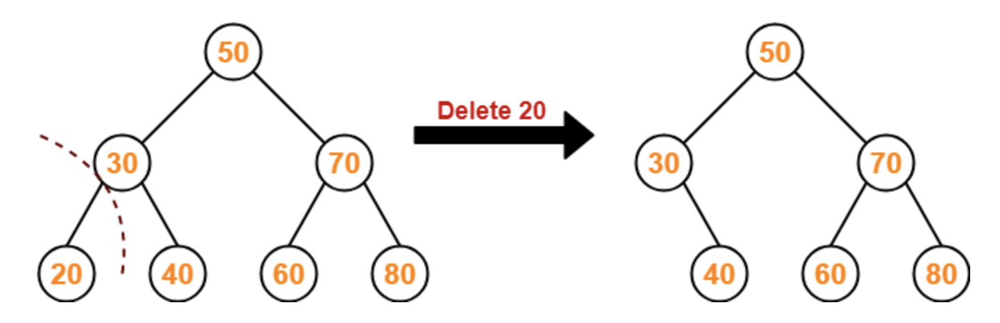
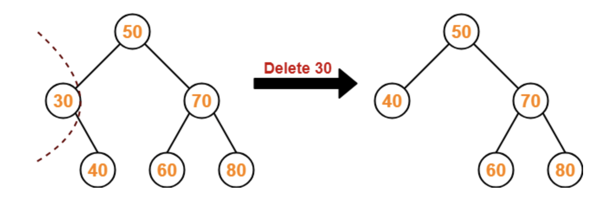
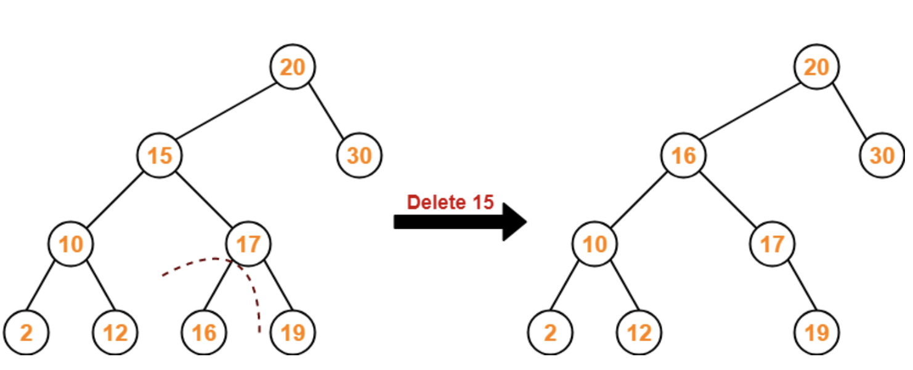

# Binary Search Tree

## 이 페이지를 읽으면 알 수 있는 것

- 이진 탐색 트리란 무엇인가?
- 이진 탐색 트리의 시간 복잡도는 무엇인가?
- 이진 탐색 트리는 어떻게 동작하는가?
- 이진 탐색 트리 코드로 구현하기 (C++)

## 이진 탐색 트리(Binary Search Tree)

이진 탐색 트리는 이진 탐색과 링크드 리스트의 결합으로, 이진 탐색의 효율적인 탐색 속도를 유지하면서도 자료의 삽입과 삭제를 가능하게 하는 자료 구조이다. 이진 탐색 트리는 다음과 같은 구조를 갖고 있다.



- 각 노드의 왼쪽 자식 트리에는 해당 노드의 값보다 작은 값을 지닌 노드들로 이루어져 있다.
- 각 노드의 오른쪽 자식 트리에는 해당 노드의 값보다 큰 값을 지닌 노드들로 이루어져 있다.
- 왼쪽 서브 트리, 오른쪽 서브 트리 또한 이진 탐색 트리이다.

중복 값을 처리하는 방식에 따라 이진 탐색 트리의 정의는 조금씩 달라질 수 있다. 어떤 곳에서는 중복 값을 가지면 안 된다고 말하고, 어떤 곳에서는 중복된 값이 왼쪽 혹은 오른쪽, 혹은 양쪽 어느 곳이든 존재할 수 있다고 말한다. 모두 맞는 정의라고 할 수 있지만 설명 시 주의하는 것이 좋다. 본 페이지에서는 중복값을 오른쪽 서브 트리에 포함시키는 방식으로 이진 탐색 트리를 구현했다.

## 시간 복잡도

### Average Case

균형 잡힌 BST의 경우 각 동작은 O(log n)의 시간이 소요된다.



- 탐색: O(log n)
- 삽입: O(log n)
- 삭제: O(log n)

### Worst Case

균형이 깨져 한 방향으로만 길게 늘어진 BST의 경우 사실상 linked list와 구조가 거의 비슷해 각 동작은 O(n)의 시간이 소요된다.



- 탐색: O(n)
- 삽입: O(n)
- 삭제: O(n)


## 장단점

- 장점

    - 입력 시 정렬된 상태로 위치가 지정되기 때문에 데이터 검색 속도가 빠르다.

- 단점

    - 최악의 경우 노드가 한 방향으로만 이어질 수 있다.
    - 이러한 단점을 보완한 자료 구조로는 AVL tree, red black tree 등이 있다.

## 동작

이진 탐색 트리의 모든 서브 트리는 이진 탐색 트리 속성을 만족해야만 한다. 따라서 이진 탐색 트리는 재귀적으로 구현될 수 있다. 

### 탐색

트리를 탐색하는 방법에는 pre-order, in-order, post-order 세 가지 방법이 있으며, 이진 탐색 트리는 주로 in-order 방식으로 탐색한다. 이진 탐색을 in-order로 구현할 경우 오름차순으로 정렬된 데이터를 얻을 수 있다는 장점이 있다.

in-order 방식의 탐색은 다음과 같은 순서로 동작한다.

1. root 노드에 접근하여 탐색을 시작한다.
2. 현재 노드를 기준으로 왼쪽 노드가 있을 경우 왼쪽 노드로 이동한다.
3. 더 이상 왼쪽 노드가 없을 경우 현재 노드의 key를 탐색한다.
4. 현재 노드를 기준으로 오른쪽 노드가 있을 경우 오른쪽 노드로 이동한다.
5. 2-4번의 과정을 반복한다.

```C++
// 탐색. 외부에서 root에 접근하지 않도록 함수 호출로 구현
void traversal(){
    _traversal(root);
    cout << endl;
}

// in-order 탐색
void _traversal(node *root){
    if(root == NULL) return ;
    
    _traversal(root->left);
    cout << root->key << " ";
    _traversal(root->right);
}
```

### 삽입

새로운 데이터를 삽입할 때는 이진 탐색 트리의 속성에 따라 새로운 데이터의 자리를 찾는 과정이 필요하다. 루트 노드부터 탐색을 시작하며, 새로운 데이터의 key 값이 현재 노드의 key 값보다 작으면 왼쪽 서브 트리로, 그렇지 않으면 오른쪽 서브 트리로 이동시키는 방식으로 자리를 찾아간다. 삽입 동작 순서를 정리하면 다음과 같다.



1. root 노드에 접근한다. 만약 root 노드가 비었다면 root 노드에 데이터를 삽입한다.
2. 현재 노드의 key 값보다 새로운 데이터의 key 값이 작다면, 왼쪽 서브 트리로 이동한다.
3. 현재 노드의 key 값보다 새로운 데이터의 key 값이 크거나 같다면, 오른쪽 서브 트리로 이동한다.
4. 2-3번 과정을 반복하다가 자식 노드가 없어 더 이상 서브 트리로 이동할 수 없다면, 빈 자식 노드에 새로운 데이터를 추가한다.

```C++
// BST가 비었을 경우 root에 삽입, 그렇지 않을 경우 재귀함수 호출
void insert(int val){
    if(isFull()){
        cout << "BST is full." << endl;
        return ;
    }

    node *newNode = new node(val);
    if(root == NULL)
        root = newNode;
    else
        _insert(root, newNode);
    size++;
}

// 루트 노드보다 큰지 작은지 판단하며 노드 이동 후 데이터 삽입
node* _insert(node *root, node *newNode){
    if(root == NULL) return newNode;

    if(newNode->key < root->key)
        root->left = _insert(root->left, newNode);
    else
        root->right = _insert(root->right, newNode);

    return root;
}
```

### 삭제

이진 탐색 트리의 삭제 동작은 조금 까다로운데, 삭제할 노드의 자식 노드의 개수에 따라 삭제 연산이 달라진다. 가장 먼저 탐색을 통해 제거할 값을 key로 갖는 노드로 이동하고, 해당 노드의 자식 수에 따라 다음 과정을 진행한다.

#### 삭제할 노드에 자식 노드가 없을 경우



   - 해당 노드를 그냥 제거한다.
   
#### 삭제할 노드에 한 개의 자식 노드만 있을 경우




   - 삭제할 노드의 부모 노드와 자식 노드를 연결하고, 원하는 노드를 삭제한다.

#### 삭제할 노드에 두 개의 자식 노드가 있을 경우



   - 삭제할 노드를 기준으로 `왼쪽 서브 트리에서 최댓값을 가진 노드` 혹은 `오른쪽 서브 트리에서 최솟값을 가진 노드`의 key 값을 삭제할 노드 위치로 이동시킨다.

```C++
// 데이터 삭제
bool erase(int val){

    if(isEmpty()){
        cout << "BST is empty." << endl;
        return -1;
    }

    bool chk = false;
    root = _erase(root, val, &chk);
    
    if(chk == true) size--; // 성공했을 경우에만 size 줄이기
    return chk;
}

// 노드 삭제
node* _erase(node *root, int val, bool *chk){
    if(root == NULL) return root;
    
    // 탐색
    if(val < root->key)
        root->left = _erase(root->left, val, chk);
    else if(val > root->key)
        root->right = _erase(root->right, val, chk);
    else{  // 원하는 노드를 찾았을 경우
        node *ptr = root;
        // 해당 노드에 자식 노드가 없는 경우
        if(root->left == NULL && root->right == NULL){
            root = NULL;
            delete ptr;
        }
        // 해당 노드의 오른쪽에마나 자식 노드가 있는 경우
        else if(root->left == NULL){
            root = root->right;
            delete ptr;
        }
        // 해당 노드의 왼쪽에만 자식 노드가 있는 경우
        else if(root->right == NULL){
            root = root->left;
            delete ptr;
        }
        // 해당 노드의 양쪽에 자식 노드가 있는 경우
        else{
            // 오른쪽 서브트리에서 가장 작은 값 찾기
            ptr = root->right;
            while(ptr->left != NULL)
                ptr = ptr->left;
            // 찾은 최소값을 루트에 저장 후 기존 노드 제거
            root->key = ptr->key;
            root->right = _erase(root->right, root->key, chk);
        }
        *chk = true;
    }

    return root;
}
```

## 이진 탐색 트리 전체 구현 코드 (C++)

이진 탐색 트리의 전체 구현 및 동작 확인 코드는 아래와 같다.

```C++
#include<iostream>
using namespace std;

#define MAX_SIZE 100

// BST의 각 node 정의
class node{
public:
    int key;
    node *left, *right;

    node() : key(0), left(NULL), right(NULL) {}; // 생성자
    node(int k) : key(k), left(NULL), right(NULL) {}; // 생성자 (초기값 설정)
    ~node() {}; // 소멸자
};

//BST class 정의
class BST{
private:
    node *root;
    int size;

public:
    BST() : root(NULL), size(0) {}; // 생성자
    ~BST() {}; // 소멸자

    // BST가 비었는지 확인
    bool isEmpty(){
        if(size == 0) return true;
        else return false;
    }

    // BST가 꽉 찼는지 확인
    bool isFull(){
        if(size == MAX_SIZE) return true;
        else return false;
    }
    
    // 탐색. 외부에서 root에 접근하지 않도록 함수 호출로 구현
    void traversal(){
        _traversal(root);
        cout << endl;
    }

    // in-order 탐색
    void _traversal(node *root){
        if(root == NULL) return ;
        
        _traversal(root->left);
        cout << root->key << " ";
        _traversal(root->right);
    }

    // BST가 비었을 경우 root에 삽입, 그렇지 않을 경우 재귀함수 호출
    void insert(int val){
        if(isFull()){
            cout << "BST is full." << endl;
            return ;
        }

        node *newNode = new node(val);
        if(root == NULL)
            root = newNode;
        else
            _insert(root, newNode);
        size++;
    }

    // 루트 노드보다 큰지 작은지 판단하며 노드 이동 후 데이터 삽입
    node* _insert(node *root, node *newNode){
        if(root == NULL) return newNode;

        if(newNode->key < root->key)
            root->left = _insert(root->left, newNode);
        else
            root->right = _insert(root->right, newNode);

        return root;
    }

    // 데이터 삭제
    bool erase(int val){

        if(isEmpty()){
            cout << "BST is empty." << endl;
            return -1;
        }

        bool chk = false;
        root = _erase(root, val, &chk);
        
        if(chk == true) size--; // 성공했을 경우에만 size 줄이기
        return chk;
    }

    // 노드 삭제
    node* _erase(node *root, int val, bool *chk){
        if(root == NULL) return root;
        
        // 탐색
        if(val < root->key)
            root->left = _erase(root->left, val, chk);
        else if(val > root->key)
            root->right = _erase(root->right, val, chk);
        else{  // 원하는 노드를 찾았을 경우
            node *ptr = root;
            // 해당 노드에 자식 노드가 없는 경우
            if(root->left == NULL && root->right == NULL){
                root = NULL;
                delete ptr;
            }
            // 해당 노드의 오른쪽에마나 자식 노드가 있는 경우
            else if(root->left == NULL){
                root = root->right;
                delete ptr;
            }
            // 해당 노드의 왼쪽에만 자식 노드가 있는 경우
            else if(root->right == NULL){
                root = root->left;
                delete ptr;
            }
            // 해당 노드의 양쪽에 자식 노드가 있는 경우
            else{
                // 오른쪽 서브트리에서 가장 작은 값 찾기
                ptr = root->right;
                while(ptr->left != NULL)
                    ptr = ptr->left;
                // 찾은 최소값을 루트에 저장 후 기존 노드 제거
                root->key = ptr->key;
                root->right = _erase(root->right, root->key, chk);
            }
            *chk = true;
        }

        return root;
    }
};

int main(){

    BST bst;

    bst.insert(16);
    bst.insert(10);
    bst.insert(36);
    bst.insert(42);
    bst.insert(6);
    bst.insert(8);
    bst.insert(22);
    bst.insert(1);
    bst.insert(40);
    bst.insert(20);

    bst.traversal(); // 1 6 8 10 16 22 36 40 42

    bst.erase(22);
    bst.erase(36);
    bst.erase(16);

    bst.traversal(); // 1 6 8 10 40 42

    return 0;
}
```

## Reference

- https://ratsgo.github.io/data%20structure&algorithm/2017/10/22/bst/
- https://medium.com/@yejinh/데이터-구조-binary-search-tree-985f677cf37