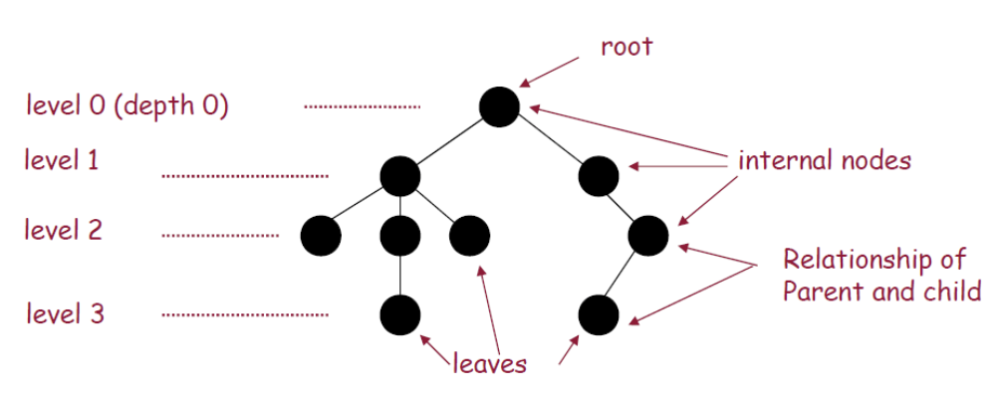
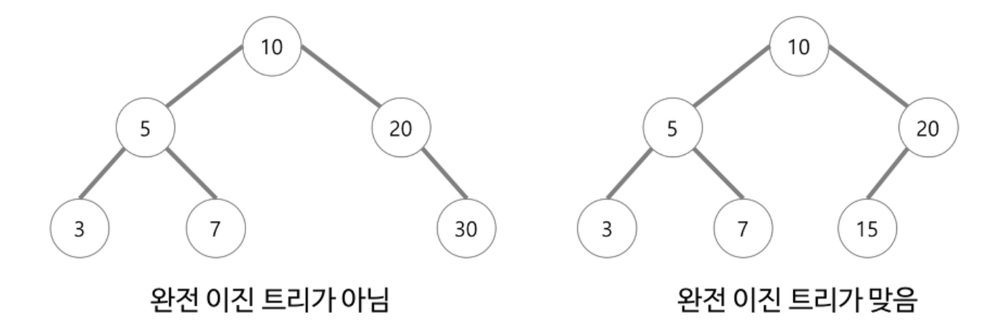
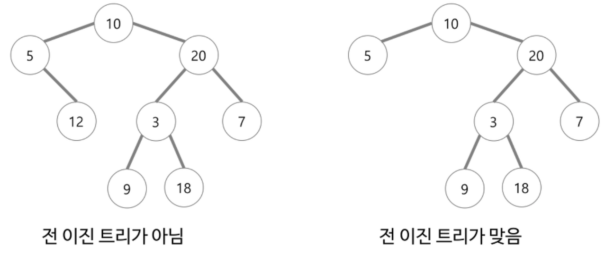
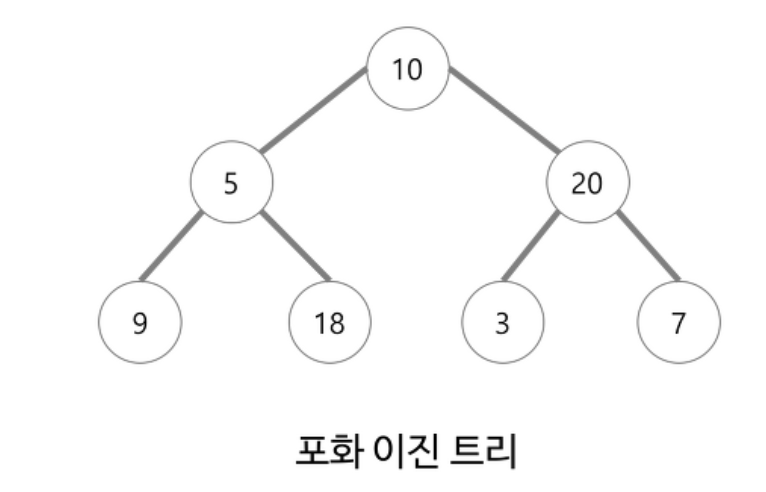
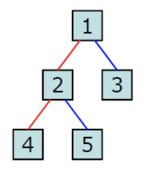

# Binary Tree

## 이 페이지를 읽으면 알 수 있는 것

- 트리란 무엇인가?
- 이진 트리는 무엇이며 이진 트리의 종류에는 무엇이 있는가?
- 트리에서 데이터를 순회하는 세 가지 방법은 무엇인가?

## 트리(Tree)란?

트리는 노드로 이루어진 자료구조로, 아래 조건을 만족한다.

- 트리는 하나의 루트 노드를 갖는다.
- 루트 노드는 0개 이상의 자식 노드를 갖는다.
- 자식 노드는 0개 이상의 자식 노드를 갖고 있고, 이는 반복적으로 정의된다.

## 용어 정리



- 노드(node): 데이터를 저장하는 각 동그라미
  
  - 루트 노드(root node): 부모 노드가 없는 노드. 루트 노드는 트리에 단 한 개뿐이다.
  - 말단 노드(leaf node): 자식 노드가 없는 노드. 말단 노드는 여러 개 존재할 수 있다.
  - 내부 노드(internal node): 말단 노드가 아닌 노드

- 간선(edge): 각 노드를 연결하여 관계를 표현하는 선
- 경로(path): 한 노드에서 다른 노드까지 연결된 edge의 집합
- 트리의 깊이(depth): 루트 노드에서 말단 노드에 이르는 가장 긴 경로의 길이
- 레벨(level): 특정 깊이를 가지는 노드의 집합

## 주요 특징

- 트리에서 모든 노드는 연결되어 있다.
- 트리는 절대 순환하지 않으며, 한 노드에서 다른 임의의 노드로 이동하는 경로는 유일하다.
- 트리 전체 edge의 수는 항상 (전체 노드의 수 - 1)과 같다.

## 이진 트리(Binary Tree)

이진 트리는 각 노드가 최대 두 개의 자식을 갖는 트리를 말한다. 이진 트리의 종류에는 완전 이진 트리, 전 이진 트리, 포화 이진 트리 등이 있다.

### 완전 이진 트리(Complete Binary Tree)



완전 이진 트리는 트리의 모든 높이에서 노드가 꽉 차 있는 이진 트리를 말한다. 마지막 레벨은 꽉 차지 않아도 되지만 노드가 왼쪽에서 오른쪽으로 차례로 채워져 있어야 한다.

### 전 이진 트리(Full Binary Tree)



전 이진 트리는 모든 노드가 자식이 없거나 혹은 자식이 정확히 두 개인 트리를 말한다. 즉, 전 이진 트리에 자식이 한 개뿐인 노드는 존재하지 않는다.

### 포화 이진 트리(Perfect Binary Tree)



포화 이진 트리는 전 이진 트리이면서 완전 이진 트리인 경우를 말한다. 포화 이진 트리에서 모든 말단 노드는 같은 높이에 있어야 하며, 마지막 레벨에서 노드의 개수는 최대가 된다.

트리의 높이가 k일 때, 포화 이진 트리는 정확히 2의 k-1 제곱의 노드를 갖게 된다. 모든 이진 트리가 포화 이진 트리는 아님을 주의하자.

## 트리의 균형

많은 트리가 균형 잡혀 있지만 모든 트리가 그런 것은 아니다. 균형을 잡는다는 것은 트리르 포화 이진 트리로 만든다는 것을 의미하지는 않는다. 일반적으로는 O(logN) 시간에 insert와 find를 할 수 있다면 균형이 잡혀 있다고 이야기한다.

## 이진 트리 순회

트리를 순회하는 방식에는 전위 순회, 중위 순회, 후위 순회가 있으며, 가장 빈번하게 사용되는 방식은 중위 순회다.

### 중위 순회 (in-order)

중위 순회는 왼쪽 가지, 현재 노드, 오른쪽 가지 순서로 노드를 방문하고 출력하는 방법을 말한다. 이진 탐색 트리를 중위 순회로 탐색할 경우 오름차순으로 노드를 방문하게 된다.

```C++
void inOrderTraversal(TreeNode node){
    if (node != NULL){
        inOrderTraversal(node.left);
        visit(node);
        inOrderTraversal(node.right);
    }
}
```

### 전위 순회 (pre-order)

전위 순회는 자식 노드보다 현재 노드를 먼저 방문하는 방법을 말한다. 전위 순회에서 가장 먼저 방문하게 될 노드는 언제나 루트 노드이다.

```C++
void preOrderTraversal(TreeNode node){
    if (node != NULL){
        visit(node);
        preOrderTraversal(node.left);
        preOrderTraversal(node.right);
    }
}
```

### 후위 순회 (post-order)

후위 순회는 모든 자식 노드들을 먼저 방문한 뒤 마지막에 현재 노드를 방문하는 방법을 말한다. 후위 순회에서 가장 마지막에 방문하게 될 노드는 언제나 루트 노드이다.

```C++
void postOrderTraversal(TreeNode node){
    if (node != NULL){
        postOrderTraversal(node.left);
        postOrderTraversal(node.right);
        visit(node);
    }
}
```

### 순회 예시



위 예시를 각각 중위 순회, 전위 순회, 후위 순회로 방문하게 된다면 다음과 같은 순서로 읽게 된다.

- 중위 순회: 4 2 5 1 3
- 전위 순회: 1 2 4 5 3
- 후위 순회: 4 5 2 3 1

## Reference

- Cracking the Code Interview 6/E (Gayle Laakmann McDowell)
- https://frogbam07.tistory.com/22