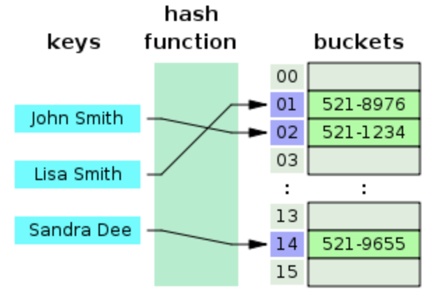
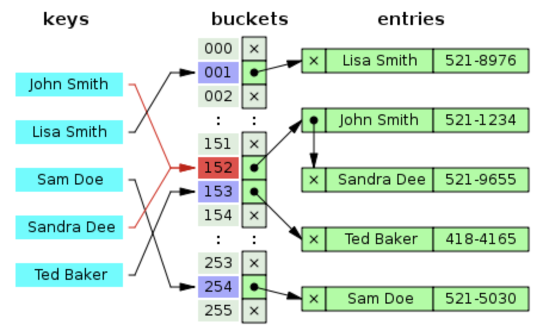
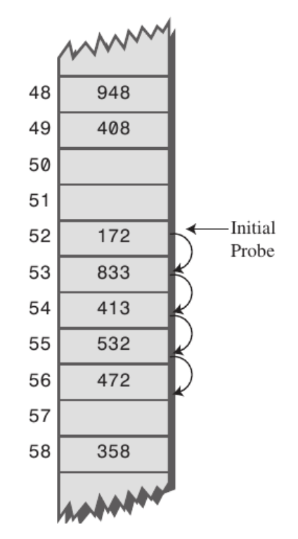
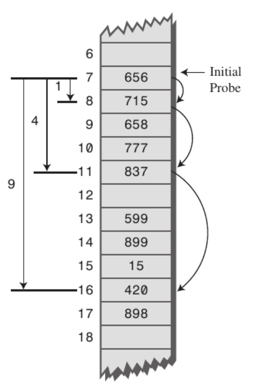

# Hash Table

## 이 페이지를 읽으면 알 수 있는 것

- 해시 함수란 무엇인가?
- 해시 테이블이란 무엇인가?
- 해시 테이블의 동작 방법 및 시간 복잡도
- 해시 테이블에서 충돌에 대응하는 방법에는 무엇이 있는가?

## 해시 함수(Hash Function)란?

해시 함수는 데이터를 효율적으로 관리하기 위해 임의의 길이의 데이터를 고정된 길이의 데이터로 매핑하는 함수다. 매핑 전 원래 데이터의 값을 키(key), 매핑 후의 데이터의 값을 해시값(hash value), 매핑하는 과정은 해싱(hashing)이라고 한다. 해시 함수를 자료 구조에 적용한다면 보다 효율적으로 알고리즘을 구현할 수 있다.

## 해시 테이블(Hash Table)이란?

해시 테이블은 key와 value를 이용하여 데이터의 삽입, 삭제, 탐색을 더 효율적으로 구현할 수 있게 해주는 자료 구조다. value가 실제로 저장되는 공간은 버킷 또는 슷롯이라고 부른다. 해시 테이블에 데이터를 삽입하는 과정은 다음과 같다.

1. key를 이용하여 해시값 계산

    key를 해시 함수에 대입하여 해시값을 계산한다. key의 값은 무한한 데 비하여 해시값은 유한하기 때문에, 서로 다른 key들이 같은 해시값을 가질 수도 있다.

2. 해시값을 이용하여 index 계산

   hash_function(key) % array_length 와 같은 방식으로 해시 값을 이용하여 배열의 index를 계산한다. 역시 여러 개의 해시 값이 같은 index를 가리킬 수 있다.
    
3. 버킷의 해당 index에 value 저장

   이전 단계에서 계산한 index에 value를 저장한다. 여기서 서로 다른 key값 또는 해시값이 하나의 index를 가리키는 상황이 발생할 수 있는데, 이를 충돌(collision)이 발생했다고 표현한다.

## 해시 테이블 예제

만약 (이름, 전화번호)를 (key, value) 값으로 갖는 데이터를 해시 테이블에 저장한다고 해보자. 주어진 배열의 크기는 16이다. ("John Smith", "521-1234")를 해시 테이블에 저장하는 방법은 다음과 같다.

1. John Smith 의 index를 구한다.

    - index = hash_function("John Smith") % 16

2. 해당 index에 전화번호를 저장한다.

    - arr[index] = "521-1234"

key 값만 안다면 바로 데이터가 위치한 index를 계산할 수 있으므로, 데이터의 탐색과 삭제 또한 효율적으로 구현할 수 있다.

## 시간 복잡도

- Average Case: O(1)
- Worst Case: O(n)

array_size가 충분히 크다면, 일반적으로 key 값은 해시 함수에 의해 고유한 index를 갖는다. 따라서 해시 테이블에서 데이터의 삽입, 삭제, 탐색은 평균적으로 O(1)의 시간 복잡도를 갖는다.

하지만, 충돌이 발생했을 경우에는 key와 index가 1 대 1로 매칭되지 않기 때문에, index를 계산한 후에도 탐색을 계속해야 한다. 따라서, 최악의 경우 O(n)의 시간 복잡도를 가질 수 있다.

## 해시 충돌을 해결하는 방법

해시 충돌(collision)이란, 서로 다른 key 또는 해시값이 같은 index를 가리키는 경우를 말한다. 해시 테이블에서 충돌은 결코 피할 수 없는 문제다. 따라서, 충돌이 발생했을 때 하나의 index에 여러 개의 데이터를 잘 저장하는 방법을 아는 것이 중요하다.

### Chaining

Chaining은 Linked List를 이용하여 충돌에 대응하는 방법이다. Chaining은 한 버킷에 저장될 수 있는 엔트리에 제한을 두지 않음으로써, 충돌이 발생했을 때 해당 버킷에 모든 value 값을 저장한다.

위의 예시를 보면, John Smith와 Sandra Dee가 같은 152번 버킷을 가리킴으로써 충돌이 발생했다. 이 경우 Chaining은 Linked List를 이용하여 152번 버킷에 각 데이터를 차례로 연결함으로써 문제를 해결한다.

Chaining은 해시 테이블을 확장할 필요가 없고, node를 동적으로 생성하고 삭제함으로써 데이터를 쉽게 관리할 수 있다는 장점이 있다. 하지만, 데이터가 많아질 경우 연결이 늘어나게 되고, 캐시 효율이 떨어진다는 단점도 있다.

### Open Addressing

Open Addressing은 한 버킷에 한 개의 엔트리만 저장될 수 있도록 제한하는 대신, 해시 테이블의 빈 공간을 활용한다. 충돌이 발생할 경우 해당 버킷에 데이터를 저장하지 않고, 빈 버킷을 찾을 때까지 새로운 해시 값을 선정하여 데이터를 저장한다. 해시 값을 새롭게 선정하는 것을 탐사(Probing)라고 하는데, 탐사의 종류에는 선형 탐사(Linear Probing), 제곱 탐사(Quadratic Probing), 이중 해싱 탐사(Double Hashing Probing) 등이 있다.

1. Linear Probing(선형 탐사)   

    선형 탐사는 충돌이 발생했을 때 일정한 간격만큼 인덱스를 이동하며 빈 버킷을 탐색하는 방법이다.
    
    
    
    위의 예시에서 해시 함수를 통해 52번 index에 접근했으나 해당 버킷에 이미 데이터가 저장되어 있다면, 한 칸씩 다음 index으로 이동해가며 빈 버킷을 탐색하는 과정을 반복한다. 57번 index에 도달해서야 탐색을 종료하고 해당 버킷에 데이터를 저장한다.

    선형 탐사는 간단하지만 위의 예시처럼 특정 버킷 영역에 데이터가 몰려 있는 경우 효율이 떨어질 수 있다.

2. Quadratic Probing(제곱 탐사)   

    제곱 탐사는 충돌이 발생했을 때 이동하는 간격을 제곱으로 늘리며 빈 버킷을 탐색하는 방법이다.

    

    제곱 탐사는 동일한 초기 index 값을 갖는 데이터가 많을 경우 불리하다. 동일한 초기 index를 갖는 데이터들은 모두 같은 경로로 버킷을 탐색하게 되기 때문에 선형 탐사만큼이나 더 많이 이동하게 될 수도 있다.

3. Double Hashing Probing(이중 해싱 탐사)   

    이중 해싱 탐사에서는 탐사를 위한 해시 함수를 별도로 마련하여 새로운 index를 선정한다. 탐사를 할 때 규칙성을 제거함으로써 임의로 새로운 버킷에 접근할 수 있다.

### 다양한 해시 함수

뛰어난 해시 함수는 각 key 값들이 가능한 고유의 index를 가질 수 있게 해싱함으로써 충돌을 줄여준다. 따라서, 충돌을 줄이기 위해 좋은 해시 함수를 선택하는 것은 중요하다.

1. Division Method   
  
   - 𝑘는 숫자로 된 key 값이고 array_size는 배열의 사이즈일 때 해시 함수는 다음과 같다.
  
     - h(k) = k % array_size
  
   - 배열의 사이즈는 소수일수록, 2의 제곱 승과 먼 숫자일수록 충돌이 발생할 확률이 감소한다.

2. Multiplication Method   
   
   - 𝑘는 숫자로 된 key 값이고 𝐴는 0과 1 사이의 실수일 때 해시 함수는 다음과 같다.

     - h(k) = (k*A mod 1) * m

   - 𝑚의 값은 크게 중요하지는 않으며 보통 2의 제곱수로 정한다. 2진수 연산에 최적화된 컴퓨터 구조를 고려한 해시 함수다.

3. Universal Hashing   

   - 다수의 해시 함수를 만들어 집합 H에 모아두고, 그 중 하나를 랜덤으로 선택해 해시값을 만드는 방법

4. Digit Folding   

    - 각 Key의 문자열을 ASCII 코드로 바꾸고 값을 합한 데이터를 테이블 내의 주소로 사용하는 방법

## Reference

- MOOC 강의: Algorithm/Data Structure - 해시
- https://ratsgo.github.io/data%20structure&algorithm/2017/10/25/hash/
- https://mangkyu.tistory.com/102