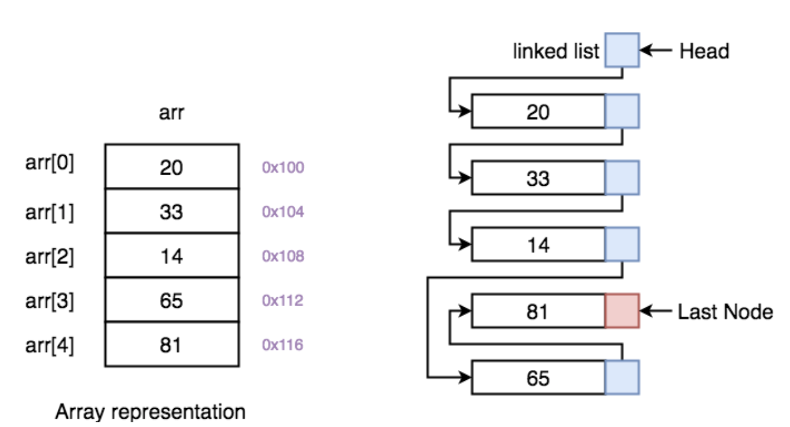
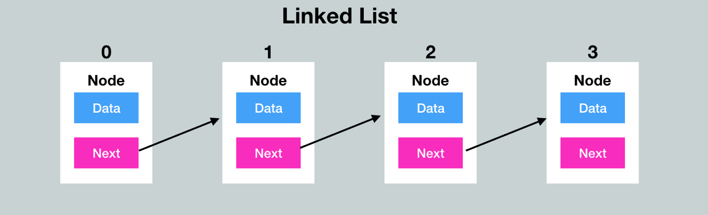
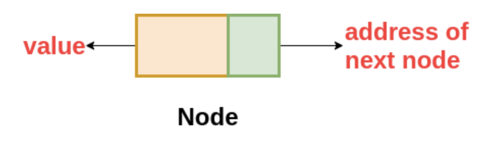
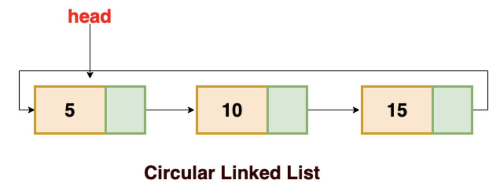
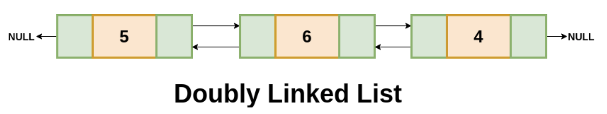
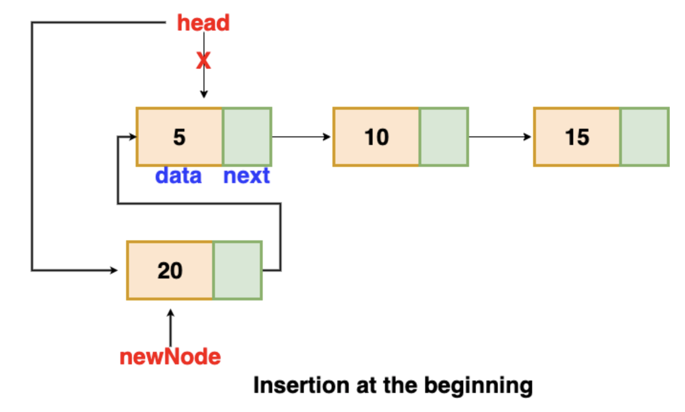
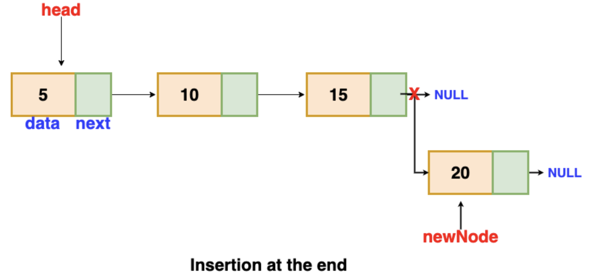
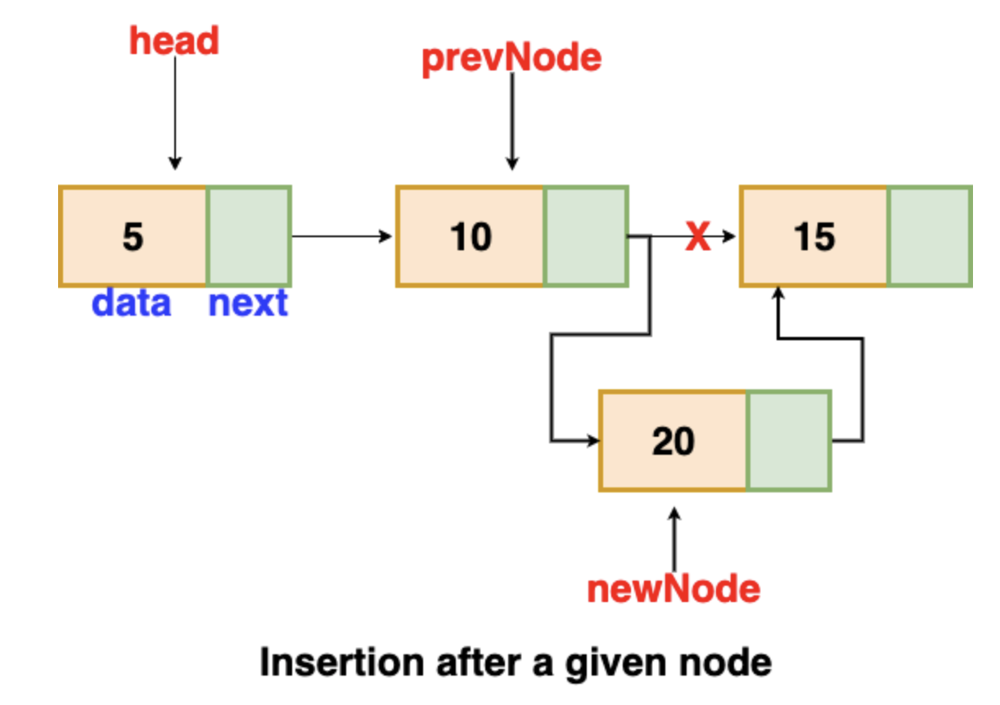
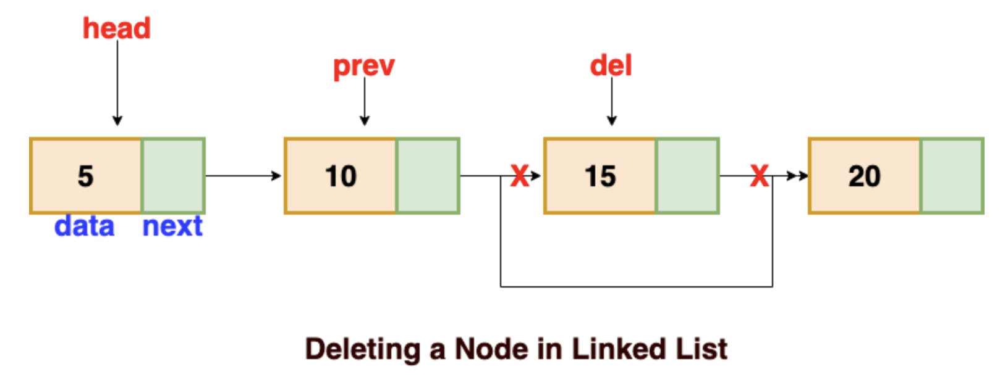

# Linked List

## 이 페이지를 읽으면 알 수 있는 것

- Linked List란 무엇이며 배열(Array)과는 무엇이 다른가?
- Linked List의 종류에는 무엇이 있고, 각 특징은 무엇인가?
- Linked List는 어떻게 동작하는가? (node 검색, 생성, 제거)
- Linked List 코드로 구현하기 (C++)

## Linked List (연결 리스트)

Linked List에 대해 이야기하기 전, 배열에 대해 생각해 보자. 배열은 같은 데이터 타입의 변수를 하나의 묶음으로 관리하는 자료 구조다. 배열이 선언되면 특정한 크기의 공간이 할당되고, 배열의 각 요소들은 해당 공간에 연속적인 주소를 가지며 순차적으로 저장된다. 

반면, Linked List는 서로 다른 공간에 위치한 데이터를 화살표로 연결시켜 관리하는 자료 구조이다. 여러 변수들을 하나의 묶음으로 관리하고자 하는 목적은 같지만, Linked List는 선언 시 특정 공간을 미리 확보하지 않고 요소가 추가될 때마다 새로운 공간을 만들어 데이터를 추가하는 구조를 갖는다. 한 번 선언되면 크기를 동적으로 변경할 수 없다는 기본 배열의 단점을 극복한 자료 구조가 Linked List이다.



## Single Linked List (단일 연결 리스트)

Single Linked List는 화살표가 한 방향으로만 존재하는 Linked List를 말한다. 처음 node에서 시작해서 한 방향으로만 순차적으로 탐색할 수 있다.



Linked List의 각 요소들을 node라고 부르며, 일반적으로 Linked List의 가장 첫 번째 node를 HEAD, 마지막 node를 TAIL이라고 표현한다. Single Linked List의 각 node는 다음과 같이 구성된다. 



- Data: node가 저장하는 데이터 값
- Next: 다음 node의 주소 포인터. 만약 다음 node가 없다면 NULL 저장한다.

## Linked List의 종류

Single Linked List 외에도 Circular Linked List, Doubly Linked List 등 여러 종류의 Linked List들이 있다. 연결 구조에서 약간의 차이만 있을 뿐 거의 같은 구조를 갖고 있다.

### Circular Linked List (원형 연결 리스트)



Circular Linked List는 Single Linked List와 유사하게 단방향 화살표를 갖지만, 마지막 node인 TAIL의 next 값이 NULL이 아닌 HEAD의 주소를 저장한다는 점에서 차이가 있다. 즉, 마지막 node까지 탐색을 마치더라도 첫 번째 node로 다시 돌아올 수 있다.

Singular Linked List는 한 번 node를 지나치면 해당 node로 다시 돌아갈 수 없었지만, Circular Linked List는 단방향임에도 해당 node에 도달할 수 있다는 장점을 갖는다. 또한 순환이 필요한 문제를 풀 때 Circular Linked List를 유용하게 사용할 수 있다. 하지만, Circular Linked List는 어느 node도 NULL 주소를 저장하지 않기 때문에, 잘못하면 프로그램이 List의 끝을 인식하지 못하고 무한 루프에 빠질 수 있음을 주의해야 한다.

### Doubly Linked List (이중 연결 리스트)



Doubly Linked List는 화살표가 양 방향으로 존재하는 Linked List이다. 각 node는 다음 node와 이전 node 모두를 화살표로 가리키는 구조를 갖는다. 따라서, 방향에 제약 없이 현재 node의 앞뒤 node를 모두 탐색할 수 있다. Doubly Linked List의 각 node는 다음과 같이 구성된다. 


- Data: node가 저장하는 데이터 값
- Prev: 이전 node의 주소 포인터. 만약 이전 node가 없다면 NULL 저장
- Next: 다음 node의 주소 포인터. 만약 다음 node가 없다면 NULL 저장

Doubly Linked List는 양 방향으로 이동할 수 있기 때문에 node의 탐색, 생성, 제거를 더 효율적으로 수행할 수 있다. 하지만, node에 prev 포인터 값이 추가되는 만큼 데이터를 저장할 공간이 더 많이 필요하고, 각 동작을 설계 시 고려해야 할 변수가 추가된다는 단점이 있다.

## Linked List의 동작

### 1. node 탐색

- Linked List의 탐색은 HEAD에서 시작한다. HEAD가 NULL이라면 탐색을 하지 않는다.
- HEAD의 next에 저장된 주소가 NULL이 아니라면, next node에 접근하여 다음 node로 이동한다.
- 원하는 데이터를 찾을 때까지 이동을 반복한다.
- 만약 데이터를 찾기 전 NULL 주소를 만났다면, 데이터가 없는 것으로 간주한다.

```C++
int searchNode(T target){

    Node<T> *ptr = head;
    int index = 0;

    while(ptr != NULL){
        index++;
        if(ptr->data == target){
            return index;
        }
        ptr = ptr->next;
    }
    return -1;
}
```

### 2. node 삽입

1. 첫 번째 node에 데이터 추가

    - 추가하고자 하는 value 값을 저장하는 newNode를 생성한다.
    - newNode의 next에 기존 HEAD 주소를 저장한다.
    - HEAD에 newNode 주소를 저장한다.

    

    ```C++
    bool addNodeAtHead(T newData){

            //새로운 node 생성
            Node<T> *newNode = new Node<T>();
            newNode->data = newData;
            newNode->next = NULL;
            size++;

            //데이터가 없을 경우 head, tail에 추가
            if(head == NULL){
                head = newNode;
                tail = newNode;
                return true;
            }
            //head에 추가
            else{
                newNode->next = head;
                head = newNode;
                return true;
            }
            
            return false;
        }
    ```

2. 마지막 node에 데이터 추가

    - 추가하고자 하는 value 값을 저장하는 newNode를 생성한다.
    - 기존 TAIL의 next에 newNode의 주소를 저장한다.
    - TAIL에 newNode의 주소를 저장한다.

    

    ```C++
    bool addNodeAtTail(T newData){
        
        //새로운 node 생성
        Node<T> *newNode = new Node<T>();
        newNode->data = newData;
        newNode->next = NULL;
        size++;

        //데이터가 없을 경우 head, tail에 추가
        if(head == NULL){
            head = newNode;
            tail = newNode;
            return true;
        }
        //tail에 추가
        else{
            tail->next = newNode;
            tail = newNode;
            return true;
        }

        return false;
    }
    ```

3. 특정 index 위치에 데이터 추가

    - 추가하고자 하는 value 값을 저장하는 newNode를 생성한다.
    - head에서 시작하여 원하는 index 위치에 있는 타겟 node까지 이동한다. 이동하며 직전 node(prev) 주소를 별도로 저장해둔다.
    - index에 도착하면 prev의 next에 newNode 주소를 저장하고, newNode의 next에는 타겟 node의 주소를 저장한다.

    

    ```C++
    bool addNode(int index, T newData){

            if(index < 0 || index > size) return false; //index 범위가 잘못된 경우 종료
            if(index==0) return addNodeAtHead(newData); //index가 0일 경우 head에 추가
            if(index==size) return addNodeAtTail(newData); //index가 마지막일 경우 tail에 추가

            Node<T> *ptr = head;

            //새로운 node 생성
            Node<T> *newNode = new Node<T>();
            newNode->data = newData;
            newNode->next = NULL;

            //index-1만큼 이동하여 원하는 위치 전 node까지 이동
            for(int i = 0; i < index-1; i++){
                ptr = ptr->next;
            }
            newNode->next = ptr->next;
            ptr->next = newNode;
            size++;

            return true;
        }
    ```

### 3. node 제거

1. 첫 번째 node 제거

    - 기존 head 주소를 ptr 포인터에 저장한다.
    - head의 next, 즉, 두 번째 node를 head로 지정한다.
    - ptr의 메모리를 해제시킨다. (delete)

    ```C++
    bool RemoveNodeAtHead(){
        
        if(size==0) return false;

        Node<T> *ptr = head;

        head = head->next;
        size--;
        delete ptr;        

        return true;
    }
    ```

2. 마지막 node 제거

    - head에서 출발하여 마지막 node까지 이동한다. 이 때, 직전 node (prev)의 주소를 저장하며 이동한다.
    - 마지막 node의 주소를 ptr 포인터에 저장한다.
    - 마지막 node의 prev, 즉, 뒤에서 두 번째 node를 tail로 지정한다.
    - ptr의 메모리를 해제시킨다. (delete)

    ```C++
    bool RemoveNodeAtTail(){

        if(size==0) return false;
        
        Node<T> *ptr = head;
        Node<T> *prev = new Node<T>();
    
        while(ptr->next != NULL){
            prev = ptr;
            ptr = ptr->next;
        }

        tail = prev;
        tail->next = NULL;
        size--;
        delete ptr;

        return true;
    }
    ```

3. 데이터에 특정 value 갖는 node 삭제

    - head에서 출발하여 특정 value을 갖는 타겟 node까지 이동한다. 이 때, 직전 node (prev)의 주소를 저장하며 이동한다.
    - 타겟 node의 주소를 ptr 포인터에 저장한다.
    - 타겟의 직전 node의 next에 타겟 node의 next 주소를 저장한다. 즉, 연결 화살표에서 타겟에 연결된 화살표를 모두 끊는 것이다.
    - ptr의 메모리를 해제시킨다.

    

    ```C++
    bool RemoveNode(T target){

        //target이 head나 tail이라면 해당 함수 호출
        if(size==0) return false;
        if(head->data == target) return RemoveNodeAtHead();
        if(tail->data == target) return RemoveNodeAtTail();

        Node<T> *ptr = head;
        Node<T> *prev = head;

        //target node와 target node의 prev node 모두 필요
        while(ptr->next != NULL){
            if(ptr->data == target){
                prev->next = ptr->next;
                size--;
                delete ptr;

                return true;
            }
            prev = ptr;
            ptr = ptr->next;
        }        

        return false;
    }
    ```

### 4. Linked List 제거

- head 주소를 ptr에 저장하고, head는 다음 node로 업데이트한다. 
- ptr가 위한 메모리를 해제한다. (delete)
- 모든 node의 메몰리를 해제할 때까지 반복한다.

```C++
void deleteList(){
    Node<T> *ptr = head;
    while(ptr != NULL){
        head = ptr->next;
        delete ptr;

        ptr = head;
    }
    delete head;
    size = 0;
}
```

## Linked List 구현 전체 코드 (C++)

```C++
#include<iostream>
using namespace std;

template <typename T>
struct Node{
public:
    T data;
    struct Node<T> *next = NULL;
};

template <typename T>
class SingleLL{
private:
    Node<T> *head; //첫 번째 node
    Node<T> *tail; //마지막 node
    int size = 0; //list 크기

public:
    SingleLL() : head(NULL), tail(NULL) {}; //생성자
    ~SingleLL() {} //소멸자

    //탐색: List에서 특정 값 검색 후 index 반환 (없다면 -1 반환)
    int searchNode(T target){

		Node<T> *ptr = head;
        int index = 0;

        while(ptr != NULL){
            index++;
            if(ptr->data == target){
                return index;
            }
            ptr = ptr->next;
        }
        return -1;
    }

    //삽입: List의 head에 node 삽입
    bool addNodeAtHead(T newData){

        //새로운 node 생성
        Node<T> *newNode = new Node<T>();
        newNode->data = newData;
        newNode->next = NULL;
        size++;

        //데이터가 없을 경우 head, tail에 추가
        if(head == NULL){
            head = newNode;
            tail = newNode;
            return true;
        }
        //head에 추가
        else{
            newNode->next = head;
            head = newNode;
            return true;
        }
        
        return false;
    }

    //삽입: List의 tail에 node 삽입
    bool addNodeAtTail(T newData){
        
        //새로운 node 생성
        Node<T> *newNode = new Node<T>();
        newNode->data = newData;
        newNode->next = NULL;
        size++;

        //데이터가 없을 경우 head, tail에 추가
        if(head == NULL){
            head = newNode;
            tail = newNode;
            return true;
        }
        //tail에 추가
        else{
            tail->next = newNode;
            tail = newNode;
            return true;
        }

        return false;
    }
    
    //삽입: 특정 index 위치에 node 삽입
    bool addNode(int index, T newData){

        if(index < 0 || index > size) return false; //index 범위가 잘못된 경우 종료
        if(index==0) return addNodeAtHead(newData); //index가 0일 경우 head에 추가
        if(index==size) return addNodeAtTail(newData); //index가 마지막일 경우 tail에 추가

        Node<T> *ptr = head;

        //새로운 node 생성
        Node<T> *newNode = new Node<T>();
        newNode->data = newData;
        newNode->next = NULL;

        //index-1만큼 이동하여 원하는 위치 전 node까지 이동
        for(int i = 0; i < index-1; i++){
            ptr = ptr->next;
        }
        newNode->next = ptr->next;
        ptr->next = newNode;
        size++;

        return true;
    }

    //삭제: 첫 번째 node 삭제
    bool RemoveNodeAtHead(){
        
        if(size==0) return false;

        Node<T> *ptr = head;

        head = head->next;
        size--;
        delete ptr;        

        return true;
    }

    //삭제: 마지막 node 삭제
    bool RemoveNodeAtTail(){

        if(size==0) return false;
        
        Node<T> *ptr = head;
        Node<T> *prev = new Node<T>();
    
        while(ptr->next != NULL){
            prev = ptr;
            ptr = ptr->next;
        }

        tail = prev;
        tail->next = NULL;
        size--;
        delete ptr;

        return true;
    }

    //삭제: 특정 데아터 값을 갖는 node 삭제
    bool RemoveNode(T target){

        //target이 head나 tail이라면 해당 함수 호출
        if(size==0) return false;
        if(head->data == target) return RemoveNodeAtHead();
        if(tail->data == target) return RemoveNodeAtTail();

        Node<T> *ptr = head;
        Node<T> *prev = head;

        //target node와 target node의 prev node 모두 필요
        while(ptr->next != NULL){
            if(ptr->data == target){
                prev->next = ptr->next;
                size--;
                delete ptr;

                return true;
            }
            prev = ptr;
            ptr = ptr->next;
        }        

        return false;
    }

    // 전체 Linked List 동적 할당 제거
    void deleteList(){
        Node<T> *ptr = head;
        while(ptr != NULL){
            head = ptr->next;
            delete ptr;

            ptr = head;
        }
        delete head;
        size = 0;
    }

    //List의 size 반환
    int getsize(){
        return size;
    }

    //List 전체 요소 출력
    void print(){

        cout << "head: " << head->data << ", tail: " << tail->data << ", size: " << size << endl;
        Node<T> *ptr = head;
        while(ptr != NULL){
            cout << ptr->data << " ";
            ptr = ptr->next;
        }
        cout << endl << "----------------------" << endl;
    }
};

int main(){

    SingleLL<int> List;

    List.addNodeAtHead(3);
    List.addNodeAtHead(2);
    List.addNodeAtHead(1);
    List.print();

    List.addNodeAtTail(4);
    List.addNodeAtTail(5);
    List.addNodeAtTail(6);
    List.print();

    List.addNode(2, 7);
    List.addNode(0, 8);
    List.addNode(8, 9);
    List.print();

    List.RemoveNode(8);
    List.RemoveNode(3);
    List.RemoveNode(9);
    List.print(); 

    List.RemoveNodeAtHead();
    List.print(); 

    List.RemoveNodeAtTail();
    List.print(); 

    List.deleteList();
    cout << List.getsize();

    return 0;
}

```

## Reference

- https://velog.io/@keemtj/자료구조-링크드-리스트Linked-List
- https://www.developer-tm.com/07/27/2017/linked_list/
- https://afteracademy.com/blog/types-of-linked-list-and-operation-on-linked-list