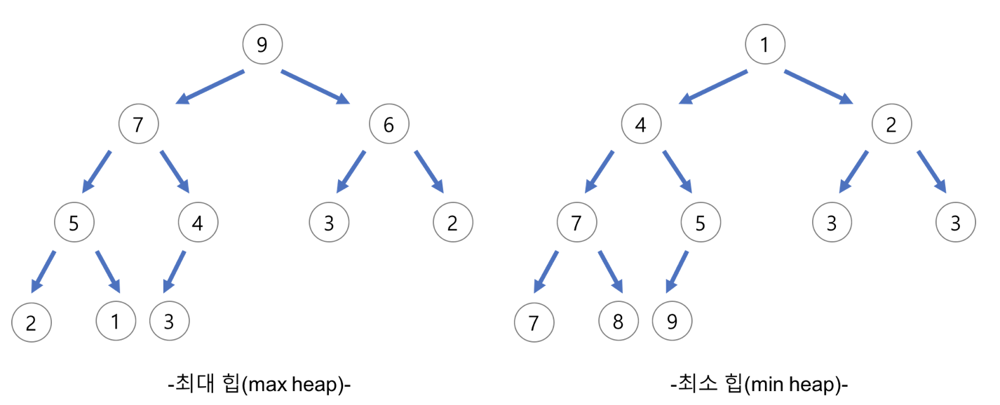

# Priority Queue

## 들어가며

만약 Queue, 배열, Linked List, Heap 구조에 대해 잘 알지 못한다면, 아래 페이지를 먼저 읽는 것을 추천한다.

* [Array and String](/Algorithm/DataStructure/Array_and_String.md)
* [Linked List](/Algorithm/DataStructure/Linked_List.md)
* [Queue and Circular Queue](/Algorithm/DataStructure/Queue.md)
* [Binary Heap](/Algorithm/DataStructure/Binary_Heap.md)

## 우선순위 큐 (Priority Queue; PQ)



Queue는 가장 먼저 들어온 데이터를 먼저 삭제하는 FIFO 구조의 자료 구조다. 그렇다면 우선순위 큐는 무엇일까? 우선순위 큐(PQ)는 먼저 들어온 자료를 삭제하는 것이 아니라, 가장 우선 순위가 높은 데이터를 먼저 삭제하는 자료 구조다. 즉, 일반적인 큐와 달리 우선순위 큐는 어느 정도 정렬된 데이터를 갖고 있다. 주로 Heap 구조를 사용하여 우선순위 큐를 구현하며, 최솟값 또는 최댓값을 빠르게 찾을 수 있다는 것이 특징이다.

## 우선순위 큐 구현 방법 비교

우선순위 큐는 Heap 뿐만 아니라 배열과 Linked List로도 구현할 수 있다. 배열 또는 Linked List를 이용하는 것이 구현이 더 쉬울텐데, 왜 Heap 구조를 사용하는 것일까?

배열과 Linked List로 우선순위 큐를 구현한다면, 삽입 또는 삭제 연산에 O(n)의 시간 복잡도가 발생한다. 예를 들어, 배열에 새로운 데이터를 삽입하기 위해서는 첫 번째 index부터 모든 노드에 방문하며 새로운 데이터가 들어갈 수 있는 적절한 위치를 찾아야만 한다.

반면, Heap은 완전 이진 트리 형태의 자료 구조로, O(log n)의 시간 복잡도로 삽입과 삭제 동작을 구현할 수 있다. Heap에서는 모든 노드에 방문할 필요가 없으며, 부모 노드보다 큰지 작은지만 판단하여 각 depth 중 하나의 노드에만 방문하게 된다.

## 시간 복잡도

Heap을 사용하여 우선순위 큐를 구현할 경우 시간 복잡도는 다음과 같다.

- 탐색: O(1)
- 삽입: O(log n)
- 삭제: O(log n)

## 장단점

- 장점

    - 데이터 삽입 및 삭제가 O(log n)으로 빠르다.
    - 정렬된 데이터를 빠르게 얻을 수 있다.

- 단점

    - (굳이 찾자면) 구현이 조금 복잡하다.

## 우선순위 큐 구현 (C++)

사실 우선순위 큐 구현은 Binary heap 구현과 차이가 없다. 데이터 값이 큰 순서대로 우선순위를 갖는 우선순위 큐를 maxheap을 사용하여 구현해보자.

### 탐색 연산

우선순위 큐에서 탐색은 가장 우선순위가 높은 원소를 찾는 것을 의미한다. maxheap은 가장 큰 값을 항상 root에 갖고 있으므로, root node를 반환하면 된다. 시간 복잡도는 O(1)이다.

```C++
// 최댓값은 항상 root에 위치
int top(){
    if(isEmpty()){
        cout << "PQ is empty." << endl;
        return -1;
    }
    return maxheap[1];
}
```

### 삽입 연산

maxheap은 데이터를 완벽한 내림차순으로 정렬하지는 않지만, 모든 자식 노드는 부모 노드보다 값이 작아야 한다는 규칙을 갖고 있다. 따라서 새로운 데이터를 삽입할 때도 이 규칙을 깨지 않도록 위치를 선정해야 한다.

완전 트리의 속성에 위배되지 않게 마지막 노드로 삽입한 후, 해당 노드가 자리를 찾을 때까지 부모 노드와 교환한다. 힙에 있는 노드의 수를 n이라고 할 때, 삽입 연산은 O(log n) 시간이 소요된다.

```C++
// 데이터 삽입. 가장 마지막 노드에 새로운 데이터를 입력하고 위로 올리며 자리를 찾는다.
void push(int val){
    if(isFull()){
        cout << "PQ is full." << endl;
        return ;
    }

    int child = ++size;
    int parent = child / 2;

    while(parent >= 1){
        if(maxheap[parent] < val){
            maxheap[child] = maxheap[parent];
            child = parent;
            parent = child / 2;
        }
        else break;
    }
    maxheap[child] = val;
}
```

### 삭제 연산

우선순위 큐에서 삭제 동작은 우선순위가 가장 높은 데이터를 삭제 및 반환하는 것을 의미한다. 최댓값을 제거하기 위해서는 루트 노드의 값을 제거하면 된다. 최댓값 제거 후에 maxheap 속성을 유지하기 위해서 heap의 가장 마지막 노드를 빈 루트 노드에 저장한다. 그 후 루트 노드를 자식 노드와 교환해가며 자리를 찾아 준다. 만약 두 개의 자식 노드로 모두 이동할 수 있다면, 최대 힙에서는 더 큰 값을 가진 자식과 위치를 교환한다. 삭제 연산은 O(log n)의 시간이 소요된다.

## 우선순위 큐 전체 구현 코드 (C++)

```C++
#include<iostream>
using namespace std;

#define MAX_SIZE 100

class PQ{
private:
    int maxheap[MAX_SIZE + 1];
    int size;

public:
    PQ() : size(0) {};
    ~PQ() {};

    // heap이 비어있으면 true, 그렇지 않으면 false 반환
    bool isEmpty(){
        if(size == 0) return true;
        else return false;
    }

    // heap이 꽉 찼으면 true, 그렇지 않으면 false 반환
    bool isFull(){
        if(size == MAX_SIZE) return true;
        else return false;
    }

    // 데이터 삽입. 가장 마지막 노드에 새로운 데이터를 입력하고 위로 올리며 자리를 찾는다.
    void push(int val){
        if(isFull()){
            cout << "PQ is full." << endl;
            return ;
        }

        int child = ++size;
        int parent = child / 2;

        while(parent >= 1){
            if(maxheap[parent] < val){
                maxheap[child] = maxheap[parent];
                child = parent;
                parent = child / 2;
            }
            else break;
        }
        maxheap[child] = val;
    }

    // 최댓값은 항상 root에 위치
    int top(){
        if(isEmpty()){
            cout << "PQ is empty." << endl;
            return -1;
        }
        return maxheap[1];
    }

    // 데이터 삭제. 가장 마지막 노드를 root에 두고 아래로 내리며 자리를 찾는다.
    int pop(){
        if(isEmpty()){
            cout << "PQ is empty." << endl;
            return -1;
        }
        int top = maxheap[1];
        int val = maxheap[size--];

        int parent = 1;
        int child = parent * 2;

        while(child <= size){
            if(child < size && maxheap[child] < maxheap[child+1])
                child++;
            
            if(val < maxheap[child]){
                maxheap[parent] = maxheap[child];
                parent = child;
                child = parent * 2;
            }
            else break;
        }
        maxheap[parent] = val;

        return top;
    }

    // heap 배열에 있는 모든 원소 출력
    void show(){
        if(isEmpty()){
            cout << "PQ is empty." << endl;
            return ;
        }
        for(int i = 1; i <= size; i++)
            cout << maxheap[i] << " ";
        cout << endl;

        return ;
    }
};

int main(){

    PQ pq;
    pq.push(1);
    pq.show(); // 1

    pq.push(4);
    pq.show(); // 4 1
    
    pq.push(7);
    pq.show(); // 7 1 4
    
    pq.push(5);
    pq.show(); // 7 5 4 1
    
    pq.push(2);
    pq.show(); // 7 5 4 1 2
    
    pq.push(6);
    pq.show(); // 7 5 6 1 2 4
    
    pq.push(9);
    pq.show(); // 9 5 7 1 2 4 6

    pq.pop();
    pq.show(); // 7 5 6 1 2 4

    pq.pop();
    pq.show(); // 6 5 4 1 2

    pq.pop();
    pq.show(); // 5 2 4 1

    pq.pop();
    pq.show(); // 4 2 1

    return 0;
}
```