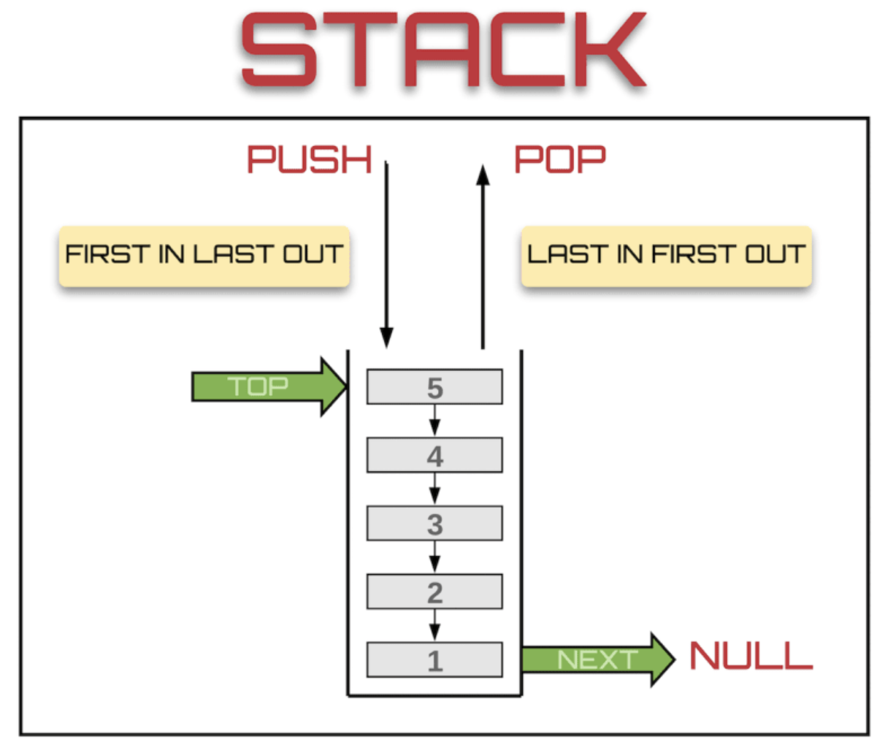
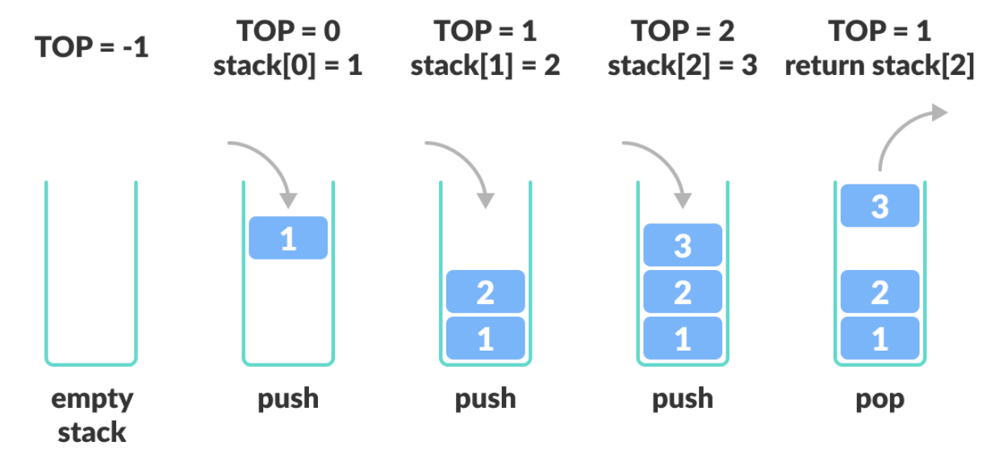

# Stack

## 이 페이지를 읽으면 알 수 있는 것

- Stack은 무엇이며 어떻게 동작하는가?
- Stack의 특징은 무엇이며 언제 활용되는가?
- Stack을 코드로 구현하기 (C++)

## 개요

Stack은 LIFO(Last In First Out) 구조를 가진 자료 구조이다. 마치 프링글스 통처럼 한쪽 끝에서만 데이터를 넣고 꺼낼 수 있는 데이터 구조로, 가장 마지막에 쌓인 데이터가 가장 먼저 밖으로 나온다.



## 동작 및 용어



- `Push`: Stack에 데이터를 입력하는 동작
- `Pop`: Stack에서 데이터를 꺼내는 동작
- `Top`: Stack에서 가장 마지막에 입력된 데이터. PUSH와 POP의 대상이 된다.
- `Btm`: (Opt.) Stack에서 가장 먼저 입력된 데이터

## 시간 복잡도

- PUSH: O(1)
- POP: O(1)

## 장단점

- 장점
  - 데이터의 삽입 및 삭제가 빠르다.
- 단점
  - TOP에 있는 데이터에만 접근이 가능하다.
  - 중간에 위치한 데이터로의 접근이 어렵다. 접근하고 싶다면 TOP부터 데이터를 꺼내면서 접근해야 한다.

## 활용 예시

데이터를 역추적할 때 주로 사용된다.

- DFS
- 웹 방문 기록, 실행 취소
- 역순 문자열 구하기
- 괄호 검사

## 구현 (C++)

### 함수 소개

Stack 자료 구조를 구현하기 위해서는 일반적으로 아래 함수들이 필요하다.

```C++
bool IsEmpty(Stack* stack);
```

- Stack이 비었으면 true, 그렇지 않으면 false를 반환한다.

```C++
bool IsFull(Stack* stack);
```

- Stack이 다 찼으면 true, 그렇지 않으면 false를 반환한다.
- Stack의 MAX_SIZE가 정해져 있는 경우 필요하다.

```C++
void push(Stack* stack, Data val);
```
- Stack의 TOP에 val 값을 추가한다.

```C++
Data pop(Stack* stack);
```

- Stack의 TOP에 위치한 데이터를 제거하고, 해당 값을 반환한다.

```C++
Data peek(Stack* stack);
```

- Stack의 TOP에 위치한 데이터를 반환한다.

### 배열을 이용한 Stack 구현

배열을 이용하면 간단하게 Stack을 구현할 수 있다. 정수형 변수 top에는 가장 최근에 들어온 데이터의 index를 저장하며, 만약 Stack이 비었을 경우 top에 -1을 저장한다. top에 저장하는 index를 늘리고 줄임으로써 push와 pop을 쉽게 구현할 수 있다.

아래 코드에서는 정적 배열을 사용하여 Stack을 구현했다. 따라서, 선언 시 Stack의 MAX_SIZE를 정의하기 때문에, Stack이 MAX_SIZE에 도달한 경우 더 이상 push할 수 없다. 만약 Stack의 크기를 유연하게 줄이거나 늘리고 싶다면 두 번째 방법인 Linked List를 이용한 Stack 구현을 참고하자.

```C++
#include<iostream>
using namespace std;

#define MAX_SIZE 5 // Stack 사이즈 정의

template <typename T>
class Stack{
private:
    T stack[MAX_SIZE + 2];
    int top = -1;

public:
    Stack() : top(-1) {};
    ~Stack() {};

    // Stack이 비었으면 true, 그렇지 않으면 false
    bool IsEmpty(){
        if(top == -1) return true;
        else return false;
    }

    // Stack이 MAX_SIZE까지 찼으면 true, 그렇지 않으면 false
    bool IsFull(){
        if(top == MAX_SIZE-1) return true;
        else return false;
    }

    // Stack의 top에 val 추가
    void push(T val){
        if(IsFull()==true){
            cout << "Stack is Full." << endl;
            return;
        }
        stack[++top] = val;
    }

    // Stack의 top 반환 및 제거
    T pop(){
        if(IsEmpty()==true){
            cout << "Stack is Empty." << endl;
            return 0;
        }
        return stack[top--];
    }

    // Stack의 top 반환 
    T peek(){
        if(IsEmpty()==true){
            cout << "Stack is Empty." << endl;
            return 0;
        }
        return stack[top];
    }

    // Stack 전체 데이터 출력
    void show(){
        if(IsEmpty()==true){
            cout << "Stack is Empty." << endl;
            return;
        }
        for(int i = 0; i < top+1; i++){
            cout << stack[i] << " ";
        }
        cout << endl;
    }
};

int main(){

    Stack<int> stack;

    stack.push(1);
    stack.push(2);
    stack.push(3);
    stack.show(); // 1, 2, 3

    cout << "Peek: " << stack.peek() << endl;

    stack.pop();
    stack.show(); // 1, 2

    stack.push(4);
    stack.push(5);
    stack.push(6);
    stack.push(7); // Stack is Full
    stack.show(); // 1, 2, 4, 5, 6

    stack.pop(); 
    stack.pop();
    stack.pop();
    stack.pop();
    stack.pop(); 
    stack.pop(); // Stack is Empty

    return 0;
}
```

### Linked List를 이용한 Stack 구현

Linked List는 배열과 달리 동적으로 node를 추가할 수 있다. 따라서, 미리 지정된 Stack 최대 사이즈가 없다는 가정 하에 MAX_SIZE와 IsFull() 함수는 구현하지 않았다. 다만, Stack보다 구현은 조금 더 복잡하다는 단점이 있다.

본 코드에서는 양방향 Linked List로 Stack을 구현했다. push 동작을 할 때는 top에 대한 정보만으로 충분하지만, pop 동작을 할 때는 top에서 두번째 노드를 새로운 top으로 지정해주는 과정이 필요하다. 단방향 Linked List로 구현한다면 btm부터 top까지 탐색해야 해서 효율이 떨어지기 때문에, 양방향으로 구현하여 효율을 높였다.

```C++
#include<iostream>
using namespace std;

template <typename T>
struct Node{
    T Data;
    struct Node<T> *next = NULL;
    struct Node<T> *prev = NULL;
};

template <typename T>
class Stack{
private:
    Node<T> *top, *btm;
    int size = 0;

public:
    Stack() : top(NULL), btm(NULL) {};
    ~Stack() {};

    // Stack이 비었으면 true, 그렇지 않으면 false
    bool IsEmpty(){
        if(top == NULL) return true;
        else return false;
    }

    // Stack의 top에 val 추가
    void push(T val){
        // newNode 생성
        Node<T> *newNode = new Node<T>();
        newNode->Data = val;
        newNode->next = NULL;
        newNode->prev = top;

        // Stack이 비었다면 btm, top 모두 newNode 지정
        if(top==NULL){
            btm = newNode;
            top = newNode;
        }
        // Stack이 비어있지 않다면 top의 next에 newNode 지정
        else{
            top->next = newNode;
            top = newNode;
        }
        size++;
    }

    // Stack의 top 반환 및 제거
    T pop(){
        // Stack이 비었을 경우 메세지 출력
        if(IsEmpty()==true){
            cout << "Stack is Empty." << endl;
            return 0;
        }

        Node<T> *ptr = top;
        T tmp = top->Data;

        // 만약 Stack에 데이터가 1개라면 top에 NULL 저장
        if(top->prev == NULL){
            btm = NULL;
            top = NULL;
        }
        // 그렇지 않다면 top 직전 노드를 top으로 지정
        else{
            Node<T> *prev = new Node<T>();
            top = top->prev;
            top->next = NULL;
        }

        // 기존 top이 저장된 주소 메모리 해제
        delete ptr;
        size--;

        return tmp;
    }
    
    // Stack의 top 반환 
    T peek(){
        // Stack이 비었을 경우 메세지 출력
        if(IsEmpty()==true){
            cout << "Stack is Empty." << endl;
            return 0;
        }
        //top 데이터 반환
        return top->Data;
    }

    // Stack 전체 데이터 출력
    void show(){
         // Stack이 비었을 경우 메세지 출력       
        if(IsEmpty()==true){
            cout << "Stack is Empty." << endl;
            return;
        }
        //btm부터 top까지 탐색하며 데이터 출력
        Node<T> *ptr = btm;
        while(ptr!=NULL){
            cout << ptr->Data << " ";
            ptr = ptr->next;
        }
        cout << endl;
    }
};

int main(){

    Stack<int> stack;

    stack.push(1);
    stack.push(2);
    stack.push(3);
    stack.show(); // 1, 2, 3

    cout << "Peek: " << stack.peek() << endl;

    stack.pop();
    stack.show(); // 1, 2

    stack.push(4);
    stack.push(5);
    stack.push(6);
    stack.show(); // 1, 2, 4, 5, 6

    stack.pop(); 
    stack.pop();
    stack.pop();
    stack.pop();
    stack.pop(); 
    stack.pop(); // Stack is Empty

    return 0;
}
```

## Reference
- https://dev.to/theoutlander/implementing-the-stack-data-structure-in-javascript-4164
- https://velog.io/@polynomeer/스택Stack-자료구조
- - https://velog.io/@choiiis/자료구조-스택Stack과-큐Queue#언제-사용할까