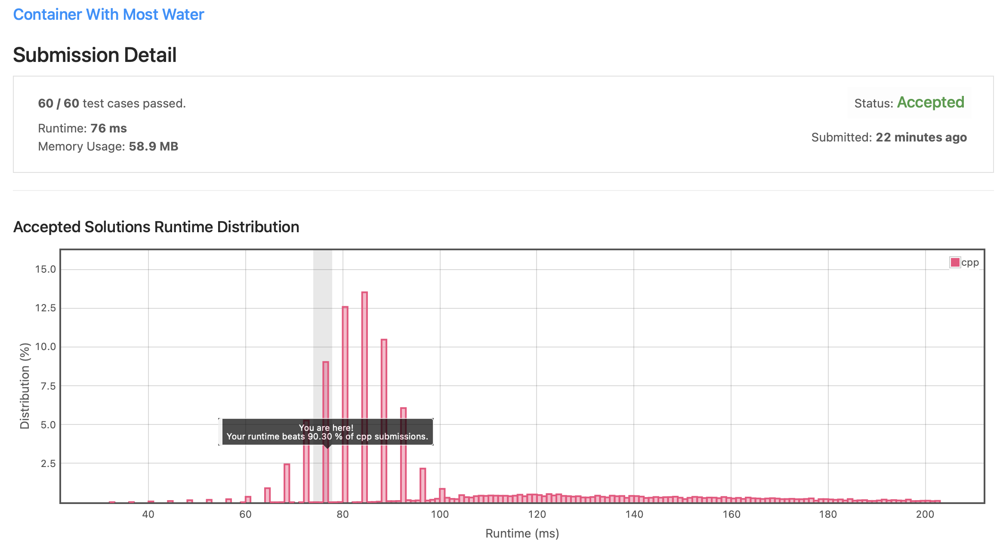
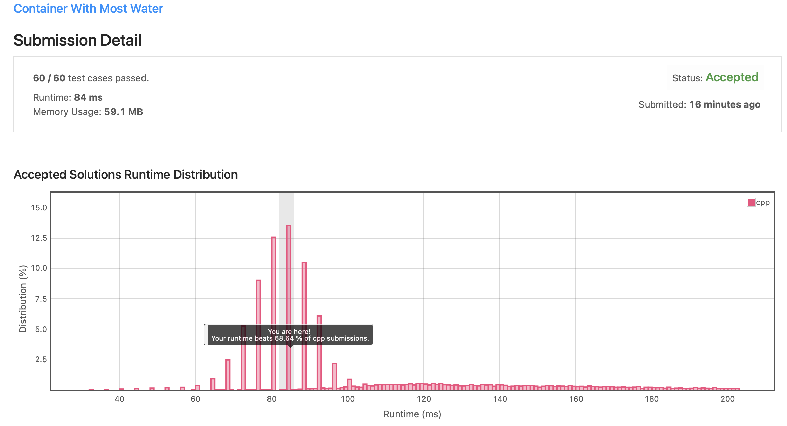

# Leetcode 11. Container With Most Water (C++)

Date: 2021.09.25

## 문제

https://leetcode.com/problems/container-with-most-water/

- input: 각 벽의 높이를 담고 있는 정수형 배열 height
- output: 주어진 배열에서 만들 수 있는 max area 값 출력

## 알고리즘

1. 배열의 첫 번째 index와 마지막 index를 left와 right에 저장한다.
2. 현 상태에서 area 값을 계산한다. 만약 현재 area가 max 값보다 크다면 max 값을 업데이트한다.
3. left와 right 중 높이가 더 작은 쪽을 배열의 안쪽으로 한 칸 이동시킨다.
4. left와 right가 만날 때까지 2,3을 반복한다.

## 시간 복잡도

left, right를 배열의 양 끝에 두고 매 탐색마다 left 또는 right를 한 칸씩 이동시키며 탐색했으므로, O(n)의 시간 복잡도를 갖는다.

## 1차 제출 코드 (C++)

```C++
class Solution {
public:
    int maxArea(vector<int>& height) {        

        int left, right, h;
        int area = 0;
        
        left = 0, right = height.size()-1;
        if(left >= right) return 0;
        
        while(left < right){
            (height[left] < height[right]) ? h = height[left] : h = height[right];
            if((right - left) * h > area) area = (right - left) * h;
            (height[left] < height[right]) ? left++ : right--;
        }
        
        return area;
    }
};
```



## 회고 및 수정

중복된 코드를 최대한 제거하고, min/max 함수를 사용하여 더 간단하게 코드를 수정했다.

런타임은 조금 더 늘어났는데, while문 시작 전에 `if(left >= right) return 0;` 코드를 추가하면 런타임이 다시 줄어든다. 간단한 코드 구현을 위해 해당 부분은 포함하지 않았다.

```C++
class Solution {
public:
    int maxArea(vector<int>& height) {        

        int left = 0, right = height.size() - 1;
        int area = 0;
                
        while(left < right){
            area = max(area, (right - left) * min(height[left], height[right]));       
            (height[left] < height[right]) ? left++ : right--;
        }
        
        return area;
    }
};
```

