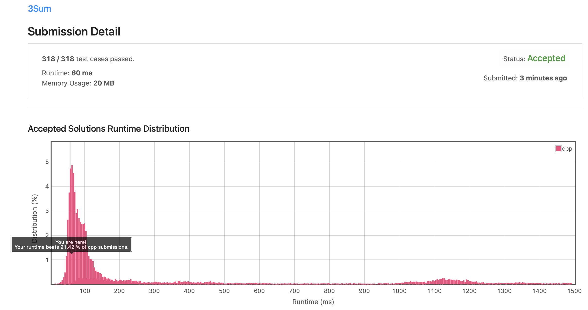
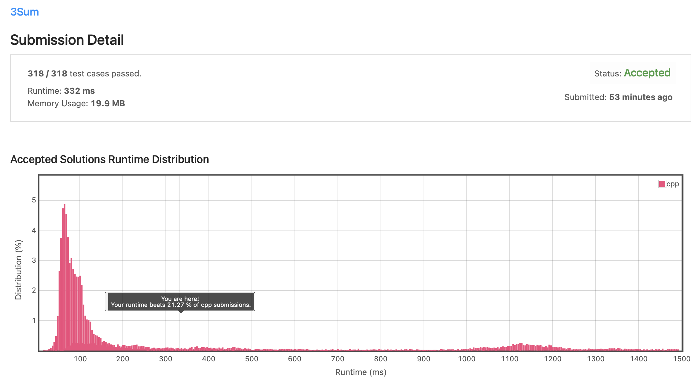

# Leetcode 15. 3Sum (C++)

Date: 2021.09.21

## 문제

https://leetcode.com/problems/3sum/

- input: 정수형 배열 nums
- output: 주어진 배열에서 더해서 0이 되는 세 개의 원소의 묶음을 이차원 배열로 출력

## 알고리즘

1. 배열을 오름차순으로 정렬한다. 정렬 알고리즘은 직접 구현하지 않고 C++ STL에 있는 sort 함수를 사용했다.
2. 배열의 처음부터 차례로 첫 번째 원소를 선정한다. (tmp[0])
3. 세 원소를 더해 0을 만들어야 하기 때문에, 남은 두 원소를 이용해 -tmp[0]을 만들어야 한다. 남은 배열의 양 끝을 left, right로 선정하고 left를 늘리거나 right를 줄이면서 조건을 만족하는 두 원소를 탐색한다.
4. 만약 조건을 만족하는 세 원소를 찾았을 경우 해당 배열을 ans에 push한다.

### 시간 복잡도

1. C++ STL의 sort() 함수는 intro sort라는 알고리즘을 구현하는 정렬 함수다. intro sort는 quick sort, heap sort, insertion sort 세 가지 정렬 알고리즘을 조합한 알고리즘으로, 언제나 O(nlogn)의 시간 복잡도를 보장한다. sort를 직접 구현해야만 하는 경우가 아니라면, sort 함수를 사용하여 O(nlogn)의 시간 복잡도를 가진 정렬을 구현할 수 있다.
   
2. 먼저 for문은 O(n)의 시간 복잡도를 가진다. for문 내에서는 left, right를 한 칸씩 이동시키며 탐색을 계속하는데, 이 또한 O(n)의 시간 복잡도를 가진다. 따라서 세 원소를 탐색하는 알골리즘은 O(n^2)의 시간 복잡도를 갖는다.

3. 따라서 본 알고리즘은 O(n^2)의 시간 복잡도를 갖는다.

## 제출 코드 (C++)

```C++
class Solution {
private:
    vector<int> visit;
    bool chk;
public:
    vector<vector<int>> threeSum(vector<int>& nums) {
        vector<vector<int>> ans;
        vector<int> tmp(3, -999999);
        
        // 배열의 크기가 3 이하일 경우 정답 없음
        if(nums.size() < 3) return ans;
        
        // 오름차순 정렬
        sort(&nums[0], &nums[nums.size()]);
        
        // 첫 번째 원소 선정
        for(int i=0; i<nums.size()-2; i++){
            
            // 중복 방지
            if(i>0 && nums[i] == nums[i-1]) continue;
            
            // target을 만족하는 두 번째, 세 번째 원소 선정
            int left = i+1, right = nums.size()-1;
            int target = 0 - nums[i];
            while(left < right){
                if(nums[left] + nums[right] > target)
                    right--;
                else if(nums[left] + nums[right] < target)
                    left++;
                else{
                    // 중복 방지
                    if(tmp[0] != nums[i] || tmp[1] != nums[left]){
                        // 조건에 맞는 원소 찾았을 시 ans에 push
                        tmp[0] = nums[i], tmp[1] = nums[left], tmp[2] = nums[right];
                        ans.push_back(tmp);                        
                    }
                    left++, right--;
                }
            }
        }
        return ans;
    }
};
```



## 두 개의 for문을 사용한다면?

위 알고리즘으로 코드를 작성하기 전에 두 개의 for문과 하나의 binary search를 사용한 방식으로 문제를 풀었다. 먼저 구현한 알고리즘에서 세 원소를 탐색하는 방식은 아래와 같았다.

1. 첫 번째 for문에서 차례로 첫 번째 원소를 선정한다.
2. 두 번째 for문에서 차례로 두 번째 원소를 선정한다.
3. 세 원소의 합을 0으로 만들 수 있는 세 번째 원소를 target으로 하여 남은 배열에 존재하는지 binary search로 탐색한다.

위 알고리즘은 순서대로 O(n), O(n), O(log n)의 시간 복잡도를 가지므로, 최종적으로 O(n^2 * log n)의 시간 복잡도를 갖는다. 실행 시간이 느릴 것이라고 예상은 했지만, 위의 O(n^2)의 프로그램 대비 실행 시간이 5배 더 느렸다.

```C++
class Solution {
private:
    vector<int> visit;
    bool chk;
public:
    vector<vector<int>> threeSum(vector<int>& nums) {
        vector<vector<int>> ans;
        vector<int> tmp(3);
        
        if(nums.size() < 3) return ans;
        
        sort(&nums[0], &nums[nums.size()]);
        
        for(int i=0; i<nums.size()-2; i++){
            
            if(i>0 && nums[i] == nums[i-1]) continue;
            tmp[0] = nums[i];
            
            for(int j=i+1; j<nums.size()-1; j++){
                
                if(j>i+1 && nums[j] == nums[j-1]) continue;
                tmp[1] = nums[j];
                tmp[2] = 0 - tmp[0] - tmp[1];
                
                chk = false;
                binarysearch(nums, tmp[2], j+1, nums.size()-1);
                if(chk == true) ans.push_back(tmp);
            }
        }
        
        return ans;
    }
    
    void binarysearch(vector<int>& nums, int target, int left, int right){
        
        if(left > right) return;
        if(left == right){
            if(target == nums[left]) chk = true;
            return;
        }
        
        int middle = (left + right) / 2;
        if(target > nums[middle])
            binarysearch(nums, target, middle+1, right);
        else if(target < nums[middle])
            binarysearch(nums, target, left, middle-1);
        else
            chk = true;
    }
};
```

