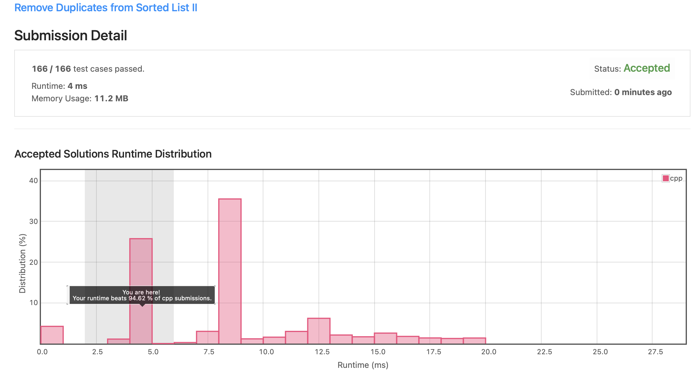

# Leetcode 82. Remove Duplicates from Sorted List II (C++)

Date: 2021.09.21

## 문제

https://leetcode.com/problems/remove-duplicates-from-sorted-list-ii/

- input: 정수형 배열 nums
- output: 주어진 배열에서 peek index 중 하나 출력
- constraint: 시간 복잡도 O(log n) 내로 작성

## 알고리즘

### Two Pointers

정렬되지 않은 배열에서 peek 원소를 찾는 문제다. peek 원소란 본인의 데이터 값이 좌우에 있는 데이터 값보다 큰 원소를 말한다. Divde and conquer를 적용하여 다음과 같은 순서로 코드를 구현했다.

1. middle 값을 기준으로 middle 값이 peek인지 확인한다.

    - 만약 middle의 index가 0 또는 n-1 이라면, 즉, 배열의 양 끝에 존재한다면 각각 오른쪽 또는 왼쪽의 데이터와만 비교한다.

2. middle 값의 바로 왼쪽과 오른쪽 원소의 peek 가능성 여부를 판단한다.

    - peek 가능성이 있는 방향으로 이동하여 탐색을 반복한다.
  
3. 탐색을 반복하다가 peek 원소를 찾을 경우 해당 index를 반환하고 프로그램을 종료한다.

### 시간 복잡도


## 제출 코드 (C++)

```C++
/**
 * Definition for singly-linked list.
 * struct ListNode {
 *     int val;
 *     ListNode *next;
 *     ListNode() : val(0), next(nullptr) {}
 *     ListNode(int x) : val(x), next(nullptr) {}
 *     ListNode(int x, ListNode *next) : val(x), next(next) {}
 * };
 */
class Solution {
public:
    ListNode* deleteDuplicates(ListNode* head) {

        int cur = 200;
        ListNode *ptr = head;
        ListNode *prev = head;
        
        while(ptr != NULL){
            
            // 현재 값이 중복 원소인지 체크하기 위한 cur 업데이트
            if(ptr->next != NULL && ptr->next->val == ptr->val)
                cur = ptr->val;
            
            // 현재 값이 cur과 같다면 제거 대상
            if(ptr->val == cur){
                ListNode *tmp = ptr;
                
                // head일 경우 head 업데이트
                if(ptr == head){
                    head = head->next;
                    ptr = head;
                    prev = head;
                }
                // prev와 ptr->next 연결하여 리스트에서 ptr 제거
                else{
                    prev->next = ptr->next;
                    ptr = prev->next;                    
                }           
                // ptr 값 메모리 해제     
                delete tmp;
            }
            else{
                // 다음 노드로 이동
                prev = ptr;
                ptr = prev->next;
            }
        }
        return head;
    }
};
```



## 회고 및 수정

