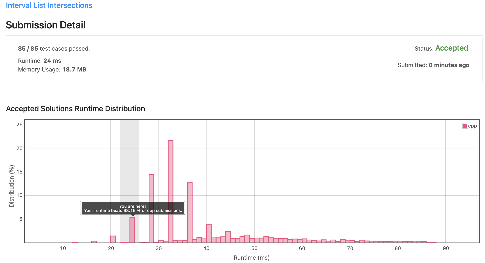
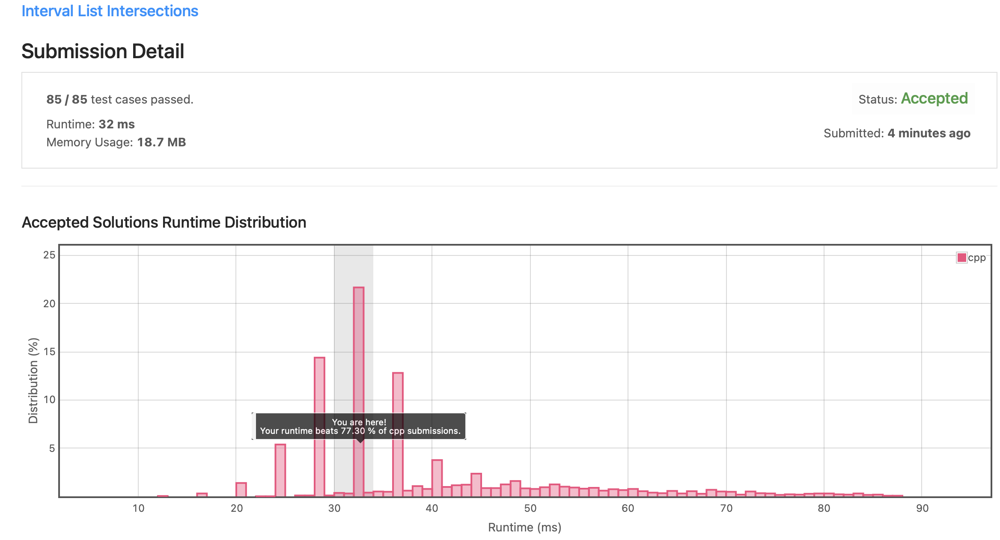

# Leetcode 986. Interval List Intersections (C++)

Date: 2021.09.25

## 문제

https://leetcode.com/problems/interval-list-intersections/

- input: interval 정보를 담고 있는 2차원 정수형 배열 firstList, secondList
- output: firstList와 secondList가 공통으로 포함하는 interval을 2차원 정수형 배열으로 출력

## 알고리즘

1. cur1와 cur2를 선언하고, 각각 firstList와 secondList에서 현재 탐색 중인 인덱스를 가리키게 한다. (초기값은 0)
2. firstList의 현재 원소와 secondList의 현재 원소를 비교한다. 만약 두 원소에 교집합이 있다면, 해당 교집합을 계산하여 intersec에 삽입한다.
3. 더 이른 시간대를 가진 배열의 인덱스를 증가시킨다.
4. 2~3을 반복하다가, 둘 중 한 배열의 끝에 도달하면 프로그램을 종료한다.

## 시간 복잡도

매 탐색마다 firstList 또는 secondList의 index를 한 칸씩 옮기면서 비교했으므로, 시간 복잡도는 O(n)이다.

## 1차 제출 코드 (C++)

```C++
class Solution {
public:
    vector<vector<int>> intervalIntersection(vector<vector<int>>& firstList, vector<vector<int>>& secondList) {
        
        vector<vector<int>> intersec;
        int size1 = firstList.size(), size2 = secondList.size();
        // firstList 또는 secondList의 배열이 비었다면 종료
        if(size1 == 0 || size2 == 0) return intersec;
        
        int cur1 = 0, cur2 = 0; // leftList, rightList의 현재 탐색 위치
        int tmp[2]; // 현재 intersect 영역 임시 저장
        
        while(cur1 < size1 && cur2 < size2){
            
            //현재 탐색 위치에서 겹치는 시간이 없다면, 더 이른 시간을 가진 배열의 인덱스 증가
            if(firstList[cur1][0] > secondList[cur2][1]) cur2++;
            else if(secondList[cur2][0] > firstList[cur1][1]) cur1++;
            // 겹치는 시간을 계산하여 intersec 배열에 삽입
            else{
                if(firstList[cur1][0] >= secondList[cur2][0])
                    tmp[0] = firstList[cur1][0];
                else
                    tmp[0] = secondList[cur2][0];

                if(firstList[cur1][1] <= secondList[cur2][1])
                    tmp[1] = firstList[cur1++][1];
                else
                    tmp[1] = secondList[cur2++][1];
                
                intersec.push_back({tmp[0], tmp[1]});
            }
        }
        
        return intersec;
    }
};
```



## 회고 및 수정

두 원소에서 min, max 함수를 사용하여 start, end 값을 먼저 계산한 후에 비교하니 훨씬 간단하게 코드를 만들 수 있었다. 다음 문제를 풀  때부터는 min, max 함수를 잘 활용하고, 중복되는 코드는 지양하는 방향으로 코드를 작성하도록 노력해야겠다.

```C++
class Solution {
public:
    vector<vector<int>> intervalIntersection(vector<vector<int>>& firstList, vector<vector<int>>& secondList) {
        
        vector<vector<int>> intersec;        
        int cur1 = 0, cur2 = 0;
        
        while(cur1 < firstList.size() && cur2 < secondList.size()){
            
            int start = max(firstList[cur1][0], secondList[cur2][0]);
            int end = min(firstList[cur1][1], secondList[cur2][1]);
            
            if(start <= end) intersec.push_back({start, end});
            (end == firstList[cur1][1]) ? cur1++ : cur2++;
            
        }
        
        return intersec;
    }
};
```

