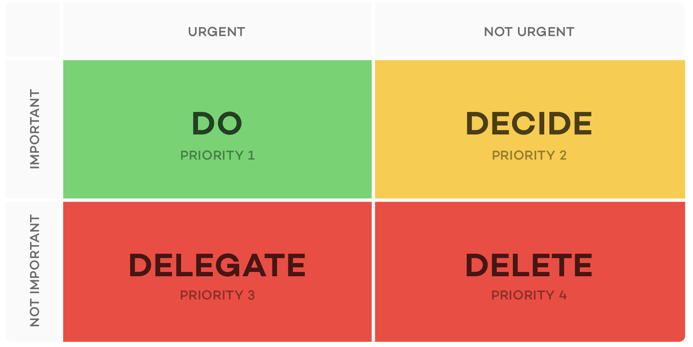

# #1 소프트웨어 아키텍처의 필요성

<!-- 2021.09.16 -->

> Clean Architecture 1부 정리

## 이 페이지를 읽으면 알 수 있는 것

- 소프트웨어 아키텍처는 왜 중요한가?
- 소프트웨어에 요구되는 가치는 무엇이고, 어떤 가치가 더 중요한 것일까?

## 설계(Design)와 아키텍처(Architecture)

우리는 흔히 설계(Design)을 저수준의 세부항을 가리킬 때, 아키텍처(Architecture)를 보다 상위 수준의 구조를 가리킬 때 사용한다. 하지만, 저자는 둘 사이에는 아무런 차이가 없다고 이야기한다. 저수준의 세부사항과 고수준의 구조는 모두 소프트웨어 전체 설계의 구성요소이며, 이 둘은 개별로 존재할 수 없다는 것이다.

### 소프트웨어 아키텍처의 목표

>"소프트웨어 아키텍처의 목표는 필요한 시스템을 만들고 유지보수하는 데 투입되는 인력을 최소화하는 데 있다."

좋은 소프트웨어란, 비용은 최소화하고 생산성은 최대화할 수 있는 설계와 아키텍처를 가진 소프트웨어라고 한다.

반면, 코드와 설계의 구조에 대한 고민이 없는 소프트웨어는 버전이 없데이트 될 때마다 개발자의 생산성을 급격히 하락시킨다. 작은 기능을 추가하기 위해 코드를 재배치해야 하고, 수많은 개발자들이 엉망인 코드를 수습하는 데 많은 시간과 에너지를 써야만 하며, 이미 엉망인 코드는 버전이 업데이트 될수록 더 엉망이 될 가능성이 높다.

## 행위와 아키텍처, 두 가지 가치에 대하여

모든 소프트웨어 시스템은 행위(behavior)와 구조(structure)라는 두 가지 가치를 제공해야하며, 개발자는 두 가치를 모두 높게 유지해야만 하는 책임을 갖는다. 어느 한 가지를 배제하게 되면 좋은 소프트웨어가 될 수 없다.

### 행위(Behavior)
행위는 직관적이고 명료하다. 소프트웨어 개발자는 소프트웨어가 특정한 요구사항을 만족하고 행위를 수행할 수 있도록 코드를 작성한다. 하지만 많은 개발자들이 이러한 활동이 자신이 해야할 일의 전부라고 생각한다.

### 아키텍처(Architecture)
소프트웨어가 존재하는 이유는 기계의 행위를 쉽게 변경하기 위해서다. 기계의 행위를 변경하는 일이 어렵다면, 그것은 소프트웨어가 아니라 하드웨어에 가까울 것이다.

소프트웨어는 soft(부드러운)과 ware(제품)의 합성어로, 소프트웨어는 본질적으로 부드러워야 한다. 쉽게 말해, 좋은 소프트웨어는 변경하기 쉬운 소프트웨어다. 그리고 좋은 아키텍처는 소프트웨어의 기능을 변경하고 싶을 때, 변경 사항을 간단하고 쉽게 적용할 수 있도록 구성된 구조를 말한다. 이러한 변경사항을 적용하는 데 드는 어려움은 변경되는 범위에만 비례해야 하며, 변경사항의 형태에는 독립적이어야한다.

### 어떤 가치가 우선인가?

저자는 행위보다 아키텍처를 우선시해야 한다고 이야기한다. 동작은 하지 않지만 수정이 쉬운 프로그램은 다른 누군가 수정해서 동작하게 만들 수 있다. 하지만 동작은 하지만 수정이 불가한 프로그램은 새로운 요구사항이 생겼을 때 더 이상 쓸모가 없게 된다는 것이 그의 의견이다.

### 아이젠하워 매트릭스

> "내겐 두 가지 유형의 문제가 있습니다. 하나는 긴급하며, 다른 하나는 중요합니다. 긴급한 문제는 중요하지 않으며, 중요한 문제는 절대 긴급하지 않습니다." - Dwight D. Eisenhower (1954)

두 가치를 위 인용구에 대입한다면, 행위는 긴급하지만 매번 높은 중요도를 가지는 것은 아니고 아키텍처는 중요하지만 긴급하지는 않다. 그리고 아이젠하워 매트릭스에서 알 수 있듯이, 중요한 일이 긴급한 일보다 우선순위를 갖는다.

### 결론

좋은 소프트웨어 아키텍처를 위해 책임감을 갖고 투쟁하자.
