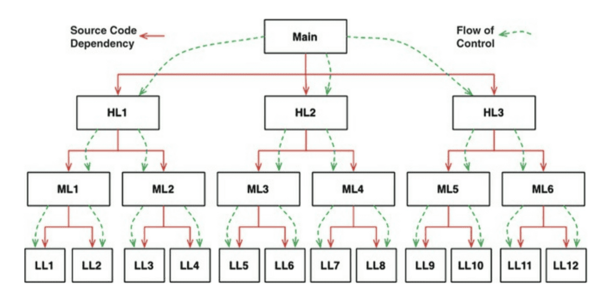
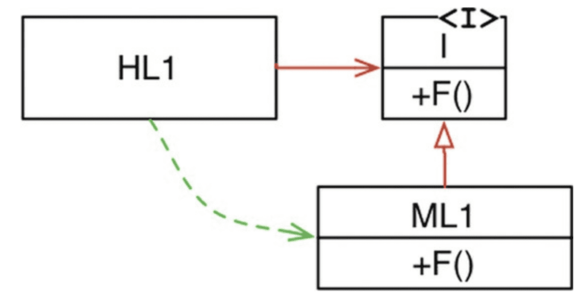

# #2 프로그래밍 패러다임

<!-- 2021.09.16 -->

> Clean Architecture(Martin, Robert C.) 2부 정리

> 책을 공부한 내용을 정리한 것으로, 본문 내용은 <클린 아키텍처> 저자의 의견을 바탕으로 합니다.

## 이 페이지를 읽으면 알 수 있는 것

- 구조적 프로그래밍이란 무엇인가?
- 객체 지향 프로그래밍이 무엇인가?
- 함수형 프로그래밍이란 무엇인가?
- 각 패러다임은 아키텍처와 어떻게 연관되어 있는가?

## 3장. 패러다임 개요

역사적으로 프로그래밍 패러다임에는 다음 세 가지 패러다임뿐이다.

- **구조적 프로그래밍**은 제어흐름의 직접적인 전환(goto)에 대해 규칙을 부과한다.
- **객체 지향 프로그래밍**은 제어흐름의 간접적인 전환(포인터)에 대해 규칙을 부과한다.
- **함수형 프로그래밍**은 할당문에 대해 규칙을 부과한다.

여기서 주목해야할 것은, 각 패러다임은 개발자로부터 특정 권한을 박탈한다는 것이다. 각 패러다임은 부정적 의도를 갖는 일종의 추가적인 규칙을 부여하며, 무엇을 해야 할지 말하기보다는 무엇을 해서는 안 되는지를 말해준다.

각 패러다임과 아키텍처의 세 가지 큰 관심사(함수, 컴포넌트 분리, 데이터 관리)가 어떻게 서로 연관되는지에 주목하며 다음 내용을 살펴보자.

## 4장. 구조적 프로그래밍

### 문제

구조적 프로그래밍은 에츠허르 비버 데이크스트라에 의해 고안되었다. 진공관 시대의 컴퓨터는 극도로 제한적으로만 기능했고, 프로그램은 바이너리 또는 아주 초기의 기계어로 작성해야 했다. 그 당시 프로그래밍은 어려웠고, 프로그래머는 프로그래밍을 잘하지 못한다는 것이 그가 인식한 문제였다.

### "증명"을 사용한 문제 해결

데이크스트라는 증명을 통해 문제를 해결하려고 했다. 수학자가 유클리드 계층구조를 사용하는 방식으로 프로그래머도 입증된 구조를 코드에 적용할 수 있을 것이라고 믿었다.

이 연구를 진행하며 데이크스트라는 goto 문장이 경우에 따라 모듈을 더 작은 단위로 분해하는 과정에 방해가 된다는 것을 발견했다. 모듈을 분해할 수 없다면, 증명의 필수 요소인 분할 정복 접근법을 사용할 수 없었다. 하지만 goto 문장이 문제가 되지 않는 경우도 있었는데, 분기(if/else)와 반복(do/while)과 같은 제어 구조와 함께 사용하는 경우였다.

그는 이러한 제어 구조는 순차 실행(sequential execution)과 결합했을 때 특별하다는 사실을 깨달았고, 여기에서 구조적 프로그래밍이 탄생했다.

### 기능적 분해

구조적 프로그래밍은 모듈을 증명 가능한 더 작은 단위로 분해할 수 있고, 이는 모듈을 기능적으로 분리할 수 있음을 뜻한다. 즉, 거대한 문제 기술서를 받더라도 문제를 고수준의 기능으로 분리하고, 각 기능은 다시 저수준의 함수들로 분리되고 구조화될 수 있다.

이를 토대로 한 구조적 분석, 구조적 설계 기법은 1970-80년대에 큰 인기를 끌었다. 이 기법을 사용하면 프로그래머는 대규모 시스템을 모듈과 컴포넌트로 분류하고, 각 모듈과 컴포넌트는 더 작은 기능들로 세분화될 수 있었다.

프로그램을 증명 가능한 세부 기능 집합으로 분해한다면, 우리는 각 세부 기능들을 테스트하여 참/거짓을 판단할 수 있게 된다. 각 세부 기능들을 거짓으로 증명하려는 시도가 실패한다면, 해당 기능은 목표에 부합할 만큼은 충분히 참이라고 여겨질 수 있는 것이다.

## 5장. 객체 지향 프로그래밍(OOP)

객체 지향이란 무엇일까? 흔히 객체 지향의 본질을 설명할 때 캡슐화, 상속, 다형성이라는 3가지의 요소를 언급하고는 한다. 과연 세 단어는 객체지향의 본질을 설명할 수 있는 충분한 개념인지 살펴보자.

### 캡슐화?

객체 지향을 이야기할 때 흔히 캡슐화를 언급한다. 객체 지향 언어는 데이터와 함수를 효과적으로 캡슐화하는 방법을 제공한다. 데이터와 함수가 캡슐화되면, 데이터는 은닉되고 일부 함수만이 외부에 노출된다. 실제 객체지향 언어에서는 각 클래스의 private 데이터와 public 함수로 이를 구현한다.

하지만 객체 지향이 아닌 언어에서도 얼마든지 완벽한 캡슐화를 구현할 수 있다. 오히려 객체 지향 이전에 더 완벽한 캡슐화를 구현했을 지도 모른다. 다음 C언어 예시를 보자.

```C
# point.h

struct Point;   
struct Point* makePoint(double x, double y);
double distance (struct Point *p1, struct Point *p2);
```

외부에서 위와 같은 헤더 파일을 사용할 때, 외부 코드는 struct Point의 데이터 멤버에 접근할 수 있을까? 위의 헤더 파일만으로는 struct Point의 데이터 형태 또는 함수 구현 방식을 전혀 알 수 없다.

```C
#point.c

#include "point.h"
#include <math.h>
#include <stdlib.h>

struct Point {
    double x, y;
};

struct Point* makepoint(double x, double y) {
    struct Point* p = malloc(sizeof(struct Point));
    p->x = x;
    p->y = y;
    return p;
}

double distance(struct Point* p1, struct Point* p2) {
    double dx = p1->x - p2->x;
    double dy = p1->y - p2->y;
    return sqrt(dx*dx + dy*dy);
}
```

위 파일은 point.h 에 선언된 구조체와 함수들이 구현된 파일이다. C언어는 이렇게 데이터 구조와 함수를 헤더 파일에 선언하고, 구현 파일에 상세 내용을 구현하는 방식을 사용한다. 프로그램 사용자는 구현 파일에 작성된 내용에는 접근할 수 없다. 이것이 C에서 제공하는 완벽한 캡슐화다.

반면, 객체지향 언어인 C++이 등장하면서 C가 제공하던 완전한 캡슐화는 오히려 깨지게 되었다. C++ 컴파일러는 기술적인 이유로 클래스 멤버 변수를 헤더 파일에 선언할 것을 요구했기 때문이다.

```C++
# point.h

class Point{
public:
    Point(double x, double y);
    double distance(const Point& p) const;

private:
    double x;
    double y;
}
```

위 코드는 동일한 내용을 C++에서 구현할 때 헤더 파일 모습이다. point.h 헤더 파일을 사용하는 개발자는 Point 의 멤버 변수를 볼 수 있게 되었다. 물론 외부에서 멤버 변수에 접근하는 것은 허용되지 않겠지만, 더 이상 데이터 구조가 노출된다는 사실은 변함이 없다. 이 때 멤버 변수의 이름이 바뀐다면 point.cc 구현 파일 또한 다시 컴파일 되어야만 하며, 이는 완벽한 캡슐화가 깨졌음을 의미한다.

```C++
# point.cc

#include "point.h"
#include <math.h>

Point::Point(double x, double y)
: x(x), y(y)
{}

double Point::distance(const Point& p) const {
    double dx = x-p.x;
    double dy = y-p.y;
    return sqrt(dx*dx + dy*dy);
}

```

이와 같이, 객체 지향의 본질이 강력한 캡슐화에 있다는 것은 받아들이기 어려우며, 실제로 많은 객체 지향 언어가 캡슐화를 거의 강제하지 않는다.

### 상속?

객체 지향 언어가 더 나은 캡슐화를 제공하지는 못했지만, 기존보다는 더 나은 상속 환경을 제공한다는 것에는 반쯤 동의한다.

상속이라는 개념 자체는 객체 지향에서 새롭게 제시한 것은 아니다. C언어와 같은 기존 언어에서도 상속을 흉내내는 기법은 사용되어 왔다. 아래 예시를 보면 NamePoint가 Point로부터 파생된 것처럼 동작함을 알 수 있다.

```C
# namedPoint.h

struct NamedPoint;
struct NamedPoint* makeNamedPoint(double x, double y, char* name);
void setName(struct NamedPoint* np, char* name);
```

```C
# namePoint.c

#include "namedPoint.h"
#include <stdlib>

struct NamePoint {
    double x, y;
    char* name;
};

struct NamePoint* makeNamedPoint(double x, double y, char* name) {
    struct NamedPoint* p = malloc(sizeof(NamedPoint));
    p->x = x;
    p->y = y;
    p->name = name;
    return p;
}

void setName(struct NamePoint* np, char* name){
    np->name = name;
}
```

다만, 객체 지향 언어에서 상속을 상당히 편리한 방식으로 제공하기 시작한 것은 부정할 수 없는 사실이다. 객체 지향 언어 덕분에 우리는 다중 상속도 쉽게 구현할 수 있게 되었다.

### 다형성?

다형성이란 하나의 타입에 여러 객체를 대입할 수 있는 성질이다. 다형성을 활용하면 객체를 변경해야할 때 타입 변경이나 코드 수정 없이 새로운 객체에 바로 적용할 수 있다.

예를 들어, 티비를 켜는 프로그램이 있다고 생각해보자. 만약 동일한 기능의 프로그램을 에어컨, 선풍기 등 여러 가전에 적용하고 싶을 때, 그때마다 각 가전을 위한 프로그램을 작성해야 한다면 상당히 비효율적일 것이다. 다형성은 하나의 '전원 켜기' 프로그램을 티비, 에어컨, 선풍기 등 다양한 객체에 적용할 수 있게 만드는 개념이다. 다형성을 적용하면 프로그램은 각 객체의 형태에 독립적으로 존재할 수 있기 때문이다.

다형성 역시 객체 지향이 새롭게 만든 개념은 아니다. 다형성은 1940년대 폰 노이만 아키텍처가 처음 구현된 이후 계속해서 사용된 개념으로, 객체 지향 이전에는 다형성을 구현하기 위해 함수를 가리키는 포인터를 사용해야만 했다. 하지만, 함수 포인터를 직접 사용하는 방식에는 문제가 있었는데, 함수 포인터는 프로그래머가 특정 관례를 늘 수동으로 처리해줘야만 한다는 점이다. 예를 들어, 포인터를 관례적으로 늘 초기화해줘야 하고, 모든 함수는 포인터를 통해 호출해야만 한다. 만약 개발자의 실수로 이 관례를 지키지 않는다면 버그가 발생하고, 이 버그를 찾아내는 것은 굉장히 어려울 것이다.

객체 지향은 더 편리하고 안전한 방식으로 다형성을 제공하기 시작했고, 따라서 실수할 위험이 사라졌다. 객체 지향을 사용하면 다형성은 더 이상 시스템에 위협이 되지 않는다. 객체 지향은 다형성을 통해 안전하게 제어 흐름을 전환하는 규칙을 부과할 수 있게 되었다.

### 다형성 - 의존성 역전

다형성을 통해 안전하게 제어 흐름을 전환한다는 게 무슨 말일까? 아래 예시를 살펴보자.



위 그림은 객체 지향 이전의 전형적인 소프트웨어 호출 트리의 모습이다. main 함수는 고수준 함수를 호출하고, 고수준 함수는 차례로 중간 수준 함수와 저수준 함수를 호출한다. 이러한 호출 트리에서 소스 코드 의존성의 방향은 반드시 제어 흐름과 동일하게 된다. 즉, 고수준 함수의 코드가 저수준 함수의 코드에 의존적이라는 것이다. 이 경우, 저수준 함수의 변경이 발생할 때 고수준 함수의 내용을 수정해야 하는 문제가 발생한다. 



위 그림은 다형성이 작동할 때의 호출 트리 모습이다. 위 그림에서 고수준 함수인 HL1은 중간 수준 함수인 ML1 모듈의 F() 함수를 호출하지만, 소스 코드 의존성은 반대다. 이를 의존성 역전이라고 부른다. 의존 관계를 맺을 때 변화하기 쉬운 것, 자주 변화하는 것보다는 변화하기 어려운 것, 거의 변화가 없는 것에 의존하도록 아키텍처를 구성하는 것은 아주 중요하다.

객체 지향 언어가 다형성을 안전하고 편리하게 제공한다는 것은 이처럼 소스코드 의존성을 언제든 역전시킬 수 있다는 뜻이기도 하다. 객체 지향 언어를 사용하면 시스템의 소스 코드 의존성에 대한 절대적인 권한을 갖게 된다. 다형성을 적용함으로써 DB, UI 등 세부 모듈의 변경이 정책 등 고수준 모듈에 영향을 주지 않도록 시스템을 구성할 수 있다.

### 결론

객체 지향이란, 다형성을 이용하여 전체 시스템의 모든 소스 코드 의존성에 대한 절대적인 제어 권한을 획득할 수 있는 능력이다. 즉, 프로그램을 고수준의 정책을 포함하는 모듈과 저수준의 세부사항을 포함하는 모듈로 분류하고, 고수준의 모듈이 세부사항 모듈에 의해 영향을 받지 않도록 독립성을 보장할 수 있게 되었다.

## 6장. 함수형 프로그래밍

함수형 프로그래밍은 1930년대 알론조 처치가 람다 계산법을 기반으로 발명한 패러다임이다. 함수형 언어에 해당되는 클로저(Clojure)는 1부터 25까지 정수의 제곱을 출력하는 문제를 아래와 같이 작성한다.

```Clojure
(println (take 25 (map (fn [x] (* x x)) (range))))
```

이를 풀어서 표현하면 다음과 같다.

```Clojure
(println ; 출력한다.
 (take 25 ; 처음부터 25까지
  (map (fn [x] (* x x)) ; 제곱을
   (range)))) ; 정수의
```

얼핏 보면 파이썬의 람다 함수와 유사한 것으로 보이기도 한다. 함수형 언어의 가장 큰 특징은 한 번 지정된 변수는 변경되지 않는다는 점에 있다.

아키텍처를 고려할 때 불변성에 대해 생각해야 하는 이유는, 많은 문제가 가변 변수로 인해 발생하기 때문이다. 만약 어떠한 변수도 갱신되지 않는다면 경합이나 동시 업데이트 문제가 발생하지 않을 것이다. 하지만 모든 변수를 불변하게 구현하는 것은 현실적으로 어려울 수 있으므로, 타협이 필요하다.

가장 중요한 타협 중 하나는, 애플리케이션 내부의 서비스를 가변 컴포넌트와 불변 컴포넌트로 분리하는 일이다. 불변 컴포넌트는 함수형 방식으로만 작업을 처리하며, 어떠한 가변 변수도 허용하지 않고, 다른 가변 컴포넌트와 통신할 수 있다. 현명한 아키텍트라면 가능한 많은 처리를 불변 컴포넌트로 옮겨야 하며, 가변 컴포넌트에서는 가능한 적은 코드를 포하마해야만 한다.

불변 컴포넌트를 최대화하기 위해서는 이벤트 소싱을 사용할 수도 있다. 이벤트 소싱이란, 상태가 아닌 트랜잭션을 저장하는 전략이다. 상태 정보가 필요할 경우 트랜잭션을 처리하여 상태를 계산한다. 저장 공간과 처리 능력이 충분하다면 애플리케이션의 불변성을 높이고, 완전한 함수형으로 구현할 수도 있다. git을 떠올리면 쉽게 이해할 수 있을 것이다.

## 결론

세 가지 패러다임에 대해 알아보고 각 패러다임은 어떤 규율을 부과하는지, 각 요소들은 어떻게 중요하기에 제한되었는지 등을 알아보았다.

본 글의 시작에서, 각 패러다임과 아키텍처의 세 가지 큰 관심사(함수, 컴포넌트 분리, 데이터 관리)가 어떻게 서로 연관되는지에 주목하자는 이야기를 했었다. 내가 내린 나름의 결론은 다음과 같다.

- 구조적 프로그래밍은 제어흐름의 직접적인 전환에 부과되는 규율이다.
    - 좋은 아키텍처는 거대한 프로그램을 고수준의 기능으로 분리하고, 각 기능을 저수준의 증명할 수 있는 세부 함수들로 분리하고 구조화할 수 있어야 한다.
- 객체 지향 프로그래밍은 제어흐름의 간접적인 전환에 부과되는 규율이다.
    - 좋은 아키텍처는 프로그램을 고수준의 정책 모듈과 저수준의 세부사항 모듈로 분리하고, 고수준의 모듈이 저수준 모듈에 독립적으로 존재할 수 있게 설계해야 한다.
- 함수형 프로그래밍은 변수 할당에 부과되는 규율이다.
    - 좋은 아키텍처는 더 많은 데이터들이 불변성을 가질 수 있게 설계해야 한다.