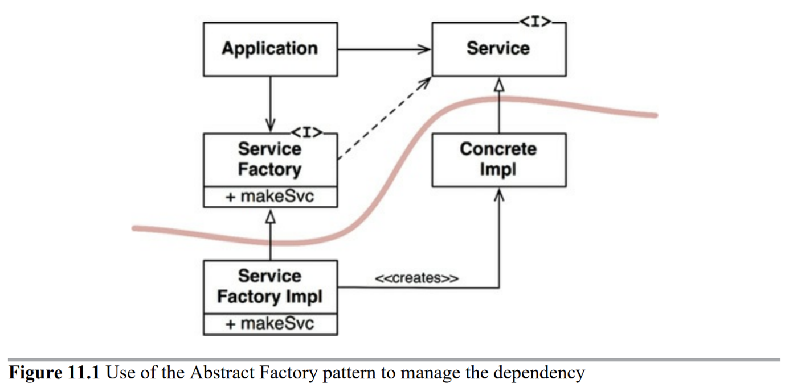

# #3 설계 원칙

<!-- 2021.09.24 -->

> Clean Architecture(Martin, Robert C.) 3부 정리    

## 이 페이지를 읽으면 알 수 있는 것

- 소트프웨어 설계 원칙 5가지는 무엇인가?
- 각 원칙을 위배할 경우 어떤 문제가 발생하는가?
- 소프트웨어 설계할 때 각 원칙을 어떻게 적용할 것인가?

## 들어가며: SOLID 원칙

SOLID는 좋은 아키텍처를 정의하는 다섯 가지 원칙이다. SOLID 원칙은 함수와 데이터 구조를 배치하고 각 클래스를 서로 결합하는 방법을 설명한다. SOLID 원칙은 중간 수준의 소프트웨어의 구조를 정의하는 데 목적이 있는데, 변경에 유연하고, 이해하기 쉬우며, 많은 소프트웨어 시스템에 사용할 수 있는 컴포넌트의 기반을 만들고자 한다.

## SRP: 단일 책임 원칙

`Single Responsibility Principle`

단일 모듈의 변경의 이유는 오직 하나뿐이어야 한다는 원칙이다. 즉, 하나의 모듈은 오직 하나의 이해관계자(이하 액터)에 의해서만 변경되어야 한다. 이해를 돕기 위해 SRP를 위반할 때 어떤 일이 벌어질지 살펴보자.

### 징후 1. 우발적 중복

다음과 같이 급여 애플리케이션의 Employee 클래스가 있다.

Employee 클래스는 SRP를 위반하고 있는데, 클래스가 가진 세 가지 매서드가 모두 다른 액터를 책임지기 때문이다.

- calculatePay(): 회계팀에서 기능 정의. CFO 보고를 위해 사용
- reportHours(): 인사팀에서 기능 정의. COO 보고를 위해 사용
- save(): DB 관리자가 기능 정의. CTO 보고를 위해 사용

다른 액터를 위해 동작하는 세 가지 매서드가 단일 클래스에 배치됨으로써, 세 액터가 서로 결합되었다. 이 말은 회계팀에서 결정한 조치가 인사팀에서 의존하는 무언가에 영향을 줄 수 있다는 것을 의미한다.

calculatePay()와 reportHours() 두 메서드가 초과 시간을 계산하는 regularHours() 매서드를 공유한다고 생각해 보자. 만약 회계팀의 급여 정책이 변경되어 regularHours() 매서드에 수정이 필요해졌고, 회계팀은 인사팀이 regularHours()를 참조하고 있다는 사실을 모른다면 어떻게 될까? 인사팀은 영문도 모른 채 기존과 다른 데이터를 얻기 시작할 것이며, 이는 회사의 큰 손실로 이어질 수 있다.

### 징후 2. 병합

하나의 모듈이 많은 메서드를 포함했을 때의 또 다른 문제는 충돌과 병합이 발생할 확률이 증가한다는 것이다. 만약 비슷한 시기에 CTO 팀은 DB 정책을 수정하고, CFO 팀은 회계 정책을 수정하기로 결정했다고 생각해 보자. 그리고 CTO 팀과 CFO 팀에서 고용한 서로 다른 개발자가 동시에 변경 작업을 시작한다면 어떻게 될까? 두 팀이 적용한 변경사항은 결국 충돌하고 원하지 않는 방향으로 병합될 것이다. 병합 후에는 클래스를 공유하는 모든 유관 부서가 피해를 입는다.

위와 같은 징후들을 피하기 위해, SRP는 서로 다른 액터가 의존하는 코드를 반드시 분리해야 한다고 주장한다.

### 해결책

각 매서들을 서로 다른 클래스로 분리한다면 위와 같은 문제를 해결할 수 있다.

아무런 매서드가 없는 간단한 데이터 구조인 Employee Data를 만들고, 각 메서드를 가진 클래스가 데이터를 공유하도록 한다. 세 클래스는 서로 독립적이므로 중복과 충돌을 피할 수 있다. 하지만 이 경우에도 단점이 있는데, 개발자가 세 가지 클래스를 개별로 인스턴스화해야 한다는 것이다.

이 문제는 '퍼사드 패턴(Facade Pattern)'을 사용함으로써 해결할 수 있다.

퍼사드 패턴이란, 클래스 라이브러리 등의 소프트웨어에 대한 간략화된 인터페이스를 제공하는 객체이다. Employee Facade라는 빈 클래스를 생성하고, 해당 클래스에 세 개의 메서드의 객체를 생성하고 요청을 위임하는 역할을 부여함으로써 앞서 정의한 세 메서드를 쉽게 생성하고 관리할 수 있다.

### 결론

SRP는 서로 다른 목적과 액터를 갖는 메서드는 반드시 독립적인 클래스로 분리되어야 한다는 정책이다. SRP는 컴포넌트 수준에서는 공통 폐쇄 원칙(Common Closure Principle)으로, 아키텍처 수준에서는 아키텍처 경계의 생성을 책임지는 변경의 축의 형태로 다시 등장한다.

## OCP: 개방-폐쇄 원칙

`Open-Closed Principle`

개방-폐쇄 원칙은 1980년대 버트란트 마이어애 의해 정의된 용어이다. 그는 "소프트웨어 객체는 확장에는 열려 있어야 하고, 변경에는 닫혀 있어야 한다"고 이야기했다. 즉, 시스템의 행위를 변경할 때는 기존 코드를 수정하기보다는 반드시 새로운 코드를 추가하는 방식을 사용하도록 소프트웨어를 설계해야 한다는 뜻이다. OCP는 컴포넌트 수준에서 아주 중요한 의미를 가지는데, 아래 사례를 통해 이해해 보자.

### 사고 실험

재무제표를 웹 페이지로 보여주는 시스템을 생각해 보자. 웹 페이지에 표시되는 데이터는 스크롤 할 수 있으며, 음수는 빨간색으로 출력된다.

만약 어떤 이해관계자가 동일한 정보를 보고서의 형태로 변환해서 흑백 프린터로 출력하도록 요청했다고 해보자. 보고서에는 페이지 번호가 필요하고, 적절한 머리글과 바닥글이 있어야 하며, 음수는 괄호로 감싸야 한다.

보고서를 생성하기 위해 새로운 코드를 작성할 때 기존의 코드는 얼마나 바꿔야 할까? 이상적인 소프트웨어 아키텍처에서 기존 코드의 변경량은 0이다. SRP를 이용하여 각 클래스를 분리하고, DIP를 이용하여 클래스 사이의 의존성을 체계화함으로써 변경량을 최소화할 수 있다.

### SRP와 DIP, 그리고 OCP

위에서 본 예시에 SRP를 적용하면 시스템이 다음과 같은 두 개의 책임으로 분리된다.

- 보고서용 데이터를 계산하는 책임
- 데이터를 웹 또는 프린트에 적합한 방식으로 표현하는 책임

이렇게 책임을 분리하는 것에서 그치지 않고, DIP를 적용하여 각 요소의 의존성 또한 확실하게 조직화해야 한다. 새로 조직화한 구조에서는 각 요소의 변경이 다른 요소에 영향을 미치지 않아야 하며, 행위가 확장할 때 기존 코드에 변경이 없음을 보장해야 한다.

이러한 목적을 달성하기 위해서는 처리 과정을 클래스 단위로 분할하고, 이 클래스를 컴포넌트 단위로 구분해야 한다. 본 예제에서는 필요한 클래스들을 다음과 같이 컴포넌트화할 수 있다.

- `<I>` : 인터페이스 클래스
- `<DS>` : 데이터 구조 클래스
- 화살표가 열려있다면 사용 관계, 닫혀 있다면 상속 관계

위 구조에서 클래스의 의존성은 소스 코드 의존성을 의미한다. A 클래스의 화살표가 B 클래스로 향한다면, A 클래스는 B 클래스를 호출하지만 B 클래스는 A 클래스에 대해 알지 못함을 의미한다.

또한, 컴포넌트 사이의 화살표 관계는 항상 단방향으로만 이루어진다는 점에도 주목해야 한다. 컴포넌트 관계에서 화살표는 변경으로부터 보호해야 하는 컴포넌트를 향하도록 그려진다.

그림 8.2의 구조에서 가장 중요한 컴포넌트는 업무 규칙을 포함하고 있는 Interactor 컴포넌트다. 따라서 Interactor 컴포넌트는 다른 모든 컴포넌트로부터 보호되어야 하고, OCP를 가장 잘 적용할 수 있는 곳에 위치해야 한다. 그 다음으로 중요한 컴포넌트는 Controller 컴포넌트, 그 다음은 Presenter 컴포넌트가 될 것이다. OCP는 이렇게 각 컴포넌트 사이의 수준을 비교하고, 그 수준에 맞게 컴포넌트를 배치시킨다. 이렇게 함으로써 데이터를 보여주는 Presenter 컴포넌트의 변경이 데이터를 생성하는 Interactor 컴포넌트에 전혀 영향을 주지 않도록 의존성을 부여할 수 있다.

### 결론

OCP는 아키텍처의 기능이 어떻게, 왜, 언제 발생하는지에 따라서 기능을 분리하고, 분리한 기능을 컴포넌트 계층 구조로 조직화하는 정책을 말한다. 컴포넌트 계층 구조를 조직화하면 저수준 컴포넌트에서 발생된 변경으로부터 고수준 컴포넌트를 보호할 수 있다.

## LSP: 리스코프 치환 원칙

`Liskov Substitution Principle`

1988년 바바라 리스코프가 정의한, 하위 타입에 대한 유명한 원칙이다. 리스코프는 하위 타입(subtype)을 다음과 같이 정의했다.

> "여기에서 필요한 것은 다음과 같은 치환 원칙이다. S 타입의 객체 o1 각각에 대응하는 T 타입 객체 o2가 있고, T 타입을 이용해서 정의한 모든 프로그램 P에서 o2의 자리에 o1를 치환하더라도 P의 행위가 변하지 않는다면, S는 T의 하위 타입이다.

LSP란, 상호 대체 가능한 구성 요소를 이용해 소프트웨어 시스템을 만들기 위해서는 각 구성 요소가 반드시 서로 치환 가능해야 한다는 원칙이다. 

### 상속을 사용하도록 가이드하기

Personal License와 Business License라는 두 가지 하위 타입을 갖는 License 클래스가 있다고 하자. License 클래스는 calcFee() 라는 매서드를 가지며, Billing 애플리케이션에서 이 매서드를 호출한다.

이 설계는 LSP를 준수하는데, Billing의 행위가 License의 하위 타입 중 무엇을 사용하는지에 전혀 의존하지 않기 때문이다. 이들 하위 타입은 모두 License 타입을 치환할 수 있다.

### LSP와 아키텍처

LSP는 단순히 상속을 사용하도록 가이드 하는 방법이 아니라, 인터페이스와 구현체에도 적용되는 광범위한 소프트웨어 설계 원칙이다. 아키텍처 관점에서 LSP를 이해하는 최선의 방법은 이 원칙을 어겼을 때 시스템 아키텍처에 무슨 일이 일어나는지 관찰하는 것이다.

### LSP를 위배하는 사례

다양한 택시 파견 서비스를 통합하는 애플리케이션을 만들고 있다고 생각해 보자. 고객은 택시 업체에 무관하게 자신의 상황에 가장 적합한 택시를 찾는다. 고객이 이용할 택시를 결정하면, 시스템은 REST 서비스를 통해 선택된 택시를 고객 위치로 파견한다.

택시 파견 REST 서비스의 URI은 운전기사 DB에 저장되어 있다고 가정해 보자. 시스템에서 사용자가 기사를 선택하면, 해당 기사의 기록으로부터 URI 정보를 얻은 후, 그 URI 정보를 이용하여 해당 기사를 고객 위치로 파견한다. 이것이 가능하기 위해서는 모든 택시업체에서 동일한 REST 인터페이스를 반드시 준수해야만 한다. 하지만 이것은 현실적으로 쉬운 일이 아니다.

만약 acme라는 회사에서 REST 인터페이스 형식을 임의로 수정한다면 어떻게 될까? 프로그램은 if문 등의 제어문을 사용하여 acme의 예외 사항을 처리하는 로직을 추가해야 할 것이다. 이러한 설계는 온갖 에러가 발생할 여지를 만든다.

훌륭한 설계자라면 이 같은 버그로부터 시스템을 격리해야만 한다. 따라서, 모듈 내에서 예외 처리를 하기 보다는, REST 서비스가 서로 치환 가능하지 않다는 사실을 처리하는 별도의 복잡한 모듈을 추가해야 할 것이다.

### 결론

위의 사례에서 각 택시 회사의 REST 인터페이스는 상위 인터페이스를 치환할 수 없게 되었으며, 이는 LSP 위반에 해당한다. LSP가 위반된 시스템은 구조적으로 오염되어 별도의 복잡한 메커니즘을 추가해야 한다는 끔찍한 결과를 낳는다. 따라서 아키텍처 수준에서 LSP를 적용하는 것은 아주 중요하다.

## ISP: 인터페이스 분리 원칙

`Interface Segregation Principle`

ISP는 소프트웨어의 각 모듈은 사용하지 않은 것에 의존하지 않아야 한다는 원칙이다. 다음 다이어그램 예시를 살펴보자.

OPS 클래스를 사용하는 User1, User2, User3 모듈이 있다. 이때, User1은 op1만을, User2는 op2만을, User3은 op3만을 사용한다고 가정해 보자. 이 경우 User1은 op2, op3을 전혀 사용하지 않음에도 두 메서드에 의존하게 된다. 이러한 의존성으로 인해 OPS 클래스에서 op2의 소스 코드가 변경될 경우, User1과 관련된 코드는 전혀 변경되지 않았음에도 User1 또한 다시 컴파일한 후 새로 배포되어야 한다.

이 문제는 다음과 같이 인터페이스를 분리함으로써 해결할 수 있다.

OPS의 각 오퍼레이션을 세 개의 인터페이스로 분리했다. 이렇게 설계할 경우, User1의 소스 코드는 U1Ops와 op1에만 의존하지만 OPS에는 의존하지 않게 된다. 따라서 User1과 무관한 OPS의 변경에 의해 User1을 새로 컴파일해야 하는 상황은 발생하지 않는다.

### ISP와 언어

앞의 사례는 언어 타입에 의존한다. 정적 타입 언어는 사용자가 import, use, include 등의 선언문을 사용하도록 강제한다. 이러한 소스 코드 선언문은 소스 코드 의존성을 만들어 내고, 이로 인해 재컴파일이나 재배포가 강제되는 상황이 무조건 초래된다.

루비나 파이썬 같은 동적 타입 언어에서는 소스 코드에 이러한 선언문이 존재하지 않는다. 따라서 소스 코드 의존성이 아예 없으며, 재컴파일과 재배포가 필요하지 않다. 따라서, 동적 타입의 언어를 사용하는 것이 정적 타입의 언어를 사용할 때보다 유연하고 결합도가 낮은 시스템을 만드는 데 적합하다.

### ISP와 아키텍처

필요 이상으로 많은 것을 포함하는 모듈에 의존하는 것은 해롭다. 이것이 ISP의 근본적인 동기다.

만약 S 시스템의 설계자가 F라는 프레임워크를 시스템에 도입하기를 원한다고 생각해 보자. 그리고 F 프레임워크의 개발자는 특정한 D 데이터베이스를 반드시 사용하도록 만들었다고 가정해 보자. 이 경우 S는 F에 의존하고, F는 다시 D에 의존하는 구조가 된다.

D라는 데이터베이스 안에 F에서는 필요하지 않은 기능들이 다수 포함되어 있다면 어떨까? 이 경우 사용하지 않는 기능의 변경에 의해서도 F를 재배포해야만 하며, 의존성에 의해 S까지 재배포해야하는 상황이 발생한다. 더 심각한 문제는, S와 F와 무관한 D의 기능에 문제가 발생할 경우에도 S와 F에 영향을 준다는 사실이다.

### 결론

ISP는 불필요한 짐을 실은 무언가에 의존하면 예상치도 못한 문제에 빠진다는 교훈을 준다.

## DIP: 의존성 역전 원칙

`Dependency Inversion Principle`

DIP는 소스 코드 의존성이 '추상'에 의존하며 '구체'에는 의존하지 않아야 한다는 원칙이다. 즉, 고수준 정책을 구현하는 코드는 저수준 세부사항을 구현하는 코드에 절대로 의존해서는 안 된다는 뜻이다. 반대로 세부 사항이 정책에 의존하는 구조를 가져야 한다.

다만, String 클래스와 같이 안정성이 보장된 환경에 대해서는 의존성을 고려하지 않는 편이다. String 클래스는 구체 클래스지만, 변경되는 일은 거의 없으며 변경되더라도 엄격하게 통제되기 때문이다. 우리가 의존하지 않도록 피하고자 하는 것은 '변동성이 큰 구체적인 요소'다. 이것은 주로 우리가 열심히 개발하는 중이라 자주 변경될 수밖에 없는 모듈들이다.

### 안정된 추상화

DIP가 적용된 구조에서는 추상 인터페이스에 변경이 생길 경우 이를 구체화한 구현체들도 함께 수정해야 한다. 하지만, 구체적인 구현체에 변경이 생기는 경우에는 그 구현체가 구현하는 인터페이스는 대다수의 경우 변경될 필요가 없다.

소프트웨어 설계의 기본은 인터페이스를 변경하지 않고도 구현체에 기능을 추가할 수 있는 방법을 찾는 것이다. 즉, 안정된 소프트웨어 아키텍처란 변동성이 큰 구현체에 의존하는 일은 지양하고 안정된 추상 인터페이스를 선호하는 아키텍처라는 뜻이다.

이 원칙에서 전달하고자 하는 내용은 다음과 같이 매우 구체적인 코딩 실천법으로 요약할 수 있다.

- **변동성이 큰 구체 클래스를 참조하지 말라.** 대신 추상 인터페이스를 참조하거나 추상 팩토리를 사용해라.
- **변동성이 큰 구체 클래스로부터 파생하지 말라.** 정적 타입의 언어에서 상속은 가장 강력한 동시에 뻣뻣해서 변경하기가 어렵다. 따라서 상속은 아주 신중하게 사용해야 한다.
- **구체 함수를 오버라이드 하지 말라.** 대체로 구체 함수는 소스 코드 의존성을 필요로 한다. 따라서 구체 함수를 오버라이드 하면 이러한 의존성을 제거할 수 없다. 의존성을 제거하기 위해서는 차라리 추상 함수로 선언하고 구현체들에서 각자의 용도에 맞게 구현해라.
- **구체적이며 변동성이 크다면 절대로 그 이름을 언급하지 말라.**

### 팩토리

이 규칙들을 준수하려면 변동성이 큰 구체적인 객체는 특별히 주의해서 생성해야 한다. 대다수의 객체 지향 언어에서는 객체를 생성할 때 해당 객체를 구체적으로 정의한 코드에 대해 소스 코드 의존성이 발생하기 때문이다. 이때 사용할 수 있는 것이 추상 팩토리다.

위의 그림을 이해해 보자. Application은 Service 인터페이스를 통해 ConcreteImpl를 사용하는데, ConcreteImpl 인스턴트를 직접 생성하면 소스 코드 의존성이 발생하게 된다. 이 문제를 해결하기 위해 Application은 ServiceFactory 인터페이스의 makeSvc 메서드를 호출한다. 이 메서드는 ServiceFactory로부터 파생된 ServiceFactoryImpl에서 구현되며, ServiceFactoryImpl은 ConcreteImpl 인스턴트를 생성하고 Service 타입을 반환한다.

위 그림의 곡선은 아키텍처 곡선을 뜻한다. 이 곡선은 시스템을 추상 컴포넌트와 구체 컴포넌트로 분리한다. 소스 코드 의존성은 해당 곡선과 교차할 때 모두 한 방향, 즉 추상적인 쪽으로 향한다. 추상 컴포넌트는 애플리케이션의 모든 고수준 업무 규칙을 포함하고, 구체 컴포넌트는 업무 규칙을 다루기 위해 필요한 모든 세부사항을 포함한다.

제어 흐름은 소스 코드 의존성과는 정반대 방향으로 곡선을 가로지른다는 점에 주목하자. 다시 말해 소스 코드 의존성은 제어 흐름과는 반대 방향으로 역전된다. 이러한 이유로 이 원칙을 의존성 역전이라고 부른다.

### 구체 컴포넌트

사실 그림 11.1은 DIP에 위반되는데, ServiceFactoryImpl라는 구체 클래스가 ConcreteImpl라는 구체 클래스에 의존하는 구체적인 의존성이 있기 때문이다. 하지만, DIP를 위배하는 구체 클래스들은 적은 수의 구체 컴포넌트 내부에 모아둘 수 있고, 시스템의 나머지 부분과 분리시킬 수 있다.

대부분의 시스템은 이러한 구체 컴포넌트를 최소한 하나는 포함할 것이다. 이 컴포넌트를 흔히 메인(Main)이라고 부르는데, main 함수를 포함하기 때문이다. 위의 예시라면, main 함수는 ServiceFactoryImpl의 인스턴스를 생성하고 그 인스턴스를 ServiceFactory 타입으로 전역 변수에 저장할 것이다. 그리고 Application은 이 전역 변수를 이용하여 ServiceFactoryImpl에 접근할 수 있게 될 것이다.

### 결론

소프트웨어는 구체 컴포넌트와 추상 컴포넌트로 분리되어야 하며, 그 경계에서 의존성은 반드시 추상적인 방향으로만 향해야 한다는 것이 DIP 원칙이다 DIP는 소프트웨어 아키텍처에서 가장 중요한 원칙 중 하나로, 이 규칙은 향후 의존성 규칙으로도 불릴 것이다.

## Reference

- 이미지 참조: https://sungjk.github.io/2019/10/26/clean-architecture-1.html