# #4 컴포넌트 원칙

<!-- 2021.09.29 -->

> Clean Architecture(Martin, Robert C.) 4부 정리   

## 이 페이지를 읽으면 알 수 있는 것

- 소트프웨어 컴포넌트란 무엇인가?
- 소프트웨어 컴포넌트는 어떤 역사를 거쳐 왔는가?
- 어떤 클래스를 어느 컴포넌트에 포함시켜야 할까?
- 어떤 컴포넌트의 추상화 정도와 의존 정도가 적절한지 어떻게 판단할 수 있을까?

## 12장. 컴포넌트

컴포넌트는 시스템의 구성 요소로 `배포`할 수 있는 가장 작은 단위다. 여러 컴포넌트를 링크하여 실행 가능한 단일 파일로 생성할 수도 있다. 컴포넌트가 마지막에 어떤 형태로 배포되든, **잘 설계된 컴포넌트라면 반드시 독립적으로 배포 가능한, 즉 독립적으로 개발 가능한 능력을 갖춰야 한다.**

### 컴포넌트의 간략한 역사

소프트웨어 개발 초기에는 메모리에서의 프로그램 위치와 레이아웃을 프로그래머가 직접 제어했다. 이 시기의 프로그래머는 프로그램을 로드할 메모리의 위치를 직접 정해야 했고, 라이브러리 함수를 사용할 때는 라이브러리의 소스 코드를 애플리케이션 코드에 직접 포함시켜 단일 프로그램으로 결합했다. 함수 라이브러리가 클수록 컴파일이 오래 걸렸다.

컴파일 시간을 단축하기 위해 프로그래머는 함수 라이브러리의 소스 코드를 애플리케이션 코드로부터 분리했다. 함수 라이브러리는 개별적으로 컴파일하고, 컴파일된 바이너리를 메모리의 특정 위치에 로드했다. 함수 라이브러리에 대한 심벌 테이블을 생성하고, 이를 이용해 애플리케이션 코드를 컴파일했다. 애플리케이션을 실행할 때는 바이너리 함수 라이브러리를 로드한 후 애플리케이션을 로드했다. 

하지만 이 경우 함수 라이브러리가 특정 메모리 공간을 차지하고 있기 때문에, 애플리케이션이 커지는 상황에서 함수 라이브러리 주소를 만난다면 애플리케이션이 두 개 이상의 주소 세그먼트로 분리되어야 한다는 문제가 있었다. 다음 그림과 같이 말이다. 프로그램과 라이브러리가 늘어날수록 이러한 상황은 심각해졌다.

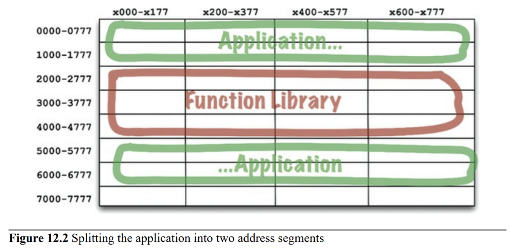

### 재배치성

해결책은 재배치가 가능한 바이너리였다. 지능적인 로더를 사용해서 메모리에 재배치할 수 있는 형태의 바이너리를 생성하도록 컴파일러를 수정하자는 것이었다. 로더는 재배치 코드가 자리할 위치를 전달받았고, 재배치 코드에는 로드한 데이터에서 어느 부분을 수정해야 정해진 주소에 로드할 수 있는지를 알려주는 플래그가 삽입되었다.

이제 프로그래머는 함수 라이브러리를 로드할 위치와 애플리케이션을 로드할 위치를 로더에게 지시할 수 있었다. 로더는 여러 개의 바이너리를 입력받고, 하나씩 차례로 메모리에 로드하면서 재배치하는 작업을 처리했으며, 프로그래머는 필요한 함수만을 로드할 수 있게 되었다.

또한 컴파일러는 재배치 가능한 바이너리 안의 함수 이름을 메타데이터 형태로 생성하도록 수정되었다. 프로그램이 라이브러리 함수를 호출한다면 컴파일러는 라이브러리 함수 이름을 `외부 참조`로 생성했고, 라이브러리 함수를 정의하는 프로그램이라면 해당 이름을 `외부 정의`로 생성했다. 이렇게 하면 로더가 외부 참조를 외부 정의 주소에 연결할 수 있게 된다. 이렇게 프로그램을 로드하는 동시에 링크까지 수행하는 로더를 링킹 로더라고 부른다.

### 링커

링킹 로더의 등장으로 프로그램은 개별적으로 컴파일하고 로드할 수 있는 단위로 분할되었다. 작은 프로그램과 비교적 작은 라이브러리를 링크할 때는 이러한 방식이 대체로 잘 동작했다. 하지만 프로그램이 커지면서 링킹 로더의 성능은 한참 부족해졌다. 링킹 로더는 매우 느린 장치를 사용해서 수 백 개의 라이브러리를 읽고 외부 참조를 해석해야 했다. 프로그램이 커질수록 링킹 로더가 프로그램 하나를 로드하는 데만 한 시간 이상이 걸리게 되었다.

결국 로드와 링크는 두 단계로 분리되었다. 링커라는 별도의 애플리케이션을 구현하여 링크 과정을 처리했고, 그 덕분에 로더의 로딩 과정이 아주 빨라졌다. 비록 링커는 여전히 느렸지만, 한번 만들어둔 실행 파일은 언제라도 빠르게 로드할 수 있게 되었다.

하지만 프로그램 코드가 수십만 라인을 넘어서면서 상황은 원점으로 돌아갔다. 각 모듈을 컴파일하는 것은 상대적으로 빠를지라도 전체 모듈을 컴파일하는 것은 여전히 시간이 꽤 걸렸던 것이다. 로드 시간은 빨랐지만, 컴파일-링크 시간이 병목 구간이었다. '컴파일하고 링크하는 데 사용 가능한 시간을 모두 소모할 때까지 프로그램이 커진다'라는 머피의 법칙이 우세했다.

하지만 머피의 법칙은 무어의 법칙에 의해 종결되었다. 무어의 법칙에 의해 컴퓨터의 성능이 기하급수적으로 좋아지기 시작했고, 프로그래머가 프로그램을 성장시키는 속도보다 링크 시간이 줄어드는 속도가 더 빨라지기 시작했다. 이렇게 액티브 X와 공유 라이브러리의 시대가 열렸다. 컴퓨터 장치가 빨라져 또다시 로드와 링크를 동시에 할 수 있게 되었다. 다수의 공유 라이브러리를 순식간에 서로 링크한 후, 링크가 끝난 프로그램을 실행할 수 있게 되었다. 이렇게 컴포넌트 플러그인 아키텍처가 탄생했다.

### 결론

소프트웨어 컴포넌트란, 런타임에 플러그인 형태로 결합할 수 있는 동적 링크 파일을 말한다. 컴포넌트 플러그인 아키텍처를 적용하는 것이 과거에는 매우 어려웠지만, 이제는 기본적으로 쉽게 사용할 수 있다.

## 13장. 컴포넌트 응집도

컴포넌트 응집도와 관련된 세 가지 원칙을 논의하고, 어떤 클래스를 어느 컴포넌트에 포함시킬지 결정하는 눈을 기르자.

### REP: 재사용/릴리스 등가 원칙

`Reuse/Release Equivalence Principle`

> "재사용 단위는 릴리스 단위와 같어야 한다."

우리는 소프트웨어 재사용의 시대에 살고 있다. 하지만 소프트웨어 컴포넌트에 릴리스 번호가 부여되지 않는다면, 해당 컴포넌트들이 서로 호환되는지 보증할 방법이 전혀 없다.

소프트웨어 릴리스 번호가 중요한 이유는 개발자가 소프트웨어의 변경 사항에 대한 정보를 알아야 하기 때문이다. 릴리스 절차에는 적절한 공지와 함께 릴리스 문서 작성이 포함되어야 하며, 해당 컴포넌트를 사용하는 개발자는 충분한 정보를 바탕으로 새 릴리스를 통합할지 여부를 결정할 수 있다.

이 원칙을 아키텍처 관점에서 보면, 컴포넌트를 구성하는 모든 모듈은 서로 공유하는 중요한 테마나 목적이 있어야 한다. 즉, 하나의 컴포넌트로 묶인 클래스와 모듈은 반드시 함께 릴리스할 수 있어야 한다. 하나의 컴포넌트로 묶인 클래스와 모듈은 버전 정보가 같아야 하며, 동일한 릴리스로 추적 관리되고, 동일한 릴리스 문서에 포함되어야 한다.

어떻게 보면 당연한 이야기지만, 당연하기 때문에 중요하다. REP를 위배한 아키텍처는 이치에 맞지 않는다. 이 원칙의 약점은 다음에 다룰 두 원칙에 의해 충분히 보완할 수 있다.

### CCP: 공통 폐쇄 원칙

`Common Closure Principle`

> "동일한 시점에 변경되는 클래스를 같은 컴포넌트로 묶어라. 서로 다른 시점에 다른 이유로 변경되는 클래스는 다른 컴포넌트로 분리하라."

CCP는 SRP(단일 책임 원칙)을 컴포넌트 관점에서 다시 쓴 것이다. SRP는 단일 클래스는 변경의 이유가 여러 개 있어서는 안 된다는 원칙이었으며, CCP는 단일 컴포넌트의 변경의 이유가 여러 개 있어서는 안 된다는 원칙이다.

애플리케이션에서 유지보수성은 매우 중요하다. 애플리케이션에서 코드가 반드시 변경되어 한다면, 이러한 변경은 여러 컴포넌트에 분산되어 발생하기보다는 모든 변경이 단일 컴포넌트에서만 발생하는 편이 낫다. 만약 변경을 단일 컴포넌트로 제한할 수 있다면, 해당 컴포넌트만 재배포하면 된다.

이러한 이유로 CCP는 변경될 가능성이 있는 클래스는 모두 한곳으로 묶을 것을 권한다. 물리적 또는 개념적으로 강하게 결합되어 항상 함께 변경되는 클래스들은 하나의 컴포넌트에 속해야 한다. 이를 통해 소프트웨어 릴리스, 재검증, 배포 작업을 최소화할 수 있다.

이는 OCP(개방-폐쇄 원칙)과도 연결되어 있다. CCP에서 동일한 유형의 변경에 대해 닫혀 있는 클래스들을 하나의 컴포넌트로 묶음으로써 OCP에서 얻은 교훈을 확대 적용할 수 있다.

### CRP: 공통 재사용 원칙

`Common Reuse Principle`

> "강하게 결합되지 않은 클래스를 동일한 컴포넌트에 위치시키지 말라."

CRP는 같이 재사용되는 경향이 있는 클래스와 모듈들은 같은 컴포넌트에 포함되어야 한다고 말한다. 일반적으로 개별 클래스가 단독으로 재사용되는 경우는 거의 없다. 대체로 재사용 가능한 클래스는 재사용 모듈의 일부로써 다른 모듈과 상호작용하는 경우가 많다. CRP는 이런 클래스들이 동일한 컴포넌트에 포함되어야 한다고 말한다. 이러한 컴포넌트 내부에서는 클래스들 사이에 수많은 의존성이 있을 것이라 예상할 수 있다.

또한 CRP는 동일한 컴포넌트로 묶어서는 안되는 클래스가 무엇인지도 말해준다. CRP는 강하게 결합되지 않은 클래스들을 동일한 컴포넌트에 위치시켜서는 안 된다고 말한다. 어떤 컴포넌트가 다른 컴포넌트를 사용하면, 두 컴포넌트에는 의존성이 발생한다. 의존성이 발생하면 사용되는 컴포넌트가 변경될 때마다 사용하는 컴포넌트를 변경해야 할 가능성이 높다. 심지어 사용하는 컴포넌트에서 발생한 변경이 사용하는 컴포넌트와는 전혀 관련 없는 경우라도 말이다.

CRP는 ISP(인터페이스 분리 원칙)의 포괄적인 버전이다. ISP는 사용하지 않는 매서드가 있는 클래스에 의존하지 말라고 조언했으며, CRP는 사용하지 않는 클래스를 가진 컴포넌트에 의존하지 말라고 조언한다.

### 컴포넌트 응집도에 대한 균형 다이어그램

REP와 CCP는 포함 원칙으로, 컴포넌트를 더욱 크게 만든다. 반면 CRP는 배제 원칙으로, 컴포넌트를 더욱 작게 만든다. 상충되는 원칙들의 균형을 이루는 방법을 찾아야 한다.

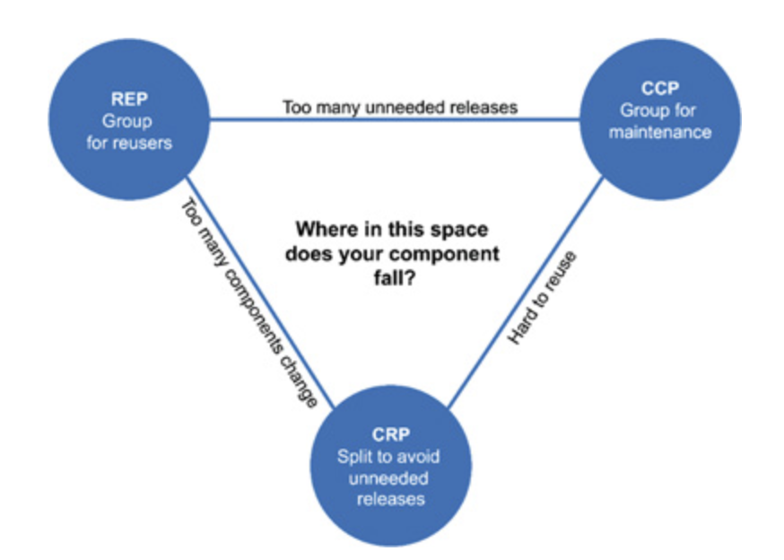

다이어그램의 각 edge는 반대쪽 꼭지점에 있는 원칙을 포기했을 때 감수해야 할 비용을 나타낸다. 뛰어난 아키텍트라면 이 균형 삼각형에서 개발팀에게 중요한 부분을 충족시키는 위치를 찾아야 하며, 시간이 흐르며 주의를 기울이는 부분이 변한다는 사실도 이해해야 한다.

일반적으로 프로젝트는 삼각형의 오른쪽에서 시작하는 편이며, 이때는 오직 재사용성만 희생하게 된다. 프로젝트가 진행될수록 점차 삼각형의 왼쪽으로 이동해 간다. 즉, 프로그램의 컴포넌트 구조는 시간과 성숙도에 따라 변한다.

### 결론

컴포넌트 응집도에 대한 세 가지 원칙을 살펴봤다. 각 원칙은 다음과 같았다.

- REP: "재사용 단위는 릴리스 단위와 같다.
- CCP: "동일한 시점에 변경되는 클래스를 같은 컴포넌트로 묶어라. 서로 다른 시점에 다른 이유로 변경되는 클래스는 다른 컴포넌트로 분리하라."
- CRP: "컴포넌트 사용자들을 필요하지 않은 것에 의존하게 강요하지 말라."

컴포넌트 응집도에 관한 원칙들은 응집도가 가질 수 있는 훨씬 복잡한 다양성을 설명해 준다. 컴포넌트를 구성할 때는 재사용성과 개발 가능성이라는 상충하는 힘을 반드시 고려해야 한다.

## 14장. 컴포넌트 결합

컴포넌트 사이의 관계를 설명하는 세 가지 원칙을 알아보자. 이 원칙들은 마찬가지로 개발 가능성과 논리적 설계 사이의 균형을 다룬다. 

### ADP: 의존성 비순환 원칙

`Acyclic Dependencies Principle`

> "컴포넌트 의존성 그래프에 순환이 있어서는 안된다."

개발자가 여러 명 있는 거대한 프로젝트에서, 의도치 않은 충돌이나 변경을 방지하기 위해서는 어떻게 해야할까? 이 문제를 해결하는 방법에는 '주 단위 빌드'와 '의존성 비순환 원칙'이 있다.

#### 주 단위 빌드

주 단위 빌드란 중간 규모의 프로젝트에서 흔히 사용하는 방식으로, 평소에는 모든 개발자가 각자 코드를 작성하고 주기적으로 코드 통합을 진행하는 것이다. 하지만 프로그램이 커질수록 개발보다 통합에 더 많은 공수가 들어가 효율이 떨어진다.

#### 순환 의존성 제거하기

이 문제의 해결책은 개발 환경을 릴리스 가능한 컴포넌트 단위로 분리하는 것이다. 이를 통해 컴포넌트는 개별 개발팀이 책임질 수 있는 작업의 단위가 된다. 각 개발자는 다른 개발자가 만든 코드를 사용하고, 코드가 수정될 경우 릴리스 정보를 확인하며 업데이트 여부와 시기를 결정한다. 이 경우 특정 컴포넌트가 변경되더라도 다른 팀에 즉각 영향을 주지 않는다. 또한 통합이 작고 점진적으로 이뤄진다.

이러한 작업 절차는 단순하고 합리적이기 때문에 널리 사용되지만, 이 절차가 성공적으로 동작하려면 컴포넌트 사이의 의존성 구조를 반드시 관리해야 한다. 의존성 구조에 순환이 있어서는 안 된다.

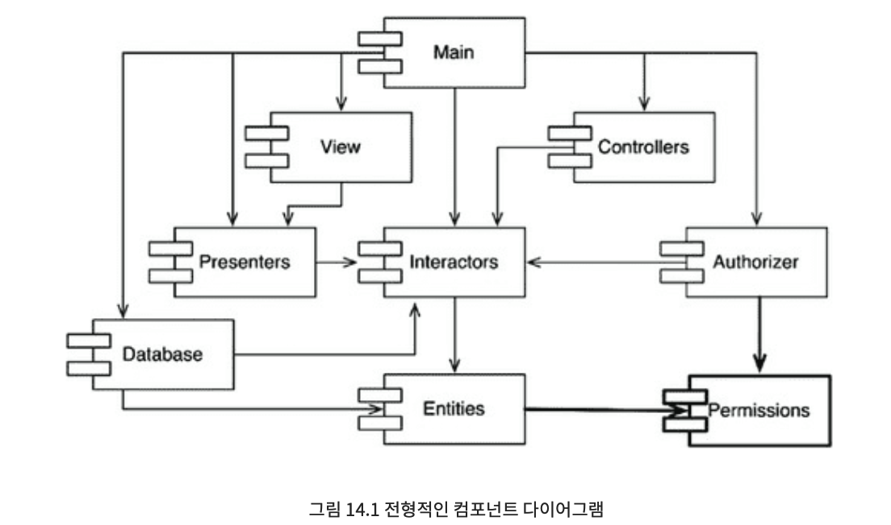

위 다이어그램에서 중요한 것은, 어느 컴포넌트에서 시작하더라도 의존성 관계를 따라가면서 최초의 컴포넌트로 되돌아갈 수 없다는 사실이다. 이 구조는 비순환 방향 그래프다.

시스템 전체를 리리스해야 할 때가 오면 릴리스 절차는 상향식으로 진행된더. Entities -> Database, Interactors -> Presenters, View, Controllers, Authorizer -> Main 순서대로 시스템을 빌드하면 통합은 명료하고 쉬워진다. 

#### 순환이 컴포넌트 의존성 그래프에 미치는 영향

다음 그림에서 Interactors, Authorizer, Entities 컴포넌트들은 순환 구조를 갖는다.

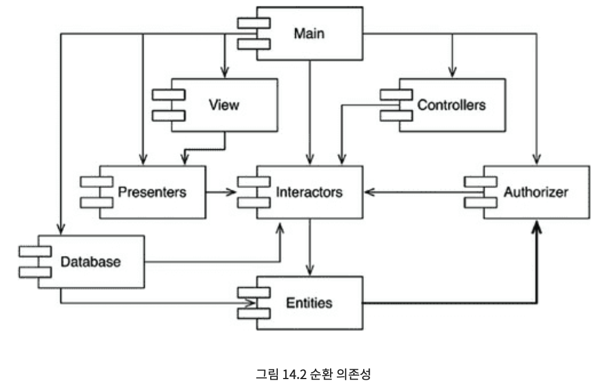

세 컴포넌트는 서로 의존하기 때문에 사실상 하나의 거대한 컴포넌트가 된다. 해당 컴포넌트의 개발자들은 모두 서로에게 얽매이게 되는데, 모두 항상 정확하게 동일한 릴리스를 사용해야 하기 때문이다.

그 뿐만 아니라, 의존 관계에 의해 세 컴포넌트 중 하나라도 수정되면 모든 컴포넌트가 빌드되고 통합되어야 한다는 문제도 발생한다. 이처럼 순환이 생기면 컴포넌트를 분리하기가 상당히 어려워진다. 컴포넌트를 어떤 순서로 빌드해야 올바를지 판단하기도 힘들어진다.

#### 순환 끊기

컴포넌트 사이의 순환을 끊고 의존성을 복구하는 것은 언제라도 가능하다. 이를 위한 주요 매커니즘 두 가지가 있다.

1. DIP(의존성 역전 원칙)를 적용한다. 다음 그림처럼 User가 필요로 하는 메서드를 제공하는 인터페이스를 생성하고, Authorizer가 이 인터페이스를 상속 받도록 한다. 이를 통해 Entitites와 Authorizer의 의존성을 역전시키고 순환을 끊을 수 있다.

    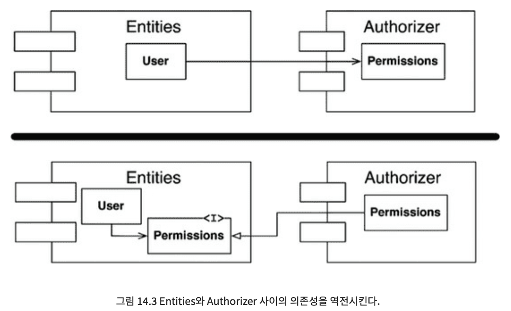

2. Entities와 Authorizer가 모두 의존하는 새로운 컴포넌트를 생성한다.

    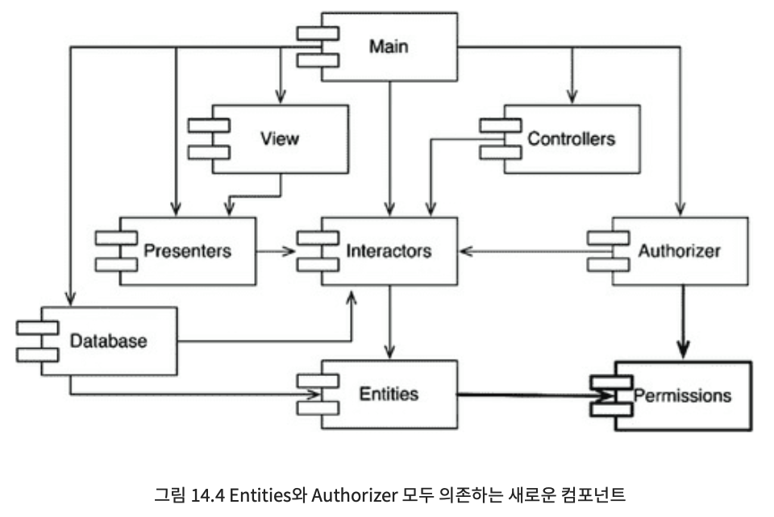

#### 흐트러짐(Jitters)

요구사항이 변경되면 컴포넌트 구조도 변경될 수 있고, 그에 따라 의존성 구조는 서서히 흐트러진다. 따라서 의존성 구조에 순환이 발생하는지를 항상 관찰해야 한다. 순환이 발생하면 어떤 식으로든 끊어야만 한다.

### 하향식(top-down) 설계

컴포넌트 구조는 하향식으로 설계될 수 없다. 컴포넌트는 시스템에서 가장 먼저 설계할 수 있는 대상이 아니며, 오히려 시스템이 성장하고 변경할 때 함께 진화한다.

컴포넌트 의존성 다이어그램은 애플리케이션의 기능을 의미하지는 않는다.
오히려 애플리케이션의 빌드 가능성과 유지보수성을 보여주는 지도와 같다. 빌드, 유지보수할 소프트웨어가 없다면 지도 또한 필요 없으므로 프로젝트 초기에 설계할 수 없다.

의존성 구조와 관련된 최우선 관심사는 변동성을 격리하는 일이다. 따라서 결국 컴포넌트 의존성 그래프는 자주 변경되는 컴포넌트로부터 안정적이며 가치가 높은 컴포넌트를 보호하려는 시도로부터 시작된다.

애플리케이션이 성장함에 따라 개발자는 재사용성에 관심을 기울이기 시작하고, 컴포넌트를 조합하는 방식에 CRP가 영향을 미치기 시작한다. 순환이 발생하면 ADP가 적용되고, 컴포넌트 의존성 그래프는 조금씩 흐트러지며 성장한다.

이러한 방식으로 컴포넌트 의존성 구조는 시스템의 논리적 설계에 발맞춰 성장하며 또 진화해야 한다.

### SDP: 안정된 의존성 원칙

`Stable Dependencies Principle`

> "더 안정된 방향으로 의존하라"

설계는 결코 정적일 수 없다. 그러므로 변경이 쉽지 않은 컴포넌트가 변동이 잦은 컴포넌트에 의존하게 만들어서는 절대로 안 된다. 의존성이 한번 발생하면 변동성이 큰 컴포넌트도 결국 변경이 어려워진다. 내가 시스템을 변경하기 쉽도록 설계했더라도, 이 모듈에 누군가 의존성을 매달아 버리면 내 모듈 또한 변경이 어려워진다. 따라서 SDP를 준수하는 것은 중요하다.

#### 안정성

소프트웨어가 안정적이라는 것은 무슨 말일까? 소프트웨어 컴포넌트를 변경하기 어렵게 만든는 확실한 방법은 수 많은 다른 컴포넌트가 해당 컴포넌트에 의존하게 만드는 것이다. 컴포넌트 안쪽으로 들어오는 의존성이 많아지면 상당히 안정적이라고 볼 수 있는데, 사소한 변경이라도 의존하는 컴포넌트를 모두 만족시키면서 변경하는 것은 상당히 어렵기 때문이다.

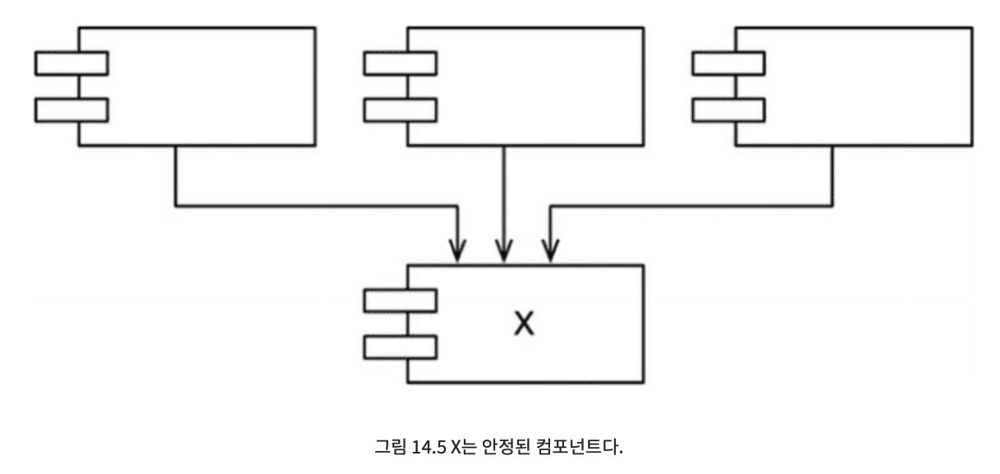

위 그림에서 세 컴포넌트가 X에 의존하므로 X는 안정된 컴포넌트이다. 이 경우 X는 세 컴포넌트를 `책임진다`고 말한다. 반대로 X는 어디에도 의존하지 않으므로 X에게 영향을 주는 외적 요소가 전혀 없다. 이 경우 X는 `독립적이디`라고 말한다.

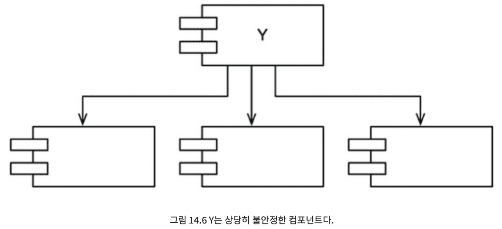

위 그림에서 어떠한 컴포넌트도 Y에 의존하지 않으므로 Y는 불안정한 컴포넌트다. 또한 Y는 세 개의 컴포넌트에 의존하기 때문에 변경이 발생할 수 있는 외부 요인이 세 가지다. 이 경우 Y는 `의존적이다`라고 말한다.

#### 연결성 지표

컴포넌트로 들어오고 나가는 의존성의 개수를 세어 봄으로써 컴포넌트 안정성을 측정할 수 있다.

- Fan-in: 안으로 들어오는 의존성. 컴포넌트 내부의 클래스에 의존하는 컴포넌트 외부의 클래스 개수를 나타낸다.
- Fan-out: 밖으로 나가는 의존성. 컴포넌트 외부의 클래스에 의존하는 컴포넌트 내부의 클래스 개수를 나타낸다.
- I(불안정성): I = Fan-out / (Fan-in + Fan-out). 이 지표는 [0, 1] 범위의 값을 가지며, 0에 가까울수록 안정된 컴포넌트라는 뜻이다.

I 값이 1이면 어떤 컴포넌트도 해당 컴포넌트에 의존하지 않지만, 해당 컴포넌트는 다른 컴포넌트에 의존하고 있다는 뜻이다. 이 상태는 컴포넌트가 가질 수 있는 최고로 불안정한 상태다.

반대로 I 값이 0이면 해당 컴포넌트는 어느 곳에도 의존하지 않지만, 해당 컴포넌트에 의존하는 다른 컴포넌트가 있다는 뜻이다. 이 상태는 컴포넌트가 가질 수 있는 최고로 안정된 상태다.

SDP에서 컴포넌트의 I 지표는 그 컴포넌트가 의존하는 다른 컴포넌트들의 I보다 커야 한다고 말한다. 즉, 의존성 방향으로 갈수록 I 지표 값이 감소해야 한다.

#### 모든 컴포넌트가 안정되어야 하는 것은 아니다.

시스템이 안정적이라는 것은 변경이 불가능함을 의미한다. 안정된 컴포넌트가 항상 좋은 것은 아니다. 

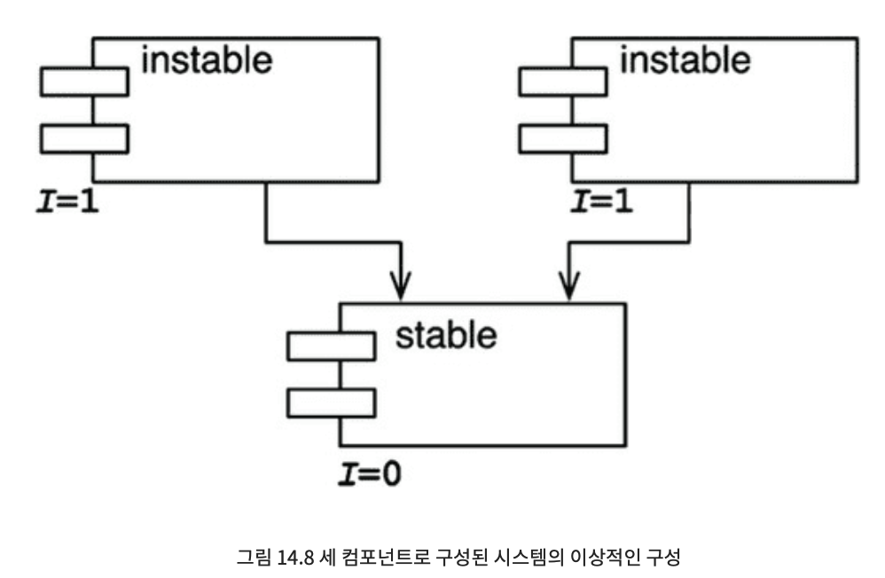

위쪽에는 변경 가능한 컴포넌트가 있고, 두 컴포넌트는 안정된 컴포넌트에 의존한다. 다이어그램은 관례적으로 불안정한 컴포넌트를 위쪽에 둔다. 만약 stable이 변경 가능한 컴포넌트에 의존하게 되면 어떤 일이 벌어질까? stable이 의존하는 컴포넌트는 더 이상 변경할 수 없게 된다. 해당 컴포넌트를 변경하는 순간 stable과 그 위의 모든 컴포넌트를 변경해야하기 때문이다. 따라서 의존성은 늘 I가 감소하는 방향으로만 향해야 한다.

### SAP: 안정된 추상화 원칙

`Stable Abstractions Principle`

> "컴포넌트는 안정된 정도만큼만 추상화되어야 한다."

#### 고수준 정책을 어디에 위치시켜야 하는가?

시스템에서 고수준 아키텍처나 정책 결정과 관련된 소프트웨어는 자주 변경해서는 절대로 안 된다. 따라서 시스템에서 고수준 정책을 캡슐화하는 소프트웨어는 반드시 안정된 컴포넌트(I=0)에 위치해야 한다. 불안정한 컴포넌트(I=1)는 반드시 변동성이 큰 소프트웨어만을 포함해야 한다.

하지만 고수준 정책을 안정된 컴포넌트에 위치시키면, 그 정책을 포함하는 소스 코드는 수정이 어려워져 전체 아키텍처가 유연성을 잃는다. 컴포넌트를 안정적이면서도 변경에 충분히 대응할 수 있을 만큼 유연하게 만들 수 있는 해답은 개방-폐쇄 원칙(OCP)에 있다. OCP에서는 클래스를 수정하지 않고도 확장이 가능할만큼 유연하게 클래스를 만들 수 있으며, 이 원칙을 준수하는 것이 추상 클래스이다.

#### 안정된 추상화 원칙

SAP는 안정성과 추상화 정도 사이의 관계를 정의한다. 안정된 컴포넌트는 추상 컴포넌트여야 하며, 이를 통해 안정성이 컴포넌트의 확장을 방해하는 것을 막는다. 반면, 불안정한 컴포넌트는 반드시 구체 컴포넌트여야 하는데, 컴포넌트가 불안정하므로 컴포넌트 내부의 구체적인 코드를 쉽게 변경할 수 있어야 하기 때문이다.

SAP와 SDP를 결합하면 컴포넌트에 대한 DIP와 같게 된다. SDP는 의존성이 반드시 안정성의 방향으로 향해야 한다는 원칙이고, SAP는 안정성이 결국 추상화를 의미한다고 말하기 때문이다. 따라서 의존성은 추상화의 방향으로 향하게 된다. DIP는 클래스에 대한 원칙이며, 클래스는 추상적이거나 구체적이거나 둘 중 하나로만 존재한다. 반면 SDP와 SAP의 조합은 컴포넌트에 대한 원칙이며, 컴포넌트는 일부는 추상적이고 다른 일부는 안정적일 수 있다.

#### 추상화 정도 측정하기

A 지표는 컴포넌트의 추상화 정도를 측정한 값이다.

- Nc: 컴포넌트의 클래스 개수
- Na: 컴포넌트의 추상 클래스와 인터페이스의 개수
- A: 추상화 정도. A = Na / Nc

A 지표는 [0, 1] 볌위를 갖는다. A가 0이면 컴포넌트에는 추상 클래스가 하나도 없다는 말이고, A가 1이면 컴포넌트는 오직 추상 클래스만을 포함한다는 뜻이다.

#### 주계열

안정성(I)과 추상화 정도(A) 사이의 관계를 정의해보자. x축은 A, y축은 I를 나타내는 그래프를 그려보자. (0, 1)에는 최고로 안정적이고 추상화된 컴포넌트가 있고, (1, 0)에는 최고로 불안정하며 구체화된 컴포넌트가 있을 것이다.

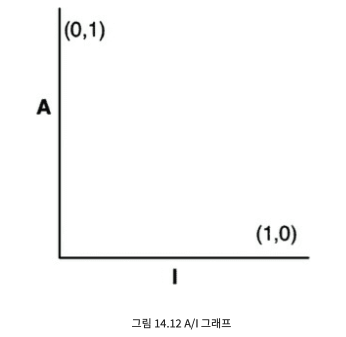

이 그래프에서 컴포넌트가 위치할 수 있는 합리적인 지점의 궤적을 그려보자. 이는 컴포넌트가 절대로 위치해서는 안되는, 배제할 구역을 찾는 방식으로 추론할 수 있다.

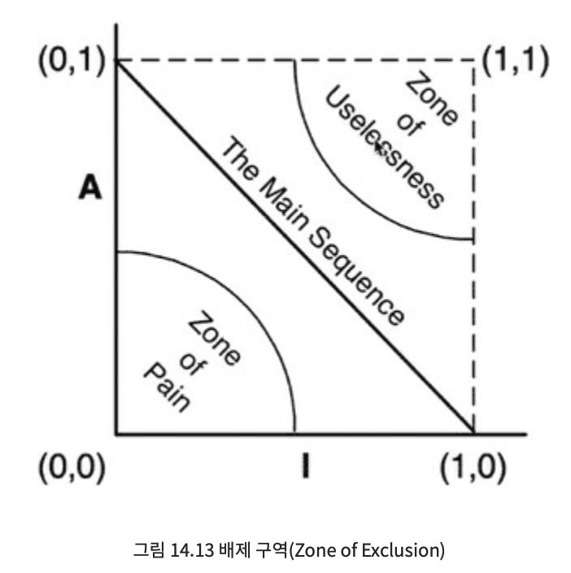

- 고통의 구역

    - (0, 0) 주변 구역의 컴포넌트. 이 컴포넌트는 매우 안정적이면서도 구체적이다. 이러한 컴포넌트는 추상적이지 않기 때문에 확장할 수 없고, 안정적이므로 변경이 어렵다.
    - 변동성이 없는 컴포넌트는 이 구역에 위치했더라도 해롭지 않다. 변동될 가능성이 거의 없기 때문이다.

- 쓸모없는 구역

    - (1, 1) 주변 구역의 컴포넌트. 이 컴포넌트는 최고로 추상적이지만, 누구도 그 컴포넌트에 의존하지 않는다. 이러한 컴포넌트는 쓸모가 없다.
    - 이 영역에 존재하는 소프트웨어 엔티티는 폐기물과 같다.

#### 배제 구역 벗어나기

변동성이 큰 컴포넌트의 대부분은 두 배제 구역으로부터 가능한 멀리 떨어뜨려야 한다. 그 궤적은 (1, 0)과 (0, 1)을 잇는 선분이 되며, 이 선분을 주계열이라고 부른다.

컴포넌트가 위치할 수 있는 가장 바람직한 지점은 주계열의 두 종점이다. 하지만 대규모 시스템에서 소수의 일부 컴포넌트는 완벽하게 추상적이거나 완전하게 안정적일 수 없다. 이 컴포넌트는 주계열에 최대한 가깝게 위치할수록 이상적이다.

#### 주계열과의 거리

- D = |A + I - 1|. 이 지표의 유효 범위는 [0, 1]이다. D가 0이면 주계열 바로 위에 존재한다는 뜻이며, 1이면 주계열로부터 멀리 위치한다는 뜻이다.

설계를 할 때 D 값이 0에 가깝지 않은 컴포넌트가 있다면 해당 컴포넌트는 재검토가 필요하다.

### 결론

이 장에서 학습한 의존성 지수와 추상화 지수를 참고하여 아키텍처를 평가하고 재구성하는 데 활용할 수 있도록 하자.

- ADP: "컴포넌트 의존성 그래프에 순환이 있어서는 안된다."
- SDP: "더 안정된 방향으로 의존하라"
- SAP: "컴포넌트는 안정된 정도만큼만 추상화되어야 한다."