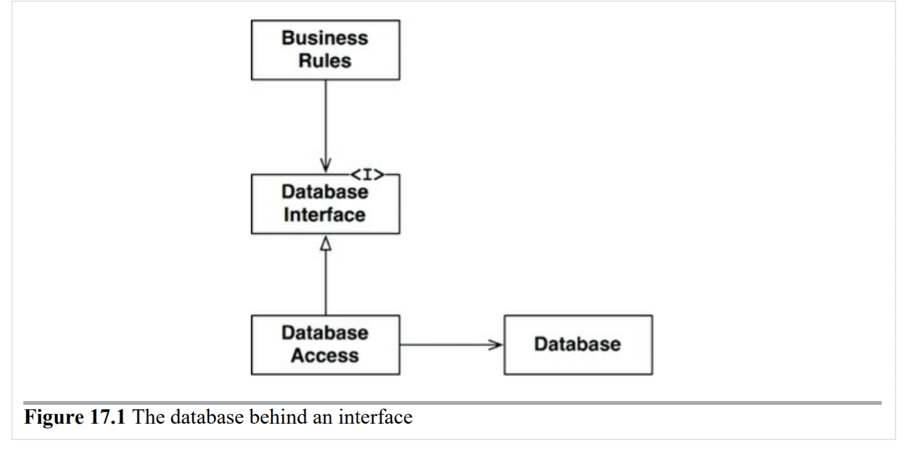
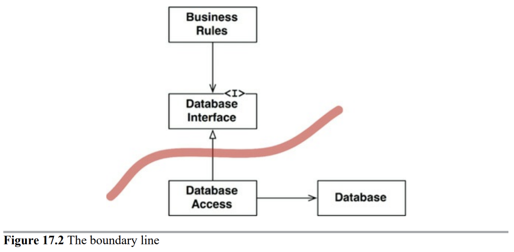
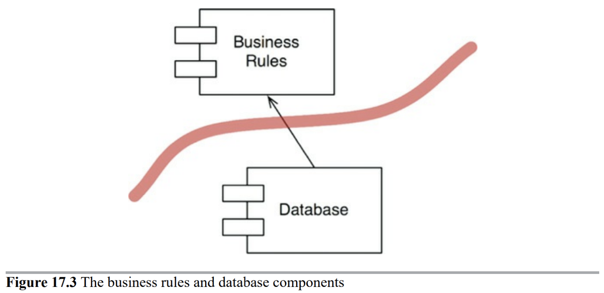
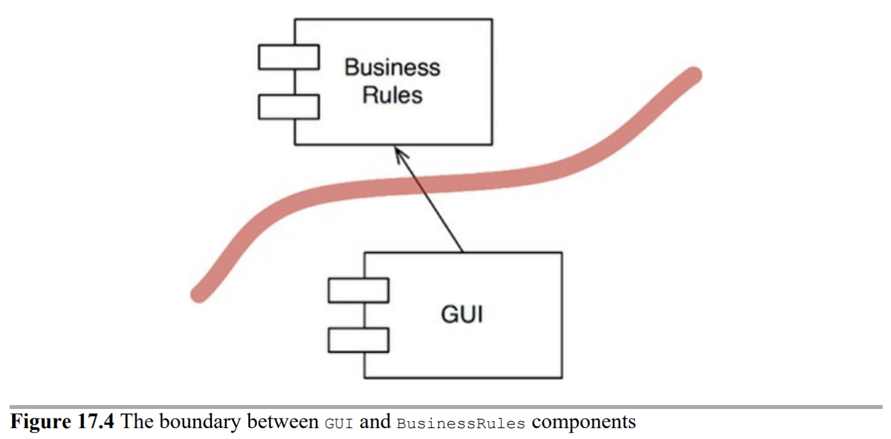
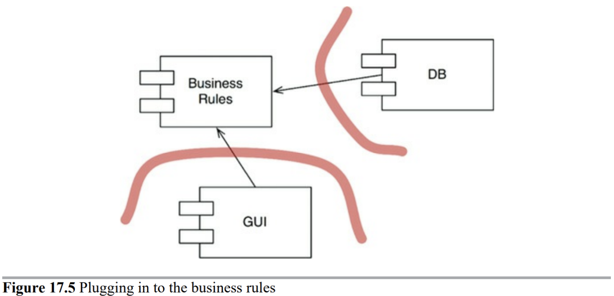
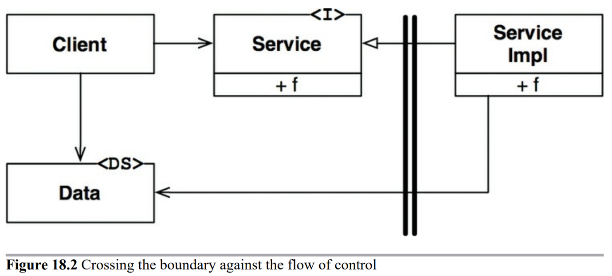
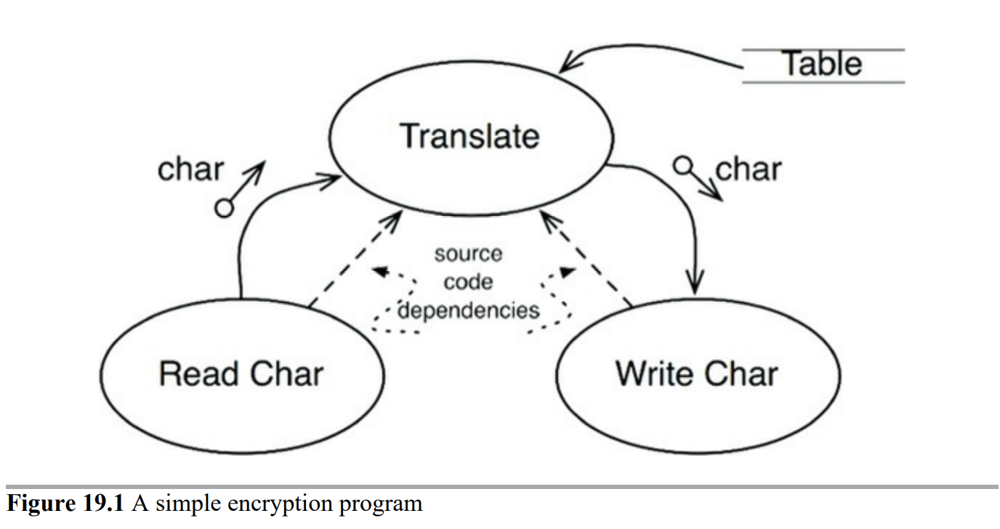
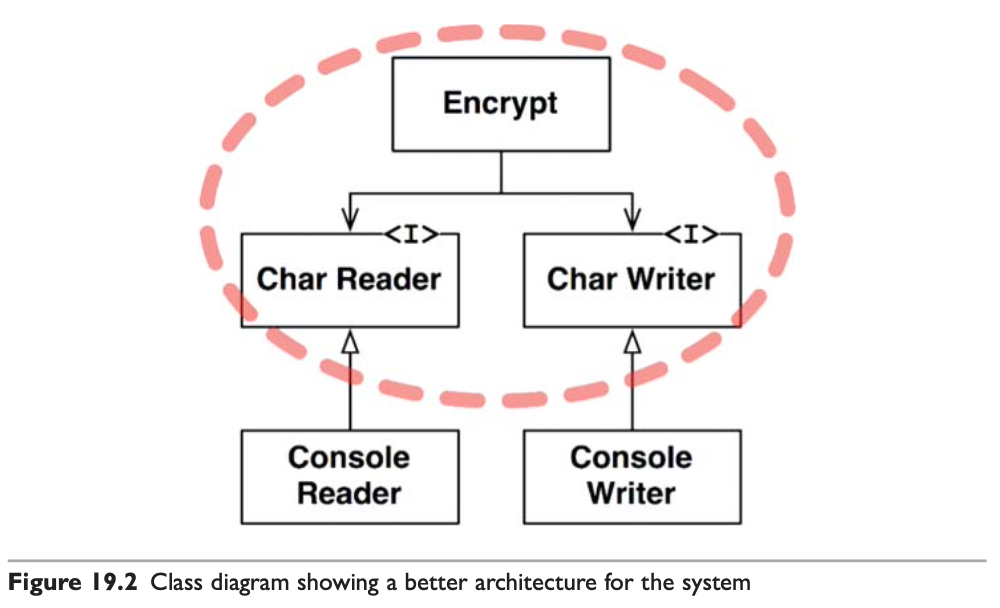
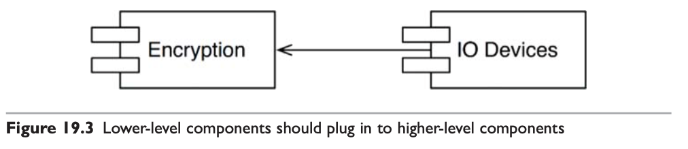

# #6 아키텍처의 경계와 수준

<!-- 2021.10.08 -->

> Clean Architecture(Martin, Robert C.) 5부 17-19장 정리

## 이 페이지를 읽으면 알 수 있는 것

- 소프트웨어 아키텍처에서 경계는 어디에 존재해야 하는가?
- 경계 전략에는 무엇이 있으며, 각 전략은 어떤 공통점과 차이점이 있는가?
- 아키텍처를 구성하는 컴포넌트의 수준은 어떻게 평가할 수 있는가?

## 17장. 경계: 선 긋기

프레임워크, 데이터베이스, 웹 서버, 유틸리티 라이브러리, 의존성 주입에 대한 결정 등을 포함한 유스케이스와 관련이 없는 시스템의 업무 요구 사항을 너무 일찍 결정하면 결합을 만든다. 그리고 이는 인적 자원의 효율을 떨어뜨리는 요인이 된다.

### 어떻게 선을 그을까? 그리고 언제 그을까?

관련이 있는 것과 없는 것 사이에 선을 긋는다. GUI는 업무 규칙과는 관련이 없기 때문에, 이 둘 사이에는 반드시 선을 그어야 한다. 데이터 베이스는 GUI와 관련이 없으므로, 이 둘 사이에도 선을 그어야 한다. 데이터베이스는 업무 규칙과 관련이 없으므로, 이 둘 사이에도 선이 있어야 한다.

위 상황에서 경계선은 어떻게 그어질까? 경계선은 상속 관계를 횡단하면서 Database Interface 바로 아래에 그어진다. 

Database Access에서 출발하는 두 화살표는 모두 Database Access로부터 바깥쪽으로 향한다. 즉, 위 도표에서 Database Access가 존재한다는 사실을 알고 있는 클래스는 없다. 이것을 컴포넌트 단위로 다시 그려보면 다음과 같다.

화살표의 방향에 주목하자. Database는 BuisinessRules에 대해 알고 있지만, BusinessRules는 Database에 대해 알지 못한다. 이는 BusinessRules에서는 어떤 종류의 데이터베이스도 사용할 수 있음을 의미한다. 

데이터베이스는 Oracle, MySQL, Couch, Atomic 등으로 구현할 수 있고, 심지어 플랫 파일로도 구현할 수 있다. 그리고 이러한 형식에 대해 업무 규칙은 전혀 개의치 않는다.

### 입력과 출력은?

아키텍처에서 입출력은 중요한 요소가 아니다. 따라서, 이번에도 GUI와 BusinessRules 컴포넌트가 경계선에 의해 분할된다. 관련성이 낮은 GUI가 관련성이 높은 BusinessRules에 의존하는 구조가 될 것이다.

### 플러그인 아키텍처

소프트웨어는 플러그인을 손쉽게 생성함으로써 확장 가능하고 유지ㅍ보수가 쉬운 시스템 아키텍처를 확립해 왔다. 선택적이거나 다양한 형태로 구현될 수 있는 컴포넌트를 플러그인으로 구현함으로써 업무 규칙을 독립적으로 만들 수 있다.

경계는 변경의 축이 있는 지점에 그어진다. 경게의 한쪽에 위치한 컴포넌트는 경계 반대편의 컴포넌트와는 다른 속도로, 그리고 다른 이유로 변경된다. 이는 단일 책임 원칙에 해당되며, 단일 책임 원칙은 어디에 경계를 그어야 할지를 알려준다.

### 결론

소프트웨어 아키텍처에서 경계선을 그리기 위해서는 먼저 시스템을 컴포넌트 단위로 분할해야 한다. 일부 컴포넌트는 핵심 업무 규칙에 해당하고, 나머지 컴포넌트는 플러그인에 해당한다. 그런 다음 컴포넌트 사이의 화살표가 특정 방향, 즉 핵심 업무를 향하도록 컴포넌트의 소스를 배치한다.

## 18장. 경계 해부학

시스템 아키텍처는 일련의 소프트웨어 컴포넌트와 그 컴포넌트를 분리하는 경계에 의해 정의된다.

### 경계 횡단하기

적절한 위치에서 경계를 횡단하게 하는 비결은 소스 코드 의존성 관리에 있다. 소스 코드 모듈 하나가 변경되면, 이에 의존하는 다른 소스 코드 모듈도 변경하거나 다시 컴파일해서 새로 배포해야 할 수도 있다. 경계는 이러한 변경이 전파되는 것을 막는 방화벽을 구축하고 관리하는 수단으로써 존재한다.

### 두려운 단일체

아키텍처 경계 중에서 가장 단순하고 흔한 형태는 소스 수준 분리 모드 아키텍처이며, 이때 경계는 물리적으로 엄격하게 구분되지 않는다. 함수와 데이터가 단일 프로세서에서 같은 주소를 공유하며 나름의 규칙에 따라 분리될 뿐이다. 그리고 가장 단순한 형태의 경계 횡단은 저수준 클라이언트에서 고수준 서비스로 향하는 함수 호출이다. 이 경우 런타임 의존성과 컴파일타임 의존성은 모두 저수준 컴포넌트에서 고수준 컴포넌트로 향한다.

고수준 클라이언트가 저수준 서비스를 호출해야 한다면, 동적 다형성을 사용하여 제어 흐름과는 반대 방향으로 의존성을 역전시킬 수 있다. 정적 링크된 모노리틱 구조의 실행 파일이라도 이처럼 규칙적인 방식으로 구조를 분리하면 개발, 테스트, 배포 작업에 큰 도움이 된다.

단일체의 컴포넌트 간 통신은 매우 값싸고 빠르다. 결과적으로, 단일체에서 경계를 가로지르는 통신은 상당히 빈번하다.

### 배포형 컴포넌트

.NET DLL, 자바 jar 파일, 루비 젬 Gem, 유닉스 공유 라이브러리 등은 동적 링크 라이브러리며, 이 경우 아키텍처의 경계가 물리적으로 드러난다. 컴포넌트를 이 형태로 배포하면 따로 컴파일하지 않고 곧바로 사용할 수 있다. 배포 과정에서만 차이가 날 뿐, 단일체와 동일하다.

배포형 컴포넌트 역시 함수를 호출함으로써 경계를 가르지를 수 있으므로 통신이 값싸다. 동적 링크와 런타임 로딩으로 최초의 함수 호출은 오래 걸릴 수 있지만, 대체로 이들 경계에서의 통신은 매우 빈번할 것이다.

### 스레드

스레드는 아키텍처 경계도 아니며 배포 단위도 아니다. 스레드는 실행 계획과 순서를 체계화하는 방법에 가깝다. 모든 스레드가 단 하나의 컴포넌트에 포함될 수도 있고, 많은 컴포넌트에 걸쳐 분산될 수도 있다.

### 로컬 프로세스

로컬 프로세스는 훨씬 강한 물리적 형태를 띠는 아키텍처 경계다. 로컬 프로세스들은 각각이 독립된 주소 공간에서 실행되고, 일반적으로 메모리를 공유하지 못한다.

로컬 프로세스 간 분리 전략은 단일체나 바이너리 컴포넌트의 경우와 동일하다. 소스 코드 의존성의 화살표는 단일체나 바이너리 컴포넌트와 동일한 방향으로 경계를 횡단한다. 즉, 항상 고수준 컴포넌트를 향한다.

로컬 프로세스 경계를 지나는 통신에는 OS 호출, 데이터 마샬링, 프로세스 간 문맥 교환 등이 있으며, 이들은 꽤 비싼 작업에 속한다. 따라서 통신이 너무 빈번하게 일어나지 않도록 제한해야 한다.

### 서비스

서비스는 물리적인 형태를 띠는 가장 강력한 경계다. 서비스는 자신의 물리적 위치에 구애받지 않으며, 네트워크를 통해 통신이 이루어진다.

로컬 프로세스의 규칙이 대부분 서비스에도 그대로 적용된다. 저수준 서비스는 반드시 고수준 서비스에 플러그인 되어야 한다. 고수준 서비스의 소스 코드에는 저수준 서비스를 특정 짓는 어떤 물리 정보도 포함되어서는 안 된다.

서비스 경계를 지나는 통신은 함수 호출에 비해 매우 느리다. 따라서 가능하면 서비스 통신은 빈번하게 하지 않아야 하며, 통신 지연에 따른 문제는 고수준에서 처리할 수 있어야 한다.

### 결론

대다수 시스템은 한 가지 이상의 경계 전략을 사용한다. 하지만 각 경계의 목적은 모두 동일하며, 통신이 빈번한 로컬 경계와 지연이 중요한 서비스 경계가 혼합되어 있을 뿐이다.

## 19장. 정책과 수준

소프트웨어 시스템이란 정책을 상세하게 기술한 것이다. 대다수의 주요 시스템은 하나의 정책을 여러 개의 작은 정책들로 쪼개고 있다. 소트프웨어 아키텍처를 개발하는 기술에는 이러한 정책을 신중하게 분리하고, 정책이 변경되는 양상에 따라 정책을 재편성하는 일도 포함된다. 흔히 아키텍처 개발은 재편성된 컴포넌트를 비순환 방향 그래프(DAG)로 구성하는 기술을 포함한다. 정점은 동일한 수준의 정책을 포함하는 컴포넌트에 해당하며, 간선은 컴포넌트 사이의 의존성을 나타낸다.

이러한 의존성은 소스 코드, 컴파일타임의 의존성이다. 자바의 import, C++의 using 구문에 해당하며, 이러한 의존성은 컴파일러가 제대로 동작하기 위해 필요하다. 좋은 아키텍처는 반드시 저수준 컴포넌트가 고수준 컴포넌트에 의존하도록 설계되어야 한다.

### 수준

'수준'을 엄밀하게 정의하자면 '입력과 출력까지의 거리'다. 시스템의 입력과 출력 모두로부터 멀리 위치할수록 정책의 수준은 높아진다. 입력과 출력을 다루는 정책이라면 시스템에서 최하위 수준에 위치한다.

위 시스템에서 번역 컴포넌트는 입력과 출력으로부터 가장 멀리 떨어져 있기 때문에 최고 수준의 컴포넌트다. 주목할 점은 데이터 흐름과 소스 코드 의존성이 항상 같은 방향을 가리키지는 않는다는 사실이다. 소스 코드 의존성은 그 수준에 따라 결합되어야 하며, 데이터 흐름을 기준으로 결합해서는 안 된다.

이 구조에서 고수준의 암호화 정책을 저수준의 입력/출력 정책으로부터 분리시킨 방식에 주목하자. 이 방식 덕분에 암호화 정책을 더 넓은 맥락에서 사용할 수 있다. 단일 책임 원칙(SRP)와 공통 폐쇄 원칙(CCP)에 따르면 동일한 이유로 동일한 시점에 변경되는 정책은 함께 묶인다. 일반적으로 저수준 정책은 더 사소한 이유로 빈번하게 변경되고, 고수준 정책은 덜 빈번하지만 중요한 이유로 변경된다.

이 논의는 저수준 컴포넌트가 고수준 컴포넌트에 플러그인되어야 한다는 관점으로 바라볼 수도 있다.

### 결론

이 장에서 설명한 정책에 대한 논의는 단일 책임 원칙(SRP), 개방 폐쇄 원칙(OCP), 공통 폐쇄 원칙(CCP), 의존성 역전 원칙(DIP), 안정된 의존성 원칙, 안정된 추상화 원칙을 모두 포함한다. 이 원칙들을 다시 읽어보고 각 원칙이 어디에서 무슨 이유로 사용되었는지 리마인드하자.