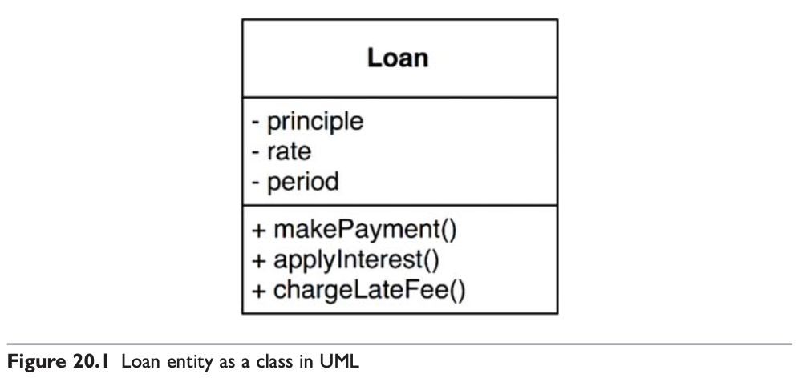
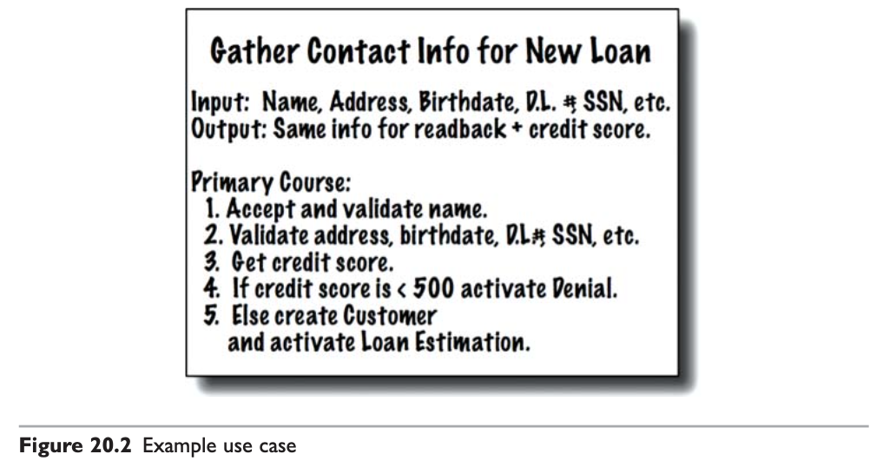
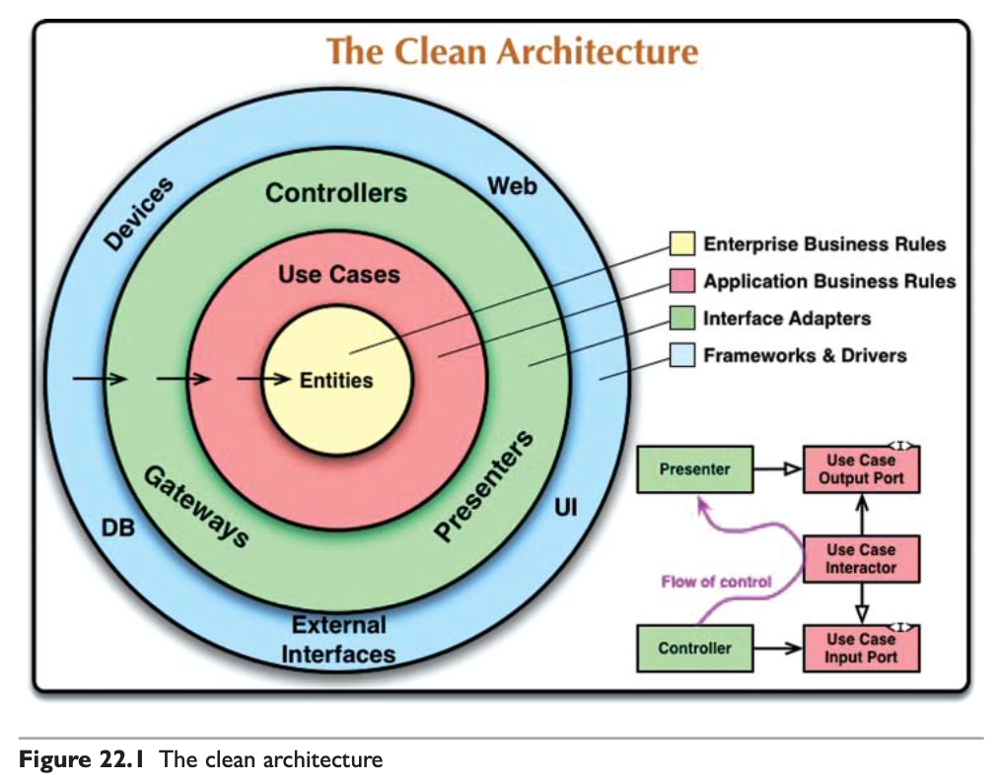

# #7 클린 아키텍처 계층과 규칙

<!-- 2021.10.09 -->

> Clean Architecture(Martin, Robert C.) 5부 19-23장 정리

## 이 페이지를 읽으면 알 수 있는 것

- 엔티티와 유스케이스란 무엇이며, 시스템에서 어떤 의미를 갖는가?
- 아키텍처가 최우선으로 보여주어야 할 것은 무엇인가?
- 좋은 아키텍처는 어떤 계층으로 구성되며, 각 계층은 어떤 관계를 갖는가?
- 험블 객체 패턴은 무엇이며 어떻게 테스트 용이성을 높일 수 있는가?
  
## 20장. 업무 규칙

애플리케이션은 업무 규칙 플러그인으로 구분할 수 있다. 업무 규칙은 사업적으로 수익을 얻거나 비용을 줄일 수 있는 핵심적인 규칙이며, 이는 규칙을 자동화하는 시스템이 없더라도 그대로 존재한다. 이러한 규칙을 핵심 업무 규칙(Critical Business Rule)이라고 부른다.

핵심 업무 규칙은 보통 데이터를 요구하는데, 이러한 데이터는 핵심 업무 데이터(Critical Business Data)라고 부르자. 이러한 데이터는 시스템으로 자동화되지 않은 경우에도 존재한다.

핵심 규칙과 핵심 데이터는 본질적으로 결합되어 있기 때문에, 객체로 만들 좋은 후보가 된다. 우리는 이러한 유형의 객체를 엔티티(Entity)라고 하겠다.

### 엔티티

엔티티는 컴퓨터 시스템 내부의 객체로서, 핵심 업무 데이터를 기반으로 동작하는 일련의 핵심 업무 규칙을 구체화한다. 엔티티 객체는 핵심 업무 데이터를 직접 포함하거나 핵심 업무 데이터에 매우 쉽게 접근할 수 있다. 엔티티의 인터페이스는 핵심 업무 데이터를 기반으로 동작하는 핵심 업무 규칙을 구현한 함수들로 구성된다.

예를 들어 대출을 뜻하는 Loan 엔티티는 세 가지 핵심 업무 데이터를 포함하며, 데이터와 관련된 세 가지 핵심 업무 규칙을 인터페이스로 제공한다.

우리는 클래스를 생성할 때, 업무에서 핵심적인 개념을 구현하는 소프트웨어는 한데 모으고, 시스템의 나머지 고려 사항과 분리시킨다. 이 클래스는 업무의 대표자로서 독립적으로 존재한다. 이 클래스는 데이터베이스, 사용자 인터페이스, 서드파티 프레임워크에 의해 오염되어서는 절대 안 된다. 이 클래스는 어떤 시스템에서도 업무를 수행할 수 있어야 한다. 엔티티는 순전히 업무에 대한 것이며, 이의외 것은 없다.

### 유스케이스

모든 업무 규칙이 엔티티처럼 순수한 것은 아니다. 어떤 업무 규칙은 자동화된 시스템이 동작하는 방법을 정의하고 제약함으로써 수익을 얻거나 비용을 줄인다. 이러한 규칙은 수동 환경에서는 사용될 수 없으며, 자동화된 시스템의 요소로 존재해야만 의미가 있다.

이것이 바로 유스케이스다. 유스케이스는 자동화된 시스템이 사용되는 방법을 설명한다. 유스케이스는 사용자가 제공해야 하는 입력, 사용자에게 보여줄 출력, 그리고 해당 출력을 생성하기 위한 처리 단계를 기술한다. 엔티티 내의 핵심 업무 규칙과는 반대로, 유스케이스는 애플리케이션에 특화된 업무 규칙을 설명한다.

위 그림은 유스케이스의 예시다. 마지막 줄에서 언급한 Customer는 엔티티에 대한 참조를 의미한다. 유스케이스는 엔티티 내부의 핵심 업무 규칙을 어떻게, 그리고 언제 호출할지를 명시하는 규칙을 담는다.

주목할 점은 인터페이스로 들어오는 데이터와 인터페이스에서 되돌려주는 데이터를 형식 없이 명시한다는 점만 빼면, 유스케이스는 사용자 인터페이스를 기술하지 않는다는 점이다. 유스케이스만 봐서는 이 애플리케이션이 웹인지, 리치 클라이언트인지, 콘솔 기반인지, 순수한 서비스인지 구분하는 것은 불가능하다. 유스케이스는 애플리케이션에 특화된 규칙을 설명하고, 이를 통해 사용자와 엔티티 사이의 상호작용을 규정한다. 시스템에서 데이터가 들어오고 나가는 방식을 유스케이스와는 무관하다.

엔티티와 유스케이스의 관계에는 의존성 역전 원칙이 적용된다. 고수준 개념인 엔티티는 저수준 개념인 유스케이스에 대해 아무것도 알지 못한다. 반대로 저수준인 유스케이스는 고수준인 엔티티에 대해 알고 있다. 유스케이스는 엔티티에 의존하지만, 엔티티는 유스케이스에 의존하지 않는다.

### 요청 및 응답 모델

유스케이스는 단순한 요청 데이터의 구조를 입력으로 받고, 단순한 응답 데이터 구조를 출력으로 반환한다. 이들 데이터 구조는 어떤 사용자 인터페이스에도 종속되지 않는다.

엔티티 객체와 요청 및 응답 모델을 절대로 결합해서는 안 된다. 두 객체는 많은 데이터를 공유하지만, 시간이 지날수록 두 객체는 완전히 다른 이유로 변경될 것이다.

### 결론

업무 규칙은 소프트웨어 시스템이 존재하는 이유이며 핵심적인 기능이다. 따라서 업무 규칙은 시스템에서 가장 독립적이며 가장 많이 재사용할 수 있는 코드여야 한다. 사용자 인터페이스나 데이터베이스와 같은 저수준의 관심사로 인해 오염되어서는 결코 안 된다. 

## 21장. 소리치는 아키텍처

### 아키텍처의 테마

어떤 건물의 설계도는 각 설계도가 어떤 용도를 위해 만들어진 것인지 소리친다. 이처럼 소프트웨어 애플리케이션의 아키텍처 또한 애플리케이션의 유스케이스에 대해 소리쳐야 한다.

아키텍처는 프레임워크에 대한 것이 아니며 절대 그래서도 안된다. 프레임워크는 사용하는 도구일 뿐, 아키텍처는 반드시 유스케이스 중심이어야만 한다.

### 아키텍처의 목적

좋은 아키텍처는 유스케이스를 그 중심에 두며, 프레임워크나 도구, 환경에 전혀 구애받지 않고 유스케이스를 지원하는 구조를 기술한다. 집을 짓기 위해 아키텍트가 주목하는 첫 번째 관심사는 주택이 거주하기에 적합한 공간임을 확실히 하는 것이지, 벽돌로 지어지는지를 확인하는 것이 아니다.

좋은 소프트웨어 아키텍처는 프레임워크, 데이터베이스, 웹 서버 등의 개발 환경 문제에 대해서는 결정을 최대한 미룬다. 그뿐만 아니라 이러한 결정을 쉽게 번복할 수 있도록 한다. 좋은 아키텍처는 유스케이스에 중점을 두며, 지엽적인 관심사에 대한 결합은 분리시킨다.

### 프레임워크는 도구일 뿐, 삶의 방식은 아니다.

프레임워크는 매우 강력하고 유용하다. 하지만 프레임워크가 모든 것을 하게 하는 것은 우리가 취하고 싶은 태도가 아니다. 어떻게 하면 아키텍처를 유스케이스에 중점을 둔 채 보존할 수 있을지 생각하라. 프레임워크가 아키텍처의 중심을 차지하는 일을 막을 수 있는 전략을 개발하라.

### 테스트하기 쉬운 아키텍처

아키텍처가 유스케이스를 최우선으로 한다면, 프레임워크를 전혀 준비하지 않더라도 필요한 유스케이스 전부에 대해 단위 테스트를 할 수 있어야 한다.

### 결론

아키텍처는 시스템을 이야기해야 하며, 시스템에 적용한 프레임워크에 절대 이야기해서는 안 된다. 아키텍처를 처음 본 사람은 시스템이 어떻게 전달될지 전혀 모르는 상태에서도 시스템의 모든 유스케이스를 이해할 수 있어야 한다.

## 22장. 클린 아키텍처

지난 수십 년간 시스템 아키텍처와 관련된 여러 가지 아이디어가 나왔으며, 이들 아키텍처는 세부적인 내용에는 차이가 있더라도 목표는 모두 같다. 바로 `관심사의 분리`다. 이들은 소프트웨어를 계층을 분리함으로써 관심사의 분리라는 목표를 달성했다. 각 아키텍처는 최소한 업무 규칙을 위한 계층 하나와, 사용자와 시스템 인터페이스를 위한 또 다른 계층 하나를 반드시 포함한다.

이 아키텍처는 모두 시스템이 다음과 같은 특징을 지니도록 만든다.

#### 1. 프레임워크 독립성

아키텍처는 다양한 기능의 라이브러리를 제공하는 프레임워크의 존재 여부에 의존하지 않는다. 프레임워크는 도구이며, 프레임워크가 지닌 제약사항 안으로 시스템을 욱여넣지 않는다.

#### 2. 테스트 용이성

업무 규칙은 UI, 데이터베이스, 웹 서버 등의 외부 요소 없이도 테스트할 수 있다.

#### 3. UI 독립성

시스템의 나머지 부분을 변경하지 않고도 UI를 쉽게 변경할 수 있다.

#### 4. 데이터베이스 독립성

오라클, MS SQL, 몽고 DB 등 데이터베이스는 쉽게 교체할 수 있다. 업무 규칙은 데이터베이스에 결합되지 않는다.

#### 5. 모든 외부 에이전시에 대한 독립성

실제로 업무 규칙은 외부 세계와의 인터페이스에 대해 전혀 알지 못한다.

이들 아키텍처 전부를 실행 가능한 하나의 아이디어로 통합하면 다음과 같은 다이어그램으로 나타낼 수 있다.

### 의존성 규칙

위 그림에서 각각의 동심원은 소프트웨어의 서로 다른 영역을 표현한다. 바깥쪽 원은 저수준의 메커니즘이며, 안쪽 원은 고수준의 정책이다.

이러한 아키텍처가 동작하도록 하는 가장 중요한 원칙은 `의존성 규칙`이다. 소스 코드 의존성은 반드시 안쪽으로, 고수준 정책을 향해야 한다. 내부의 원에 속한 요소는 외부의 원에 속한 어떤 것도 알지 못한다. 특히 내부의 원에 속한 코드는 외부의 원에 선언된 어떤 것에 대해서도 그 이름을 언급해서는 절대 안된다. 같은 이유로, 외부의 원에 선언된 데이터 형식도 내부의 원에서 절대 사용해서는 안된다.

#### 엔티티

엔티티는 애플리케이션의 핵심 업무 규칙을 캡슐화한다. 엔티티는 가장 일반적이며 고수준인 규칙을 캡슐화한다. 운영 관점에서 특정 애플리케이션의 무언가 변경이 필요하더라도 엔티티 계층에는 절대로 영향을 주어서는 안 된다.

#### 유스케이스

유스케이스 계층의 소프트웨어는 애플리케이션에 특화된 업무 규칙을 포함한다. 또한 유스케이스 계층의 소프트웨어는 시스템의 모든 유스케이스를 캡슐화하고 구현한다. 유스케이스는 엔티티로 들어오고 나가는 데이터 흐름을 조정하며, 엔티티가 자신의 업무 규칙을 사용해서 유스케이스의 목적을 달성하도록 이끈다.

유스케이스에서 발생한 변경은 엔티티에 영향을 주어서는 안된다. 또한 프레임워크 등의 외부 요소에서 발생한 변경이 유스케이스에 영향을 줘서도 안된다. 엔티티와 달리 운영 관점에서 애플리케이션이 변경될 경우 유스케이스는 영향을 받을 수 있다.

#### 인터페이스 어댑터

인터페이스 어댑터 계층은 일련의 어댑터들로 구성된다. 어댑터는 데이터를 유스케이스와 엔티티에게 가장 편리한 형식에서 데이터베이스나 웹 같은 임의의 프레임워크에 가장 편리한 형태로 변환한다. 프레젠터(Presenter), 뷰(View), 컨트롤러(Controller)는 모두 인터페이스 어댑터 계층에 속한다.

이 계층에 속한 어떤 코드도 프레임워크에 대해 알아서는 안된다. 예를 들어, SQL 기반의 데이터베이스를 사용한다면 모든 SQL은 이 계층을 벗어나서는 안된다. 또한 이 계층 내에서도 데이터베이스를 담당하는 부분으로 제한되어야 한다.

#### 프레임워크와 드라이버

아키텍처의 가장 바깥쪽 계층은 일반적으로 데이터베이스나 웹 등의 프레임워크와 도구들로 구성된다. 일반적으로 이 계층은 안쪽 원과 통신하기 위한 접합 코드들로 구성된다.

프레임워크와 드라이버 계층은 모든 세부사항이 위치하는 곳이다. 우리는 이러한 것들을 모두 외부에 위치시켜 피해를 최소화한다.

#### 원은 네 개여야만 하나?

항상 네 개의 원만 사용해야 한다는 규칙은 없다. 소스 코드 의존성이 항상 안쪽을 향한다는 의존성 규칙만 적용되면 된다. 안쪽으로 이동할수록 추상화와 정책의 수준은 높아지며, 가장 바깥쪽 원은 저수준의 구체적인 세부사항을 구성된다는 것만 기억하자.

#### 경계 횡단하기

다음 그림을 다시 보자. 우측 하단 다이어그램에 원의 경계를 횡단하는 방법을 보여주는 예시가 있다.

먼저, 제어흐름은 컨트롤러에서 시작해서 유스케이스를 지난 후 프레젠터에서 실행되면서 마무리된다. 다음으로는 소스 코드 의존성에 주목하자. 각 의존성은 유스케이스를 향해 있다. 이처럼 제어흐름과 의존성의 방향이 반대여야 하는 경우, 대체로 의존성 역전 원칙을 사용하여 해결한다. 인터페이스와 상속 관계를 적절하게 배치함으로써, 제어 흐름과 소스 코드 의존성을 반대로 만들 수 있다.

#### 경계를 횡단하는 데이터는 어떤 모습인가

경계를 가로지르는 데이터는 흔히 간단한 데이터 구조로 이루어져 있다. 기본적인 구조체, 데이터 전송 객체 등 데이터 구조의 형태는 다양하다. 중요한 점은 격리된 간단한 데이터 구조가 경계를 가로질러 전달된다는 사실이다.

데이터 구조는 의존성 규칙을 위배하지 않아야 한다. 프레임워크에 편리한 데이터 구조가 내부로 그대로 전달된다면, 내부의 원에서 외부 원의 무언가를 알아야 한다는 의미가 된다. 따라서, 데이터가 경계를 가로지를 때 데이터는 항상 내부의 원에서 사용하기 가장 편리한 형태를 가져야만 한다.

### 결론

소프트웨어를 계층으로 분리하고 의존성 규칙을 준수한다면, 본질적으로 테스트하기 쉽고 유연한 시스템을 만들 수 있다. 

## 23장. 프레젠터와 험블 객체

프레젠터(Presenter)란 험블 객체(Humble Object) 패턴을 따른 형태로, 아키텍처 경계를 식별하고 보호하는 데 도움을 준다. 클린 아키텍처는 험블 객체 구현체로 가득 차 있다.

### 험블 객체 패턴

험블 객체 패턴은 디자인 패턴으로, 테스트하기 어려운 행위와 테스트하기 쉬운 행위를 단위 테스트 작성자가 분리하기 쉽게 하는 방법으로 고안되었다. 아이디어는 매우 단순한데, 행위들을 두 개의 모듈 또는 클래스로 나누면 이들 모듈 중 하나가 험블이다. 가장 기본적인 본질은 남기고, 테스트하기 어려운 행위를 모두 험블 객체로 옮긴다. 나머지 모듈에는 험블 객체에 속하지 않은, 테스트하기 쉬운 행위를 모두 옮긴다. 험블 객체를 사용하면 두 부류의 행위를 분리하여 프레젠터와 뷰라는 서로 다른 클래스로 만들 수 있다.

예를 들어 GUI의 경우 단위 테스트가 어렵다. 화면을 보면서 각 요소가 필요한 위치에 적절히표시되었는지 검사하는 테스트는 작성하기 매우 어렵기 때문이다. 하지만 GUI에서 수행하는 행위의 대다수는 쉽게 테스트할 수 있다. 험블 객체 패턴을 사용하면 두 부류의 행위를 분리하여 프레젠터와 뷰라는 서로 다른 클래스로 만들 수 있다.

### 프레젠터와 뷰

뷰는 험블 객체이고 테스트하기 어렵다. 이 객체에 포함된 코드는 가능한 하나 간단하게 유지한다. 뷰는 데이터를 GUI로 이동시키지만, 데이터를 직접 처리하지는 않는다.

프레젠터는 테스트하기 쉬운 객체다. 프레젠터의 역할은 애플리케이션으로부터 데이터를 받아 화면에 표현할 수 있는 포맷으로 만드는 것이다. 이를 통해 뷰는 데이터를 화면으로 전달하는 간단한 일만 처리하도록 만든다.

화면에 표시되고 애플리케이션에서 어느 정도 제어할 수 있는 요소라면 무조건 뷰 모델 내부에 문자열, bool, 또는 열거형 형태로 표현한다. 뷰는 뷰 모델의 데이터를 화면으로 로드할 뿐이며, 이 외에 뷰가 맡은 역할은 전혀 없다. 따라서 뷰는 보잘 것 없다.(humble)

### 테스트와 아키텍처

좋은 아키텍처는 테스트가 용이해야 한다. 험블 객체 패턴이 좋은 예인데, 행위를 테스트하기 쉬운 부분과 테스트하기 어려운 부분으로 분리하면 아키텍처 경계가 정해지기 때문이다. 프레젠터와 뷰 사이의 경계는 이러하나 경계 중 하나다.

### 데이터베이스 게이트웨이

유스케이스 인터렉터와 데이터베이스 사이에는 데이터베이스 게이트웨이(Database gateway)가 위치한다. 이 게이트웨이는 다형적 인터페이스로, 애플리케이션이 데이터베이스에 수행하는 작업과 관련된 모든 메서드를 포함한다.

유스케이스 계층은 SQL을 허용하지 않는다. 따라서 유스케이스 계층은 필요한 메서드를 제공하는 게이트웨이 인터페이스를 호출한다. 그리고 인터페이스의 구현체는 데이터베이스 계층에 위치한다. 이 구현체는 험블 객체다. 구현체에서 직접 SQL을 사용하거나 데이터베이스에 대한 임의의 인터페이스를 통해 게이트웨이의 메서드에서 필요한 데이터에 접근한다. 이와 달리 인터랙터는 애플리케이션에 특화된 업무 규칙을 캡슐화하기 때문에 험블 객체가 아니다. 따라서 테스트하기 쉬운데, 게이트웨이는 스텁이나 테스트 더블로 적당히 교체할 수 있기 때문이다.

### 데이터 매퍼

객체 관계 매퍼(ORM, Object Relational Mapper) 대신 데이터 매퍼라고 부르는 편이 좋다. 엄밀히 말하면 객체는 데이터 구조가 아닌 오퍼레이션의 집합이기 때문이다.

ORM 또는 데이터 매퍼는 데이터베이스 계층에 위치한다. 실제로 ORM은 게이트웨이 인터페이스와 데이터베이스 사이에서 일종의 또 다른 험블 객체 경계를 형성한다.

### 서비스 리스너

애플리케이션이 다른 서비스와 통신해야 한다면, 서비스 경계를 생성하는 험블 객체 패턴이 필요하다. 애플리케이션은 데이터를 간단한 데이터 구조 형태로 로드한 후, 이 데이터 구조를 경계를 가로질러 특정 모듈로 전달한다. 그러면 해당 모듈은 데이터를 적절한 포맷으로 만들어 외부 서비스로 전송한다.

반대로 외부로부터 데이터를 수신하는 경우, 서비스 리스너가 서비스 인터페이스로부터 데이터를 수신하고, 데이터를 애플리케이션에서 사용하라 수 있는 간단한 구조로 포맷을 변경한다. 그러면 이 데이터 구조는 서비스 경계를 가로질러 내부로 전달된다.

### 결론

경계를 넘나드는 통신은 거의 모두 간단한 데이터 구조를 수반할 때가 많고, 대개 그 경계는 테스트하기 어려운 부분과 쉬운 부분으로 분리된다. 따라서 이러한 아키텍처 경계에서 험블 객체 패턴을 사용하면 전체 시스템의 테스트 용이성을 크게 높일 수 있다.

