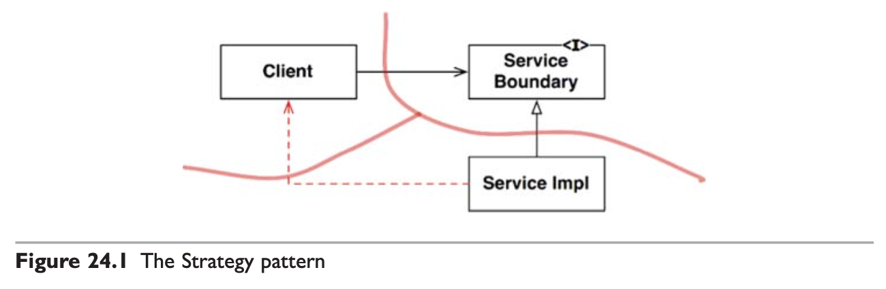
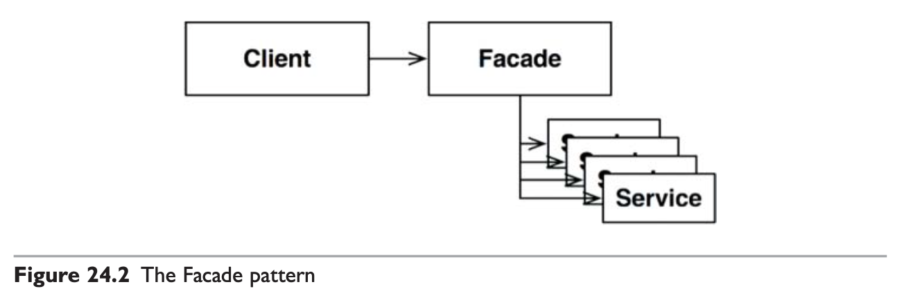
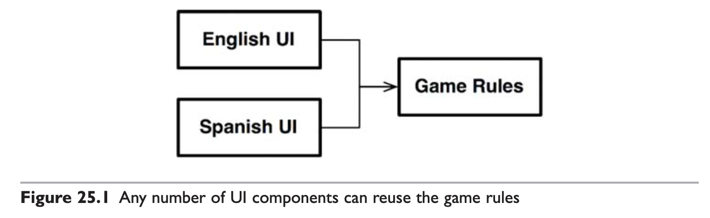
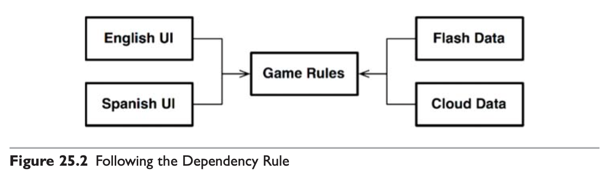
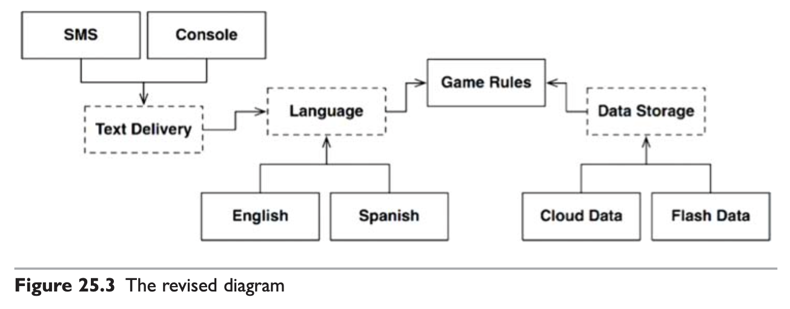
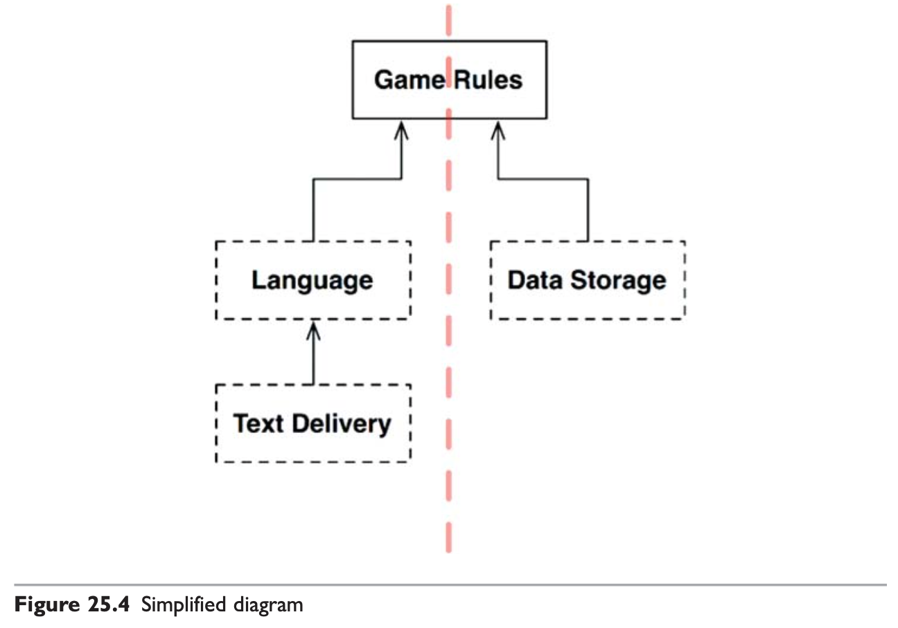
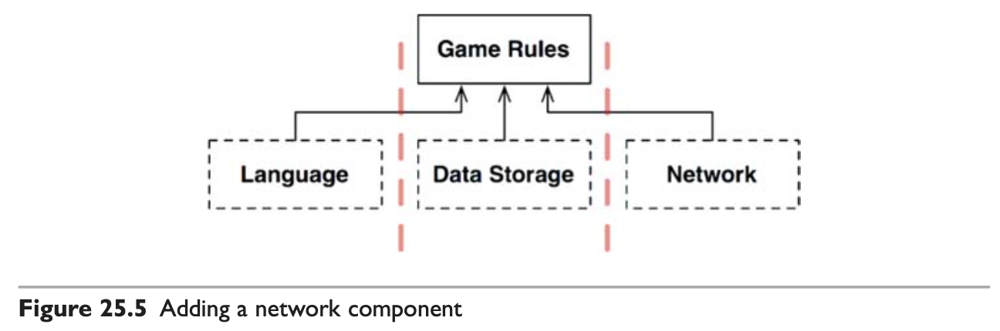
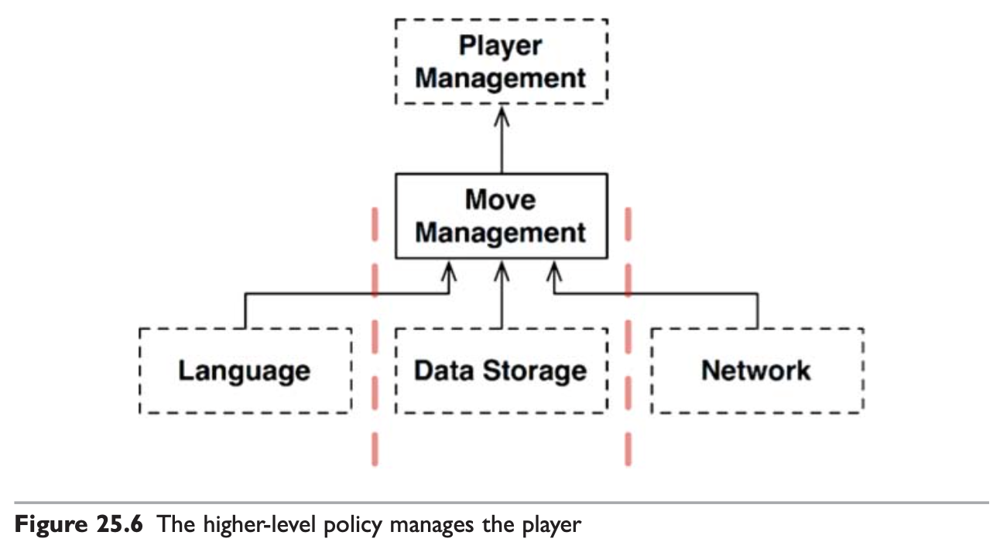
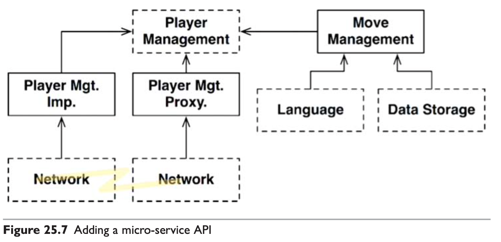

# #8 계층과 경계

<!-- 2021.10.11 -->

> Clean Architecture(Martin, Robert C.) 5부 24-25장 정리

## 이 페이지를 읽으면 알 수 있는 것

- 아키텍처 경계를 부분적으로 구현하는 방법에는 무엇이 있는가?
- 게임 제작 예시에서 시스템 컴포넌트는 어떻게 구성될 수 있을까?

## 24장. 부분적 경계

아키텍처 경계를 완벽하게 만들고 유지하는 데는 비용이 많이 든다. 뛰어난 아키텍트들은 이러한 경계를 만드는 비용이 너무 크다고 판단하면서도, 한편으로는 나중에 필요할 수도 있으니 선행적인 설계를 적용을 고민할 것이다. 만약 완벽한 아키텍처 구현 여부를 당장 결정하기 어렵다면, 부분적 경계(Partial boundary)를 구현해볼 수 있다.

### 마지막 단계를 건너뛰기

부분적 경계를 생성하는 방법 하나는 독립적으로 컴파일하고 배포하라 수 있는 컴포넌트를 만들기 위한 작업은 모두 수행한 후, 단일 컴포넌트에 그대로 모아만 두는 것이다. 쌍방향 인터페이스, 입출력 데이터 구조 등을 완전히 준비하더라도, 이 모두를 단일 컴포넌트로 컴파일해서 배포하는 것이다.

이렇게 부분적 경계를 만들려면 완벽한 경계를 만들 때 만큼의 코드량과 사전 설꼐가 필요하다. 하지만 다수의 컴포넌트를 관리하는 작업이 불필요하다. 추적을 위한 버전 번호나 배포 관리에 대한 부담도 없다. 이 차이는 가볍지 않다.

다만, 이 접근법이 지닌 위험 요소도 있다. 시간이 흐르면서 별도로 분리한 컴포넌트의 구분이 약화되고, 잘못된 방향으로 의존성이 선을 넘는 일이 발생할 수 있다. 이것을 다시 분리하는 작업은 쉽지 않을 것이다.

### 일차원 경계

완벽한 형태의 아키텍처 경계는 양방향으로 격리된 상태를 유지해야 하므로 쌍방향 인터페이스를 사용한다. 쌍방향 인터페이스는 초기 설정과 유지 모두에서 비용이 많이 든다.

추후 완벽한 형태의 경계로 확장할 수 있는 공간을 확보하고자 할 때 활용할 수 있는 더 간단한 구조가 있다.

클라이언트는 ServiceBoundary 인터페이스를 사용하며, 인터페이스는 ServiceImpl 클래스가 구현한다. 이렇게 구현함으로써 Client를 ServiceImpl로부터 격리시킬 수 있다.

하지만 이 다이어그램의 점선 화살표는 이 접근법의 위험성을 나타낸다. 쌍방향 인터페이스가 없고 개발자와 아키텍트가 충분히 훈련되지 않았다면, 이 점선과 같은 비밀 통로가 생기는 일을 막을 수 없다.

### 퍼사드

이보다 훨씬 더 단순한 경계는 퍼사드 패턴이다. 이 경우에는 심지어 의존성 역전까지도 희생한다. 경계는 Facade 클래스로만 간단히 정의되며, Facade 클래스에는 모든 서비스 클래스를 메서드 형태로 정의하고 호출한다. 클라이언트는 이들 서비스 클래스에 직접 접근할 수 없다.

하지만 Client는 이 모든 서비스 클래스에 대해 추이 종속성을 가지게 된 것을 주목하자. 서비스 클래스 중 하나에서 소스 코드가 변경되면 Clien도 무조건 재컴파일해야 할 것이다. 이러한 구조에서는 비밀 통로 또한 쉽게 만들 수 있다.

### 결론

아키텍처 경계를 부분적으로 구현하는 간단한 방법 세 가지를 살펴봤다. 이러한 접근법 각각은 나름의 비용과 장점을 가진다. 아키텍처 경계가 언제, 어디에 존재해야 할지, 그리고 그 경계를 완벽하게 구현할지 또는 부분적으로 구현할지를 결정하는 일 또한 아키텍터의 역할이다.

## 25장. 계층과 경계

시스템이 세 가지 컴포넌트(UI, 업무 규칙, 데이터베이스)로만 구성된다고 생각하기 쉽다. 하지만 정말 이게 전부일까?

### 움퍼스 사냥 게임

텍스트 기반 UI는 그대로 유지하되, 게임 규칙과 UI를 분리해서 게임을 다양한 언어로 발매할 수 있게 만든다고 가정해 보자. 게임 규칙은 언어 독립적인 API를 사용해서 UI 컴포넌트와 통신할 것이고, UI는 API를 사람이 이해할 수 있는 언어로 변환할 것이다.

또한 게임의 상태를 저장소에 유지할 때도, 필요에 따라 API를 생성하여 게임 규칙이 데이터 저장소 컴포넌트와 통신할 때 사용하도록 만들 수 있다.

이렇게 하면 게임 규칙은 다양한 언어나 데이터 저자아소에 대해 알지 못하며, 신경 쓸 이유도 없게 된다.

### 클린 아키텍처

하지만 UI에서 언어가 유일한 변경의 축은 아니다. 이 밖에도 텍스트를 주고받는 메커니즘을 다양하게 만들고 싶을 때도 있을 것이다. 이러한 변경의 축에 의해 정의되는 아키텍처 경계가 잠재되어 있을 수 있다. 아마도 해당 경계를 가로지르는, 그래서 언어를 통신 메커니즘으로부터 격리하는 API를 생성해야할 수도 있다. 이러한 아이디어는 다음과 같이 구현할 수 있다.

점선으로 된 테두리는 API를 정의하는 추상 컴포넌트를 가리키며, 해당 API는 하위 컴포넌트가 구현한다. English, SMS, CloudData와 같은 변형들은 추상 API 컴포넌트가 정의하는 다형적 인터페이스를 통해 제공되고, 실제로 서비스하는 구체 컴포넌트가 해당 인터페이스를 구현한다. 이러한 변형들을 모두 제거하고 순전히 API 컴포넌트만 집중하면 다이어그램을 다음과 같이 단순화할 수 있다.

위 다이어그램에서 모든 화살표는 위로 향하고, 모든 입력 또한 위로 전달된다. 그 후 GameRules는 아래 방향으로 출력을 전달한다.

이 구성은 데이터 흐름을 두 개의 흐름으로 효과적으로 분리한다. 왼쪽의 흐름은 사용자와의 통신에 관여하며, 오른쪽 흐름은 데이터 영속성에 관여한다. 두 흐름은 상단의 GameRules에서 서로 만나며, GameRules는 두 흐름이 모두 거치게 되는 데이터에 대한 최종적인 처리기가 된다.

### 흐름 횡단하기

이제는 게임을 네트워크상에서 여러 사람이 함께 플레이할 수 있게 만든다고 해보자. 이 경우 네트워크 컴포넌트를 추가해야 한다. 이제 데이터 흐름은 세 개로 분리뢴다. 따라서 시스템이 복잡해질수록 컴포넌트 구조는 더 많은 흐름으로 분리될 것이다.

### 흐름 분리하기

항상 모든 흐름이 상단의 단일 컴포넌트에서 서로 만나는 것은 아니다. 게임 규칙에서도 지도와 관련된 메커니즘, 이동과 관련된 메커니즘 등 다양한 메커니즘이 존재한다. 그리고 그 상위에는 모든 메커니즘을 관리하고 플레이어의 생명력과 상태를 관리하는 정책 집합이 필요할 것이다. 이 경우 구조는 다음과 같이 고도화될 수 있다.

만약 대규모의 플레이어가 동시에 플레이한다면 어떻게 될까? MoveManagement는 플레이어의 컴퓨터에서 직접 처리되지만 PlayerManagement는 서버에서 처리될 것이다. 따라서 PlayerManagement는 접속된 모든 MoveManagement 컴포넌트에 마이크로서비스 API를 제공한다.

### 결론

이 예제는 아키텍처 경계가 어디에나 존재한다는 사실을 보여준다. 아키텍트로서 우리는 아키텍처 경계가 언제 필요한지를 신중하게 파악해내야 한다. 또한 우리는 이러한 경계를 제대로 구현하기 위해서는 비용이 많이 든다는 사실도 인지하고 있어야 한다. 동시에 이러한 경계가 무시되었을 때 나중에 다시 추가하는 비용 또한 크다는 사실도 알아야 한다.

소프트웨어 아키텍트롯서 우리는 미래를 내다봐야만 한다. 비용을 산정하고, 어디에 아키텍처 경계를 둬야 할지, 그리고 완벽하게 구현할 경계와 부분적으로 구현할 경계와 무시할 경계를 결정해야만 한다.

이는 일회성 결정은 아니다. 따라서 시스템이 발전함에 따라 빈틈없이 지켜봐야 한다. 경계가 필요할 수도 있는 부분에 주목하고, 경계가 없어 생기는 마찰의 어렴풋한 조짐을 신중하게 관찰하자.