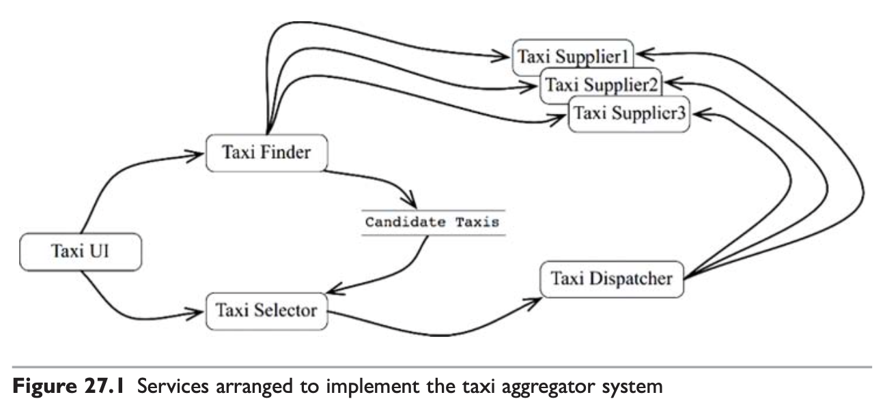
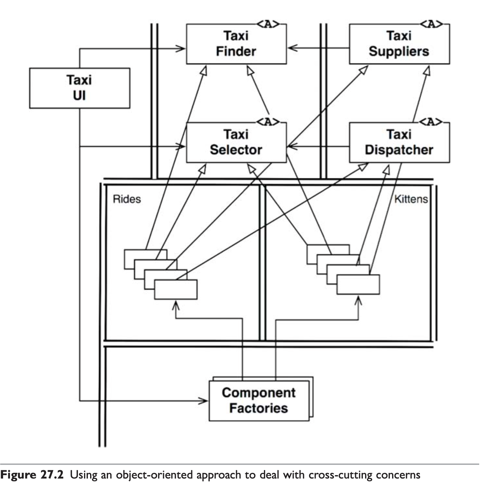
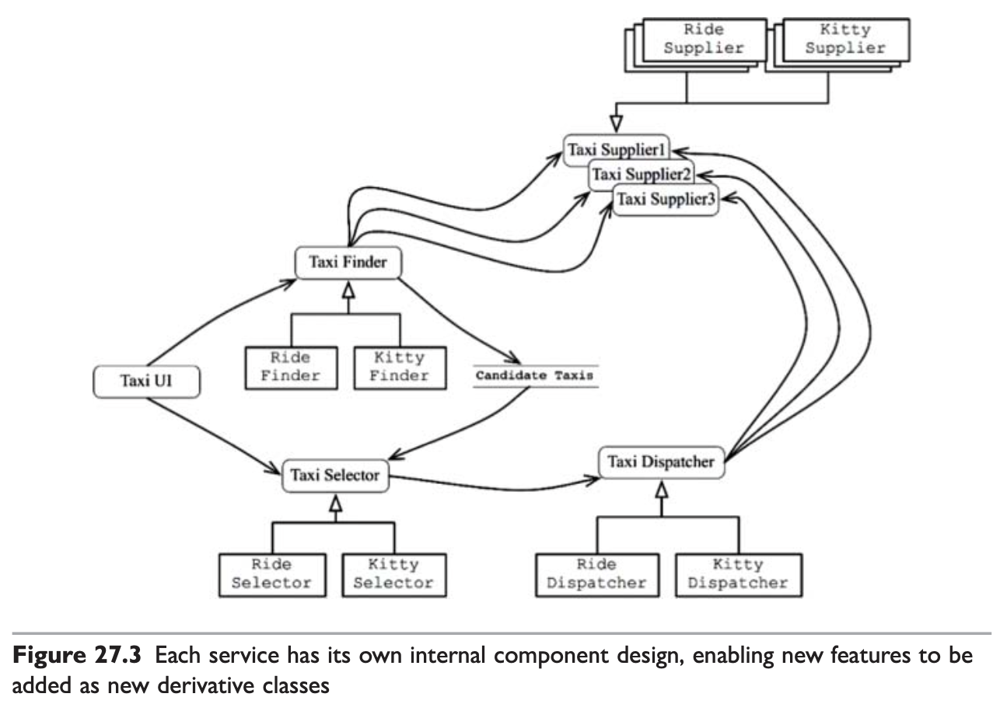
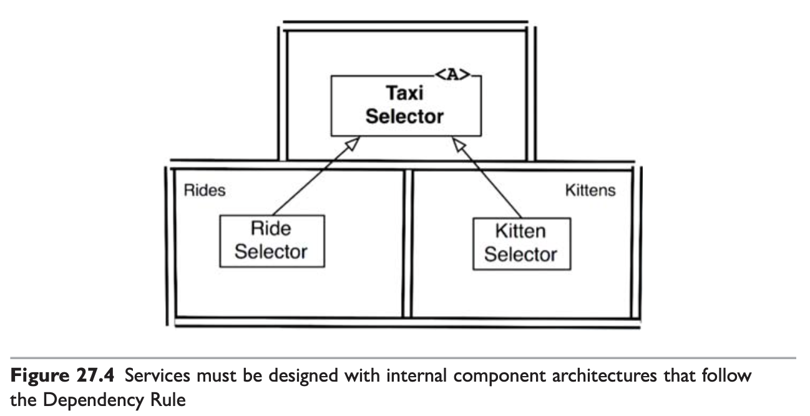

# #9 메인, 서비스, 테스트

<!-- 2021.10.15 -->

> Clean Architecture(Martin, Robert C.) 5부 26-28장 정리

## 이 페이지를 읽으면 알 수 있는 것

- 아키텍처에서 메인 컴포넌트의 역할과 수준은 무엇인가?
- 서비스 아키텍처에서 주의해야할 점은 무엇인가?
- 아키텍처엣서 테스트 컴포넌트는 어떻게 설계되어야 하는가?

## 26장. 메인(Main) 컴포넌트

모든 시스템에는 최소 하나의 컴포넌트가 존재하고, 이 컴포넌트는 나머지 컴포넌트를 생성하고, 조정하며, 관리한다. 이 컴포넌트를 메인(Main)이라고 부르자.

### 궁극적인 세부사항

메인 컴포넌트는 궁극적인 세부사항으로, 가장 낮은 수준의 정책이다. 메인은 시스템의 초기 진입점이다. 운영체제를 제외하면 어떤 것도 메인에 의존하지 않는다. 메인은 모든 팩토리, 전략, 그리고 기반 설비를 생성한 후, 시스템에서 더 높은 수준을 담당하는 부분으로 제어권을 넘기는 역할을 맡는다.

메인은 클린 아키텍처에서 가장 바깥 원에 위치하는, 지저분한 저수준 모듈이다. 따라서 메인은 고수준의 시스템을 위한 모든 것을 로드한 후, 제어권을 고수준의 시스템에게 넘긴다.

### 결론

메인을 애플리케이션의 플러그인이라고 생각하자. 메인은 초기 조건과 설정을 구성하고, 외부 자원을 모두 수집한 후, 제어권을 애플리케이션의 고수준 정책으로 넘기는 플러그인이다. 메인은 플러그인이므로 메인 컴포넌트를 애플리케이션의 설정별로 하나씩 두어 둘 이상의 메인 컴포넌트를 만들 수도 있다. 메인을 플러그인으로 여기면 설정 문제를 훨씬 쉽게 해결할 수 있다.

## 27장. '크고 작은 모든' 서비스들

서비스 지향 아키텍처와 마이크로 서비스 아키텍처는 최근 큰 인기를 끌고 있는데, 그 이유는 다음과 같다.

- 서비스를 사용하면 상호 결합이 철저하게 분리되는 것처럼 보인다. 사실 이는 일부만 맞는 말이다.
- 서비스를 사용하면 개발과 배포 독립성을 지원하는 것처럼 보인다. 이 역시도 일부만 맞는 말이다.

### 서비스 아키텍처?

서비스를 사용한다는 것은 본질적으로 아키텍처에 해당하는 것은 아니다. 시스템의 아키텍처는 의존성 규칙을 준수하고 고수준의 정책을 저수준의 세부사항으로부터 분리하는 경계에 의해 정의된다. 서비스가 단순히 애플리케이션의 행위를 분리하는 역할을 한다면, 아키텍처 관점에서 꼭 중요하다고 할 수 없다. 모든 서비스가 반드시 아키텍처 관점에서 중요해야 한다는 뜻은 아니다. 의존성 규칙 준수와 관계 없이 서비스는 큰 도움이 될 때가 많다. 그러나 서비스 그 자체는 아키텍처를 정의하지 않는다.

모노리틱 시스템이나 컴포넌트 기반 시스템에서도 아키텍처를 정의하는 요소는 의존성 규칙을 따르면서 아키텍처 경계를 넘나드는 함수 호출들이다. 반면 시스템의 나머지 많은 함수들은 행위를 서로 분리할 뿐이며, 아키텍처로서는 전혀 중요하지 않다.

서비스도 마찬가지다. 서비스는 결국 프로세스나 플랫폼 경계를 가로지르는 함수 호출에 지나지 않는다. 아키텍처에 중요한 서비스들도 있지만, 중요하지 않은 서비스도 있다. 이번 장에서 주목해 볼 것은 아키텍처에 중요한 서비스다.

### 서비스의 이점?

#### 결합 분리의 오류

시스템을 서비스로 분리함으로써 얻을 것이라 예상되는 큰 이점 하나는 서비스 사이의 결합이 확실히 분리된다는 것이다. 서비스는 서로 다른 프로세서에서 실행되므로 다른 서비스의 변수에 접근할 수 없다. 그리고 모든 서비스의 인터페이스는 반드시 잘 정의되어 있어야 한다.

이 말에는 일리가 있지만, 꼭 그런 것은 아니다. 물론 서비스는 개별 변수 수준에서 결합이 분리된다. 하지만 프로세서 내에서 또는 네트워크 상의 공유 자원에 의해 결합될 가능성이 여전히 존재한다. 특히 서로 공유하는 데이터에 의해 강력하게 결합될 수 있다. 예를 들어 서비스 사이를 오가는 데이터 레코드에 새로운 필드를 추가한다면, 이 필드를 사용해 동작하는 모든 서비스는 반드시 변경되어야 한다. 따라서 서비스들은 이 데이터 레코드에 강하게 결합되고, 서비스 사이에는 간접적인 결합이 생긴다.

인터페이스가 잘 정의되어 있다는 것은 명백한 장점이다. 하지만 함수의 경우에도 전혀 다르지 않다. 서비스 인터페이스가 함수 인터페이스보다 더 엄밀하거나 더 잘 정의되는 것은 아니다.

#### 개발 및 배포 독립성의 오류

서비스를 사용함에 따라 예측되는 또 다른 이점은 전담팀이 서비스를 소유하고 운영한다는 점이다. 그래서 전담팀이 각 서비스를 작성하고, 유지 보수하고, 운영하는 모든 책임을 질 수 있다. 이러한 개발 및 배포 독립성은 확장 가능한 것으로 간주된다. 대규모의 엔터프라이즈 시스템은 수천 개의 독립적인 서비스들을 이용하여 만들 수 있고, 각 서비스를 담당하는 팀은 독립적으로 일할 수 있을 것으로 여겨진다.

이러한 믿음은 어느 정도 일리가 있지만, 극히 일부일 뿐이다. 첫째로, 대규모 엔터프라이즈 시스템은 서비스 기반 시스템 이외에도 모노리틱 시스템이나 컴포넌트 기반 시스템으로도 구축될 수 있다. 서비스는 확장 가능한 시스템을 구축하는 유일한 방법이 아니다.

두 번째로, '결합 분리의 오류'에 따르면 서비스가 항상 독립적으로 개발하고 배포하며 운영할 수 있는 것은 아니다. 데이터나 행위에서 어느 정도 결합되어 있다면, 결합된 정도에 맞게 개발, 배포, 운영을 조정해야만 한다.

### 야옹이 문제

9장에서 예를 들었던 택시 통합 시스템에서 택시 기사가 야옹이를 배달하는 기능을 추가한다면 어떻게 될까? 위의 예시는 택시 통합 서비스를 구현하기 위해 배치된 서비스 다이어그램이다. 이 다이어그램에 야옹이 배달하는 기능을 추가하기 위해서는 모든 서비스 영역을 수정해야 한다. 이것이 횡단 관심사(Cross-cutting concern)가 가진 문제다. 모든 소프트웨어 시스템은 서비스 지향이든 아니든 이 문제에 직면하기 마련이다.

### 객체가 구출하다

컴포넌트 기반 아키텍처에서는 이 문제를 어떻게 해결했을까? SOLID 설계 원칙을 살펴보면, 다형적으로 확장할 수 있는 클래스 집합을 생성해 새로운 기능을 처리하도록 함을 알 수 있다.

컴포넌트 기반 서비스 다이어그램은 객체 지향 방식으로 횡단 관심사를 처리한다. 두 개의 신규 컴포넌트인 Rides와 Kittens는 의존성 규칙을 준수하며, 결합이 분리되어 독립적으로 개발하여 배포할 수 있다.

### 컴포넌트 기반 서비스

서비스에서도 이렇게 할 수 있을까? 당연하다. 서비스가 반드시 소규모 단일체여야 할 이유는 없다. 서비스는 SOLID 원칙대로 설계할 수 있으며 컴포넌트 구조를 갖출 수도 있다. 이를 통해 서비스 내의 기존 컴포넌트들을 변경하지 않고도 새로운 컴포넌트를 추가할 수 있다.

서비스를 추상 클래스의 집합이라고 생각하라. 새로운 파일을 구성하는 클래스들은 기존에 정의된 추상 클래스들을 확장하여 만든다. 그러면 새로운 기능의 배포는 서비스를 재배포하는 문제가 아니라, 서비스를 로드하는 경로에 새로운 파일을 추가하는 문제가 된다. 즉, 새로운 기능을 추가하는 행위가 개방 폐쇄 원칙을 준수하게 된다. 이를 예시에 적용하면 다음 다이어그램을 얻을 수 있다.

### 횡단 관심사

아키텍처 경계는 서비스 사이에 있지 않다. 오히려 서비스를 관통하며, 서비스를 컴포넌트 단위로 분할한다.

모든 주요 시스템이 직면하는 횡단 관심사를 처리하려면, 서비스 내부는 의존성 규칙을 준수하는 컴포넌트 아키텍처로 설계해야 한다. 이 서비스들은 시스템의 아키텍처 경계를 정의하지 않는다. 아키텍처 경계를 정의하는 것은 서비스 내에 위치한 컴포넌트다. 

### 결론

서비스는 시스템의 확장성과 개발 가능성 측면에서 유용하지만, 그 자체로는 아키텍처로서 중요한 요소는 아니다. 시스템의 아키텍처는 시스템 내부에 그어진 경계와 경계를 넘나드는 의존성에 의해 정의된다.

## 28장. 테스트 경계

### 시스템 컴포넌트인 테스트

테스트는 태생적으로 의존성 규칙을 따른다. 테스트는 세부적이며 구체적인 것으로, 의존성은 항상 테스트 대상이 되는 코드를 향한다. 테스트는 아키텍처에서 가장 바깥쪽 원에 해당한다. 시스템의 어떤 것도 테스트에 의존하지 않으며, 테스트는 항상 원의 안쪽으로 의존한다.

또한 테스트는 독립적으로 배포할 수 있다. 대다수의 경우 테스트는 테스트 시스템에만 배포한다. 배포 독립성이 필요하지 않는 시스템에서도 테스트는 독립적으로 배포된다.

테스트는 시스템 컴포넌트 중에서 가장 고립되어 있다. 테스트는 시스템 운영에 꼭 필요치는 않다. 어떤 사용자도 테스트에 의존하지 않으며, 테스트는 개발을 지원하는 역할만을 한다. 하지만, 그럼에도 테스트는 많은 면에서 시스템 컴포넌트가 반드시 지켜야 하는 모델을 표현해 준다.

### 테스트를 고려한 설계

테스트가 지닌 극단적인 고립성을 보며 개발자는 종종 테스트가 시스템의 설계 밖에 있다고 여긴다. 이 관점은 치명적이다. 테스트가 시스템의 설계와 잘 통합되지 않으면, 테스트는 깨지기 쉽고 시스템은 변경하기 어려워진다.

문제는 결합이다. 시스템에 강하게 결합된 테스트라면 시스템이 변경될 때 함께 변경되어야만 한다. 시스템 컴포넌트에서 생긴 사소한 변경이, 이와 결합된 수많은 테스트를 망가뜨릴 수 있다. 만약 시스템의 공통 컴포넌트가 변경되면 수백, 수천 개의 테스트가 망가진다. 이것은 깨지기 쉬운 테스트 문제(Fragile Tests Problem)으로 알려져 있다.

깨지기 쉬운 테스트는 시스템을 뻣뻣하게 만든다. 시스템에 가한 간단한 변경이 대량의 테스트 실패로 이어진다는 사실을 알게 되면, 개발자는 그러한 변경을 하지 않으려고 할 것이다. 이 문제를 해결하려면 테스트를 고려해서 설계해야 한다. 소프트웨어 설계의 첫 번째 규칙은 언제나 같다. 변동성이 있는 것에 의존하지 말라. GUI는 변동성이 크므로, GUI를 사용하는 테스트는 깨지기 쉽다. 따라서, 설계할 때 GUI를 사용하지 않고도 업무 규칙을 테스트할 수 있게 해야 한다.

### 테스트 API

이 목표를 달성하려면 테스트가 모든 업무 규칙을 검증하는 데 사용할 수 있도록 특화된 API를 만들면 된다. 이 API는 사용자 인터페이스가 사용하는 인터랙터와 인터페이스 어댑터들의 상위 집합이 될 것이다.

테스트 API는 테스트를 애플리케이션으로부터 분리할 목적으로 사용한다. 단순히 테스트를 UI에서 분리하는 것만이 아닌, 테스트 구조를 애플리케이션 구조로부터 결합을 분리하는 게 목표다.

#### 구조적 결합

테스트 API의 역할은 애플리케이션의 구조를 테스트로부터 숨기는 데 있다. 이렇게 만들면 상용 코드를 리팩터링하거나 진화시키더라도 테스트에는 영향을 주지 않는다. 시간이 지날수록 테스트는 더 구체적이고 더 특화된 형태로 변할 것이고, 상용 코드는 더 추상적이고 더 범용적인 형태로 변할 것이다. 따라서 테스트와 상용 코드가 독립적으로 진화할 수 있게 만들어야 한다.

#### 보안

테스트 API가 지닌 보안 위험성을 피하기 위해서는, 테스트 API 자체 또는 테스트 API 중 위험한 부분의 구현부는 독립적으로 배포할 수 있는 컴포넌트로 분리해야 한다.

### 결론

테스트는 시스템의 일부다. 따라서 테스트는 잘 설계되어야 한다. 테스트를 시스템의 일부로 설계하지 않으면 테스트는 깨지기 쉽고 유지 보수하기 어려워진다.