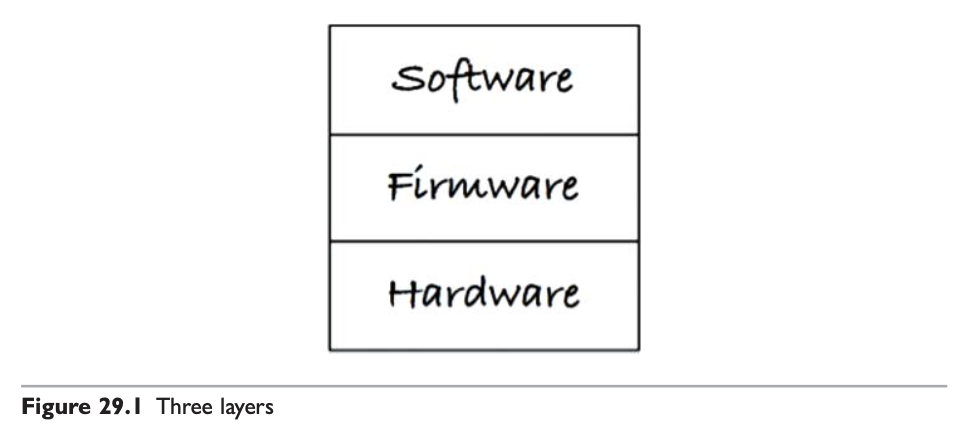
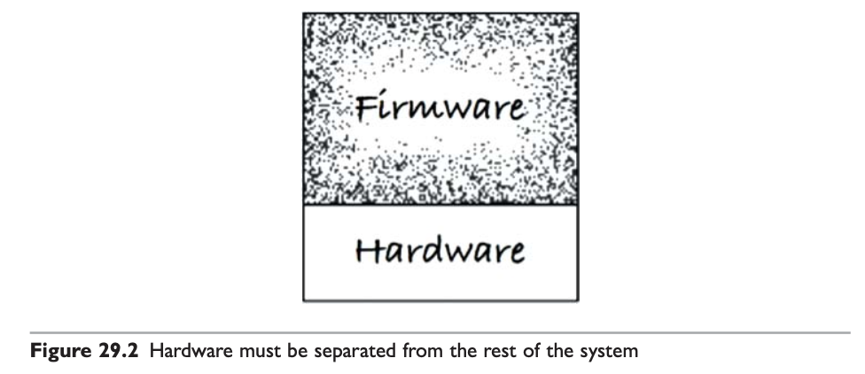
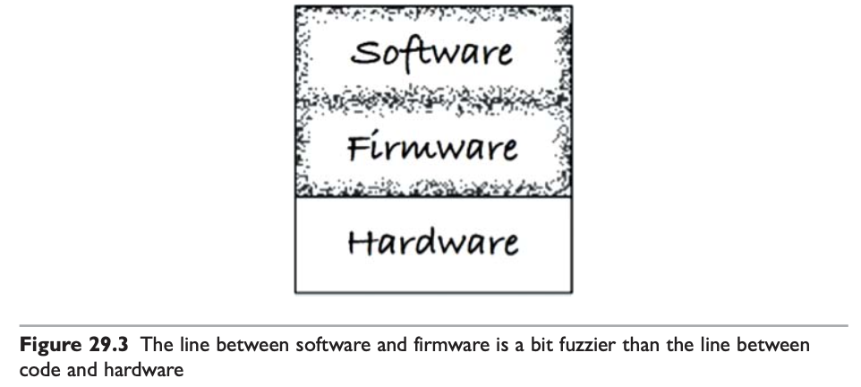
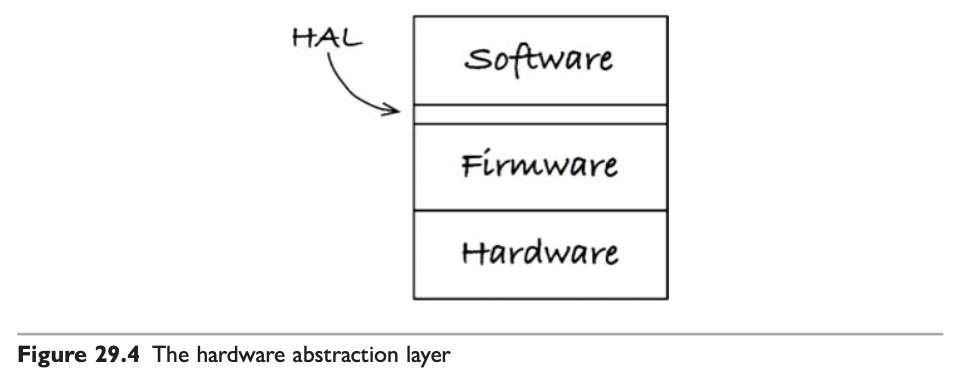
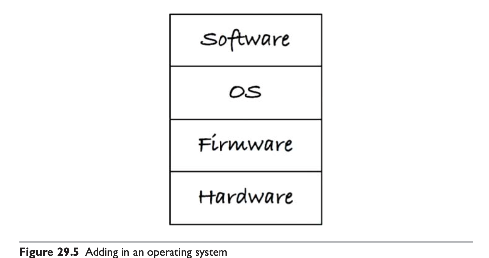
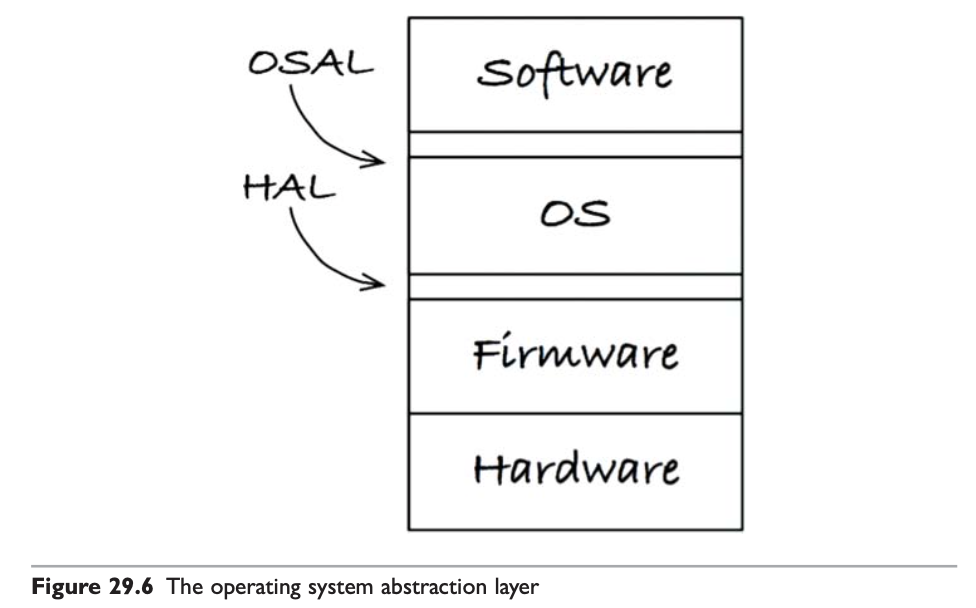

# #10 클린 임베디드 아키텍처

<!-- 2021.10.18 -->

> Clean Architecture(Martin, Robert C.) 5부 29장 정리

소프트웨어는 긴 시간 유용하게 쓸 수 있지만, 펌웨어는 하드웨어가 발전할수록 낡아 간다. 하드웨어는 계속해서 발전하고 또 개선되기 때문이다. 소프트웨어의 경우 닳지는 않지만, 펌웨어와 하드웨어에 대한 의존성을 관리하지 않으면 안으로부터 파괴될 가능성이 존재한다.

흔히 펌웨어를 ROM에 내장되는 소프트웨어라고 정의한다. 하지만, 단순히 ROM에 상주하는 코드만이 펌웨어는 아니다. 이보다는 어떤 코드가 무엇에 의존하는지, 그리고 하드웨어 발전에 맞춰 수정하기가 얼마나 어려운지에 따라 결정된다.

임베디드 엔지니어가 아닌 엔지니어들도 펌웨어를 작성한다. 만약 어떤 개발자가 코드에 SQL을 심어 놓거나 개발하는 코드 전반에 플랫폼 의존성을 퍼뜨려 놓는다면, 본질적으로 펌웨어를 작성하는 셈이다. 앱 개발자 역시 업무 로직을 안드로이드 API로부터 분리하지 않는다면 펌웨어를 작성하는 셈이다. 이러한 경우에서 각 코드는 오랜 기간 유용하게 사용될 수 있는 잠재력이 있었으나, 소프트웨어가 될 기회를 포기하고 펌웨어가 된 것이다.

따라서 엔지니어들은 펌웨어를 수없이 양산하는 일을 멈추고, 코드에게 유효 수명을 길게 늘릴 수 있는 기회를 주어야 한다. 어떻게 하면 임베디드 소프트웨어 아키텍처를 깔끔하게 유지할 수 있는지, 그래서 소프트웨어가 오랫동안 유용하게 살아남을 가능성을 높일 수 있는지를 살펴보자.

## 앱-티튜드 테스트

켄트 백은 소프트웨어를 구축하는 세 가지 활동을 다음과 같이 기술했다.

1. "먼저 동작하게 만들어라"
   - 소프트웨어가 동작하지 않는다면 사업은 망한다.
2. "그리고 올바르게 만들어라"
   - 코드를 리팩터링해서 다른 사람들이 이해할 수 있게 만들어라.
   - 요구가 변경되었을 때 코드를 개선할 수 있게 만들어라.
3. "그리고 빠르게 만들어라"
   - 코드를 리팩터링해서 요구되는 성능을 만족시켜라.

대부분의 임베디드 소프트웨어는 단순히 '동작하게 하라'라는 활동만을 염두에 두고 작성되며, 따라서 펌웨어로 변하게 된다. 앱이 동작하도록 만드는 것을 개발자용 앱-티튜드 테스트(App-titude test)라고 부른다. 프로그래밍에는 단순히 앱이 동작하도록 만드는 것보다 중요한 것이 훨씬 많다.

아래 예시는 어떤 임베디드 시스템에서 작성된 코드의 예시다.

```
ISR(TIMER_vect) { ... }
ISR(INT2_vect) { ... }
void btn_Handler(void) { ... }
float calc_RPM(void) { ... }
static char Read_RawData(void) { ... }
void Do_Average(void) { ... }
void Get_Next_Measurement(void) { ... }
void Zero_Sensor_1(void) { ... }
void Zero_Sensor_2(void) { ... }
void Dev_Control(char Activation) { ... }
char Load_FLASH_Setup(void) { ... }
void Save_FLASH_Setup(void) { ... }
void Store_DataSet(void) { ... }
float byte2float(char bytes[4]) { ... }
void Recall_DataSet(void) { ... }
void Sensor_init(void) { ... }
void uC_Sleep(void) { ... }
```

우리는 이 함수를 관련된 것끼리 묶을 수 있다.

- 도메인 로직을 포함하는 함수들
  
```
float calc_RPM(void) { ... }
void Do_Average(void) { ... }
void Get_Next_Measurement(void) { ... }
void Zero_Sensor_1(void) { ... }
void Zero_Sensor_2(void) { ... }
```

- 하드웨어 플랫폼을 설정하는 함수들

```
ISR(TIMER_vect) { ... }
ISR(INT2_vect) { ... }
void uC_Sleep(void) { ... }
```

- 전원 버튼에 반응하는 함수들

```
void btn_Handler(void) { ... }
void Dev_Control(char Activation) { ... }
```

- 영구 저장소에 값을 저장하는 함수들

```
char Load_FLASH_Setup(void) { ... }
void Save_FLASH_Setup(void) { ... }
void Store_DataSet(void) { ... }
float byte2float(char bytes[4]) { ... }
void Recall_DataSet(void) { ... }
```

또한, 이 코드는 특정 임베디드 장치에서만 테스트할 수 있음을 암시하는 파일 구조를 포함했다. 이 코드의 거의 대부분은 자신이 특수한 마이크로프로세서 아키텍처에서 동작한다는 사실을 알고 있었다. 이 코드는 유효 수명을 길게 유지할 길이 아예 없어 보인다.

이 애플리케이션은 동작한다. 엔지니어는 앱-티튜드 테스트를 통과했다. 하지만 이 애플리케이션이 클린 임베디드 아키텍처를 가진다고 말하기는 어렵다.

## 타깃-하드웨어 병목현상

임베디드가 가진 특수한 문제 중 하나는 타깃-하드웨어 병목현상(target hardware bottleneck)이다. 클린 아키텍처가 적용되지 않은 임베디드 코드는 대부분 코드를 테스트할 수 있는 환경이 특정 타깃으로 국한될 것이다. 그리고 그 타깃이 테스트가 가능한 유일한 장소라면, 타깃-하드웨어 병목현상이 발생하여 진척이 느려질 것이다.

몇 가지 아키텍처 원칙을 임베디드 소프트웨어와 펌웨어에 적용하여 타깃-하드웨어 병목현상을 줄이는 방법을 살펴보자.

### 클린 임베디드 아키텍처는 테스트하기 쉬운 임베디드 아키텍처다.

#### 계층

시스템을 소프트웨어, 펌웨어, 하드웨어의 3개 계층으로 나눠보자. 이 중 하드웨어는 언젠가 불가피하게 변경해야 하는 시점이 반드시 온다. 임베디드 엔지니어는 하드웨어 변경에 따른 작업을 필요 이상으로 하지 않기를 원한다.



만약 다음 그림처럼 소프트웨어와 펌웨어가 결합된다면, 완성된 코드는 변경하기가 매우 어렵게 된다. 하드웨어 관련 정보가 코드 전체를 오염시킨 것이다.



소프트웨어와 펌웨어가 서로 섞이는 일은 안티 패턴이다. 안티 패턴은 변화에 저항한다. 변경하기 어려울 뿐 아니라 변경하는 일 자체가 위험을 수반하여, 때로는 의도하지 않은 결과를 불러온다.

#### 하드웨어는 세부사항이다.

소프트웨어와 펌웨어 사이의 경계는 코드와 하드웨어 사이의 경계와 달리 잘 정의하기가 대체로 어렵다.



임베디드 소프트웨어 개발자는 이 경계를 분명하게 만들어야 한다. 소프트웨어와 펌웨어 사이의 경계는 하드웨어 추상화 계층(Hardware Abstraction Layer, HAL)이라고 부른다.



HAL은 자신보다 위에 있는 소프트웨어를 위해 존재한다. 따라서 HAL의 API는 소프트웨어의 필요에 맞게 만들어져야 한다. 예를 들어, 소프트웨어는 데이터가 플래시 메모리에 저장되는지, 클라우드에 저장되는지, 코어 메모리에 저장되는지 전혀 개의치 않는다. 이러한 서비스는 HAL이 제공하며, 어떻게 저장하는지에 대해서는 소프트웨어에 드러내지 않는다. 이는 세부사항이기 때문이다.

### HAL 사용자에게 하드웨어 세부사항을 드러내지 말라.

클린 임베디드 아키텍처로 설계된 소프트웨어는 타깃 하드웨어에 관계없이 테스트가 가능하다.

#### 프로세서는 세부사항이다.

프로세서 제작 업체가 제공하는 C 컴파일러는 프로세서 내부에 쉽게 접근하도록 기능을 제공한다. 하지만, 이 기능을 사용해 버리면 그 코드는 더 이상 C가 아니다. 그 코드는 다른 프로세서에서는 컴파일되지 않을 것이고, 심지어는 동일한 프로세서라도 다른 컴파일러로는 컴파일하지 못할 수도 있다.

클린 임베디드 아키텍처라면 소프트웨어가 어떤 프로세서에도 종속되지 않게 해야 한다. 프로세서에 직접 접근하는 것은 모두 펌웨어가 되어야 한다.

#### 운영체제는 세부사항이다.

작성한 코드의 수명을 늘리려면, 무조건 운영체제를 세부사항으로 취급하고 운영체제에 의존하는 일을 막아야 한다. 운영체제는 소프트웨어를 펌웨어로부터 분리하는 계층이다. 소프트웨어는 운영체제를 통해 운영 환경이 제공하는 서비스에 접근한다. 



클린 임베디드 아키텍처는 운영체제 추상화 계층(Operating System Abstraction Layer, OSAL)을 통해 소프트웨어를 운영체제로부터 격리시킨다. 



소프트웨어가 운영체제 대신 OSAL에 의존하게 만들자. 소프트웨어가 OSAL에 의존한다면, 운영체제가 변경되어도 OSAL 인터페이스에 맞게 새로운 코드를 작성함으로써 변경에 대응할 수 있다. 이는 기존의 복잡한 코드 덩어리를 수정하는 일보다 훨씬 낫다.

OSAL은 테스트 지점을 만드는 데 도움이 되며, 그 덕분에 소프트웨어 계층의 애플리케이션 코드를 운영체제에 관계없이 테스트할 수 있다.

### 인터페이스를 통하고 대체 가능성을 높이는 방향으로 프로그래밍하라.

모든 주요 계층 내부에는 이 책에서 설명한 원칙들을 적용해야 한다. 이 원칙은 관심사를 분리시키고, 인터페이스를 활용하며, 대체 가능성을 높이는 방향으로 프로그래밍하도록 유도한다.

계층형 아키텍처(layered architecture)는 인터페이스를 통해 프로그래밍하자는 발상을 기반으로 한다. 모듈들이 서로 인터페이스를 통해 상호작용한다면, 특정 서비스 제공자를 다른 제공자로 대체할 수 있다. 경험 법칙에 따르면 인터페이스 정의는 헤더 파일에 해야 한다. 따라서 헤더 파일에는 구현 세부사항이 포함되어서는 안된다.

클린 임베디드 아키텍처에서는 모듈들이 인터페이스를 통해 상호작용하기 때문에 각각의 계층 내부에서 테스트가 가능하다. 각 인터페이스는 타깃과는 별개로 테스트할 수 있도록 해주는 경계층을 제공한다.

### DRY 원칙: 조건부 컴파일 지시자를 반복하지 말라

DRY 원칙이란 코드를 반복하는 일은 반복하지 말라(Don't Repeat Yourself)는 원칙이다. 임베디드 시스템의 경우 타깃-하드웨어의 유형을 식별하는 조건부 컴파일을 반복해서 사용할 때가 많은데, 같은 코드를 반복하지 않도록 주의해야 한다.

만약 하드웨어 추상화 계층(HAL)이 있다면 어떨까? 하드웨어 유형은 HAL 뒤에 가려진 세부사항이 될 것이며, 우리는 HAL이 제공하는 인터페이스를 통해 링커 등을 사용하여 소프트웨어와 하드웨어를 연결할 수 있다.

## 결론

모든 코드가 펌웨어가 되도록 내버려 두면 제품이 오래 살아남을 수 없게 된다. 클린 임베디드 아키텍처는 제품이 장기간 생명력을 유지하는 데 도움을 준다.