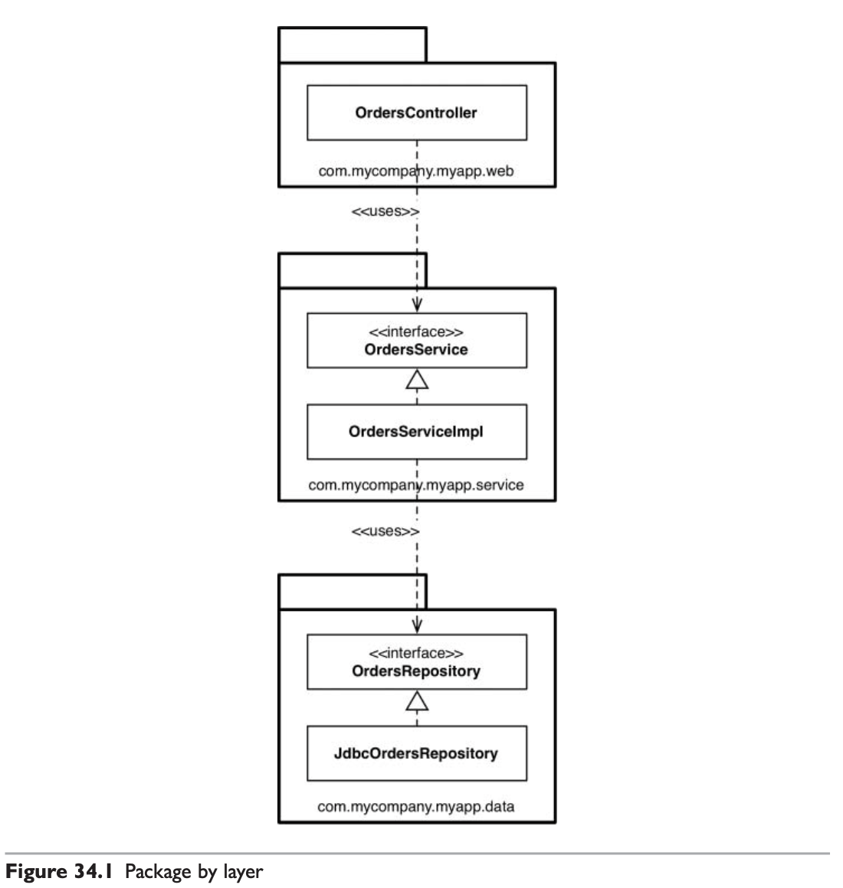
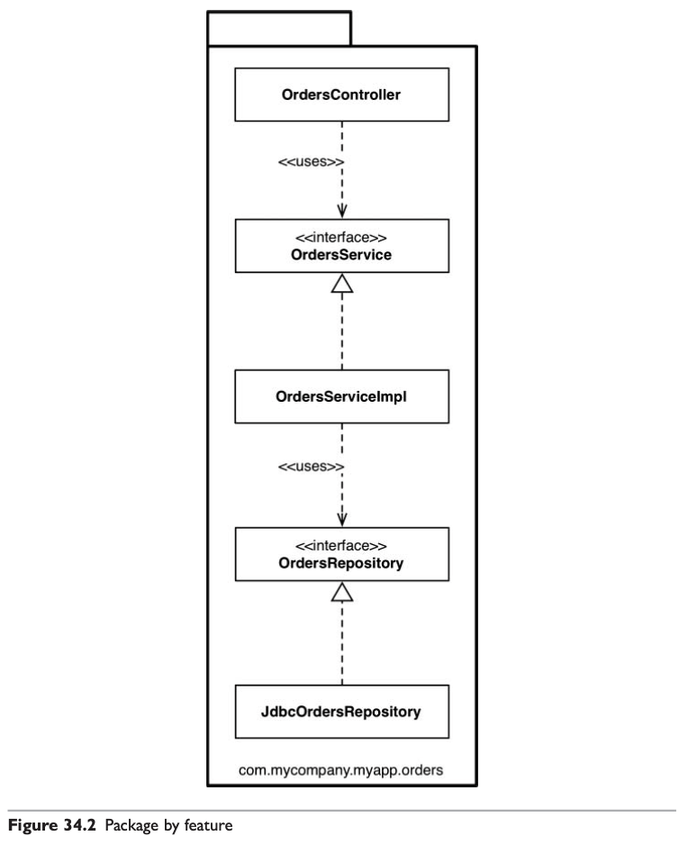
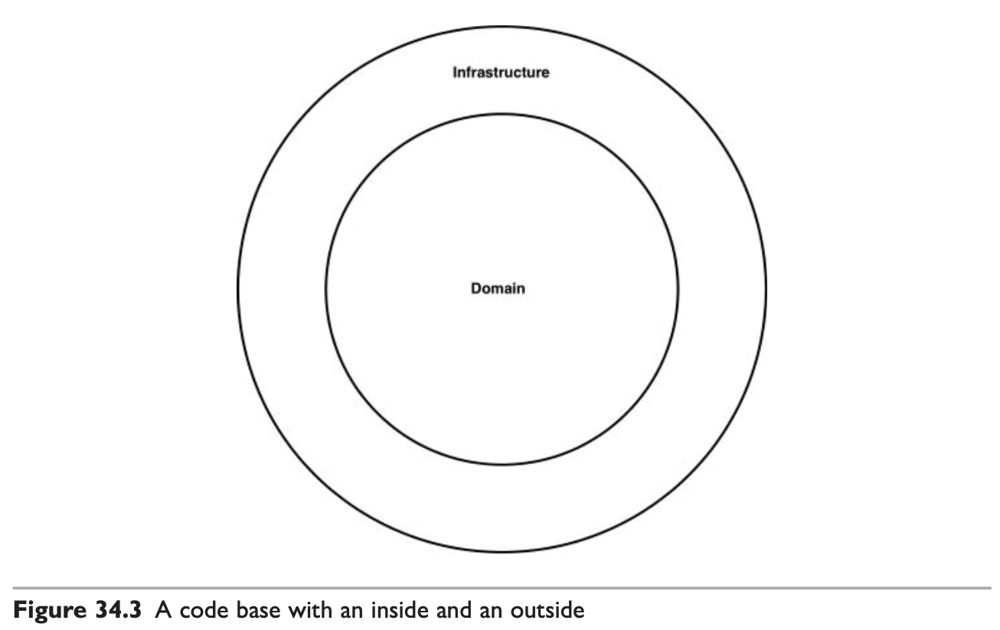
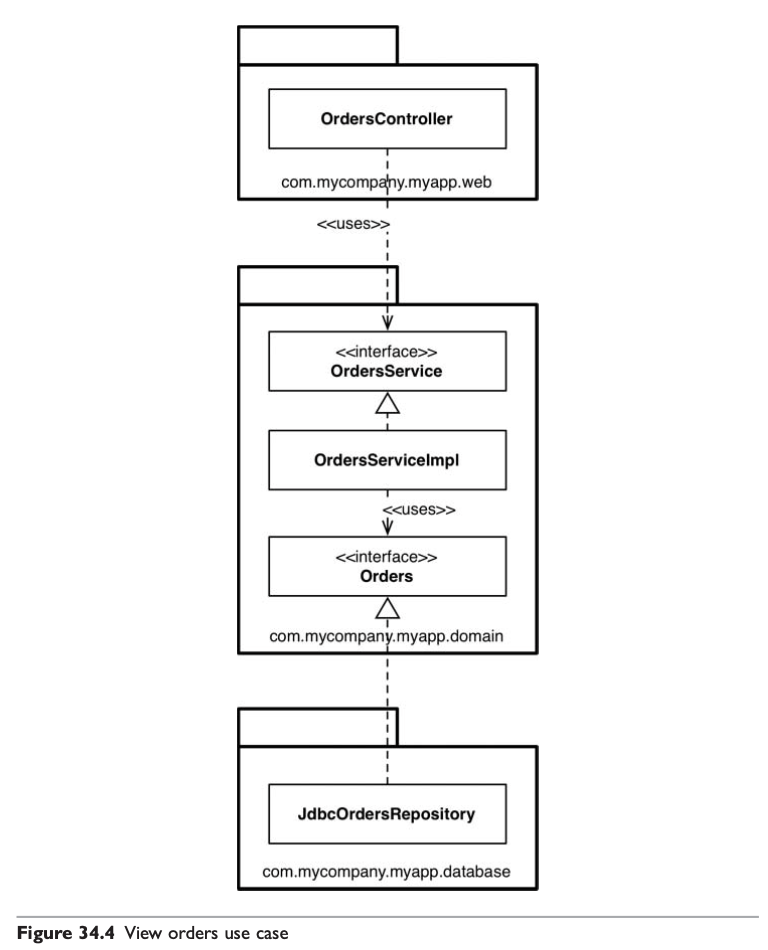
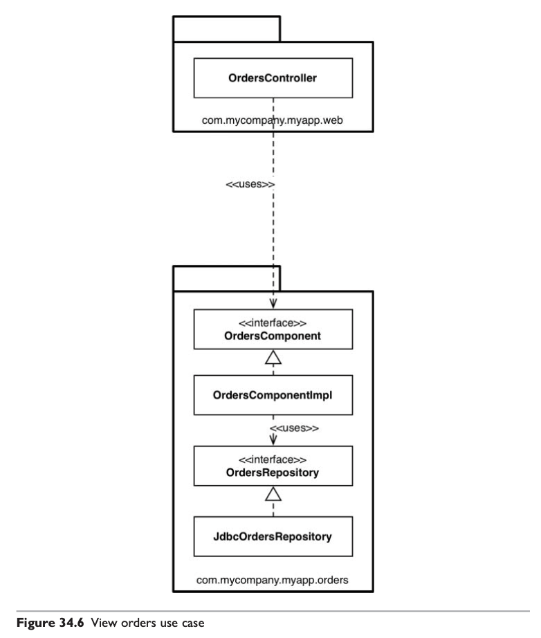
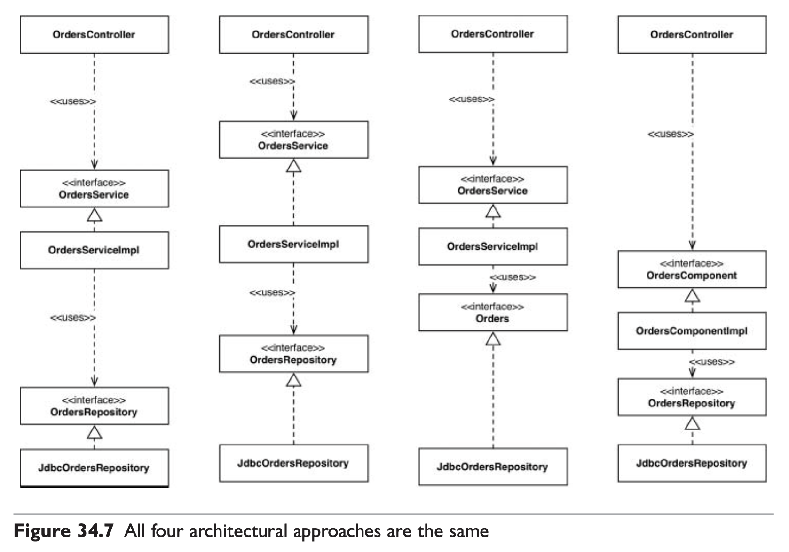
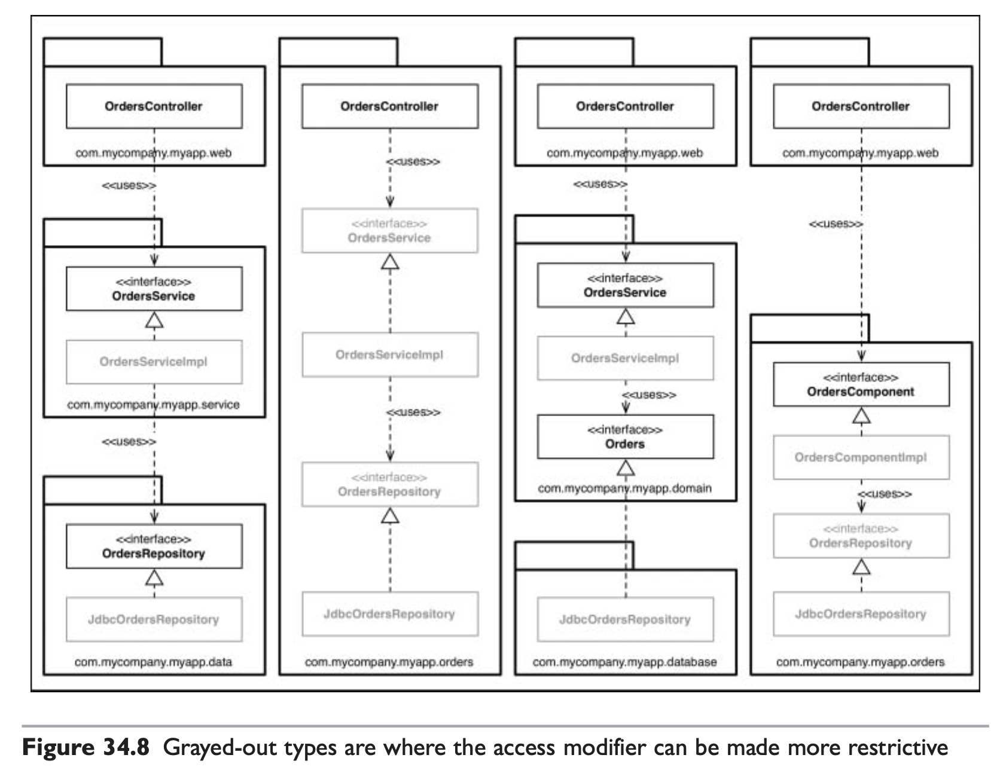

# #11 세부사항

<!-- 2021.10.21 -->

> Clean Architecture(Martin, Robert C.) 6부 정리

## 이 페이지를 읽으면 알 수 있는 것

- 아키텍처에서 데이터베이스, 웹, 프레임워크의 위치는 어디에 있는가?
- 클린 아키텍처 외에 코드를 조직화하는 방법은 또 무엇이 있는가?

## 30장. 데이터베이스는 세부사항이다

아키텍처 관점에서 데이터베이스는 세부사항으로, 데이터베이스는 아키텍처의 엔티티가 아니다. 데이터베이스는 데이터에 접근할 방법을 제공하는 유틸리티일 뿐이며, 저수준의 메커니즘이다.

### 관계형 데이터베이스

관계형 데이터베이스는 편리하지만, 아키텍처 측면에서 전혀 중요하지 않다. 애플리케이션의 유스케이스는 이러한 방식을 알아서는 안 되며 관여해서도 안 된다.

### 데이터베이스 시스템은 왜 이렇게 널리 사용되는가?

데이터베이스 시스템이 소프트웨어 시스템을 장악한 배경에는 '디스크'가 있다. 지난 반세기 동안 회전식 자기 디스크는 데이터 저장소의 중심에 있었지만, 디스크의 느린 특성은 치명적인 단점이었다.

디스크의 시간 지연을 완화하기 위해 색인, 캐시, 쿼리 최적화 기능이 필요했고, 작업의 대상을 파악하기 위한 표준 데이터 양식도 필요했다. 즉, 데이터 접근 및 관리 시스템이 필요했다. 시간이 지나면서 이러한 시스템은 두 가지 유형으로 분리되었는데, 바로 파일 시스템과 관계형 데이터베이스 관리 시스템(RDBMS)이다.

파일은 문서(document) 기반이다. 파일 시스템은 문서 전체를 자연스럽고 편리하게 저장하는 방법을 제공한다. 일련의 문서를 이름을 기준으로 저장하거나 조회할 때는 잘 동작하지만, 내용을 기준으로 검색할 때는 크게 도움이 되지 않는다.

데이터베이스 시스템은 내용 기반이다. 데이터베이스 시스템은 내용을 기반으로 레코드를 편리하게 찾는 방법을 제공한다. 하지만 정형화되지 않은 문서를 저장하고 검색하는 데는 적합하지 않다.

이들 두 시스템은 데이터를 디스크에 체계화하고, 가능한 한 효율적으로 데이터를 저장하고 검색할 수 있도록 한다.

### 디스크가 없다면 어떻게 될까?

디스크는 점차 RAM으로 대체되고 있으며, 소멸 중인 부품이다. 디스크가 모두 사라진다면, 데이터를 어떻게 체계화할 것인가? 데이터를 테이블 구조로 만들어 SQL로 접근할 것인가? 파일 구조로 만들어 디렉터리를 통해 접근할 것인가?

당연히 아니다. 프로그래머가 해야 하는 일은 데이터들을 데이터 구조로 체계화하고, 데이터에 접근할 때는 포인터나 참조를 사용하는 것뿐이다.

### 세부사항

데이터베이스는 그저 메커니즘에 불과하다. 데이터베이스는 비트를 담을 거대한 그릇이며, 데이터를 저장하는 공간에 지나지 않는다. 따라서 아키텍처 관점에서 우리는 데이터의 형태와 디스크의 존재를 신경 써서는 안 된다.

### 하지만 성능은?

데이터 저장소의 측면에서 성능은 완전히 캡슐화하여 업무 규칙과 분리할 수 있는 저수준의 관심사다. 성능은 시스템 전반적인 아키텍처와는 아무런 관련이 없다.

### 결론

체계화된 데이터 구조와 데이터 모델은 아키텍처 관점에서 중요하다. 반면, 그저 데이터를 옮길 뿐인 기술과 시스템은 중요하지 않다. 데이터는 중요하지만, 데이터베이스는 세부사항이다.

## 31장. 웹은 세부사항이다

GUI는 세부사항이다. 웹은 GUI다. 따라서 웹은 세부사항이다. 그리고 아키텍트라면 이러한 세부사항을 핵심 업무 로직에서 분리된 경계 바깥에 두어야 한다. 웹은 입출력 장치일 뿐이며, 애플리케이션은 장치 독립적이어야만 한다.

## 32장. 프레임워크는 세부사항이다

프레임워크는 강력하고 유용하지만, 이 또한 세부사항으로 아키텍처가 될 수 없다.

### 프레임워크 제작자

대다수의 프레임워크 제작자는 커뮤니티에 도움이 되기를 바라는 마음으로 자신의 작업물을 무료로 제공한다. 하지만 제작자는 당신을 알지 못하며, 당신이 풀어야 할 문제도 알지 못한다.

### 혼인 관계의 비대칭성

당신과 프레임워크 제작자 사이의 관계는 놀라울 정도로 비대칭적이다. 당신은 프레임워크를 위해 큰 헌신을 하지만, 프레임워크 제작자는 당신을 위해 아무런 헌신도 하지 않는다.

프레임워크를 사용할 경우, 우리는 프레임워크 제작자가 제공하는 문서를 꼼꼼히 읽는다. 대개의 경우 프레임워크 문서는 프레임워크를 중심에 두고 우리의 아키텍처는 그 바깥을 감싸야 한다고 말한다. 프레임워크 제작자는 당신의 애플리케이션이 가능하면 프레임워크에 공고하게 결합될 것을 요구한다.

프레임워크는 당신에게 장기간의 막대한 헌신을 요구하지만, 프레임워크 제작자는 어떤 헌신도 감수하지 않는다. 이 관계는 일방적이다.

### 위험 요인

당신이 고려해야 할 위험 요인들은 다음과 같다.

- 프레임워크의 아키텍처는 깨끗하지 않고, 의존성 규칙을 위반하는 경향이 있다. 프레임워크 제작자는 자신의 프레임워크가 당신의 가장 안쪽 원과 결합되기를 원한다. 프레임워크가 한 번 원 안으로 들어가면 다시는 꺼낼 수 없을 것이다.
- 프레임워크는 애플리케이션 제작 초기에는 도움이 될 것이나, 제품이 성숙하면서 프레임워크가 제공하는 기능과 틀을 벗어나게 될 것이다.
- 프레임워크는 당신에게 도움 되지 않는 방향으로 진화할 수도 있다. 심지어 사용 중이던 기능이 사라지거나 반영하기 힘든 형태로 변경될 수도 있다.
- 새로운 프레임워크가 등장해서 갈아타고 싶을 수도 있다.

### 해결책

해결책은 간단하다. 프레임워크와 결혼하지 말라!

프레임워크를 사용할 수는 있지만, 프레임워크와 결합해서는 안 된다. 프레임워크를 아키텍처 바깥의 세부사항으로 취급하라.

프레임워크가 핵심 코드 안으로 들어오지 못하게 하라. 대신 핵심 코드에 플러그인 할 수 있는 컴포넌트에 프레임워크를 통합하고, 의존성 규칙을 준수하라. 업무 객체는 절대로 프레임워크에 대해 알아서는 안 된다.

업무 객체보다는 메인 컴포넌트에서 프레임워크 의존성을 주입하는 편이 낫다. 메인은 아키텍처 내에서 최저 수준의 컴포넌트이기 때문에 프레임워크를 알아도 상관없다.

### 결론

가급적이면 프레임워크를 가능한 한 오랫동안 아키텍처 경계 너머에 두자.

## 33장. 사례 연구: 비디오 판매 (SKIP)

따로 정리하지 않았다.

## 34장. 빠져 있는 장

지금까지 본 클린 아키텍처 외에 잘 알려진 설계나 코드 조직화와 관련된 몇 가지 접근법을 살펴보자.

### 계층 기반 패키지

가장 단순한 첫 번째 설계 방식은 전통적인 수평 계층형 아키텍처다. 흔히 이를 '계층 기반 패키지'라고 부르는데, 계층 기반 패키지는 기술적인 관점에서 해당 코드가 하는 일에 기반해 그 코드를 분할한다.

전형적인 계층형 아키텍처에는 웹, 업무 규칙, 영속성 코드를 위한 계층이 각각 하나씩 존재한다. 계층 기반 패키지에서 코드는 계층이라는 얇은 수평 조각으로 나뉘며, 각 계층은 유사한 종류의 행동을 묶는 도구로 사용된다.

계층형 아키텍처는 초기 개발 단계에서 시스템을 작동시켜 주는 아주 빠른 접근 방법이다. 하지만 소프트웨어가 커지고 복잡해지기 시작하면, 머지않아 계층 세 개만으로는 모든 코드를 담기엔 부족하다는 사실을 깨달을 것이다. 또한, 계층형 아키텍처는 업무 도메인에 대해 아무것도 말해주지 않는다는 문제가 있다. 전혀 다른 업무 도메인이라도 아키텍처를 보면 웹, 서비스, 리포지터리로 구성된 모습이 거의 비슷하게 느껴질 것이다.

### 기능 기반 패키지

코드를 조직화하는 또 다른 선택지로 '기능 기반 패키지' 구조도 있다. 이는 서로 연관된 기능에 기반하여 수직의 얇은 조각으로 코드를 나누는 방식이다.

기능 기반 패키지에서 같은 기능을 하는 코드는 하나의 패키지에 속하게 된다. 그리고 코드의 상위 수준 구조는 업무 도메인에 대해 무언가를 알려준다. 우리는 아래 예시의 구조가 주문과 관련된 무언가를 한다는 것을 알 수 있다.

예를 들어, 기능 기반 패키지는 '주문 조회하기' 유스케이스가 변경될 경우 변경 작업을 쉽게 만들어 준다. 변경해야 할 코드가 모두 한 패키지에 담겨 있기 때문이다. 하지만 이 또한 차선책일 뿐임을 우리는 이미 잘 알고 있다.

### 포트와 어댑터

'포트와 어댑터', '육각형 아키텍처', 혹은 '경계, 컨트롤러, 엔티티' 등의 방식은 업무 규칙과 세부사항을 분리하기 위한 구조다. 그러한 코드 베이스는 흔히 '내부(도메인)' 영역과 '외부(인프라)' 영역으로 구성된다.

아래 예시는 '주문 조회하기' 유스케이스를 이 방식으로 구현한 모습이다. 여기서 중간에 위치한 패키지가 '내부'이며, 나머지 패키지는 모두 '외부'다. 아키텍처에서 의존성은 '내부'를 향해서만 흐른다.

### 컴포넌트 기반 패키지

본 장의 저자는 SOLID, REP, CCP, CRP 등 이 책에서 나온 여러 조언에 전적으로 동의하지만 '컴포넌트 기반 패키지'또 다른 선택지를 제시한다.

컴포넌트 기반 패키지는 큰 단위의 단일 컴포넌트와 관련된 모든 책임을 하나의 자바 패키지로 묶는 데 주안점을 둔다. 컴포넌트 기반 패키지는 사용자 인터페이스를 큰 단위의 컴포넌트로부터 분리해서 유지한다.

컴포넌트 기반 패키지 접근법의 주된 이점은 주문과 관련된 무언가를 코딩해야 할 때 오직 하나의 컴포넌트만 둘러보면 된다는 것이다. 컴포넌트 내부에서 관심사의 분리는 여전히 유효하며, 따라서 업무 로직은 데이터 영속성과 분리되어 있다.

### 조직화 vs. 캡슐화

만약 자바 애플리케이션에서 모든 타입을 public으로 지정한다면, 패키지는 단순히 조직화를 위한 메커니즘으로 전락하여 캡슐화를 위한 메커니즘이 될 수 없다. 따라서 사실상 패키지를 사용하지 않는 것과 같다. public 지시자를 과용하면 앞에서 제시한 네 가지 아키텍처 접근법은 본질적으로 완전히 같아진다.

접근 지시자를 적절하게 사용한다면 다이어그램은 다음과 같이 변할 수 있다. 우리는 컴파일러의 도움을 받아서 컴포넌트 기반 패키지 접근법을 강제할 수 있다.

### 다른 결합 분리 모드

프로그래밍 언어가 제공하는 방법 외에도 소스 코드 의존성을 분리하는 방법이 존재한다. 예를 들어, 자바에는 OSGi 같은 모듈 프레임워크가 있으며, 자바 9에서 제공하는 새로운 모듈 시스템도 있다. 모듈 시스템을 사용하면 public 타입으로 지정하더라도 일부 타입만을 외부에서 사용할 수 있도록 공표가 가능하다.

다른 선택지로는 소스 코드 수준에서 의존성을 분리하는 방법도 있다. 용도에 따라 소스 코드를 모두 분리한 후, 컴파일 시점에 의존성을 갖는 것이다. 하지만 이는 너무 이상적인 해결책으로, 현실에 적용하기는 쉽지 않다.

포트와 어댑터 접근법을 적용할 때는 이보다 더 간단한 방법을 사용하기도 하는데, 단순히 소스 코드 트리를 두 개만 만드는 것이다.

이 다이어그램에서 인프라는 도메인에 대해 컴파일 시점의 의존성을 가진다. 이 접근은 소스 코드를 조직화할 때는 효과가 있지만 절충해야 할 부분이 있음을 알고 있어야 한다. 인프라와 도메인의 관계를 잘 고려하여 접근 지시자를 적절히 적용해야만 한다.

### 결론: 빠져 있는 조언

이 장은 최적의 설계를 꾀했더라도, 구현 전략에 얽힌 복잡함을 고려하지 않으면 설계가 순식간에 망가질 수도 있다는 사실을 강조하는 데 그 목적이 있다. 가능하면 선택사항을 열어두되, 실용주의적으로 행해라. 선택된 아키텍처 스타일을 강제하는 데 컴파일러의 도움을 받을 수 있을지를 고민하며, 데이터 모델과 같은 다른 영역에 결합되지 않도록 주의하라.
