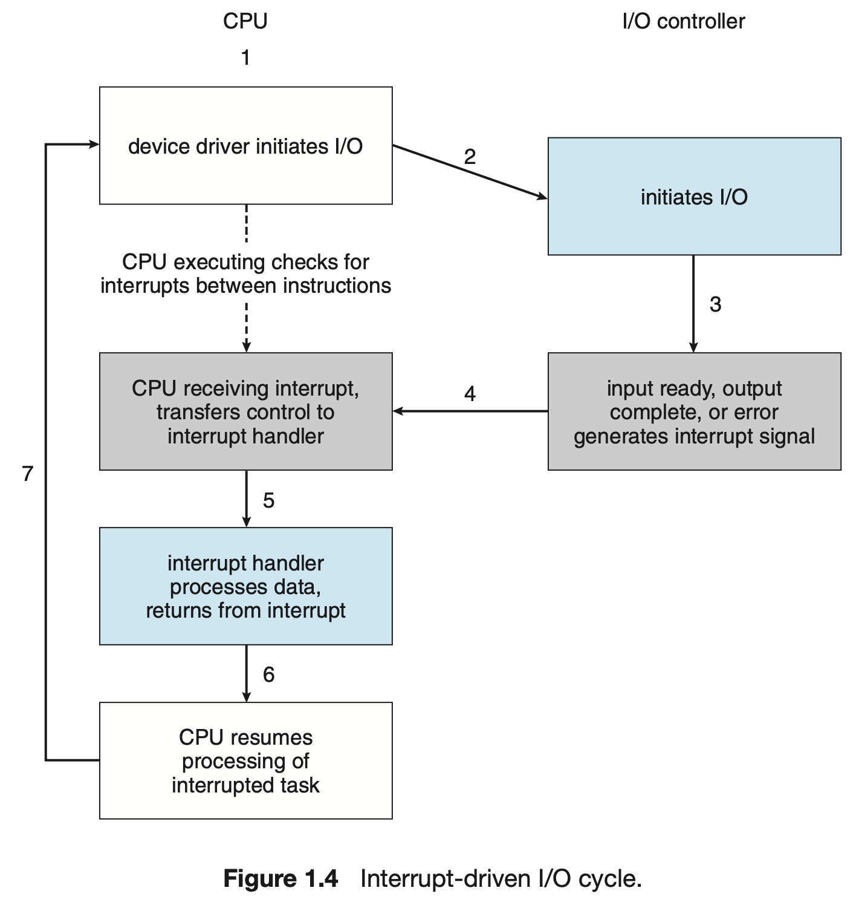

# [OS] Chap 1. Introduction

> Operating System Concepts 10th Edition (a.k.a. 공룡책) - Chap 1을 읽고 정리합니다.

## Operating System

운영체제(OS, Operating System)는 컴퓨터의 하드웨어를 관리하는 소프트웨어로, 하드웨어와 사용자 사이에서 매개체 역할을 한다.

## 1.1 What OS Do

컴퓨터 시스템은 크게 하드웨어, 애플리케이션 프로그램, 유저, 그리고 운영체제의 네 가지 요소로 나눌 수 있다.

하드웨어는 CPU, memory, I/O device 등 시스템에 기본적인 컴퓨팅 자원을 제공한다. 애플리케이션 프로그램은 사용자가 컴퓨팅 문제를 해결하는 방식을 정의한다. 이 때, 하드웨어와 애플리케이션 프로그램 사이에서 하드웨어를 관리하고 사용자들이 애플리케이션 프로그램을 사용할 수 있도록 환경을 제공하는 것이 운영체제의 역할이다.

운영체제는 다시 사용자 관점과 시스템 관점으로 나누어 생각해볼 수 있다.

### 1.1.1 User View

사용자 관점에서 운영체제의 목표는 사용자가 수행하는 일의 퍼포먼스를 최대화하는 것이다. 이를 위해 운영체제는 퍼포먼스와 보안에 좀 더 초점을 맞추도록 디자인되어야 할 것이다.

### 1.1.2 System View

시스템 관점에서 운영체제는 하드웨어와 프로그램을 더 긴밀하게 연결하는 목표를 갖는다. 이러한 맥락에서 운영체제는 자원 할당자의 역할을 한다. 운영체제는 컴퓨터 시스템을 효율적이고 공평하게 운영하기 위해, 각 프로그램과 사용자에게 어떻게 자원을 할당할 지를 결정한다. 또한 운영체제는 제어 프로그램의 역할을 한다. 운영체제는 프로그램이 시스템에 부적절하게 접근하는 것을 방지하고 프로그램에 에러가 발생하는 것을 방지한다.

### 1.1.3 Defining Operating System

하드웨어는 그 자체로는 다루기 쉽지 않기 때문에, 사용자들을 위한 애플리케이션 프로그램이 개발되었다. 이 때, 애플리케이션 프로그램은 I/O 디바이스 관리, 자원 할당 등의 기능을 하드웨어에 요구하게 되는데, 이렇게 애플리케이션 프로그램이 요구하는 공통적인 기능을 한 데 모아 소프트웨어로 구현한 것이 바로 운영체제이다.

운영체제는 하드웨어 위에서 항상 동작하는 단 하나의 프로그램이며, 이것은 커널(kernel)이라고도 불린다. 커널은 운영체제의 핵심이며, 일반적으로 커널은 운영체제와 동일시 되는 경우가 많다.

## 1.2 Computer-System Organization

일반적인 컴퓨터 시스템은 하나 이상의 CPU, 여러 개의 장치 컨트롤러(device controller), 그리고 장치 컨트롤러와 공유 메모리를 연결하는 공통 버스(common bus)로 구성된다. 장치 컨트롤러에는 한 개 이상의 장치들이 연결되어 있다.

일반적으로 운영체제는 각 장치 컨트롤러마다 장치 드라이버를 갖는다. 장치 드라이버는 장치 컨트롤러를 이해하고, 운영체제에 장치에 대한 인터페이스를 제공한다.

### 1.2.1 Interrupts

#### An example: a Program performing I/O

I/O 동작 과정을 살펴 보자. I/O 동작을 시작하기 위해, 장치 드라이버는 장치 컨트롤러로부터 적절한 레지스터를 로드한다. 장치 컨트롤러는 레지스터의 내용을 확인한 후에, 어떤 '키보드로부터 문자 입력 받기' 등 어떤 실행 동작을 취할지 결정한다. 장치 컨트롤러는 장치로부터 데이터를 입력 받아 로컬 버퍼(local buffer)에 먼저 저장하고, 데이터 입력이 끝나면 장치 드라이버에게 동작이 끝났음을 알린다. 장치 드라이버가 운영체제에 제어권을 넘겨주면, 운영체제는 로컬 버퍼의 데이터를 메모리 영역으로 이동시키고, 데이터가 저장된 메모리 위치 등을 반환할 것이다.

이 때, 장치 컨트롤러는 장치 드라이버에게 동작이 끝났다는 것을 어떻게 알릴 수 있을까? 이것은 인터럽트(interupt)에 의해 수행된다.

#### Interrupt Implementation

하드웨어는 시스템 버스를 통해 CPU에 신호를 전송함으로써 인터럽트를 발생시킨다. 인터럽트는 운영체제와 하드웨어가 소통하는 핵심적인 방법이다.

컴퓨터는 여러 작업을 병렬적으로 처리한다. CPU에 인터럽트가 발생하면, CPU는 수행하던 동작을 중단하고 즉시 메모리의 특정 위치로 이동한다. 이 위치는 인터럽트 벡터(interrupt vector)에 저장되어 있으며, 인터럽트 벡터에는 인터럽트를 처리할 수 있는 서비스 루틴의 시작 주소가 저장되어 있다. CPU는 해당 인터럽트를 처리하고, 다시 돌아와 기존에 하던 수행을 계속한다.

컨트롤러가 인터럽트 신호를 발생시키면, 인터럽트 신호들은 CPU의 인터럽트 요청 라인(interrupt request line)에 저장된다. CPU는 인터럽트 요청 라인에 접근하여 인터럽트 인덱스 번호를 읽고, 적절한 인터럽트 벡터로 인터럽트를 보낸다. 인터럽트 핸들러(interrupt handler)는 적절한 서비스 루틴을 수행함으로써 인터럽트를 종결시킨다.

#### Maskable / Non-maskable Interrupt

대부분의 CPU는 두 개의 인터럽트 요청 라인을 갖는다. 첫 번재는 마스크가 불가능한 인터럽트(non-maskable interrupt)로, 복구할 수 없는 메모리 오류 등과 같은 이벤트를 위한 것이다. 두 번째로는 마스크 가능한 인터럽트(maskable interrupt)이며, 이 경우 CPU가 방해할 수 없는 중요한 동작을 수행하고 있을 경우 인터럽트가 처리되지 않을 수 있다.

#### Interrupt Chaining

CPU는 빠른 동작을 위해 인터럽트 벡터에 서비스 루틴을 저장하도 있지만, 실제로 컴퓨터는 인터럽트 벡터 사이즈보다 더 많은 장치를 갖는다. 이 때 인터럽트 벡터에 특정 핸들러 리스트의 head를 저장하는 인터럽트 연결(interrupt channing) 방식을 사용한다. 예를 들어 Intel 프로세서의 인터럽트 벡터는 다음과 같이 설계되어 있다.

#### Interrupt Priority Level

각 인터럽트는 우선순위 레벨을 갖는다. 이 레벨은 CPU가 작업과 인터럽트의 우선순위를 비교하여 수행 순서를 결정하기 위해 필요하다.

