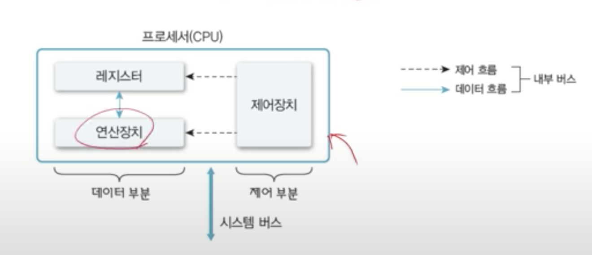
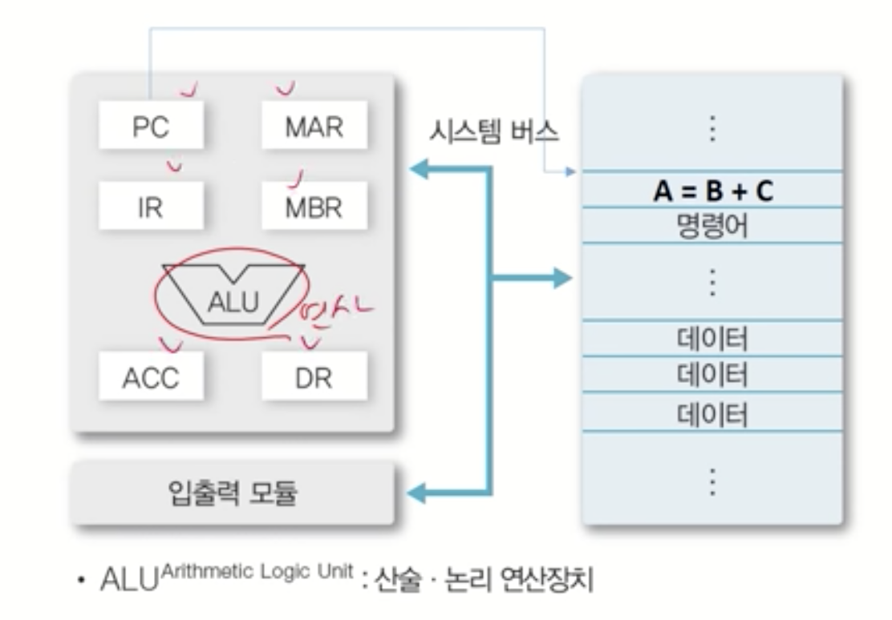
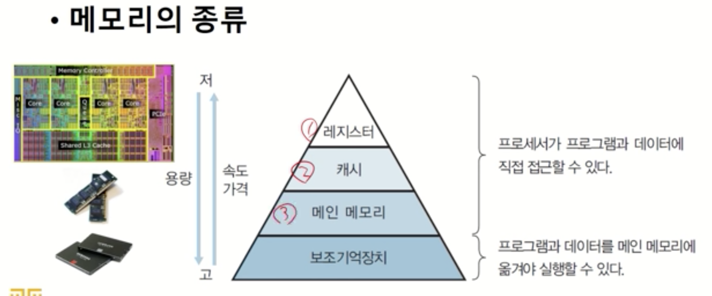
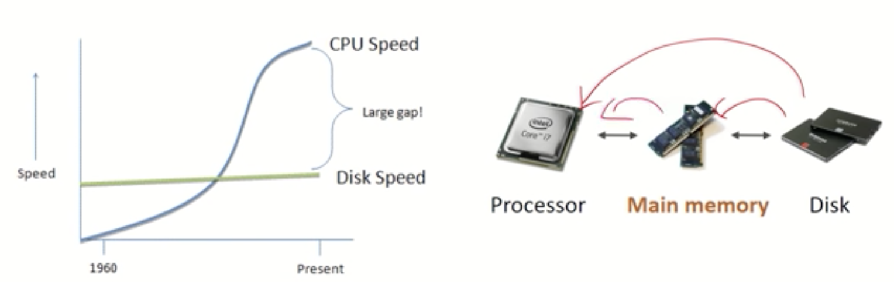
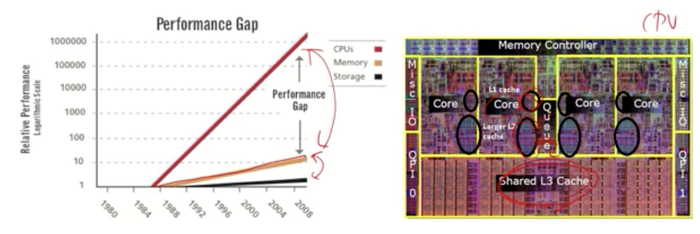
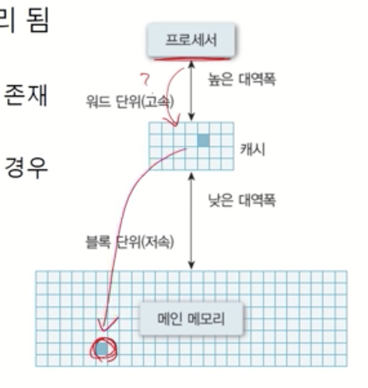
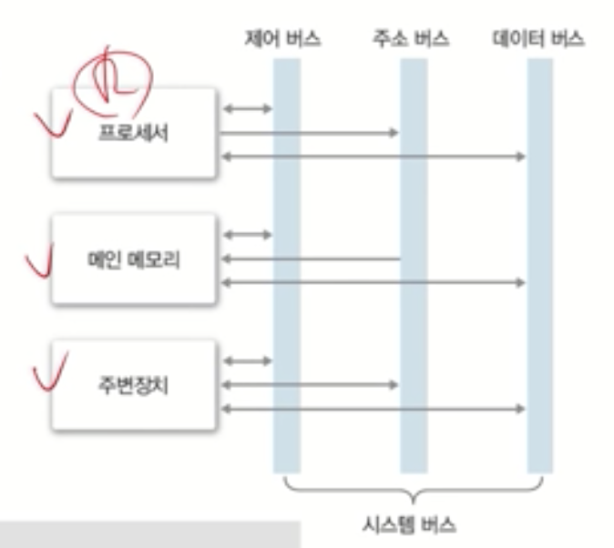
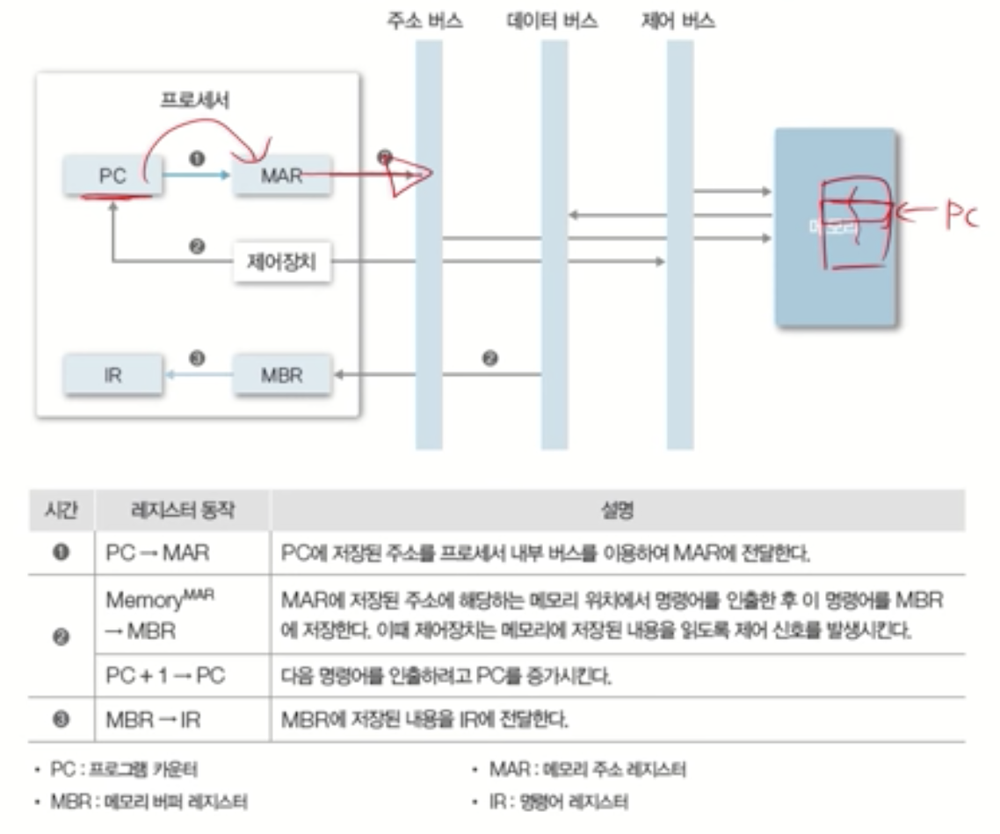

# [OS] CPA310 Lec 1. Computer System Overview

> [김덕수 교수님의 운영체제 강의 - Lec 1.](https://youtu.be/EdTtGv9w2sA)를 보고 정리한 자료입니다.

<!--2021.10.17-->

## 컴퓨터 하드웨어

컴퓨터 하드웨어는 크게 3가지 요소(프로세서, 메모리, 주변 장치)로 구성되어 있다.

- 프로세서: 계산하는 역할
  + CPU, 그래픽카드(GPU), 응용 전용 처리 장치 등
- 메모리: 저장하는 역할
  + 주 기억장치, 보조 기억장치 등
- 주변장치
  + 키보드/마우스, 모니터, 프린터, 네트워크 모뎀 등

## 프로세서(Processor)

프로세서는 컴퓨터의 두뇌로, 중앙처리장치(CPU)라고도 부른다. 다음 그림은 프로세서의 구조를 표현한 그림이다. 프로세서의 연산장치는 연산을 수행하고, 제어장치는 컴퓨터에 연결된 모든 장치의 동작을 제어한다. 참고로 프로세스(Process)는 프로그램의 실행 단위로, 용어가 헷갈리지 않게 주의하자.

### 레지스터(Register)

연산장치와 제어장치 외에, 프로세서에는 레지스터 영역이 존재한다. 레지스터는 프로세서 내부에 있는 메모리로, 프로세서가 사용할 데이터를 저장한다. 레지스터는 컴퓨터에 있는 메모리 중 가장 속도가 빠르다는 특징이 있다.

레지스터의 종류는 카테고리에 따라 다음과 같이 분류된다.
- 용도에 따른 분류: 전용 레지스터, 범용 레지스터
- 사용자가 변경 가능 여부에 따른 분류: 사용자 가시 레지스터,    불가시 레지스터
- 저장하는 정보의 종류에 따른 분류: 데이터 레지스터, 주소 레지스터, 상태 레지스터 

그 중 몇 가지 레지스터에 대해 살펴보자.

#### 사용자 가시 레지스터

- 데이터 레지스터(DR, Data Register)
  + 함수 연산에 필요한 데이터를 저장한다.
- 주소 레지스터(AR, Address Register)
  + 주소나 유효 주소를 계산하는 데 필요한 주소의 일부분을 저장한다.
  + 기준 주소 레지스터
    * 프로그램을 실행할 때 사용하는 기준 주소값을 저장한다. 기준 주소는 하나의 프로그램이나 일부처럼 서로 관련 있는 정보를 저장하며, 연속된 저장 공간을 지정하는 데 참조할 수 있는 주소다. 따라서 기준 주소 레지스터는 페이지나 세그먼트처럼 블록화된 정보에 접근하는 데 사용한다.
  + 인덱스 레지스터
    * 유효 주소를 계산하는 데 사용하는 주소 정보를 저장한다.
  + 스택 포인터 레지스터
    * 메모리에 프로세서 스택을 구현하는 데 사용한다. 많은 프로세서와 주소 레지스터를 데이터 스택 포인터와 큐 포인터로 사용한다. 보통 반환 주소, 프로세서 상태 정보, 서브루틴의 임시 변수를 저장한다.

#### 사용자 불가시 레지스터

- 프로그램 카운터(PC, Program Counter)
  + 다음에 실행할 명령어의 주소를 보관하는 레지스터다. 계수기로 되어 있어 실행할 명령어를 메모리에서 읽으면 명령어의 길이만큼 증가하여 다음 명령어를 가리킨다.

- 명령어 레지스터(IR, Instruction Register)
  + 현재 실행하는 명령어를 보관하는 레지스터다.

- 주산기(ACC, ACCumulator)
  + 데이터를 일시적으로 저장하는 레지스터다.

- 메모리 주소 레지스터(MAR, Memory Address Register)
  + 프로세서가 참조하는 데이터의 주소를 명시하여 메모리에 접근하는 버퍼 레지스터다.

- 메모리 버퍼 레지스터(MBR, Memory Buffer Register)
  + 프로세서가 메모리에서 읽거나 메모리에 저장할 데이터 자체를 보관하는 버퍼 레지스터다. 메모리 데이터 레지스터(MDR)라고도 한다.

### 프로세서 동작

프로세서는 레지스터와 연산장치, 제어장치로 구성되어 있으며, 각 레지스터는 시스템 버스를 통해 메모리에 접근한다.

### 운영체제와 프로세서

운영체제와 프로세서는 어떤 관련이 있을까? 운영체제는 프로세서를 관리하는 역할을 한다. 운영체제는 프로세서에서 처리할 작업을 할당하고 관리하며, 프로그램이 프로세서를 사용하는 방식을 제어한다.

## 메모리(Memory)

메모리는 데이터를 저장하는 기억장치다. 메모리에는 프로그램, 사용자 데이터 등이 저장된다. 메모리는 그 속도와 크기에 따라 크게 레지스터, 캐시, 메인 메모리, 보조기억장치로 나뉜다. 각 메모리 종류에 대해 알아보고, 이렇게 많은 메모리 종류가 필요한 이유에 대해 알아보자.

### 메인 메모리(Main Memory)

메인 메모리는 프로세서가 수행할 프로그램과 데이터를 저장하는 곳이다. 주로 용량이 크고 가격이 저렴한 DRAM을 사용한다. 프로세서는 보조기억장치에 직접 접근할 수 없으며, 데이터와 프로그램에 접근하기 위해서는 해당 데이터를 메인 메모리에 먼저 로드해야만 한다.

역사적으로 디스크의 속도 발전 대비 CPU의 속도 발전이 훨씬 급격하게 이루어졌고, 디스크의 속도와 CPU의 속도 사이에 큰 격차가 발생하게 되었다. 이로 인해 CPU는 빠른데 디스크는 느려서 전체 컴퓨터 시스템의 성능이 저하되는 디스크 입출력 병목현상(I/O bottleneck)이 문제가 되기 시작했다. 메인 메모리는 디스크 입출력 병목현상을 해소하기 위한 아이디어로서 등장했다. 디스크보다 용량은 작지만 속도가 빠른 무언가를 프로세서와 디스크 사이에 둠으로써, CPU가 일하는 동안 필요한 데이터를 미리 가져다 두어 속도 격차를 극복하자는 것이다.

### 캐시

캐시는 프로세서 내부에 있는 메모리다. 캐시도 CPU와 얼마나 가까이 위치하는지에 따라 L1, L2, L3 캐시 등으로 나뉜다. 캐시는 레지스터보다는 코어에서 더 멀리 떨어져 있어 느리지만, 메인 메모리보다 더 빠른 속도를 갖는다.

메인 메모리가 등장한 이유와 동일하게, 캐시는 메인 메모리의 입출력 병목현상을 해소하기 위해 등장했다.

#### 캐시의 동작

캐시는 메인 메모리와 프로세서 사이에 위치하며 프로세서가 더 빨리 데이터에 접근할 수 있도록 돕는다. 프로세서는 메인 메모리에 접근하기 전에 먼저 캐시에 해당 데이터가 있는지를 확인한다. 만약 필요한 데이터 블록이 캐시 영역에 이미 존재한다면, 프로세서는 메인 메모리에 접근하지 않고 바로 고속으로 데이터를 얻을 수 있다. 이렇게 캐시에 필요한 데이터 블록이 존재하는 경우를 캐시 히트(cache hit)라고 부른다.

반면, 필요한 데이터 블록이 캐시에 없는 경우를 캐시 미스(cache miss)라고 한다. 캐시 미스가 발생한 경우, 캐시는 메인 메모리에서 해당 데이터를 찾아 데이터 블록을 캐시 영역에 로드하여 프로세서가 캐시에서 해당 데이터를 참조할 수 있게 한다.

#### 캐시의 지역성(locality)

실제로 캐시는 매우 작은 용량을 갖고 있다. 캐시가 작은 용량으로도 효율적으로 동작하려면, 캐시에 저장할 데이터가 지역성을 가져야 한다. 지역성이란 데이터 접근이 시간적, 혹은 공간적으로 가깝게 일어나는 것을 의미한다.

- 공간적 지역성(spatial locality)
    + 특정 데이터와 가까운 주소가 순서대로 접근되었을 경우를 공간적 지역성이라고 한다. CPU 캐시나 디스크 캐시의 경우 한 메모리 주소에 접근할 때 그 주소뿐 아니라 해당 블록을 전부 캐시에 가져오게 된다. 이때 메모리 주소를 오름차순이나 내림차순으로 접근한다면, 캐시에 이미 저장된 같은 블록의 데이터를 접근하게 되므로 캐시의 효율성이 크게 향상된다.
- 시간적 지역성(temporal locality)
  + 특정 데이터가 한번 접근되었을 경우, 가까운 미래에 또 한 번 데이터에 접근할 가능성이 높은 것을 시간적 지역성이라고 한다.
  + 메모리 상의 같은 주소에 여러 차례 읽기 쓰기를 수행할 경우 상대적으로 작은 크기의 캐시를 사용해도 효율성을 꾀할 수 있다.
- 지역성은 캐시 적중률(cache hit ratio)과 밀접한 연관성을 가지며, 알고리즘 성능 향상을 위한 중요한 요소 중 하나이기도 하다.

### 보조 기억 장치

보조 기억 장치는 프로그램과 데이터를 저장하는 저장 장치다. 프로세서는 보조 기억 장치에 직접 접근할 수 없으며, 반드시 메인 메모리를 거쳐 접근해야 한다. 보조 기억 장치는 용량이 크고 가격이 저렴한 대신 속도가 느리다.

### 메모리와 운영체제

메모리와 운영체제는 어떤 상관관계를 가질까? 운영체제는 메모리를 할당하고 관리하는 역할을 한다. 프로그램의 요청에 따른 메모리 할당과 회수 작업을 수행한다. 또한 프로그램이 잘못된 방식으로 메모리에 접근하지 않도록 할당된 메모리를 관리하는 역할도 한다.

운영체제는 가상 메모리를 관리하기도 하는데, 가상 메모리란 하드 디스크의 영역을 메인 메모리처럼 사용하는 것을 말한다. 만약 실행해야 하는 프로그램의 크기가 너무 커 메인 메모리에 로드할 수 없다면, 하드 디스크에 가상 메모리 공간을 만들어 메인 메모리처럼 사용하게 된다. 따라서 운영체제는 논리 주소를 물리 주소로 변환시키는 등의 작업을 수행하며 가상 메모리를 생성하고 관리한다.

## 시스템 버스

시스템 버스란, 하드웨어들이 데이터 및 신호를 주고받는 물리적인 통로를 말한다. 제어 버스, 주소 버스, 데이터 버스 등이 해당된다.

- 데이터 버스
  + 프로세서와 메인 메모리, 주변장치 사이에서 데이터를 전송한다. 데이터 버스를 구성하는 배선 수는 프로세서가 한 번에 전송할 수 있는 비트 수를 결정하는데, 이를 워드라고 부른다.
- 주소 버스
  + 프로세서가 시스템의 구성 요소를 식별하는 주소 정보를 저장한다. 주소 버스를 구성하는 배선 수는 프로세서와 접속할 수 있는 메인 메모리의 최대 용량을 결정한다.
- 제어 버스
  + 프로세서가 시스템의 구성 요소를 제어하는 데 사용한다. 제어 신호로 연산 장치의 연산 종류와 메인 메모리의 읽기, 쓰기 동작을 결정한다.

### 시스템 버스의 동작

시스템 버스는 프로세서와 메모리 사이에서 데이터를 전달하는 역할을 한다. 아래 예시 그림에서, 프로그램 카운터(PC)는 다음 명령어를 위해 저장된 주소를 내부 버스를 이용하여 메모리 주소 레지스터(MAR)에 저장한다. MAR이 주소 데이터를 시스템 버스로 보내면, 시스템은 메모리의 특정 주소에 접근하여 명령어를 인출할 수 있다. 인출한 명령어는 다시 시스템 버스를 거쳐 메모리 버퍼 레지스터(MBR)에 저장된 후, 현재 명령어를 저장하는 명령어 레지스터(IR)에 최종적으로 전달될 수 있다.

## 주변 장치

프로세서와 메모리를 제외한 하드웨어들을 주변 장치라고 부른다. 키보드/마우스, 모니터, 프린터, 네트워크 어댑터 등이 주변 장치에 해당한다.

### 주변 장치와 운영체제

운영체제의 중요한 역할 중 하나는 주변 장치를 조작하는 일이다. 만약 운영체제가 없다면 각 애플리케이션이 직접 장치를 조작하는 코드를 작성해야만 한다. 이러한 단점을 극복하기 위해 운영체제는 장치 드라이버라고 하는 프로그램을 사용하여 장치를 다룬다. 각 프로세스는 장치 드라이버를 통해서만 장치를 조작할 수 있다.

### 커널

만약 특정 프로세스가 '디바이스 드라이버를 통해 디바이스에 접근함'이라는 규칙을 깨면 어떻게 될까? 아마 멀티 프로세스가 동시에 디바이스를 조작하려고 시도하는 상황이 발생할 것이다. 운영체제는 이러한 문제를 피하고자 CPU에 있는 '커널 모드'를 이용하여 프로세스가 직접 하드웨어에 접근하는 것을 차단한다.

CPU는 크게 커널 모드와 사용자 모드라는 두 가지 모드가 존재하며, 커널 모드로 동작할 때만 장치에 접근할 수 있다. 장치 드라이버는 커널 모드로 동작하고, 프로세스는 사용자 모드로 동작한다.

디바이스 조작 외에도 프로세스 스케줄링, 메모리 관리 등 일반적인 프로세스로 실행하면 문제가 되는 중요한 수행이 있는데, 이러한 처리들도 커널 모드에서 동작한다. 이렇게 커널 모드에서 동작하는 운영체제의 핵심 부분이 되는 처리를 전담하는 프로그램을 '커널'이라고 부른다.

프로세스가 장치 드라이버를 포함하나 커널의 기능을 사용하려고 할 때는 '시스템 콜'이라는 특수한 처리를 통해 커널에 요청을 보낸다.

## Reference

- [김덕수 교수님의 운영체제 강의 - 1강](https://youtu.be/EdTtGv9w2sA)
- [실습과 그림으로 배우는 리눅스 구조](http://www.yes24.com/Product/Goods/69660412)