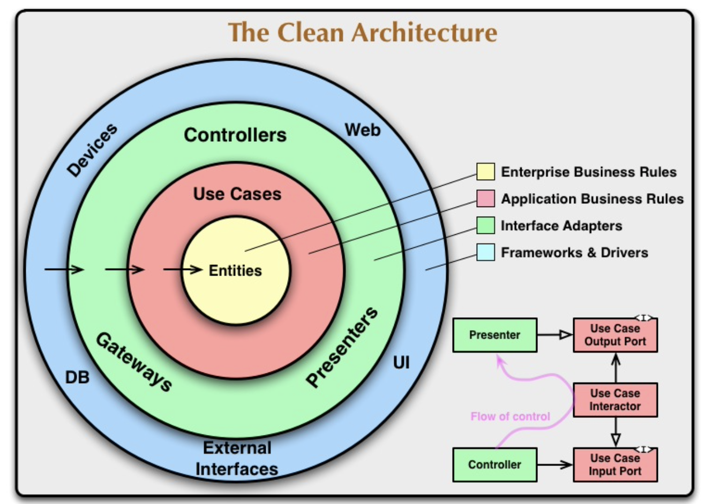

# 2021.09

## 9/15 (Wed)

### Alfred Configuration

Alfred에 workflow 들을 설치했다. 맥을 4년째 쓰면서 편리한 기능들을 전혀 활용하지 못하고 있었다는 걸 최근에 많이 느낀다. 생산성을 높이기 위해 의식적으로 노력해야겠다는 생각을 하게 된다.

### NPM(Node Package Manager)

Alfred workflow를 다운받다 보니, npm 명령어로 workflow를 설치하는 경우가 많아서 찾아보게 됐다. 

1. **NPM이란?**

    NPM은 (Node Package Manger)의 약자로, 명령어로 자바스크립트 라이브러리를 설치하고 관리하는 패키지 매니저다.   

2. **NPM 설치 방법**

    node.js를 설치하면 자동으로 npm이 함께 설치된다.

    - 설치 링크: https://nodejs.org/en/

    terminal에서 아래 명령어가 잘 동작하면 정상적으로 설치된 것이다.

    ```
    npm -v
    ```

3. **NPM 설치 관련 기본 명령어**

    ```npm init```: package.json을 만드는 명령어. 새로운 프로젝트나 패키지를 만들 때 사용한다.

    ```npm install```: 새로운 패키지를 설치하는 명령어

    - ```npm install + 패키지 명 (+ @ + 버전)```: 특정 패키지 다운로드 (버전 지정 옵션)

    - ```npm install + 주소```: 특정 주소에서 다운로드

    ```npm update```: 패키지 버전 업데이트

### Clean Architecture

소프트웨어를 설계하는 방법을 공부하기 위해 클린 아키텍처 책을 구입했다. 책이 배송되는 동안 아래 블로그들을 보며 클린 아키텍처가 무엇이고 왜 필요한지 등의 대략적인 내용만 파악했다. 자세한 사항은 공부하면서 정리해보려고 한다.

- 원문: 
https://blog.cleancoder.com/uncle-bob/2012/08/13/the-clean-architecture.html   

- 도움이 된 블로그   
    - https://joonfluence.tistory.com/322   
    - https://zeddios.tistory.com/1065   


1. **클린 아키텍처란?**   

    소프트웨어 아키텍처란 소프트웨어를 구성하고 설계하는 기본 원칙으로, 좋은 소프트웨어를 만들기 위해서는 좋은 아키텍처가 필요하다. 좋은 소프트웨어란 유연한 소프트웨어를 말하며, 기능과 환경을 쉽게 변경할 수 있도록 아키텍처를 설계해야한다고 한다.

2. **클린 아키텍처 구조**   
   
    
   
    - Each circles   
        - **Entity**: "Enterprise wide business rules" 를 캡슐화한 요소로, 외부에 변화가 있을 때 변경될 가능성이 가장 적어야 한다. 일반적으로 가장 높은 수준의 규칙을 캡슐화 합니다.
        - **Use Cases**: 시스템의 동작을 사용자의 입장에서 표현한 기능으로, 비즈니스 로직을 결정한다. 예를 들어, 검색 앱이라고 한다면 사용자가 검색 창을 누르고 검색을 하는 동작이 Use case에 해당된다. Use case는 엔티티를 알고 있지만, 그 바깥에 있는 DB, UI 등 외부 환경에 대해서는 전혀 영향을 받지 않는다.
        - **Interface Adapters**: Entities, Use cases 등 내부 시스템에서 익숙한 포맷에서 외부 프레임워크에서 요구하는 포맷으로 데이터를 변환하는 계층이다.
        - **Frameworks & Drivers**: Flutter, Angular 등 프레임워크가 이 계층에 해당된다.   
   
    - Dependency Rules
        - 소스코드 종속성은 outer -> inner 방향으로만 향할 수 있다.
        - inner circles 안에 있는 것들은 outer circles에 대해 아무것도 알 수 없다.
        - 특히, outer circles에 선언된 이름은 inner circles에서 언급해서는 안된다. (함수, 클래스 등등)

## 9/16 (Thur)

### MAC 단축키, 노션 단축키

최대한 트랙패드 없이 단축키와 Alfred 등으로 맥을 사용할 수 있도록 연습 중이다. 트랙패드도 충분히 편한데 굳이 단축키들을 익혀야해? 라고 생각했는데, 막상 단축키를 쓰니 굳이 시간을 들일 가치가 있는 일이었다. 

### Clean Architecture 학습

클린 아키텍처 책 공부를 시작했다. 아래 내용을 학습하고 정리했다. 

  * [#1 소프트웨어 아키텍처의 필요성](/Architecture/CleanArchitecture/01_Introduction.md)
  * [#2 프로그래밍 패러다임](/Architecture/CleanArchitecture/02_Programming_Paradigm.md)

소프트웨어 아키텍처가 왜 필요하고 어떤 가치에 집중해야 하는지, 그리고 세 가지 프로그래밍 패러다임을 학습하며 아키텍처 설계에서 중요하게 고려해야할 사항은 무엇인지 배울 수 있었다.

## 9/17 (Fri)

### Binary Search

자료구조 복습할 겸 리트 코드 문제를 꾸준히 풀어보려고 한다. 오늘은 이진 탐색 개념을 정리하고 간단한 문제를 세 개 풀었다. 각각 아래 페이지에 정리해 두었다.

* [Binary Search](Algorithm/BinarySearch/README.md)
* [Leetcode 33. Search in Rotated Sorted Array (C++)](/Algorithm/BinarySearch/Leet_Medium_Binary_Search_33.md)
* [Leetcode 34. Find First and Last Position of Element in Sorted Array (C++)](/Algorithm/BinarySearch/Leet_Medium_Binary_Search_34.md)
* [Leetcode 74. Search a 2D Matrix (C++)](/Algorithm/BinarySearch/Leet_Medium_Binary_Search_74.md)

