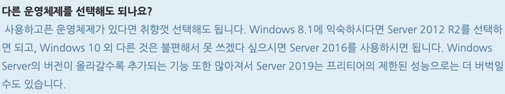

# #1 AWS 무료 Windows 서버 생성하기 (AWS 프리 티어)

자동매매 프로그램을 개발하기 위해서는 증권사 API 연동이 필수적인데, 증권사 API는 Windows 에서만 사용할 수 있다. MAC 환경에서 개발하기 위해서는 별도의 Windows 서버가 필요했고, 클라우드 서비스를 이용하기로 결정했다.

## AWS 프리 티어 소개

AWS에 계정을 새로 만들면 프리 티어로 12개월간 무료 서버를 사용할수 있다. 무료 서버는 CPU 1 Core, MEM 1GB, SSD 30GB 사양의 가상 서버를 사용할수 있는데, Windows Server OS를 지원한다. 성능은 좋지 않지만, 우선 Windows 서버 구축에 대한 다른 방안을 마련하기 전까지는 이 서버를 사용해보려고 한다.

컴퓨팅 환경을 제공하는 EC2의 프리 티어 조건은 다음과 같이 월별 750시간 사용으로 제한된다. 자원 사용량에 따라 내가 사용한 시간이 늘어날 수 있으니 가상 서버를 사용하지 않을 때는 가급적 꺼두는 것이 좋다.

## AWS 계정 생성하기

[AWS 홈페이지](https://aws.amazon.com/ko/)에서 계정을 만든다. 결제 정보를 입력하면 카드로 100원이 결제되는데, 바로 환불되기 때문에 걱정하지 않아도 된다.

## 가상 서버 생성하기

### Amazon EC2 시작하기

- 가상 서버 생성을 위해서 AWS 홈페이지에서 제품 > Amazon EC2 페이지로 이동한다.
- Amazon EC2 시작하기 버튼을 클릭한다.

### 지역 설정 및 인스턴스 생성

- 먼저 우측 상단의 지역을 개발 환경과 가까운 위치로 설정 해준다.
    + 선택된 지역에서 가장 가까운 데이터센터에 EC2가 생성되기 때문에, 쾌적한 사용을 위해서 지역 설정은 매우 중요하다.
- 하단의 인스턴스 생성을 클릭한다. 인스턴스는 우리가 생성할 가상 서버를 의미한다.

### 인스턴스 구성

#### 1. Amazon Machine Image(AMI) 선택

- 좌측 하단의 `프리 티어만`을 체크하면 프리 티어에서 사용할 수 있는 이미지를 확인할 수 있다.
- Windows 서버 생성을 위해 `MS Windows Server 2012 R2 Base` AMI를 선택했다.
        
    
        
- Windows Server 2019 대신 Windows Server 2012 R2를 선택한 이유는 다음과 같다. Windows 버전이 높을수록 사용자 편의를 위한 기능이 많기 때문에, 저사양의 프리 티어 서버 성능으로는 오히려 더 버벅일 수가 있다. 그래서 Windows 8 수준에 해당되는 Windows Server 2012를 선택했다.

    
        
#### 2. 인스턴스 유형 선택

- 프리 티어에서는 t2.micro 유형을 선택할 수 있다.
- 체크 후 `다음: 인스턴스 세부 정보 구성`을 클릭하자.

    

#### 3. 인스턴스 스토리지 구성

- 스토리지는 최대 30GB까지 사용할 수 있다.
    
    
    
#### 4. 인스턴스 태그 추가

- 여기에 추가하는 태그로 인스턴스 이름을 구분할 수 있으므로 꼭 추가해주자.
    
    
    
#### 5. 인스턴스 보안 그룹 구성

- RDP 유형에서 TCP 3389 포트를 열어야 서비스를 사용할 수 있다.

    
    
#### 6. 검토

- 검토 후 `시작하기` 버튼을 누른다.

    

### 키 페어 생성

RDP 등을 사용해서 서버에 접속할 때 사용할 암호를 생성하는 과정이다. 키 페어를 다운받아 개인 PC에 저장해 둔다. 분실시 재발급이 안되므로 저장 위치를 잘 기억해두자.

- 새 키 페어 생성 선택 → 키 페어 이름 작성 → 키 페어 다운로드 클릭 → 인스턴스 시작

    

### 인스턴스 생성 완료

## 인스턴스 생성 확인

다음과 같이 인스턴스가 실행중인 것을 확인할 수 있다.

