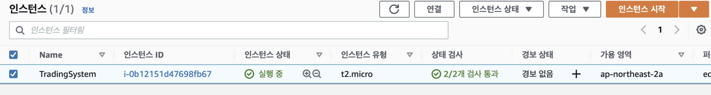
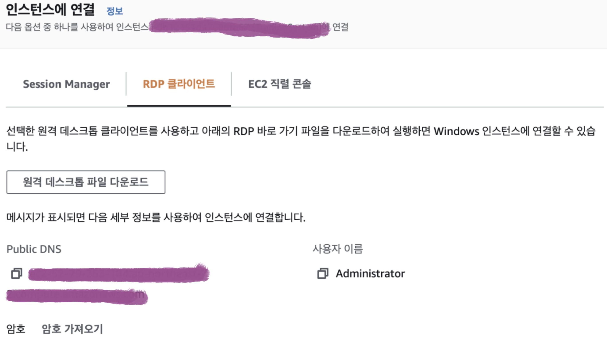
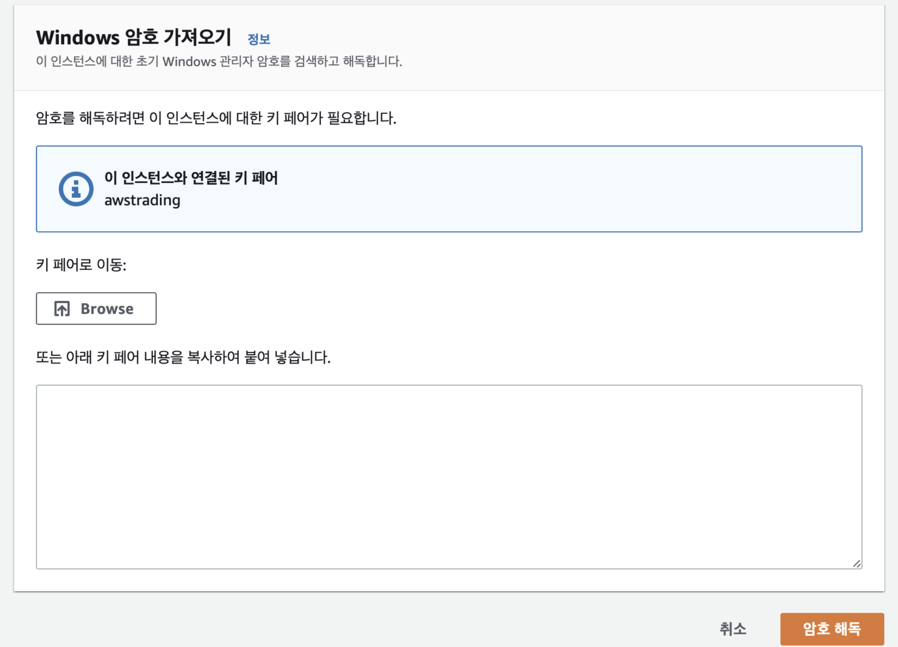
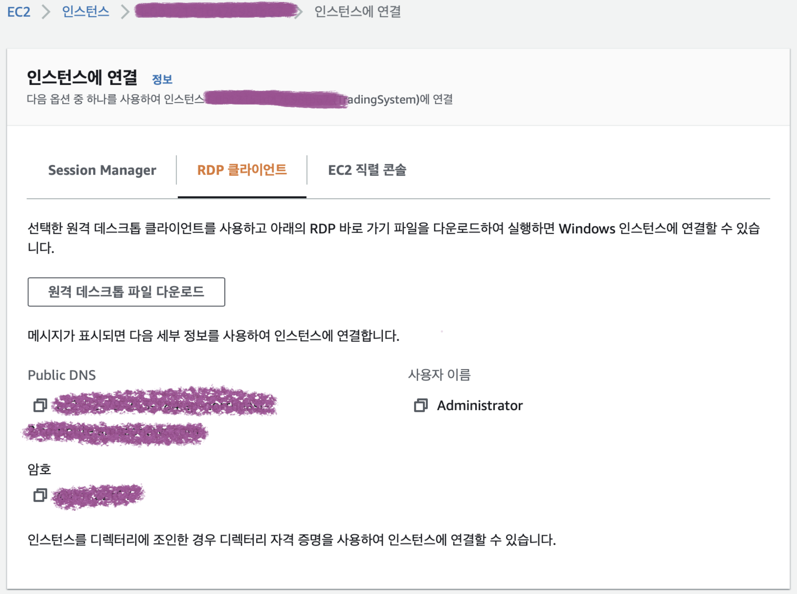
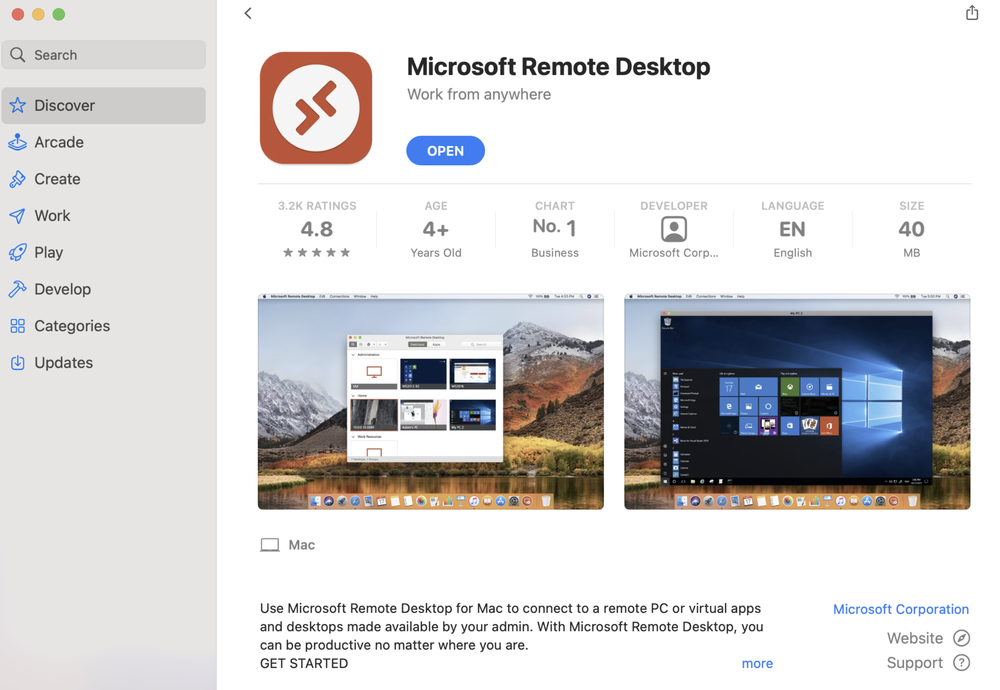
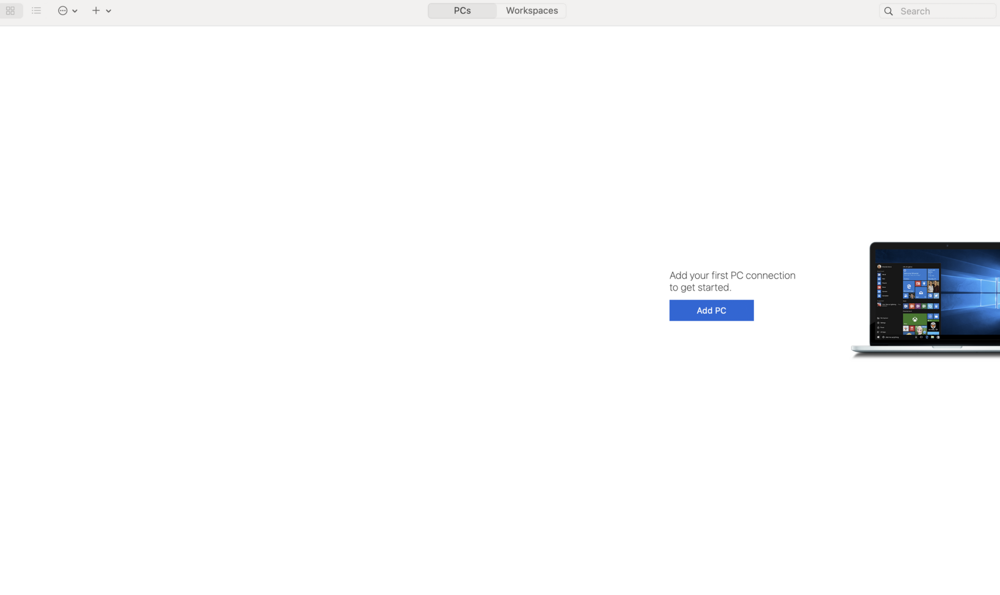
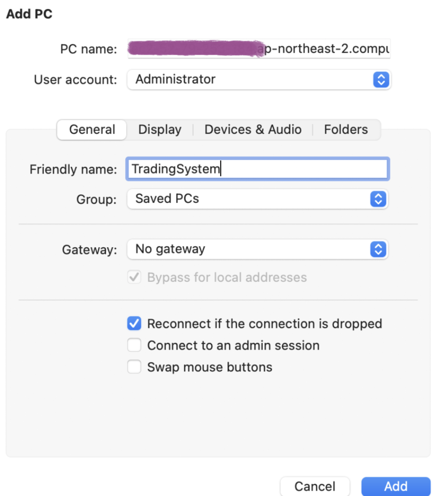
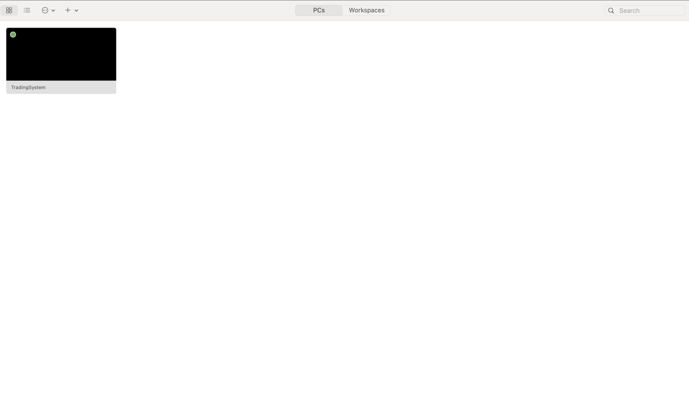
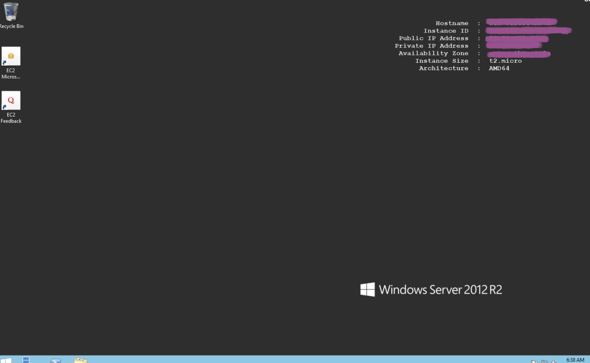

# #2 MAC에서 AWS 서버에 접속하기

MAC에서 AWS Windows 서버에 접속할 수 있는 방법에 대해 알아보자.

## AWS 인스턴스 연결 설정

- 생성한 인스턴스를 체크하고 상단의 `연결` 버튼을 클릭한다.
    

    
- 카테고리 중 `RDP 클라이언트`를 클릭하면 다음과 같은 화면이 보인다.
    + `암호 가져오기` 버튼을 클릭한다.
    

    
- Browse 버튼을 클릭하여 인스턴스를 생성할 때 발급받은 키 페어 파일을 업로드한다. 업로드 후 `암호 해독` 버튼을 클릭한다.
    

    
- 암호가 발급된 것을 확인할 수 있다.
    

    

## MAC에 RDP 애플리케이션 설치

App Store 에서 Microsoft Remote Desktop 애플리케이션을 설치한다.

## Remote Desktop 실행

- Microsoft Remote Desktop을 실행하고 Add PC 버튼을 클릭한다.

- PC name 및 User account 정보를 입력한 후 Add 버튼을 누른다.
    + PC name에 AWS에서 발급 받은 도메인 이름을 입력한다.
    + User account는 AWS에서 발급 받은 아이디와 비밀번호를 입력한다.

- Windows 서버 추가 완료된 모습이다.

    

## Windows Server에 원격 접속

RDP 애플리케이션에서 생성한 PC를 더블 클릭하면 서버에 원격 접속할 수 있다.

