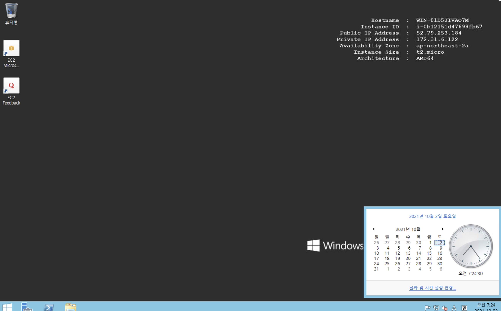
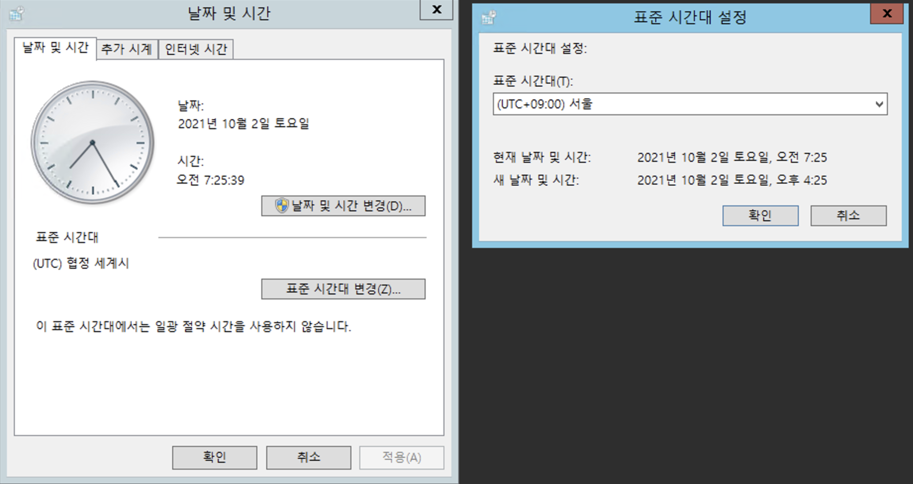

# #3 Windows 서버 초기 환경 설정

AWS Windows 서버를 처음 생성하면 기본 환경 설정이 필요하다. 언어, 지역, 시간, IE 환경을 설정해보자.

## 언어 설정

- `시작` 버튼을 클릭하고 `제어판(Control Panel)` 버튼을 클릭한다.

- 제어판에서 `Add a language` 클릭 후 `Add a language` 을 클릭한다.

- `Korean(한국어)` 를 선택 후 `Add` 버튼을 누른다.

- 추가된 한국어 행을 선택하고 우측의 `Options` 버튼을 클릭한다.

- Options에서 `Download and install language pack` 을 클릭하여 설치를 진행한다.

  + 설치 중 아래 화면에서 매우 긴 시간이 소요되는데, 정상적인 상황이니 기다리면 된다. (매우.. 오래걸림...)

- 설치가 완료되면 `Move up` 버튼을 눌러 한국어를 가장 상단로 올린다.

- 왼쪽 메뉴에서 `Advanced settings`을 클릭 후 언어 세팅을 모두 한국어로 변경해준다.

- 로그오프 후 재 접속하면 다음과 같이 시스템이 한국어로 변경된 것을 확인할 수 있다.

## 지역 설정

- 위와 동일한 언어 설정 화면에서 왼쪽 메뉴의 `날짜, 시간 또는 숫자 형식 변경` 을 클릭한다.

   

- 형식: `한국어(대한민국)` 선택
    
    
    
- 위치: `대한민국` 선택
 
   
 
- 관리자 옵션: `설정 복사` 를 클릭한 후 `적용`을 클릭한다.

    
- `체크박스를 모두 선택`하고 `확인` 버튼을 누른다. 한 가지 더 설정 해야하니 아직 재부팅은 하지 말자.
    

    
- 관리자 옵션: `유니코드를 지원하지 않는 프로그램용 언어` → `시스템 로캘 변경` 클릭 → 한국어로 설정 변경

- `확인` 버튼을 누른 후 서버를 재부팅한다.

## IE 보안 설정 해제 및 홈페이지 설정

- 하단 작업 표시줄에서 시작 버튼 바로 오른쪽에 있는 `서버 관리자`를 실행한다.
- 왼쪽 메뉴 중 `로컬 서버`로 이동 후 `IE 보안 강화 구성` 를 클릭한다.

- 두 가지 옵션 모두 `사용 안 함`으로 설정 후 저장한다.

- 인터넷 익스플로어를 켜면 다음과 같이 보안 강화에 대한 페이지가 기본 홈페이지로 설정되어 있다.

- IE 우측의 `설정` 버튼 클릭 → `인터넷 옵션` 클릭 → 홈 페이지 변경

## 시간 설정

- 우측 하단의 시간 정보 클릭 → `날짜 및 시간 설정 변경` 클릭

- 표준 시간대 변경 → (UTC +09:00) 서울 클릭 → 확인

## 시간 동기화

표준 시간대를 설정했음에도 불구하고 컴퓨터 내부 신호처리에 의해 PC의 시간이 실제 표준 시간보다 몇 초 느려질 가능성이 있다. 다음과 같이 시간 동기화 프로그램을 다운받아 주기적으로 시간을 동기화해주자.

- AWS 서버에서 한국표준과학연구원 사이트에 접속한다.
    + [http://www.kriss.re.kr/](http://www.kriss.re.kr/standard/view.do?pg=standard_set_01)
- 표준 이야기 → 표준 시각 맞추기 클릭

- 표준 시각 맞추기 동기 프로그램을 다운받고 설치한다.

- 애플리케이션에 UTCk3.1이 설치된 것을 확인할 수 있다. 우클릭하여 시작 화면에 고정시키자.

- 앱 선택 후 우클릭 → 파일 위치 열기 클릭

- 파일을 복사 후 바탕화면에 붙여넣기한다.

- 파일 실행
    + 다음과 같이 내 PC가 얼마나 더 빠른지 알려준다. `동기` 버튼을 눌러 시간을 동기화할 수 있다.

