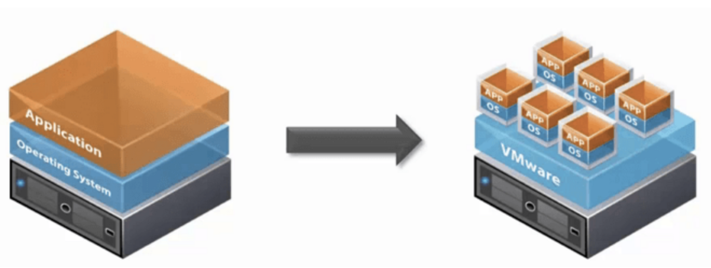
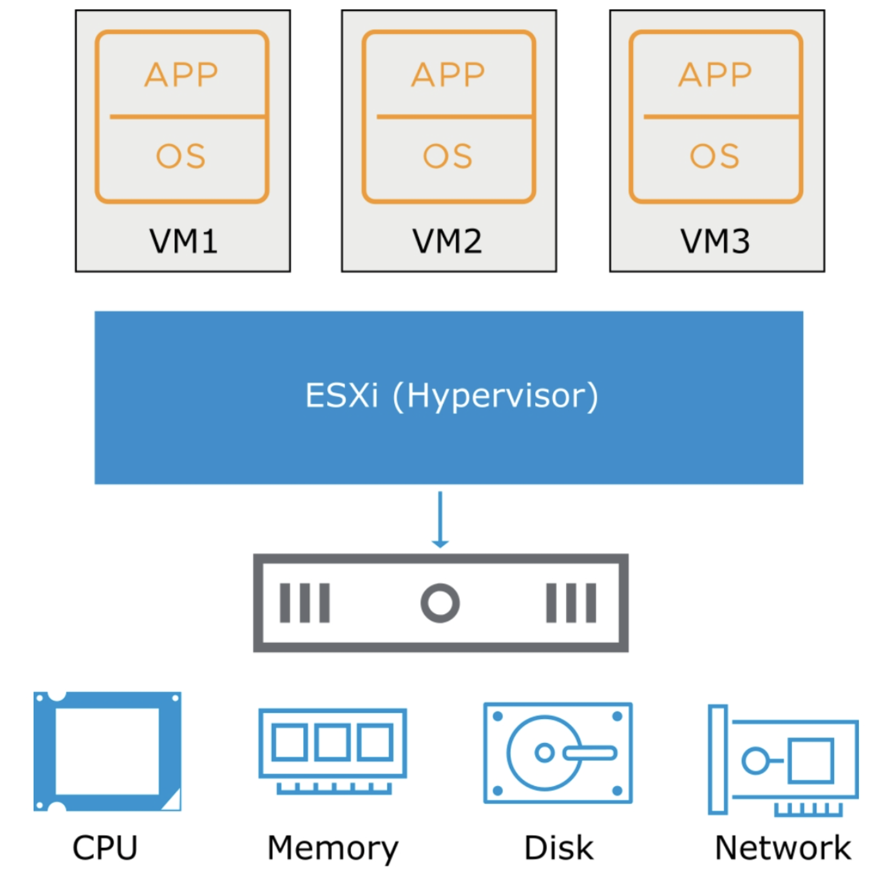
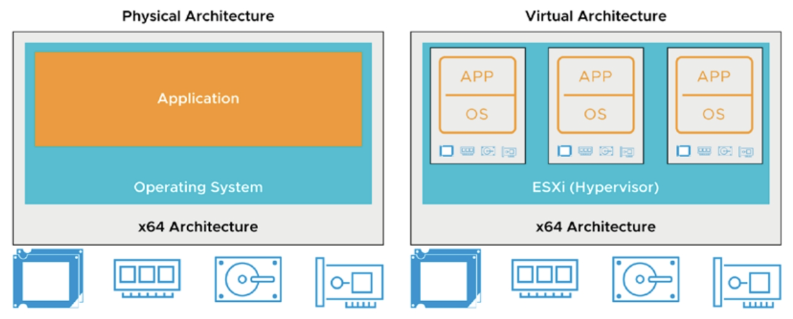
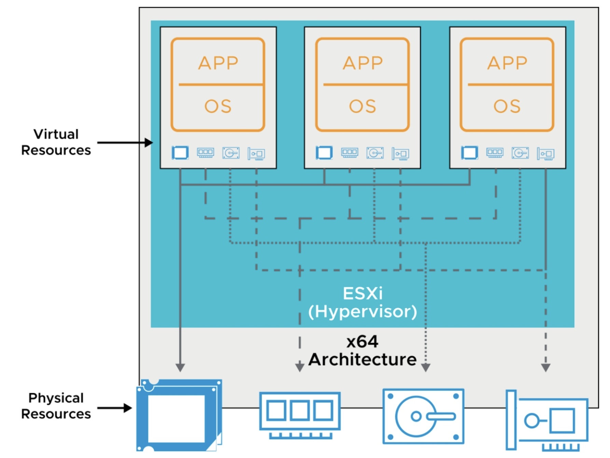
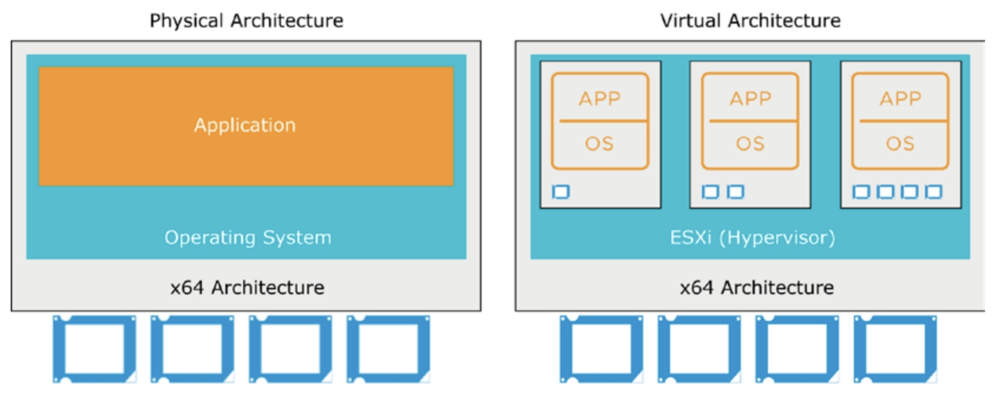
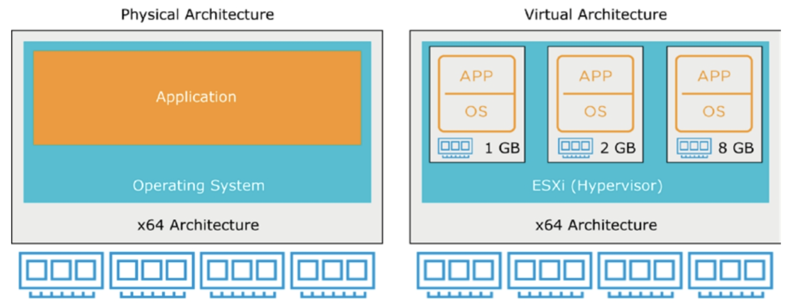
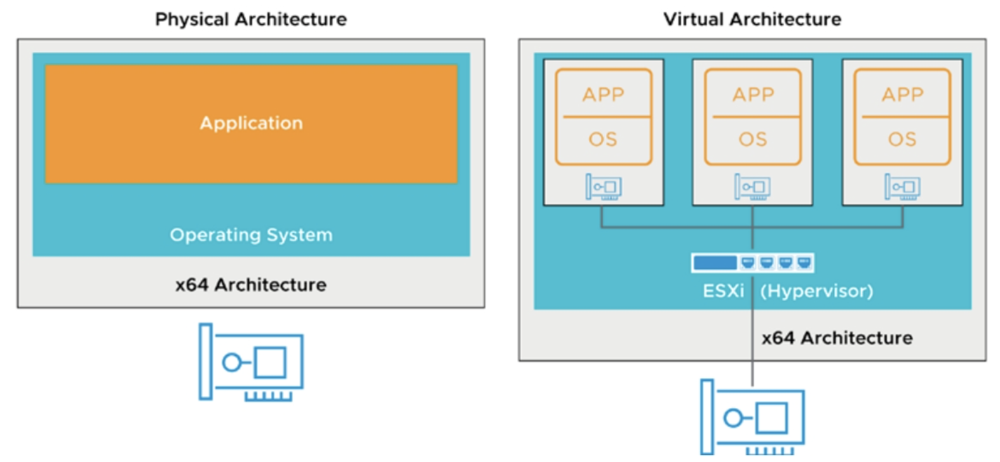
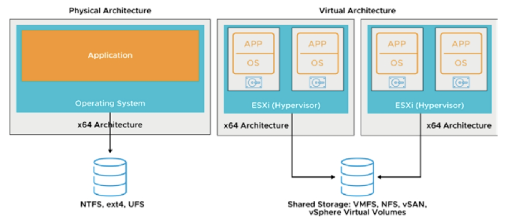

# 2-1. Virtualization Concepts

> vSphere Install, Configure, Manage [V7] Lecture Note  
> Module 2. Introduction to vSphere and SDDC

가상화 및 vSphere에 대한 기본 개념을 정리하자.

## 가상화란?

 가상화란 (1) 컴퓨팅 리소스를 추상화시켜서 (2) 하나의 물리 리소스를 여러 개의 논리 리소스처럼 기능 시키거나 (3) 여러 개의 물리 리소스를 하나의 논리 리소스처럼 기능하게 하는 것이다. CPU, 메모리,스토리지, 네트워크 등으로 대부분의 컴퓨팅 리소스가 가상화의 대상이 된다.
 
 ## VM(Virtual Machine)이란?

 하드웨어 리소스를 추상화하여 소프트웨어로 논리적으로 구현한 컴퓨터

 vSphere 제품 기준으로 VM의 구성요소는 다음과 같다.
 - Guest OS
 - VMware Tools
 - Virtual Resources
    - CPU and memory
    - Network adapters
    - Disks and controllers
    - Parallel and serial po

## VM의 장점

- 이동과 복사가 쉽다. (이동성, 확장성, 유연함)
- 같은 물리 하드웨어 위에서 동작하더라도 각 VM들은 서로 격리되어 있어, 각 VM의 장애가 다른 VM에 영향을 주지 않는다.
- 하나의 물리적 컴퓨터에서 여러 운영 체제 환경을 실행할 수 있다.

## 하이버파이저(Hypervisor)란?

 전통적인 아키텍쳐에서 컴퓨터 OS는 하드웨어와 직접 상호작용했다. OS는 여러 프로세스를 스케쥴링하고, 어플리케이션에 리소스를 할당하고, 네트워크 인터페이스를 관리하고, 스토리지에서 데이터를 읽고 쓰는 등 소프트웨어와 하드웨어 사이의 인터페이스 역할을 담당했다.

 이와 유사하게, 가상화 아키텍쳐에서 호스트 서버와 각 VM 사이에서 인터페이스 역할을 하는 얇은 계층을 우리는 가상화 계층 또는 하이퍼바이저라고 부른다.

 하이퍼바이저의 역할은 다음과 같다.
 - VM 관리 (생성, 삭제, 이동 등)
 - 하드웨어 리소스를 각 VM에 동적 할당 및 스케쥴링
 - VM의 I/O 요청을 하드웨어에 전달
 - 네트워크, 스토리지 등의 리소스 관리

## 가상화의 종류

### 서버 가상화

서버 가상화는 물리적 서버를 여러 개로 분리된 고유한 가상 서버로 나누는 것이다. 물리 CPU, 메모리는 추상화되어 각 VM에 동적으로 할당된다. 각 가상 서버는 독립적인 OS를 가질 수 있다.

### 네트워크 가상화

네트워크 가상화는 기존에 하드웨어로 제공되던 네트워크 리소스를 소프트웨어로 추상화하는 것이다. 여러 물리적 네트워크를 하나의 소프트웨어 기반 가상 네트워크로 결합하거나, 하나의 물리적 네트워크를 별도의 독립적인 가상 네트워크로 나눌 수 있다.

VM은 하나 이상의 가상 이더넷 어댑터를 갖게 되고, 가상 스위치를 사용하여 가상화 환경 내의 다른 호스트와 통신한다.

### 스토리지 가상화

스토리지 가상화는 여러 대의 네트워크 스토리지 장비들을 한 개의 스토리지로 보이게 하거나, 한 개의 스토리지 장비를 여러 대의 스토리지 장비로 보이게 하는 것을 말한다. 또한 가상 환경에서는 여러 호스트들이 한의 데이터 스토어를 공유함으로써 리소스 활용률을 높이고 가용성을 높일 수 있다.

### 데스크탑 가상화

데스크톱 가상화는 사용자 워크스테이션을 시뮬레이션하여 연결된 기기에서 원격으로 액세스할 수 있도록 하는 방식이다. 사용자 데스크톱을 추상화하면 거의 모든 위치에서 자신의 워크스테이션에 접근할 수 있다.

- VDI(Virtual Desktop Infrastructure)
    - VDI는 VM을 이용하여 가상 데스크탑을 제공하고 관리하는 것을 의미한다. VDI는 중앙 집중식 서버에서 모든 데스크탑 환경을 호스트하며, 사용자 요청 시 데스크탑 환경을 최종 사용자에게 배포한다. 
    - VDI에서는 하이퍼바이저가 서버를 VM으로 세분화하고, VM은 가상 데스크탑을 호스팅하며, 사용자는 각자의 기기를 통해 가상 데스크탑에 원격으로 접근한다. 사용자는 장소와 기기에 구애받지 않고 가상 데스크톱에 접근할 수 있고, 모든 처리는 호스트 서버에서 이루어진다.
    - 사용자는 연결 브로커를 통해 데스크톱 인스턴스에 접속한다. 연결 브로커는 소프트웨어 기반 게이트웨이로서 사용자와 서버 사이에서 중개자 역할을 한다.

- RDS(Remote Desktop Service)
    - Windows 서버에 여러 계정을 생성하고, 서로 다른 사용자가 동시에 접속하여 서버 자원을 나눠 쓰는 방식
    - 전체 데스크톱이 아닌 제한된 수의 애플리케이션을 가상화해야 하는 경우에 주로 사용된다.

## SDDC(Software Defined Data Center)란?

SDDC란 모든 인프라가 가상화되어 데이터 센터가 소프트웨어에 의해 자동화되는 것을 말한다. SDDC에서 모든 리소스는 물리 영역에서 가상화되어 파일로 추상화된다.