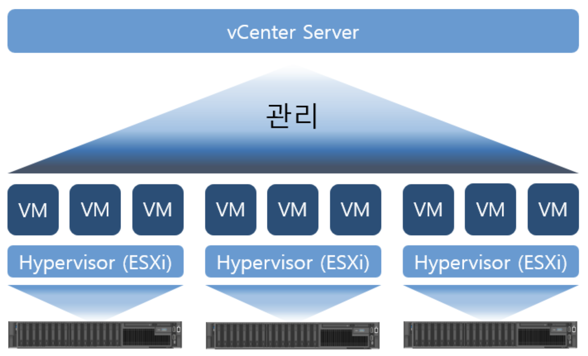
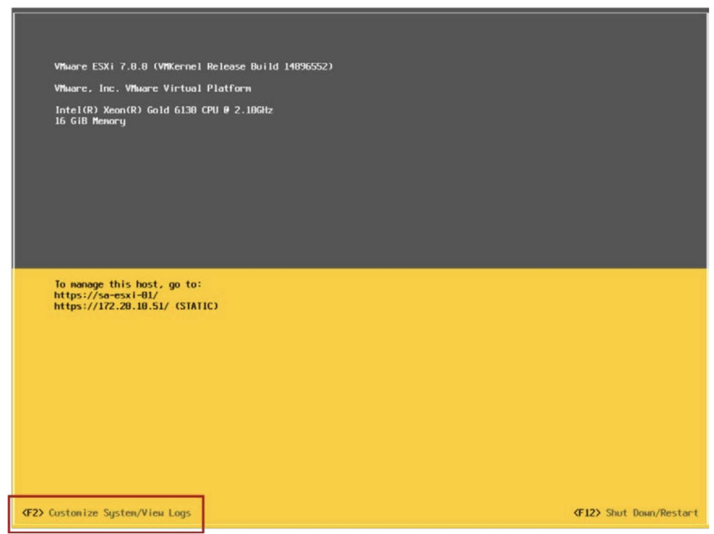
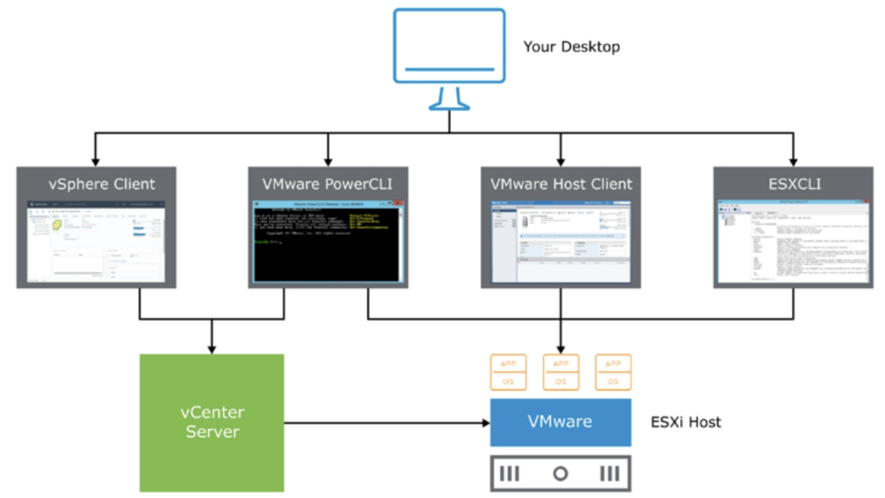

# [vSphere] vSphere and ESXi

> vSphere Install, Configure, Manage [V7] Lecture Note  
> Module 2. Introduction to vSphere and SDDC

## vSphere란?

vSphere는 SDDC를 구현하기 위한 소프트웨어를 모아둔 패키지이다. vSphere는 ESXi, vCenter 등의 세부 제품을 포함하며, vMotion, HA, DRS 등 가상 환경을 제어하기 위한 여러 기능을 제공한다.

- ESXi: 여러 VM을 관리하는 하이퍼바이저
- vCenter: 다수의 ESXi 서버를 하나로 통합하여 관리할 수 있는 솔루션

 > 흔히 많이 하는 실수 중 하나가 vSphere, Horizon 등을 VMware라고 잘못 지칭하는 것인데, 각 단어들은 혼용할 수 없음을 주의하자. VMware는 가상화 솔루션을 제공하는 회사명이고, vSphere은 VMware에서 판매하는 제품의 이름이다. (우리가 Excel을 MS라고 지칭하지 않는 것과 같다.)

## ESXi란?

ESXi는 vSphere 패키지에 포함되어 있는 하이퍼바이저의 이름이다.

## vSphere UI

관리자는 다양한 방법으로 vSphere 환경을 제어할 수 있다.

만약 맨 처음 ESXi를 설치했다면, 아래와 같이 ESXi DCUI(Direct Console UI)에 직접 접근하여 권한, 네트워크 등 각 ESXi에 대한 초기 설정을 해주게 될 것이다.

DCUI 외에도 VMware Host Client 툴을 사용하면 개별 ESXi 호스트에 접근하여 각 ESXi를 관리 및 제어할 수 있다.

일반적으로 기업에서는 ESXi를 최소 수십 개 이상 사용하게 되는데, 작업마다 모든 ESXi Host Client에 접속해야 한다면 상당한 비효율 문제가 있을 것이다. 그래서 우리는 vSphere Client 라는 툴을 더 자주 사용하게 된다. vSphere Client는 ESXi 뿐만 아니라 vSphere 환경 내의 모든 인벤토리를 한 번에 관리할 수 있는 툴이다.

- vSphere Client: vSphere 환경 내의 모든 인벤토리를 한번에 관리할 수 있는 툴
- VMware Host Client: 개별 Host를 직접 관리할 수 있는 툴
- PowerCLI / ESXCLI: vSphere 및 ESXi를 cmd로 제어할 때 사용