# [vSphere] Managing the vCenter Server Inventory

> vSphere Install, Configure, Manage [V7] Lecture Note
> Module 4. vCenter Server 

vSphere Client 화면 구성 및 주요 기능 알아보기

## vSphere Client 바로 가기 페이지

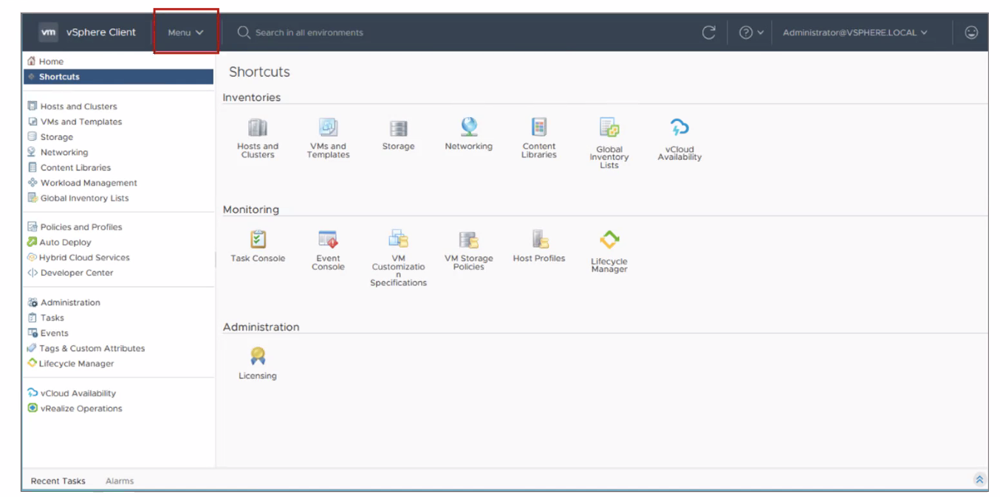

vSphere Client 바로 가기 페이지에서 할 수 있는 것
- vCenter Server 시스템 인벤토리 관리
- 인프라 환경 모니터링
- 시스템 관리 작업 완료

상단 메뉴 풀다운을 클릭하면 바로가기 메뉴들이 모두 표시된다.

## 탐색 창(Navigation Pane)

탐색 창에는 네 개의 인벤토리 단축키가 배치되어 있다. 각 인벤토리 단축키를 선택하면 하단에 세부 오브젝트 목록을 확인할 수 있다. 특정 오브젝트를 선택하면 오른쪽 상세 페이지 영역에서 해당 오브젝트에 대한 정보를 확인하거나 관리 작업을 수행할 수 있다.

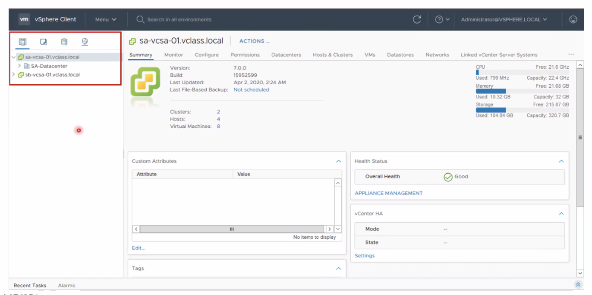

1. Host and Clusters 인벤토리 탭
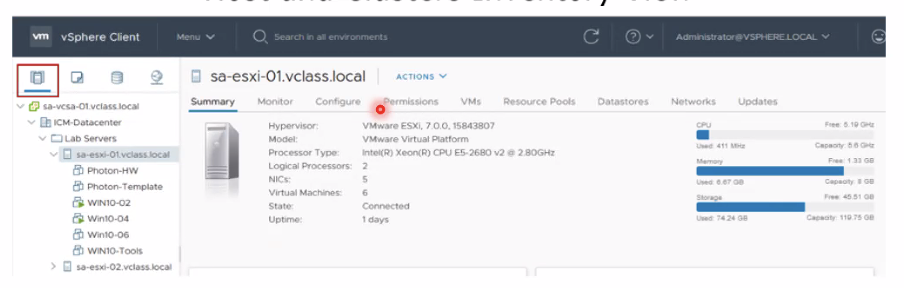

2. VM and Templates 인벤토리 탭
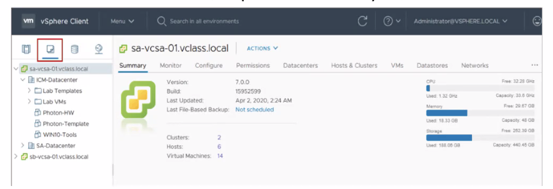

3. Storage 인벤토리 탭
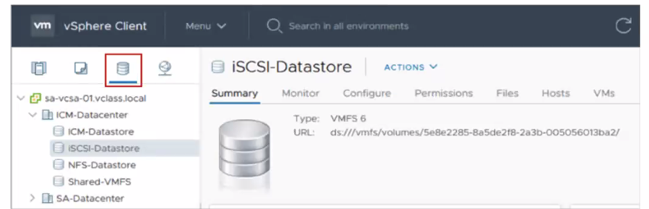

4. Network 인벤토리 탭
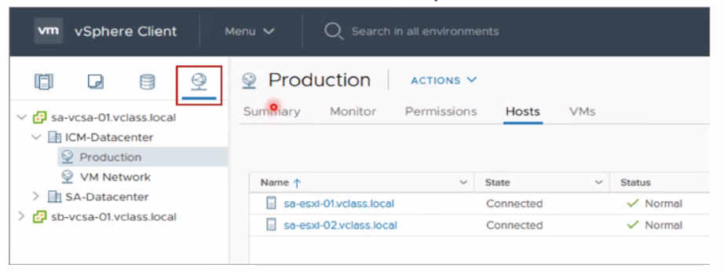

## Data Center Objects

가상 데이터 센터는 VM을 운영하는 데 필요한 모든 인벤토리 오브젝트를 논리적으로 구분한 논리적 조직이다. 각 데이터 센터에는 자체 호스트, VM, 템플릿, 데이터스토어, 네트워크가 포함되어 있다.

데이터 센터 오브젝트를 구분했을 때 장점은 다음과 같다.
- 데이터 센터 단위로 사용자 권한을 구분할 수 있다.
- 데이터 센터 아래 클러스터를 구성하여 호스트 및 VM들을 더 손쉽게 관리할 수 있다.

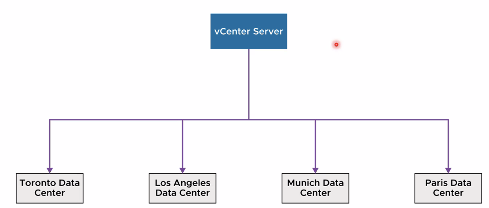

## 인벤토리 오브젝트를 폴더로 구성

데이터 센터에 폴더를 생성하여 오브젝트들을 각 폴더에 배치할 수 있다. 이 폴더가 특정한 기능이나 역할을 갖는 것은 아니지만, 폴더를 구성하면 시스템을 보다 효율적으로 구성할 수 있고 관리가 용이하다.

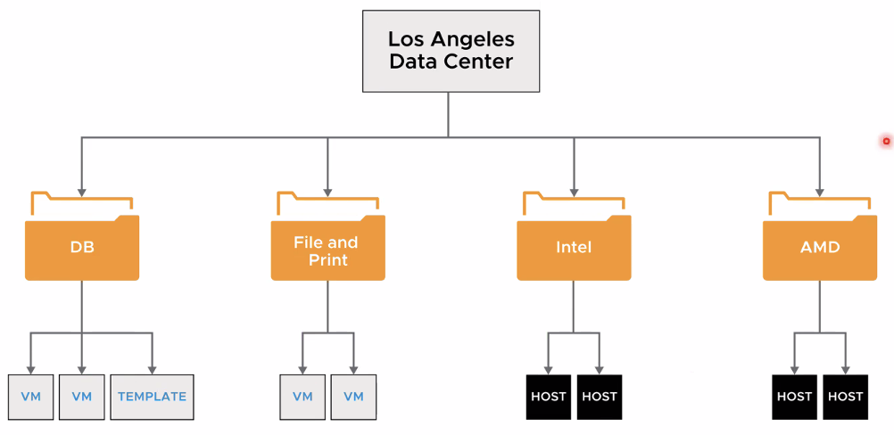

## vCenter Server에 데이터 센터 및 오브젝트 조직 추가

vCenter Server에 새로운 데이터 센터, 호스트, 클러스터 및 폴더를 쉽게 추가할 수 있다. 폴더의 경우 위에서 본 4개의 인벤토리를 기준으로 생성할 수 있으며, 네트워크 폴더를 생성할 경우 네트워크 인벤토리 탭에서만 보이게 된다.

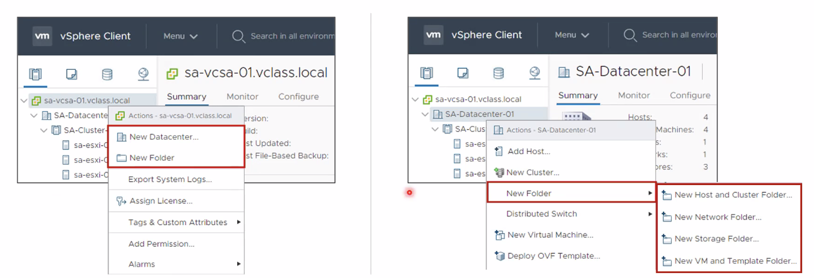

예를 들어, vCenter를 새롭게 구성한다면 먼저 데이터센터를 생성한 후에 데이터 센터 하위에 ESXi 호스트를 직접 추가하는 방식으로 시스템을 구성할 수 있다. 이 때, 데이터 센터에 ESXi 호스트를 직접 추가할 수도 있고, 데이터 센터에 Cluster를 먼저 구성하고 Cluster 하위에 ESXi 호스트를 추가할 수도 있는데, 여러 대의 ESXi 호스트를 추가할 경우 후자의 방법이 더 편리하다고 한다.

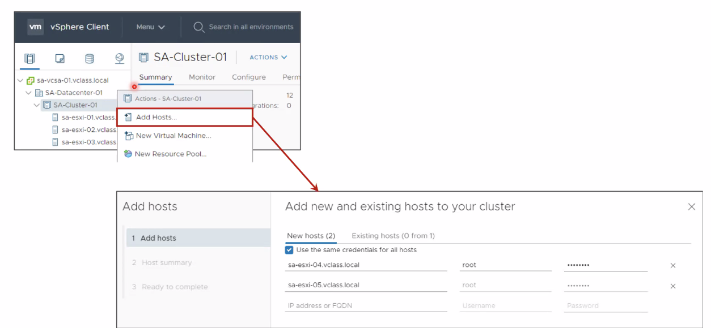

## 인벤토리 개체에 대한 사용자 지정 태그 설정

vCenter Server 인벤토리 개체에 태그를 달아줌으로써 개체를 더 쉽게 정렬할 수 있다.

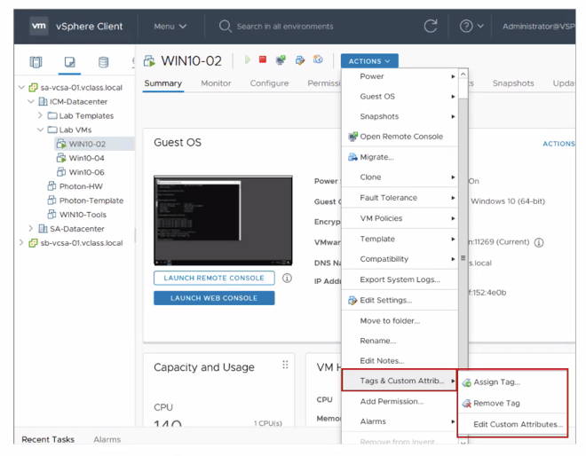

