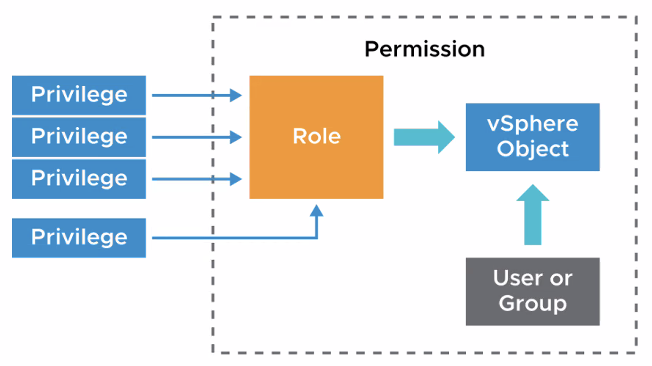
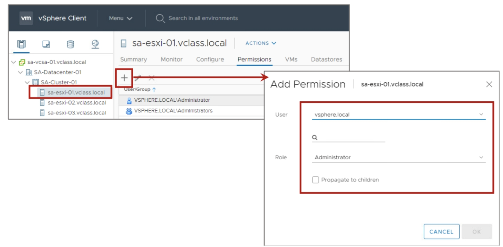
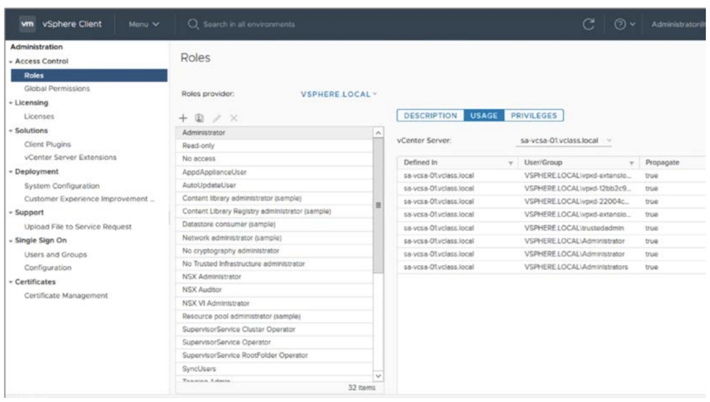
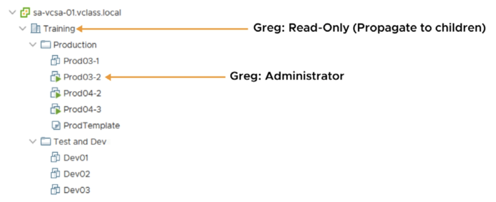
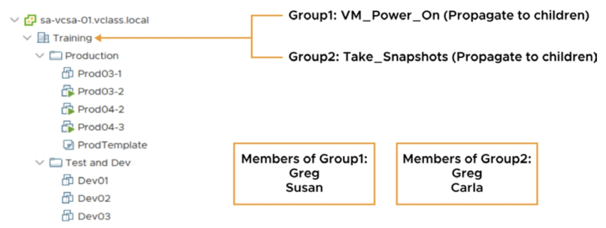
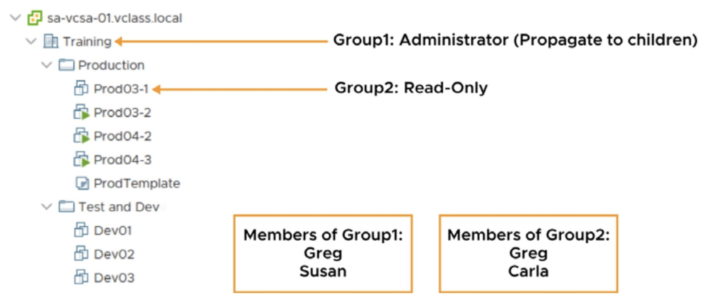
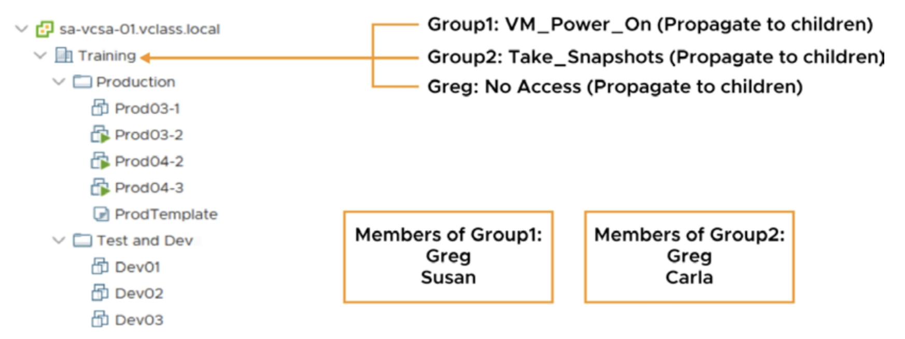
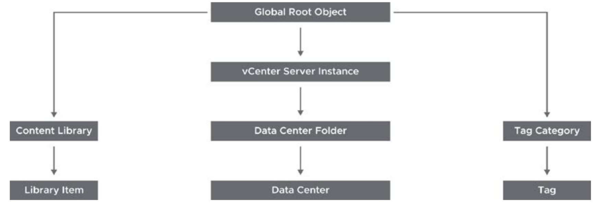

# [vSphere] vCenter Server Role and Permission

> vSphere Install, Configure, Manage [V7] Lecture Note  
> Module 4. vCenter Server 

## vCenter 권한 (Permission)

엑세스 제어 시스템을 사용하여 vCenter Server 관리자가 인벤토리 오브젝트에 엑세스할 수 있는 사용자 권한을 정의할 수 있다.

- 권한(Privilege): 사용자가 수행할 수 있는 동작
- 개체(Object): 사용자가 작업 등을 수행하는 대상
- 역할(Role): 권한의 집합
- 허가(Permission): 한 명의 사용자 또는 그룹에 선택한 개체에 대한 역할을 부여하는 것

### vCenter Server 인벤토리에 사용 권한 추가 방법

- 각 Object 단위로 권한 부여

- 사용자 단위로 권한 부여

## 권한 적용 시나리오

### 시나리오 1

어떤 사용자(Greg) 상위 오브젝트(데이터 센터)에서는 Read-only 권한으로 설정되어 있는데, 하위 특정 오브젝트(VM)에서는 관리자 권한을 부여하면 어떻게 될까?

기본적으로 하위 오브젝트들은 상위 오브젝트의 권한을 상속받는다. 다만, 특정 오브젝트에 특정 권한을 지정하게 된다면, 상속받은 권한보다 직접 지정된 권한이 우선순위를 갖는다. 따라서 위 예시에서 Greg은 관리자 권한을 갖게 된다.

### 시나리오 2

어떤 사용자(Greg)가 두 개 이상의 그룹에 소속되어 있고, 각 그룹은 다른 종류의 권한을 갖고 있다면 Greg은 어느 권한을 갖게 될까?

위 예시에서 Greg은 두 그룹의 권한을 모두 받게 되어, 'VM 전원 켜기'와 '스냅샷 생성' 모두 할 수 있는 권한을 갖는다. 또 다른 사례로, 유사한 상황에서 Group1은 Read-only 권한, Group2는 관리자 권한을 갖다면, 두 그룹에 모두 속해있는 사용자는 둘 중 더 상위 권한인 관리자 권한을 갖게 된다.

### 시나리오 3

시나리오 1과 반대의 상황이다. 어떤 사용자(Greg)가 상위 오브젝트에서는 관리자 권한을 갖고 있으나, 하위 특정 오브젝트에서는 Read-only 권한이 지정되어 있다면, 이 경우 Greg은 어떤 권한을 갖게 될까?

정답은, Greg은 Prod03-1 오브젝트에 대해 Read-only 권한을 갖는다. 시나리오 1에서 언급했듯, 특정 오브젝트에 특정 권한을 지정하게 된다면 상속받은 권한보다 직접 지정된 권한이 우선순위를 갖는다.

### 시나리오 4

특정 사용자(Greg)이 서로 다른 권한을 갖는 두 개의 그룹에 속해 있는 상황에서, 개별 사용자에 대한 No Access 역할까지 부여받는 다면 어떻게 될까?

기본적으로 사용자는 소속된 그룹의 권한을 상속받게 되나, 오브젝트와 마찬가지로 특정 사용자에 명시적으로 권한이 지정될 경우 그 권한이 가장 높은 우선순위를 가진다. 따라서 Greg은 최종적으로 No Access 권한을 갖는다.

## 역할 생성시 주의사항

**보안과 안정성을 위해서는 항상 최소 권한 부여를 원칙으로 하자.**

## Global Permission

Global Permission이란 글로벌 루트 개체의 솔루션 간의 권한을 할당하는 기능이다. vCenter에서 다루는 전체 오브젝트뿐만 아니라, vCenter에 연결된 vRA, vRops 등 전체 솔루션에 대한 권한까지 포함한다.

