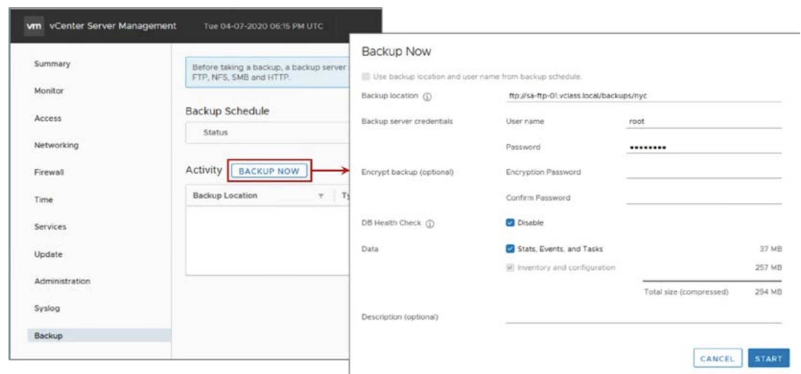
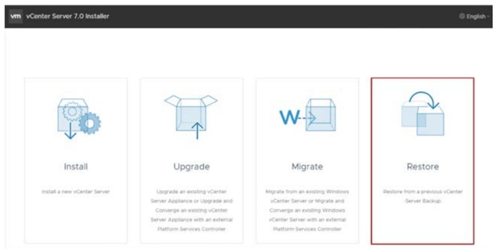

# 4-3. Backing up and Restoring vCenter Server Appliance

> vSphere Install, Configure, Manage [V7] Lecture Note  
> Module 4. vCenter Server 

## vCenter Server 백업 및 복원

vCenter Server 백업 및 복원 작업은 아래 방법으로 할 수 있다.

- 파일 기반 백업 및 복원   
    - 백업: vCenter Server에서 직접 백업. 자동 백업 스케쥴링도 설정할 수 있다.
    
        

    - 복원: vCenter Server Appliance GUI 설치 관리자에서 복원
    
        
    
- 이미지 기반 백업 및 복원
    - vSphere API를 사용하는 써드파티 솔루션 제품에으로 백업 및 복원