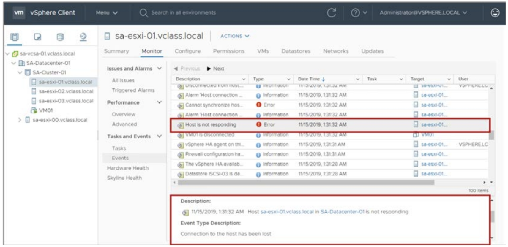
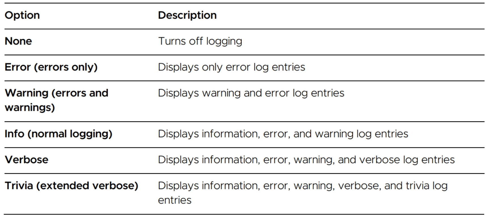
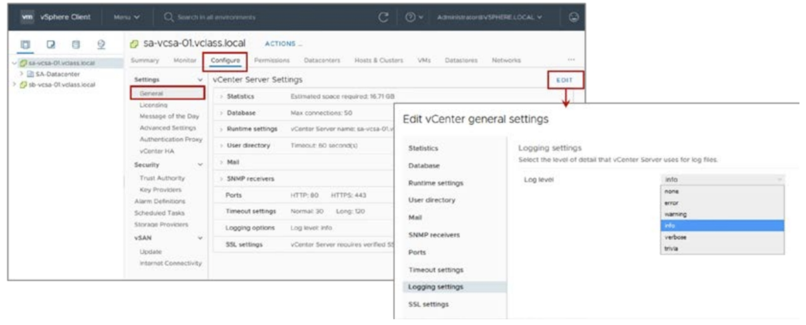
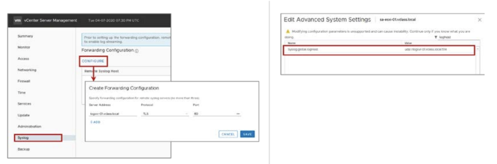
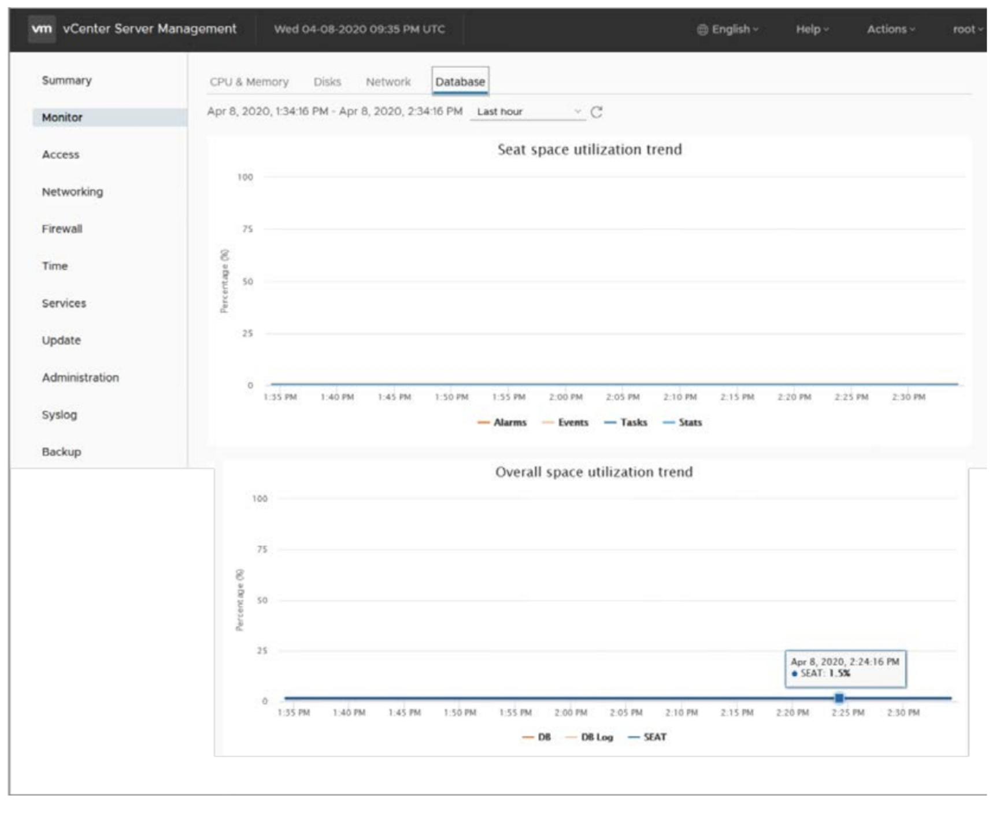

# [vSphere] Monitoring vCenter Server and Its Inventory

> vSphere Install, Configure, Manage [V7] Lecture Note  
> Module 4. vCenter Server 

가상 시스템에서 발생하는 장애를 조기에 발견하고 해결하기 위해서는 vCenter Server의 다양한 경고와 로그를 잘 살펴봐야 한다.

## vCenter Server Events

vCenter Server Events 에서 이벤트 정보를 통해 오류를 확인할 수 있다.

## Logs Option

vCenter Server에서 발생하는 로그 수준을 설정하여 정보의 양과 유형을 변경할 수 있다.

로그는 외부 서버에 저장해두는 것이 안정적이다. vCenter Server 설정을 통해 로그 정보를 원격 syslog 서버로 스트리밍할 수 있다.

## vCenter Database 상태

vCenter Server는 기본 15분마다 DB 상태를 확인한다.
- DB 사용 공간이 80%에 도달하면 경보 트리거
- DB 사용 공간이 95%에 도달하면 오류 발생 후 vCenter Server 자동 종료

