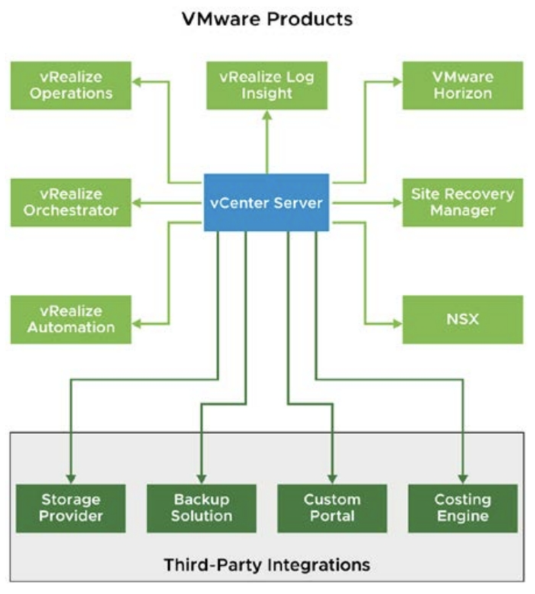
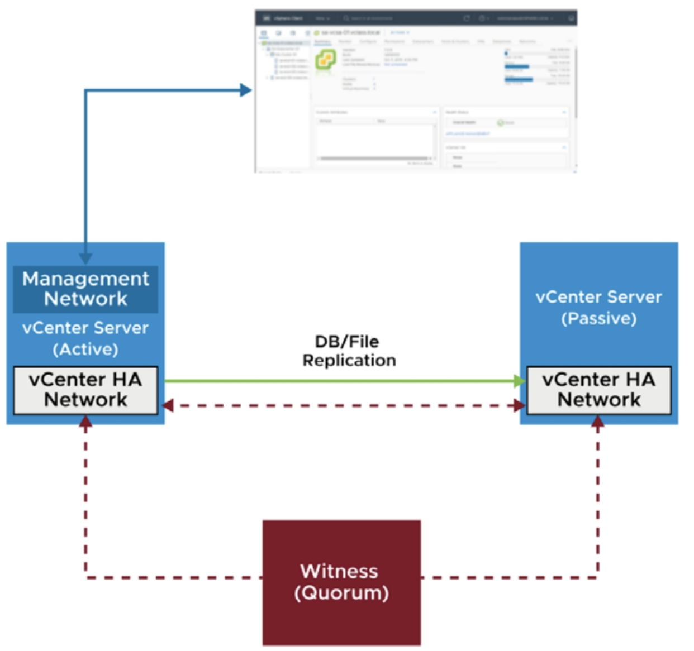
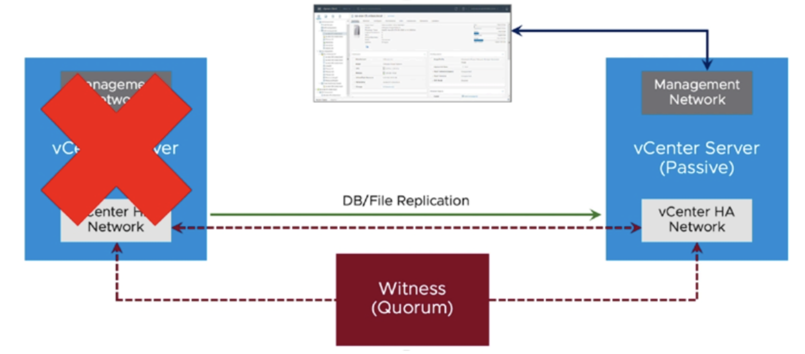
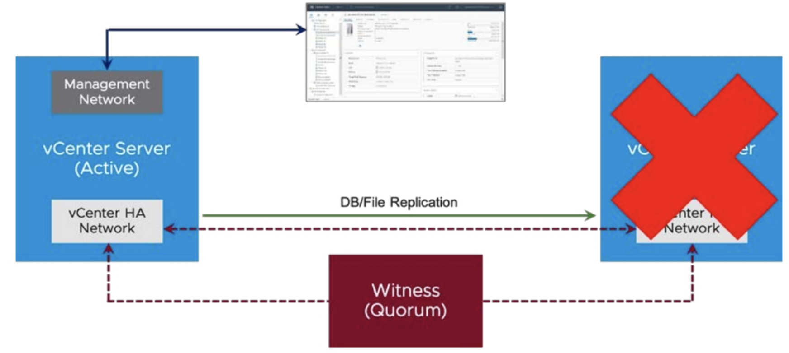
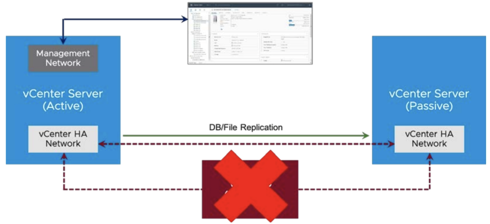
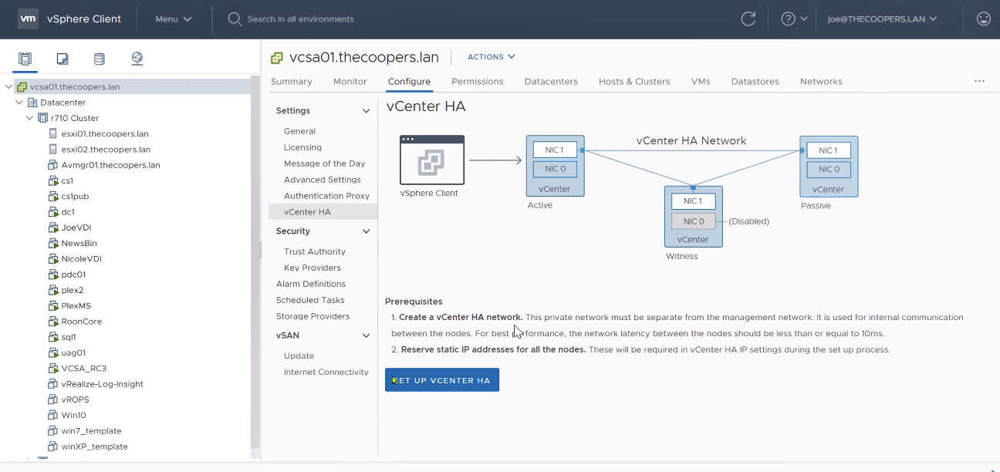

# [vSphere] vCenter Server High Availability

> vSphere Install, Configure, Manage [V7] Lecture Note  
> Module 4. vCenter Server

## High Availability (HA)란?

 가용성(availability)이란, 시스템에 장애가 발생했을 때 얼마나 빨리 정상화될 수 있는 상태인지를 나타내는 척도이다. 고가용성(HA)이란 가용성이 매우 높은 상태를 말하며, 고가용성을 적용할 경우 시스템에 장애가 발생하더라도 서비스 중단 시간을 최소화할 수 있다.

 시스템에서 HA을 구현하는 방식은 주로 백업, 이중화, 클러스터링 등의 방식에 집중되어 있다.

 vSphere HA 역시 가용성을 극대화하여 vSphere 환경에서 장애가 발생했을 때 시스템 중단 시간을 최소화하는 기능이다.

## vCenter Server HA 유지의 중요성

vCenter Server는 vRops, vRLI, Horizon, NSX 등 vCenter Server를 중심으로 연결된 솔루션이 많기 때문에, 고가용성을 유지하는 것이 매우 중요하다.

## vCenter Server High Availavility

 vCenter HA는 장애로부터 vCenter Server를 보호하기 위해 세 개의 노드 클러스터를 구성한다.

 - Active node: 현재 구동중인 active vCenter Server Appliance
 - Passive node: Active node와 동일한 데이터와 환경을 갖는 이중화된 node로, 장애가 발생하면 자동으로 active node의 역할을 이어 받는다.
 - Witness node: Active, Passive node의 장애를 판단한다.

## 장애 시나리오

### 시나리오 1. Active Node 실패

 Active node가 실패하면 Passive node가 자동으로 active node의 역할을 이어 받는다. 기존 vCenter에 연결된 모든 IP들은 새로운 vCenter의 IP로 변경된다. 이때 클러스터는 성능이 저하된 상태로 실행중인 것으로 간주된다.

 

### 시나리오 2. Passive Node 실패

 Passive node가 실패하더라도 active node가 정상적으로 작동하지만, 클러스터는 성능이 저하된 상태로 간주된다. 만약 이 상태에서 active node에 장애가 발생하면 vCenter Server는 작동되지 않는다.

 

### 시나리오 3. Witness Node 실패

 Witness node가 실패하더라도 active node가 정상적으로 작동하지만, 클러스터는 성능이 저하된 상태로 간주된다.

 

## vCenter Server HA의 장점

- 하드웨어, 호스트 및 애플리케이션 장애에 대한 보호 기능이 제공된다.
- 추가 License 구입하지 않더라도 사용할 수 있는 vCenter 기본 기능이다.

## vCenter Server HA 설정 방법

 vCenter Server > Configure > vCenter HA 에서 설정 가능하다.

 HA 구성하려면 반드시 해당 vCenter Server가 가진 NIC가 두 개 이상이어야 한다. (Replication용 네트워크 별도 구성)

