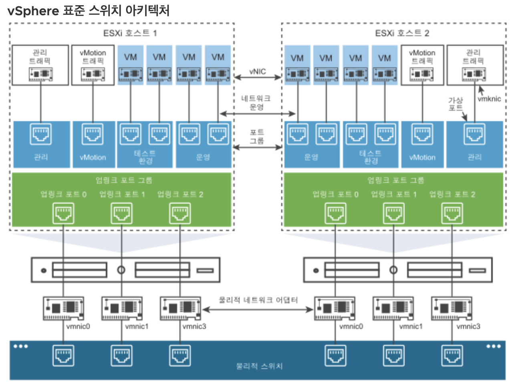
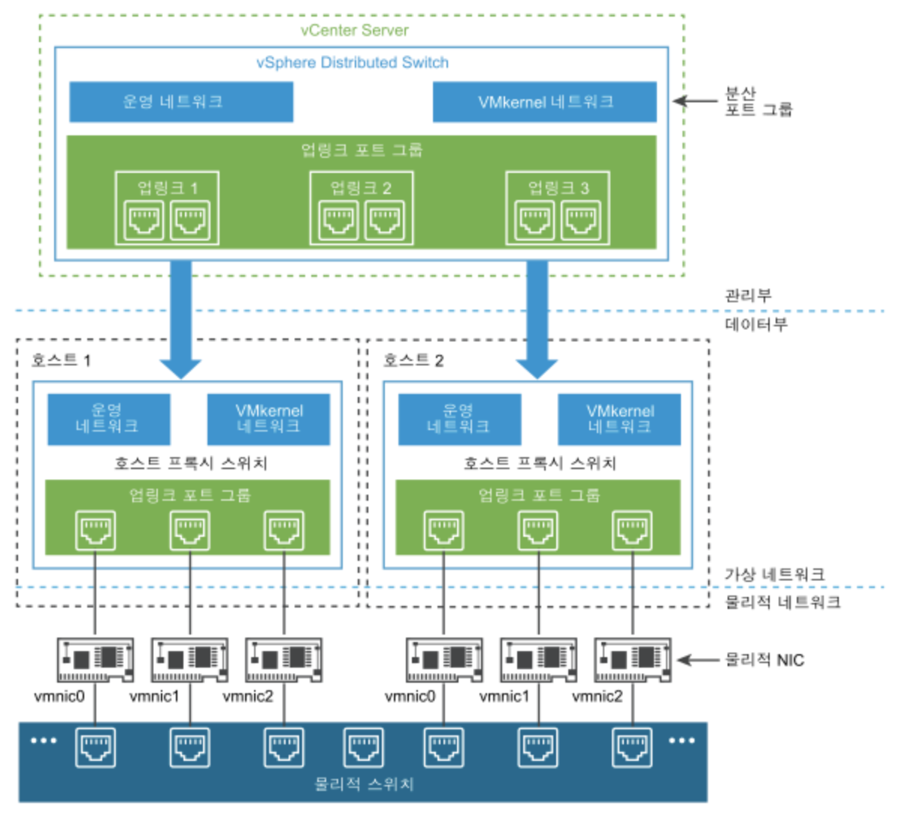
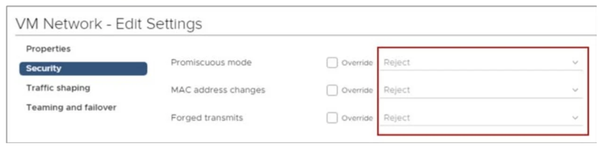

# [vSphere] Configuring and Managing Virtual Networks

> vSphere Install, Configure, Manage [V7] Lecture Note  
> Module 5. Configuring and Managing Virtual Network

## 물리적 이더넷 스위치

물리적 이더넷 스위치는 시스템 간 네트워크 트래픽을 관리한다. 각 스위치는 여러 개의 포트를 가지며 각 포트는 하나의 시스템 또는 네트워크의 다른 스위치에 연결될 수 있다. 스위치는 어느 포트에 어느 호스트가 연결되었는지 확인한 후 올바른 물리적 시스템에 트래픽을 전달한다. 스위치는 물리적 네트워크의 핵심으로, 스위치를 여러 개 연결하여 큰 규모의 네트워크를 구성할 수 있습니다.

## vSphere Standard Switch (vSS)

vSphere 표준 스위치는 물리적 이더넷 스위치와 작동 방식이 비슷하다. vSphere 표준 스위치는 각 가상 포트에 어떤 가상 시스템이 논리적으로 연결되었는지 확인한 후 이 정보를 사용하여 올바른 가상 시스템에 트래픽을 전송한다. vSphere 표준 스위치는 업링크 어댑터라고 하는 물리적 이더넷 어댑터를 사용하여 물리적 스위치에 연결될 수 있으며, 이를 통해 가상 네트워크를 물리적 네트워크와 조인한다. 이는 물리적 스위치를 서로 연결하여 큰 규모의 네트워크를 생성하는 것과 유사하다. 

## vSphere Distributed Switch (vDS)

vSphere Distributed Switch는 데이터 센터에서 연결된 모든 호스트에 대해 단일 스위치처럼 작동하여 가상 네트워크의 중앙 집중식 프로비저닝, 관리 및 모니터링 기능을 제공한다. vCenter Server 시스템에 vSphere Distributed Switch를 구성하면 해당 구성이 스위치와 연결된 모든 호스트에 전파된다. 이를 통해 가상 시스템은 여러 호스트 간에 마이그레이션되더라도 동일한 네트워크 구성을 유지할 수 있다.

## 가상 스위치 포트

가상 스위치는 다음과 같은 포트 구성을 갖는다.

- VM 포트 그룹
    - 각 VM들과 연결하기 위한 포트
- VM kernel 포트
    - 관리 용도로 사용되는 포트
    - ESXi 호스트간의 통신, 외부 스토리지와 연결, vMotion 마이그레이션을 위한 통신 등
    - IP주소가 반드시 필요하다.
- 업링크 포트
    - 물리 스위치와 연결하기 위한 포트

## 가상 스위치 구성 방식 예시

필요에 따라 크게 두 가지 구성을 가질 수 있다.

- 가상 스위치는 최소한으로 만들고, 포트 그룹으로 구분해서 사용하는 방식

    

- 포트 그룹 개수만큼 가상 스위치 생성
    - 이렇게 되면 스위치가 생성되는 만큼 업링크 포트가 많이 필요해진다.

    

## 가상 스위치 유형별 특징

### 표준 스위치 (vSS)
- 서로 다른 호스트들이 스위치를 공윻라 수 없기 때문에, 동일한 스위치를 호스트마다 직접 만들어야 한다.
- 표준 스위치에 대해 작업이 필요한 경우에는 꼭 vCenter Server 내 호스트를 기준으로 작업해야 한다!

### 분산 스위치 (vDS)
- vCenter Server 전체에 한 개의 스위치를 구성하면, 하위의 모든 호스트들이 해당 스위치를 공유할 수 있다.
- 관리나 성능 측면에서 유리하나, vSphere Enterprise 버전부터 사용 가능하다.

## 표준 스위치 정책 구성

### Security

 스위치에서 전체 포트에 동일한 보안 정책을 적용할 수도 있고, 특정 포트 그룹을 지정하여 별도 정책을 적용할 수도 있다.

 아래 항목에 대한 옵션을 제공함으로서 보안을 높일 수 있다.

 - Promiscuous mode (Reject)
    - 무차별 모드는 게스트 운영 체제가 네트워크에서 관찰되는 모든 트래픽을 수신할 수 있도록 모든 수신 필터링을 제거하는 것이다. (Reject)
 - MAC address changes (Reject)
    - 게스트가 vNIC에 할당된 MAC 주소를 변경하려고 시도한다면 프레임 수신을 멈춘다.
 - Forged transmits (Reject)
    - 프레임의 소스 주소에 다른 vNIC 맥 주소가 설정되어 있다면 (주소가 위조되었다면) 해당 프레임을 reject할 수 있다. 

### Traffic shaping

 가상 시스템의 사용 가능한 네트워크 대역폭을 제한하는 매커니즘

 평균 대역폭, 최대 대역폭 및 버스트 크기로 트래픽 속도를 제어할 수 있다. 주의할 것은 vSS는 양방향 트래픽에 대해 설정이 적용되는 것이 아니라 outbound 트래픽 기준으로만 설정된다. Inbound 트래픽에 대한 기능은 vDS에서만 제공한다.

### NIC teaming and failover

NIC 팀 구성을 사용할 경우, NIC 팀에 둘 이상의 물리적 NIC를 포함하게 되어 가상 스위치의 네트워크 용량을 늘릴 수 있다. NIC 팀은 여러 NIC간에 트래픽을 분산하고, 어댑터 오류 또는 네트워크 중단 시 수동 장애 조치를 제공할 수 있다.

