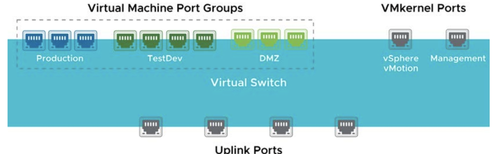
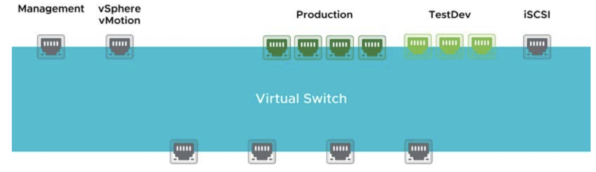
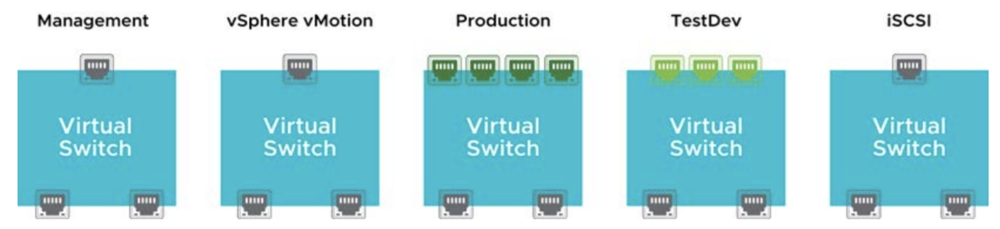
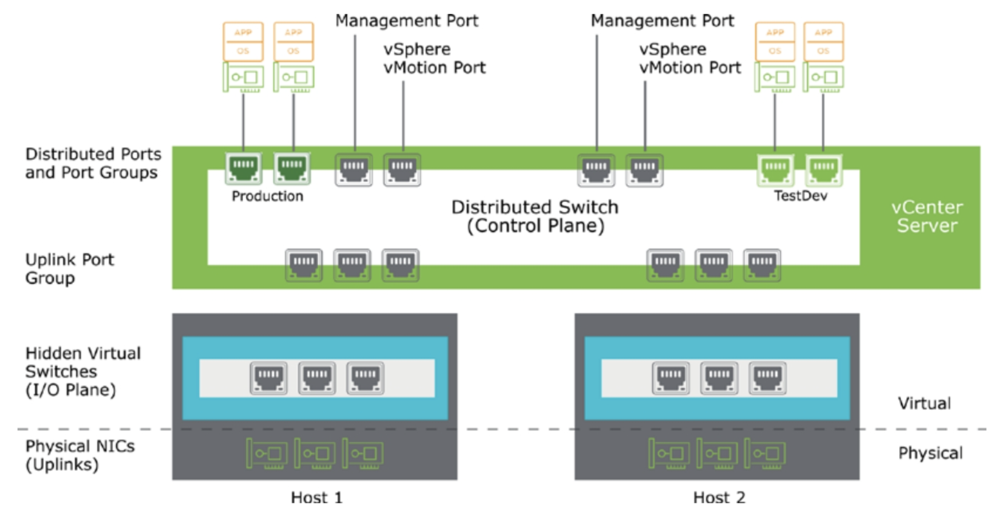
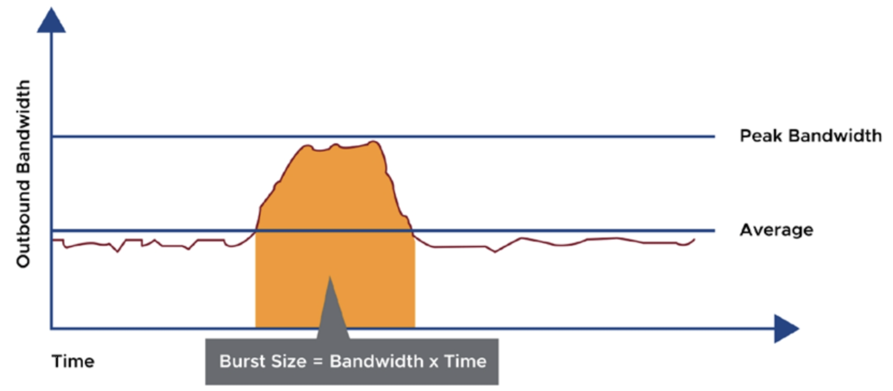
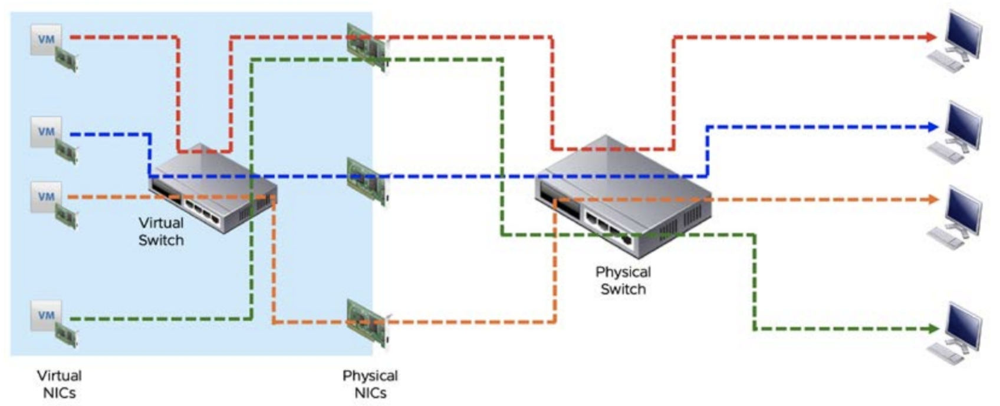

# [vSphere] Configuring and Managing Virtual Networks

> vSphere Install, Configure, Manage [V7] Lecture Note
> Module 5. Configuring and Managing Virtual Network

## 가상 스위치 포트

가상 스위치에는 다음과 같은 연결 유형이 있다.

- VM 포트 그룹
- VM kernel 포트
    - 관리 용도로 사용되는 포트
    - ESXi 호스트간의 통신, 외부 스토리지와 연결, vMotion 마이그레이션 등
    - 통신을 해야하기 때문에 IP주소가 반드시 필요하다.
- 업링크 포트

## 가상 스위치 구성 방식 예시

- 가상 스위치는 최소한으로 만들고, 포트 그룹으로 구분해서 사용하는 것

- 포트 그룹 개수만큼 가상 스위치 생성
    - 이렇게 되면 스위치가 생성되는 만큼 업링크 포트가 많이 필요해진다.

    

## 가상 스위치 유형

### 표준 스위치 (vSS)
- 같은 역할을 하는 스위치를 호스트마다 직접 만들어야 한다.
- 표준 스위치는 꼭 vCenter Server 내 호스트를 기준으로 작업해야 한다!

### 분산 스위치 (vDS)
- vCenter Server에 스위치를 하나만 만들어두면 호스트들이 해당 스위치를 공유할 수 있다.
- 관리나 성능 측면에서 유리하나, vSphere Enterprise 버전부터 사용 가능하다.

### 분산 스위치 아키텍쳐

## 표준 스위치 정책 구성

### Security

 보안 정책은 스위치 전체 포트에 대해 적용하거나, 특정 포트 그룹에 대해서 별도 정책을 적용할 수 있다.

 아래 항목에 대한 보안 정책을 적용할 수 있다.

 - Promiscuous mode
 - MAC address changes
 - Forged transmits

### Traffic shaping

 가상 시스템의 사용 가능한 네트워크 대역폭을 제한하는 매커니즘

 평균 대역폭, 최대 대역폭 및 버스트 크기로 트래픽 속도를 제어할 수 있다. 주의할 것은 양방향 트래픽에 대해 설정이 적용되는 것이 아니라 outbound 트래픽 기준으로만 설정된다. Inbound 트래픽에 대한 기능은 vDS에서 제공한다.

### NIC teaming and failover

NIC 팀 구성을 사용하면 한 팀에 둘 이상의 물리적 NIC를 포함하여 가상 스위치와 네트워크 용량을 늘릴 수 있다.

## Load-Balancing

원래 가상 포트 ID를 기반으로 하는 로드 밸런싱을 사용하면 가상 시스템의 아웃바운드 트래픽이 특정 물리적 NIC에 맵핑된다. 물리 스위치에서 구성 작업을 할 필요 없이 가상화 환경에서의 설정만으로도 로드 밸런싱이 가능하다. 다만 효율이 떨어진다.

2
하나의 컴퓨터에서 여러 개의 트래픽이 나갈 때 효율적으로 트래픽을 분산할 수 있다.

3
가장 효율이 좋은 방식. VM의 IP와 Client IP를 갖고 해시값에 의해 동작한다. 같은 컴퓨터라도 IP가 다르면 다른 컴퓨터로 인식하는 것. 물리 네트워크 장비에서의 설정이 필요하다.

