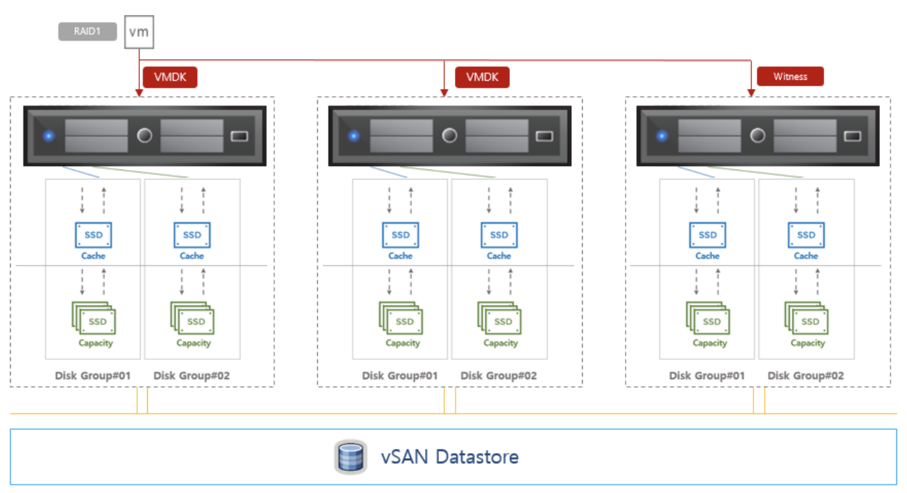

# 6-1. Storage Concepts

> vSphere Install, Configure, Manage \[V7\] Lecture Note   
>  Module 6. Configuring and Managing Virtual Storage

## 데이터스토어

데이터스토어는 하나의 물리적 디바이스에서 디스크 공간을 사용하거나 여러 물리적 디바이스에 걸쳐 있을 수 있는 논리적 스토리지 단위이다. VM 파일, VM 템플릿, ISO 이미지 등을 저장하는 데 사용하며, 하나의 데이터스토어를 여러 호스트들이 함께 공유함으로써 가용성을 높일 수 있다.

vSphere는 다음 유형의 데이터스토어를 지원한다.

* VMFS
* NFS
* vSAN
* vSphere Virtual Volumes

## VMFS\(VMware File System\)

VMFS는 블록 레벨의 파일 시스템이다. 가상 시스템이 블록 스토리지를 사용하기 위해서는 블록 스토리지를 가상 시스템이 사용할 수 있는 적절한 형태로 포맷팅해주어야 한다. ESXi나 vSphere에서 블록 스토리지를 사용하기 위해 포맷을 변경한 형태를 VMFS라고 부른다.

VMFS를 VM을 저장하는 데 최적화된 고성능 파일 시스템 형식이다. VMFS를 사용하면 여러 ESXi 호스트가 동일한 VMFS 데이터 스토어에 동시에 접근할 수 있다.여러 호스트가 데이터스토어에 동시에 접근할 수 있는 것은 다음과 같은 장점을 갖는다.

- VMware DRS(Distributed Resource Scheduling) 및 VMware HA(High Availability)를 사용할 수 있다.   

    vSphere는 VMFS 데이터스토어에 연결된 서로 다른 호스트에 가상 머신을 배포할 수 있게 된다. 만약 어떤 서버에 장애가 발생하면, 해당 서버의 VM들을 다른 물리적 서버에서 다시 시작하는 방법으로 고가용성을 확보한다. 또한, 한 서버의 리소스 사용량이 과도하게 높아질 경우, 해당 서버의 VM들을 다른 서버로 이동시킴으로써 리소스 사용량을 낮출 수 있다.

- vMotion을 사용하여 호스트 간 VM을 마이그레이션할 수 있다.

## NFS (Network File System)

NFS는 파일 레벨의 네트워크 파일 시스템이다. ESXi에 내장된 NFS 클라이언트는 TCP/IP를 통해 NFS 프로토콜을 사용하여 NAS 서버에 있는 지정된 NFS 볼륨에 액세스한다.

## vSAN (HCI; Hyper Converged Infrastructure)

vSAN이란 물리 스토리지를 소프트웨어 기반 스토리지로 구성하는 VMware의 기술이다. 기존 외부 스토리지를 사용하지 않는 가상 환경을 위한 소프트웨어 기반 스토리지를 말한다.

### vSAN 디스크 그룹

vSAN을 구성하기 위해서는 서버당 최대 5개의 디스크 그룹이 구성되는데, 각 디스크 그룹에는 두 가지 계층이 필요하다.

- 캐시(cache) 계층: 성능을 높이기 위한 용도. SSD 디스크 필요. 디스크 그룹 당 1개 구성 가능
- 용량(capacity) 계층: 데이터를 저장하기 위한 용도. SSD 또는 HDD 디스크 필요. 디스크 그룹당 최대 7개 구성 가능

### vSAN Type
- Hybrid type
    - 구성: 캐시 계층 (SSD) + 용량 계층 (HDD)
    - 동작: 캐시 계층이 read/write 동작을 모두 수행   
- All Flash type
    - 구성: 캐시 계층 (SSD) + 용량 계층 (SSD)
    - 동작: 캐시 계층이 write 동작만 수행하고 read는 용량 계층이 대신 한다. write에 대한 공간을 더 많이 확보할 수 있기 때문에 이 방식을 권장한다.

## Raw Device Mapping (RDM)

오버헤드를 줄이기 위해 VM이 가상화 계층을 거치지 않고 물리적 LUN에 직접 엑세스할 수 있도록 구현한 방식이다. VM에서 LUN을 가리키는 매핑 파일 (rdm.vmdk)은 VMFS 데이터스토어에 저장되어야 한다. 요즘은 오버헤드 이슈가 크지 않아서 굳이 RDM을 구성하지 않고 데이터스토어 단위로도 많이 쓴다.
