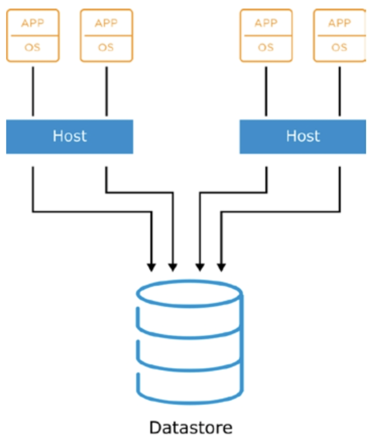
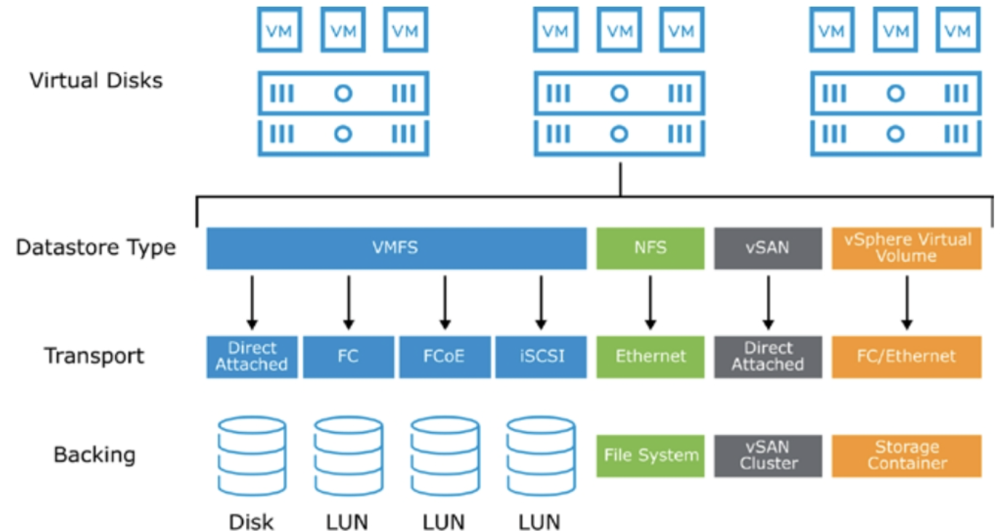
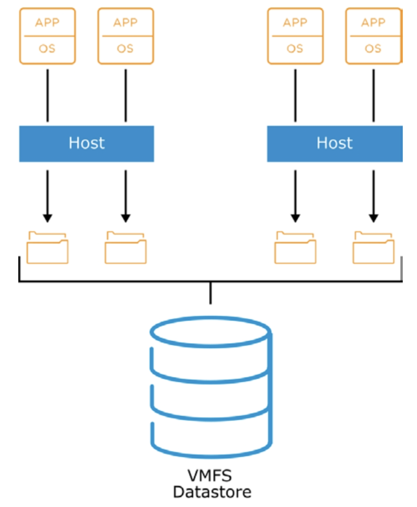
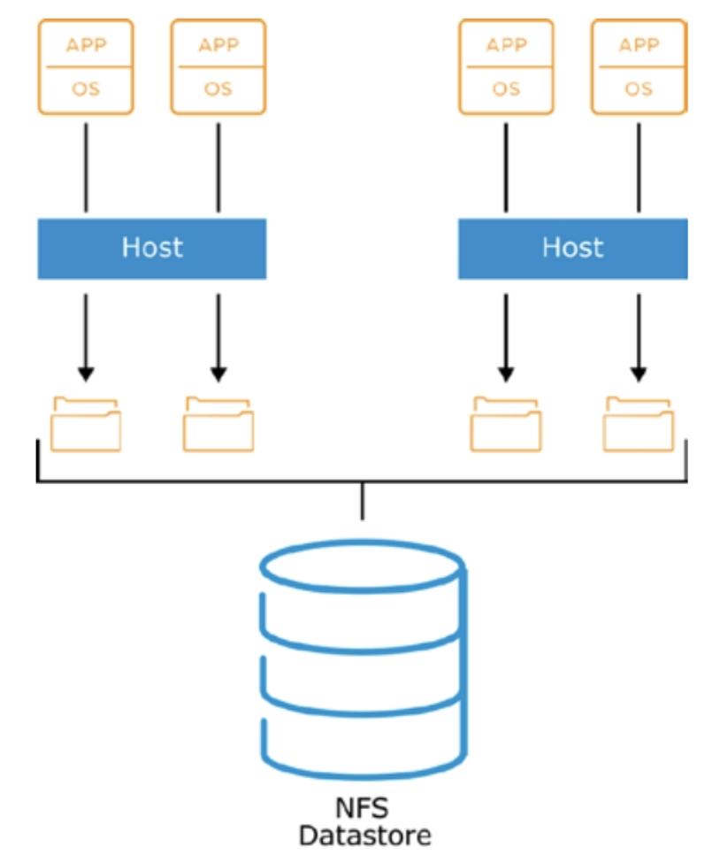
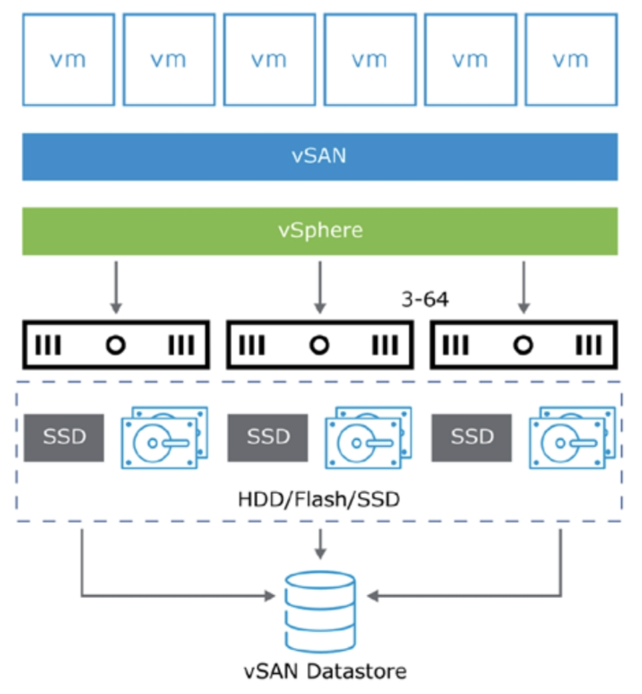
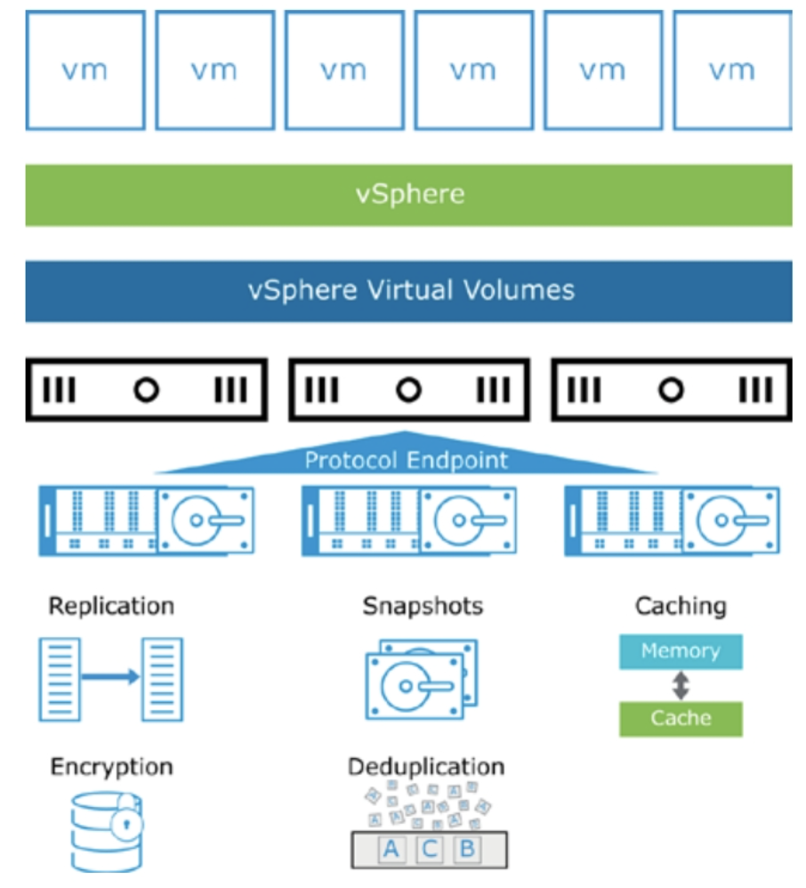
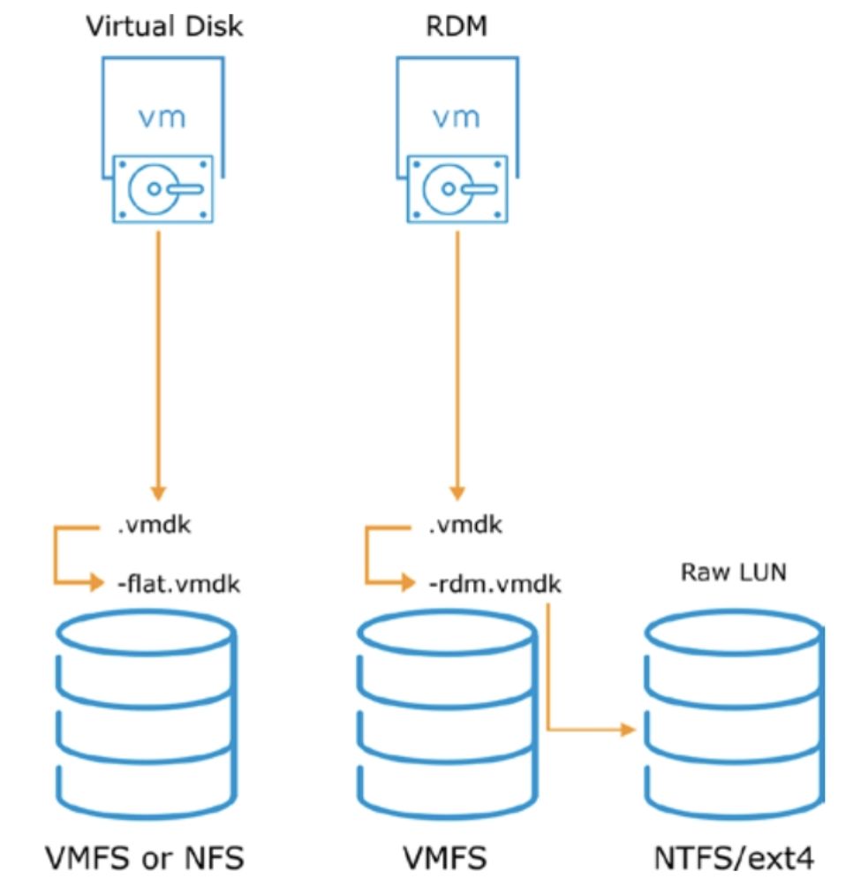

# [vSphere] Storage Concepts

> vSphere Install, Configure, Manage [V7] Lecture Note
> Module 6. Configuring and Managing Virtual Storage

## 데이터스토어

데이터스토어는 하나의 물리적 디바이스에서 디스크 공간을 사용하거나 여러 물리적 디바이스에 걸쳐 있을 수 있는 논리적 스토리지 단위이다. VM 파일, VM 템플릿, ISO 이미지 등을 저장하는 데 사용하며, 공유 스토리지를 사용할 경우 고가용성을 구성하는 데 유리하다.

vSphere는 다음 유형의 데이터스토어를 지원한다.
- VMFS
- NFS
- vSAN
- vSphere Virtual Volumes

## 스토리지 개요

ESXi 호스트는 데이터스토어에 대한 공유 엑세스 설정을 갖고 있어한다.

## VMFS(VMware File System)

블록 스토리지를 VM이 사용하기 위해서는 적절한 형태로 포맷팅이 필요하다. ESXi나 vSphere에서 블록 스토리지를 사용하기 위해 포맷팅한 형태를 VMFS라고 한다.

## NFS (NAS File System)

ESXi 호스트가 NAS 디바이스와 통신하는 데 사용하는 파일 공유 프로토콜. 가장 많이 사용하는 파일 시스템 중 하나이다.

## vSAN (HCI; Hyper Converged Infrastructure)

vSAN이란 기존 외부 스토리지를 사용하지 않는 가상 환경을 위한 소프트웨어 기반 스토리지를 말한다.

## vSphere Virtual Volumes

## Raw Device Mapping

오버헤드를 줄이기 위해 VM이 가상화 계층을 거치지 않고 물리적 LUN에 직접 엑세스할 수 있도록 구현한 것. VM에서 LUN을 가리키는 매핑 파일 (rdm.vmdk)은 VMFS 데이터스토어에 저장되어야 한다. 요즘은 오버헤드 이슈가 크지 않아서 굳이 RDM을 구성하지 않고 데이터스토어 단위로도 많이 쓴다.

