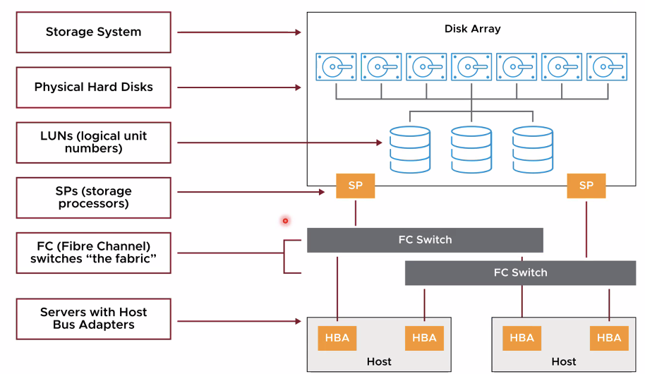
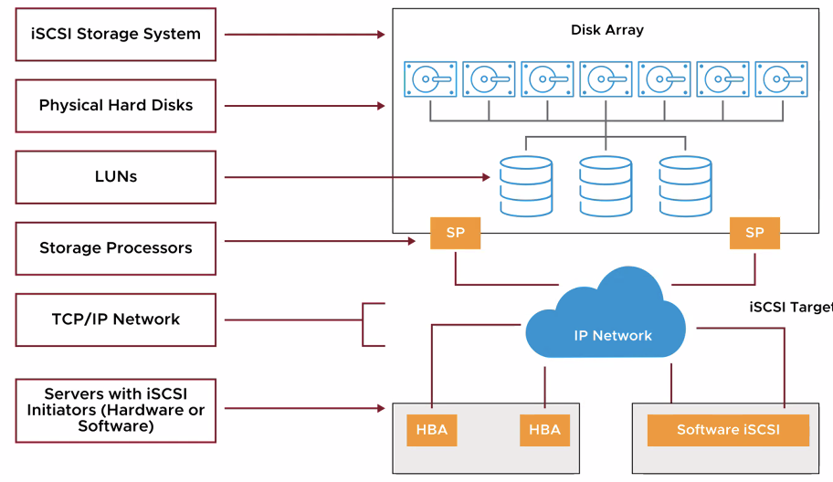

# [vSphere] Fibre Channel and iSCSI Storage

> vSphere Install, Configure, Manage [V7] Lecture Note  
> Module 6. Configuring and Managing Virtual Storage

## Fibre Channel

Fibre channel은 VM 파일을 Fibre channel SAN에 원격으로 저장하는 데 사용한다. Fibre channel SAN은 호스트를 고성능 스토리지 디바이스에 연결하는 특수 고속 네트워크다. 네트워크는 fibre channel 프로토콜을 사용하여 SCSI 트래픽을 VM에 전송한다.

## Fibre Channel SAN 구성요소

하나의 스토리지에 장애가 발생했을 때를 대비하여 multi-path 구성을 지정한다.

## iSCSI 구성요소

ethernet 기반으로 연결하는 스토리지를 말한다. iSCSI SAN은 LUN과 스토리지 프로세서를 포함한다.

## iSCSI 주소 지정

iSCSI는 기본적으로 target name과 initiator name 를 사용하여 연결하지만, 주로 IP 기반으로 연결하는 경우가 많다. Storage가 Target, 연결하는 Client가 initiator가 된다.

