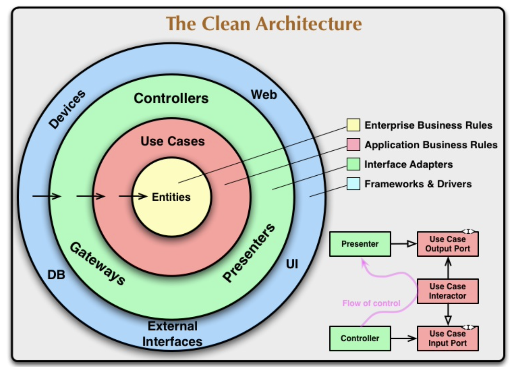

# 2021.09

## 9/15 (Wed)

### Alfred Configuration

Alfred에 workflow 들을 설치했다. 맥을 4년째 쓰면서 편리한 기능들을 전혀 활용하지 못하고 있었다는 걸 최근에 많이 느낀다. 생산성을 높이기 위해 의식적으로 노력해야겠다는 생각을 하게 된다.

### NPM(Node Package Manager)

Alfred workflow를 다운받다 보니, npm 명령어로 workflow를 설치하는 경우가 많아서 찾아보게 됐다. 

1. **NPM이란?**

    NPM은 (Node Package Manger)의 약자로, 명령어로 자바스크립트 라이브러리를 설치하고 관리하는 패키지 매니저다.   

2. **NPM 설치 방법**

    node.js를 설치하면 자동으로 npm이 함께 설치된다.

    - 설치 링크: https://nodejs.org/en/

    terminal에서 아래 명령어가 잘 동작하면 정상적으로 설치된 것이다.

    ```
    npm -v
    ```

3. **NPM 설치 관련 기본 명령어**

    ```npm init```: package.json을 만드는 명령어. 새로운 프로젝트나 패키지를 만들 때 사용한다.

    ```npm install```: 새로운 패키지를 설치하는 명령어

    - ```npm install + 패키지 명 (+ @ + 버전)```: 특정 패키지 다운로드 (버전 지정 옵션)

    - ```npm install + 주소```: 특정 주소에서 다운로드

    ```npm update```: 패키지 버전 업데이트

### Clean Architecture

소프트웨어를 설계하는 방법을 공부하기 위해 클린 아키텍처 책을 구입했다. 책이 배송되는 동안 아래 블로그들을 보며 클린 아키텍처가 무엇이고 왜 필요한지 등의 대략적인 내용만 파악했다. 자세한 사항은 공부하면서 정리해보려고 한다.

- 원문: 
https://blog.cleancoder.com/uncle-bob/2012/08/13/the-clean-architecture.html   

- 도움이 된 블로그   
    - https://joonfluence.tistory.com/322   
    - https://zeddios.tistory.com/1065   


1. **클린 아키텍처란?**   

    소프트웨어 아키텍처란 소프트웨어를 구성하고 설계하는 기본 원칙으로, 좋은 소프트웨어를 만들기 위해서는 좋은 아키텍처가 필요하다. 좋은 소프트웨어란 유연한 소프트웨어를 말하며, 기능과 환경을 쉽게 변경할 수 있도록 아키텍처를 설계해야한다고 한다.

2. **클린 아키텍처 구조**   
   
    
   
    - Each circles   
        - **Entity**: "Enterprise wide business rules" 를 캡슐화한 요소로, 외부에 변화가 있을 때 변경될 가능성이 가장 적어야 한다. 일반적으로 가장 높은 수준의 규칙을 캡슐화 합니다.
        - **Use Cases**: 시스템의 동작을 사용자의 입장에서 표현한 기능으로, 비즈니스 로직을 결정한다. 예를 들어, 검색 앱이라고 한다면 사용자가 검색 창을 누르고 검색을 하는 동작이 Use case에 해당된다. Use case는 엔티티를 알고 있지만, 그 바깥에 있는 DB, UI 등 외부 환경에 대해서는 전혀 영향을 받지 않는다.
        - **Interface Adapters**: Entities, Use cases 등 내부 시스템에서 익숙한 포맷에서 외부 프레임워크에서 요구하는 포맷으로 데이터를 변환하는 계층이다.
        - **Frameworks & Drivers**: Flutter, Angular 등 프레임워크가 이 계층에 해당된다.   
   
    - Dependency Rules
        - 소스코드 종속성은 outer -> inner 방향으로만 향할 수 있다.
        - inner circles 안에 있는 것들은 outer circles에 대해 아무것도 알 수 없다.
        - 특히, outer circles에 선언된 이름은 inner circles에서 언급해서는 안된다. (함수, 클래스 등등)

## 9/16 (Thur)

### MAC 단축키, 노션 단축키

최대한 트랙패드 없이 단축키와 Alfred 등으로 맥을 사용할 수 있도록 연습 중이다. 트랙패드도 충분히 편한데 굳이 단축키들을 익혀야해? 라고 생각했는데, 막상 단축키를 쓰니 굳이 시간을 들일 가치가 있는 일이었다. 

### Clean Architecture - 1,2부

클린 아키텍처 책 공부를 시작했다. 아래 내용을 학습하고 정리했다. 

  * [#1 소프트웨어 아키텍처의 필요성](/Architecture/CleanArchitecture/01_Introduction.md)
  * [#2 프로그래밍 패러다임](/Architecture/CleanArchitecture/02_Programming_Paradigm.md)

소프트웨어 아키텍처가 왜 필요하고 어떤 가치에 집중해야 하는지, 그리고 세 가지 프로그래밍 패러다임을 학습하며 아키텍처 설계에서 중요하게 고려해야할 사항은 무엇인지 배울 수 있었다.

## 9/17 (Fri)

### Binary Search

자료구조 복습할 겸 리트 코드 문제를 꾸준히 풀어보려고 한다. 오늘은 이진 탐색 개념을 정리하고 간단한 문제를 세 개 풀었다. 각각 아래 페이지에 정리해 두었다.

* [Binary Search](/Algorithm/BinarySearch/README.md)
* [Leetcode 33. Search in Rotated Sorted Array (C++)](/Algorithm/BinarySearch/Leet_Medium_Binary_Search_33.md)
* [Leetcode 34. Find First and Last Position of Element in Sorted Array (C++)](/Algorithm/BinarySearch/Leet_Medium_Binary_Search_34.md)
* [Leetcode 74. Search a 2D Matrix (C++)](/Algorithm/BinarySearch/Leet_Medium_Binary_Search_74.md)

## 9/18 (Sat)

### Big-O

알고리즘 문제를 본격적으로 풀기 앞서 시간 복잡도, 공간 복잡도에 대한 개념을 다시 한 번 학습했다. Big-O를 고려해야하는 것이 중요한 것을 알면서도, 알고리즘 문제를 풀 때 적용하지 못했는데 오늘 정리한 것을 바탕으로 Big-O를 생각하면서 문제를 푸는 연습을 해야할 것 같다. 학습 내용은 아래 페이지에 정리했다.

* [Big-O](/Algorithm/BigO.md)

### Array and String (배열과 문자열)

자료 구조 기본인 배열(array), 동적 배열(vector), 문자열(string)에 대해 공부하고 정리했다. 이번 기회에 배열을 초기화하는 여러 방법을 정리할 수 있었다. 정리를 하다 보니 vector와 string STL 라이브러리 함수들에 대해서는 별도 페이지에 정리를 해둬야겠다는 생각이 들었다.

* [Array and String](/Algorithm/DataStructure/Array_and_String.md)

## 9/19 (Sun)

### Linked List (연결 리스트)

자료 구조 중 Linked List에 대한 개념을 정리하고 C++로 Single Linked List를 직접 구현했다. 평소 Problem Solving을 할 때는 vector나 queue 등 라이브러리를 사용하다 보니, 데이터 구조를 직접 구현해볼 일이 거의 없는 것 같다. 오랜만에 Linked List를 직접 구현해보니 각 동작을 좀 더 세부적으로 생각하게 되고, 메모리 할당과 해제에 대해서도 코드로 구현해볼 수 있어 좋았다. 오늘 학습한 Linked List 개념 및 코드 구현 내용은 아래 페이지에 정리했다.

* [Linked List](/Algorithm/DataStructure/Linked_List.md)

### Markdown 문법 학습

기본적인 강조 구문, 코드 블럭, 인용구 표현 등의 마크다운 문법 사용에는 익숙하지만, 링크 첨부나 테이블 사용 등은 잘 몰라서 사용을 하지 않게 된다. 당장 모든 문법을 익힐 수는 없더라도, 마크다운에서 어떤 기능을 사용할 수 있는지 알아두는 것이 필요하다는 생각을 했다. 아래 링크에 정리가 잘 되어 있어, 필요할 경우 아래 링크를 참고하며 마크다운의 여러 기능을 사용해보도록 하자.

- https://velog.io/@wonhs717/마크다운Markdown-문법-ytk5zemk0x#서론

## 9/20 (Mon)

### Stack and Queue

Stack, Queue 개념을 정리하고 C++ 코드로 구현했다. 배열을 사용한 Stack과 Queue, Linked List를 사용한 Stack과 Queue를 모두 구현했으며, 덕분에 배열과 Linked List를 직접 만들어 사용하는 것도 훨씬 편해졌다. 아래 페이지에 정리해 두었다.

  * [Stack](/Algorithm/DataStructure/Stack.md)
  * [Queue and Circular Queue](/Algorithm/DataStructure/Queue.md)

### LeetCode PS (Binary Search)

Leetcode에서 아래 두 문제를 풀고 정리했다.

  * [Leetcode 153. Find Minimum in Rotated Sorted Array (C++)](/Algorithm/BinarySearch/Leet_Medium_Binary_Search_153.md)
  * [Leetcode 162. Find Peak Element (C++)](/Algorithm/BinarySearch/Leet_Medium_Binary_Search_162.md)

## 9/21 (Tue)

### LeetCode PS (Two Pointers)

Leetcode에서 아래 두 문제를 풀고 정리했다. 며칠 전 Linked List를 구현해본 것이 82번 문제를 풀 때 도움이 많이 되었다.

  * [Leetcode 15. 3Sum (C++)](/Algorithm/TwoPointers/Leet_Medium_Two_Pointers_15.md)
  * [Leetcode 82. Remove Duplicates from Sorted List II (C++)](/Algorithm/TwoPointers/Leet_Medium_Two_Pointers_82.md)

## 9/23 (Thur)

### Hash Table

해시 테이블을 공부하고 정리했다. 사내 알고리즘 시험에서 자주 나오는 자료 구조라고 한다. 다음 페이지에 정리했다.

  * [Hash Table](/Algorithm/DataStructure/Hash_Table.md)

### Flutter 공부 방법

Flutter 공부를 해야겠다고 생각만 하고 못 하고 있는데, 언제든 시작할 수 있게 미리 공부 방법을 찾아봣다.

#### 1. Udemy 강의

 - 총 28.5시간의 강의. 강의 퀄리티가 좋고 실습이 많아 도움이 된다는 평
 - 수강료는 상시 할인 중으로 약 15,000원
 - https://www.udemy.com/flutter-bootcamp-with-dart/

#### 2. Google Code Lab (Flutter)

 - 구글에서 제공하는 코드 랩.
 - 가이드를 보면서 쉽게 따라할 수 있는 게 장점이자 단점일 것 같다.
 - https://codelabs.developers.google.com/?cat=Flutter

#### 3. Youtube 강의

 - Flutter에 대한 여러 튜토리얼이 올라오는 채널.
 - 아래 'Flutter에 Clean Architecture 적용하기' 시리즈는 들어보고 싶다.
 - https://www.youtube.com/watch?v=KjE2IDphA_U

Udemy 강의를 따라 들으면서 공부와 실습을 같이 하고, 필요할 경우 Youtube 나 구글링으로 내용을 보충하는 것이 좋을 것 같다. 당장 Flutter udemy를 듣기엔 먼저 끝내야할 일들이 있엇서, 기존에 하던 공부들 정리되는 대로 시작해야겠다.

## 9/24 (Fri)

### Clean Architecture - 3부

클린 아키텍처 3부를 학습했다. 5가지 소프트웨어 설계 원칙을 학습하고, 여러 사례를 통해 각 원칙이 필요한 이유를 이해했다.

- **단일 책임 원칙(SRP)**: 각 소프트웨어 모듈은 변경의 목적이 단 하나뿐이어야만 한다.
- **개방-폐쇄 원칙(OCP)**: 시스템을 변경할 때는 기존 코드를 수정하기보다는 새로운 코드를 추가하는 방식으로 소프트웨어를 설계해야 한다.
- **리스코프 치환 원칙(LSP)**: 상호 대체 가능한 요소를 이용해 소프트웨어 시스템을 만들려면, 각 요소들은 반드시 서로 치환할 수 있어야만 한다.
- **인터페이스 분리 원칙(ISP)**: 소프트웨어 요소는 사용하지 않는 것에 의존하지 않아야 한다.
- **의존성 역전 원칙(DIP)**: 고수준 정책을 구현하는 코드는 저수준 세부사항을 구현하는 코드에 절대 의존해서는 안 된다.

이러한 원칙들을 모두 고려하며 프로그램을 설계하는 연습을 많이 해봐야겠다는 생각을 했다. 책의 자세한 내용은 아래 페이지에 정리했다.

  * [#3 설계 원칙](/Architecture/CleanArchitecture/03_Design_Principle.md)

### LDAP 

- Lightweight Directory Access Protocol
- LDAP은 계층구조를 갖는 데이터를 네트워크를 통해서 교환할 수 있게 하는 소프트웨어 프로토콜이다. LDAP을 사용하면 네트워크 상에서 전화번호, 주소, 조직, 파일, 계정 등의 정보를 쉽게 검색할 수 있다.
- DAP(Directory Access Protocol)은 네트워크 상의 디렉토리 서비스의 표준 프로토콜이다. DAP는 OSI 전체 스택을 지원하며 매우 많은 컴퓨팅 자원을 필요로 하기 때문에 아주 무거운 프로토콜이다. DAP의 복잡성을 줄이고 적은 자원으로 DAP의 기능을 효율적으로 조작하도록 설계한 경량 프로토콜이 LDAP이다.
- 디렉토리 서비스란, 이름을 기준으로 대상을 찾아 조회하거나 편집할 수 있는 서비스를 의미한다. DNS는 도메인 주소로 IP 주소를 검색하는 대표적인 디렉토리 서비스다.
- LDAP의 요청의 99%는 검색에 대한 요청으로, 검색에 특화된 대신 트랜잭션이나 롤백이 없고 복잡한 관계 등을 설정할 수 없다.
- 사용자, 시스템, 네트워크, 서비스, 애플리케이션 등의 정보를 트리 구조로 저장하여 조회하거나 관리할 때 사용된다. 특정 데이터를 중앙에서 일괄 관리하는 일반적인 경우에 사용된다.

## 9/25 (Sat)

### LeetCode PS (Two Pointers)

Two Pointers 관련 Leetcode 세 문제를 풀었다. Medium 두 문제의 풀이와 회고는 다음 페이지에 정리했다. 중복된 코드를 작성하지 않고, 적절한 함수를 활용해서 간단하게 코드를 작성하는 연습을 더 해야겠다.

  * [Leetcode 11. Container With Most Water (C++)](/Algorithm/TwoPointers/Leet_Medium_Two_Pointers_11.md)
  * [Leetcode 986. Interval List Intersections (C++)](/Algorithm/TwoPointers/Leet_Medium_Two_Pointers_986.md)

### Binary Tree and Binary Heap

이진 트리와 이진 힙의 개념을 정리하고 이진 힙을 C++ 으로 구현했다. 시간 복잡도와 활용 예제를 생각하며 자료 구조를 공부하고 있다.

  * [Binary Tree](/Algorithm/DataStructure/Binary_Tree.md)
  * [Binary Heap](/Algorithm/DataStructure/Binary_Heap.md)

## 9/28 (Tue)

### Priority Queue

우선순위 큐를 정리하고 C++ 으로 동작을 구현했다. 우선순위 큐의 구현은 사실상 heap 구현과 같기 때문에 지난 heap 구현과 비슷한 코드를 작성했다. 지난 번보다 더 빠르게 작성했다.

  * [Priority Queue](/Algorithm/DataStructure/Priority_Queue.md)

### 코드 리뷰 프리뷰

클린 아키텍처를 공부하면서 자연스럽게 클린 코드에도 관심과 욕심이 생긴다. 개발 스터디에서 원하는 사람들끼리 코드 리뷰를 시작해보려고 한다. 코드 리뷰를 시작하기 전 관련 자료들을 찾아봤다.

#### 1. 코드 리뷰에서 봐야하는 것은?
   
- `설계(Design)`: 코드가 잘 설계되었고 시스템에 적합한가?
- `기능(Functionality)`: 코드가 작성자의 의도대로 동작하는가? 사용자에게 적합하게 동작하는가?
- `복잡성(Complexity)`: 더 간단하게 만들 수 있는가? 나중에 코드를 다른 개발자가 보았을 때 쉽게 이해하고 사용 가능한가?
- `테스트(Tests)`: 잘 설계된 자동 테스트가 있는가?
- `작명(Naming)`: 개발자가 변수, 클래스, 메소드 등에 명확한 이름을 선택했는가?
- `주석(Comments)`: 주석이 명확하고 유용한가?
- `스타일(Style)`: 스타일 가이드(코딩 컨벤션)를 따르고 있는가?
- `문서화(Documentation)`: 개발자가 관련 문서도 업데이트 했는가?

#### 2. 코드 리뷰 요청자가 재공해야 하는 것은?

- 제품 기능 기획
- 기술적인 구현 계획
- 현재 PR에서의 변경점
- 예상 / 구현된 디자인
- 어떤 내용들을 테스트했는지 / 해야 하는지 목록

#### 3. 코딩 스타일 가이드

- C/C++
  
  - Google Style Guide: https://google.github.io/styleguide/cppguide.html
  
- Python
  
  - Google Style Guide: https://google.github.io/styleguide/pyguide.html
  - PEP8 Style Guide: https://www.python.org/dev/peps/pep-0008

#### 4. 참고자료

- 구글 코드 리뷰 가이드 (번역)

  - https://madplay.github.io/post/google-code-review-guide

- 코드 리뷰 in 뱅크샐러드

  - https://madplay.github.io/post/google-code-review-guide

### 개발 스터디에서 배운 것

오늘 개발 스터디에서는 각자 작성한 시스템 아키텍처를 공유하는 시간을 가졌다. 다른 분들이 작성한 아키텍처를 보며 다음 것을 배웠다.

- 데이터 크롤링의 중요성에 대해 알게 되었다.

  - 데이터를 얻을 때 여러 증권사의 API를 사용하여 정보의 양을 늘릴 수 있음을 알게 되었다.
  - 증권사 API가 아닌 일반 웹을 통한 데이터 축적도 가능할 수 있음을 인지하게 되었다.

- API와 DB를 추상화해야한다는 말에 공감했고, 그렇게 구현하고 싶다.
- 스터디를 준비할 때 각 모듈의 우선순위를 고려하는 과정이 필요했다.
  
  - 각 모듈이 동작을 위한 필수 요소인지 또는 옵션인지를 정의하고, 실제 개발을 할 때 어떤 모듈부터 만들기 시작해야할지에 대한 고민을 했어야 했다.
  - 작은 단위로 `동작`하는 프로그램을 먼저 만들고, 점점 기능을 `확장`하는 방식으로 개발 흐름을 가져가자는 것에 동의했다.

## 9/29-30 (Wed-Thur)

### Clean Architecture - 4부

Clean Architecture 4부를 읽었다. (12-14장). 12장에서는 컴포넌트의 역사에 대해 간략하게 학습했다. 13장에서는 하나의 컴포넌트는 어떤 클래스로 구성되어야 하는지 관련된 원칙을 공부했고, 14장에서는 여러 컴포넌트들을 어떻게 서로 결합해야 하는지를 배울 수 있었다.

#### 13장. 컴포넌트 응집도에 대한 3가지 원칙

- REP: "재사용 단위는 릴리스 단위와 같다.
- CCP: "동일한 시점에 변경되는 클래스를 같은 컴포넌트로 묶어라. 서로 다른 시점에 다른 이유로 변경되는 클래스는 다른 컴포넌트로 분리하라."
- CRP: "컴포넌트 사용자들을 필요하지 않은 것에 의존하게 강요하지 말라."

#### 14장. 컴포넌트 결합에 대한 3가지 원칙

- ADP: "컴포넌트 의존성 그래프에 순환이 있어서는 안된다."
- SDP: "더 안정된 방향으로 의존하라"
- SAP: "컴포넌트는 안정된 정도만큼만 추상화되어야 한다."

4부 전체 내용은 아래 페이지에 정리했다.

* [#4 컴포넌트 원칙](/Architecture/CleanArchitecture/04_Component_Principle.md)

### Binary Search Tree (BST)

이진 탐색 트리를 정리하고 구현했다. 재귀적으로 함수를 호출하며 동작을 구현하는 것에도 익숙해질 수 있었다. AVL과 Red black tree를 추가로 공부할 예정이다.

* [Binary Search Tree](/Algorithm/DataStructure/Binary_Search_Tree.md)

### 자료구조별 Big-O 참고

