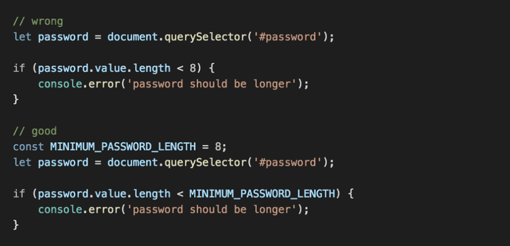
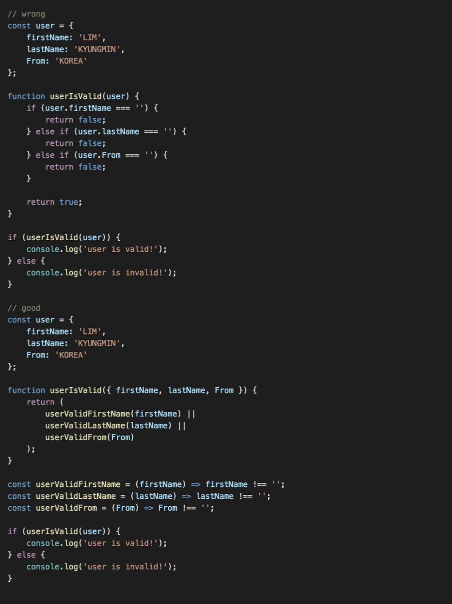
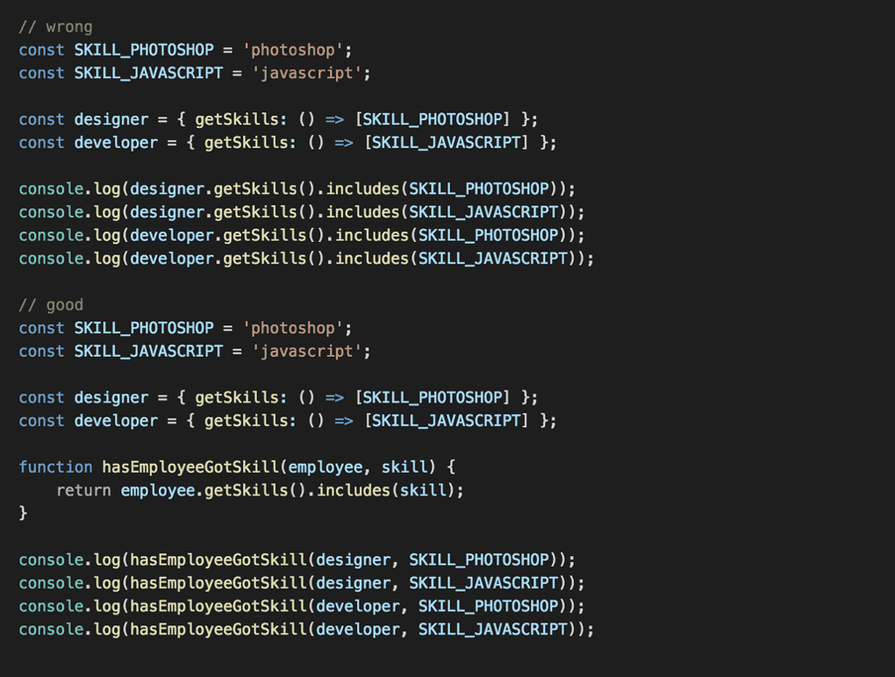
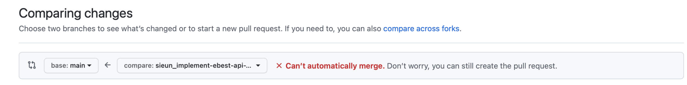
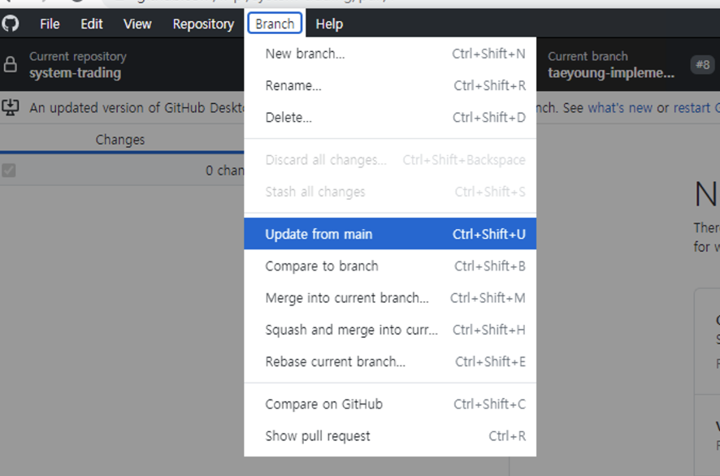

# 2021.10

## 10/1 (Fri)

### Graph

그래프 개념을 학습하고 정리했다.

* [Graph](/Algorithm/DataStructure/Graph.md)

## 10/2 (Sat)

### AWS Windows 서버 생성하기

Windows 개발 환경이 필요해서 알아보다가 AWS 프리 티어 서버를 생성했다. AWS 계정을 만들어 프리 티어용 Windows 서버를 생성하고, MAC에서 Windows 서버에 연결하고, Windows 서버 환경 설정을 진행했다. 설정 과정은 다음 페이지에 정리했다.

* [#1 AWS 무료 Windows 서버 생성하기 (AWS 프리 티어)](/Virtualization/AWS/01_Create_EC2_Server.md)
* [#2 MAC에서 AWS 서버에 접속하기](/Virtualization/AWS/02_Connect_EC2_from_MAC.md)
* [#3 Windows 서버 초기 환경 설정](/Virtualization/AWS/03_Windows_Server_Initial_Setting.md)

## 10/4 (Mon)

### COM(Component Object Model)

COM(Component Object Model)은 MS에서 내놓은 일종의 프로그래밍 표준이다. COM에 대한 자료를 찾던 중 아래 사이트가 도움이 되어 링크와 일부 내용을 남긴다.

#### 원문 링크

- [tipssoft: COM(Component Object Model)의 개념 - Step 1](http://www.tipssoft.com/bulletin/board.php?bo_table=FAQ&wr_id=762)
- [tipssoft: COM(Component Object Model)의 개념 - Step 2](http://www.tipssoft.com/bulletin/board.php?bo_table=FAQ&wr_id=763)

#### 인용

"소프트웨어 세계에서는 예전부터 이미 만들어진 소프트웨어를 재사용하지 못하고 처음부터 다시 제작해야 하는 비효율성에 대해 많은 고민을 해왔습니다. 이러한 고민을 해결하기 위해 하나의 프로그램에 모든 기능을 구현하는 것이 아닌 여러개의 컴포넌트로 분할하여 사용하는 것이 효과적이겠다는 결론을 내렸습니다. 이와 같이 구현된다면 레고블록으로 조립하듯이 필요한 기능을 담고 있는 컴포넌트를 선택하여 자신의 프로그램에 사용함으로써 타인이 구현한 코드를 재사용 할 수 있게 되는 것입니다. 
 
하지만 위와 같은 컴포넌트 개념을 사용하기에 앞서서 생각해 보아야 할 점이 있습니다. 모든 개발자가 동일한 언어로 프로그램을 개발하지 않기 때문에 재사용에 있어서 많은 제약이 생기게 됩니다. VC++ 개발자가 필요한 기능의 컴포넌트를 찾았는데 이 컴포넌트가 VB으로 작성되어 있다면 사용할 수 없습니다. 따라서 개발 언어, 개발툴에 상관없이 호환이 가능한 컴포넌트의 사용을 위해 마이크로소프트가 규정한 표준화된 방법이 바로 COM(Component Object Model)입니다. 
 
COM을 이용한 컴포넌트들은 동일한 인터페이스를 통해 VB, VC++, 델파이 등 언어나 개발툴에 상관없이 코드를 재사용할 수 있다는 점에서 이점을 띄고 있습니다."

## 10/5 (Tue)

### Paging Pool, Non-Paging Pool


#### Virtual Memory

가상 메모리는 실제 물리 메모리(RAM)을 관리하는 하나의 방법으로, 가상의 메모리 주소를 주는 방식이다.

- 가상으로 주어진 주소: 가상 주소(Virtual Address) 또는 논리 주소(Logical Address)
- 실제 메모리 상에서 유효한 주소: 물리 주소(Physical Address) 또는 실 주소(Logical Address)

가상 주소 공간은 메모리 관리 장치(MMU)에 의해 물리 주소로 변환된다.

#### Page와 Frame

- Page: 가상 메모리를 일정한 크기로 나눈 블록. 가상 메모리를 사용하는 최소 크기 단위
- Frame: 물리 메모리를 일정한 크기로 나눈 블록
- Page와 Frame의 크기는 같다.

#### Page Table

프로세스의 페이지 정보를 저장하고 있으며, 하나의 프로세스는 하나의 페이지 테이블을 가진다.

- 색인: 페이지 번호
- 내용: 해당 페이지에 할당된 물리 메모리(Frame)의 시작 주소. 시작 주소와 페이지 주소를 결합하여 물리 메모리 주소를 알 수 있다.

#### Paged Pool

실제 메모리에서 제거되어 페이징 파일에 기록될 수도 있고 (Page out), 반대로 페이징 파일에서 실제 메모리로 올라올 수도 있는(Page in) 시스템 공간의 가상 메모리 영역이다.

#### Non-Paged Pool

언제나 실제 메모리에 상주하는 공간으로, 페이지 폴트를 내지 않고 엑세스 할 수 있다고 보장된 시스템 가상 주소 영역이다. 고수준 IRQL 프로세스에서도 오류 없이 접근이 가능하고 접근 속도도 빠르다는 장점이 있다. 

실제로 커널 오브젝트의 일부와 커널 드라이버 등이 주로 이 메모리에 할당된다. 하지만 메모리 공간을 제한해서 확보한 것이기 때문에, 이 공간을 다 사용하면 할당에 실패한다. 일부 잘못된 드라이버나 프로그램이 Non-Paged Pool에 할당될 경우 문제가 발생한다.

#### Page Fault

Page를 Frame과 매칭하지 못했을 경우 발생하는 오류

#### Reference

- https://yongj.in/rust%20os/rust-os-intoduction-to-paging/

### 개발 스터디에서 배운 것

오늘 개발 스터디에서는 각자 작성한 API 구현 코드를 소개하고, 코드를 작성하며 고려한 점 또는 느낀 점을 공유했다. 추가로, 앞으로 진행할 코드 리뷰 방식을 결정하고, 개발 로드맵을 작성했다. 금일 스터디에서는 다음 것들을 배웠다.

- 지난 과제를 하며 궁금했던 점을 해결했다.
  + Python의 abstract class를 사용하여 API를 추상화할 수 있었다.
  + 디렉토리 구조는 아키텍처 구조와 일치시키는 것이 좋다.
  
- 함수를 구현하기 전 interface를 먼저 작성해 보는 과정이 필요함을 알게 되었다.
  + interface는 함수의 이름, 입력 데이터, 반환 데이터 등을 포함한다.
  + 보다 정돈된 함수 구조를 만드는 데 도움이 많이 될 것 같다.
  
- git으로 협업하는 방법(github-flow)에 대해 배웠다.
  + branch 생성부터 PR 생성, 코드 리뷰, merge까지 git을 사용하여 협업하는 전체 flow를 배우고 정리할 수 있었다.
  + github desktop 애플리케이션을 사용하면 git을 보다 편리하게 사용할 수 있음을 알게 되었다.
  
- 개발 로드맵을 작성했다.
  + 대략적인 개발 로드맵을 결정하니 스터디 계획을 세우는 것이 수월해졌다.

## 10/6 (Wed)

### 클린 아키텍처 5부 - 15,16장

클린 아키텍처 5부 중 15, 16장을 읽고 정리했다.

* [#5 아키텍처의 역할과 결합 분리 모드](/Architecture/CleanArchitecture/05_Architecture.md)

## 10/8 (Fri)

### 클린 아키텍처 5부 - 17,18장

클린 아키텍처 5부 중 17, 18장을 읽고 정리했다.

* [#6 아키텍처의 경계 해부학](/Architecture/CleanArchitecture/06_Architecture_Boundary.md)

## 10/9 (Sat)

### 클린 아키텍처 5부 - 19-22장

클린 아키텍처 5부 중 19-22장을 읽고 정리했다. 클린 아키텍처 책을 본격적으로 읽기 전, 인터넷으로 자료를 찾아보며 22장 클린 아키텍처의 원형 계층을 먼저 접한 적이 있었다. 그 때는 엔티티, 유스케이스 등의 계층과 의존성 방향 등의 개념이 생소해서 쉽게 이해하기는 어려웠다. 책을 처음부터 읽으며 22장을 다시 읽게 되니, 이제는 각 계층이 필요한 이유와 역할, 그리고 의존성 개념이 자연스럽게 이해가 되었다. 즐겁다!

* [#7 클린 아키텍처 계층과 규칙](/Architecture/CleanArchitecture/07_Clean_Architecture.md)

### Linked List 구현

Linked List 구현 시 다음과 같이 노드를 선언함으로써 노드의 생성과 삭제를 쉽게 구현할 수 있다. 

```C++
struct node {
    char ch; // data
    node* prev, * next;
    void alloc(char _ch, node* _prev, node* _next) {
        ch = _ch, prev = _prev, next = _next;
        prev->next = next->prev = this;
    }
    void pop() {
        prev->next = next;
        next->prev = prev;
    }
} * head, *tail, *cur, buf[MAX];
```

선언된 node의 alloc, pop 함수는 다음 방식으로 사용할 수 있다.

```C++
// 생성
buf[bufcnt++].alloc(str[i], cur->prev, cur);

// 삭제
if (cur->prev != head) cur->prev->pop();
```

## 10/10 (Sun)

### Python Naming Rule

- 모듈, 패키지
  + 모듈명은 가능한 짧은 소문자로 이름 짓는다.
  + 모듈명은 가독성을 위해 밑줄문자(_)를 사용한다.
  + 패키지명은 밑줄문자를 사용하지 않는다.
- 클래스
  + UpperCamelCase 형식으로 이름 짓는다.
  + 밑줄을 사용하지 않는다.
  + exception은 "Error"로 끝내는것을 권장한다.
- 변수, 함수, 메서드
  + 소문자가 원칙이며 가독성을 위해 밑줄 사용을 권장한다.
  + 보호 속성일 때 맨앞에 '_'를 붙여준다.
  + 키워드와 동일 변수일 때는 맨뒤에 '_'를 추가 한다.
  + 비공개 속성일 때는 맨앞에 '__' 더블언더를 추가한다.
  + 스폐셜 속성일 때는 앞과 뒤에 '__' 더블언더를 추가한다.
  + 인스턴스 메서드는 자신을 가리킬 때 self를 사용한다.
  + 클래스 메서드는 자신을 가리킬 때 cls를 사용한다.
- 상수
  + 모듈에서 정의되는 상수는 대문자로 작성 한다.
  + 단어마다 밑줄로 연결하는 ALL_CAPS 포맷으로 명명한다.

#### Reference
- https://www.python.org/dev/peps/pep-0008/#function-and-variable-names

### 추상 클래스

추상 클래스는 메서드의 목록만 가진 클래스이며, 상속받는 클래스에서 메서드 구현을 강제하기 위해 사용한다.

- 추상클래스는 구현되지 않은 추상메소드를 한 개 이상 가지며, 자식클래스는 해당 추상 메소드를 반드시 구현하도록 강제된다.
- 자식클래스가 추상메소드를 구현하지 않을 경우, 객체를 생성할 때 TypeError가 발생한다.
- 추상클래스는 안스턴스로 만들 수 없다. 오직 상속을 위해 사용한다.
- 추상클래스를 만들기 위해서는 반드시 abc 모듈을 import 해야한다.
  + abc: abstract base class의 약자

```Python
from abc import *
class 추상클래스명(metaclass=ABCMeta):

    @abstractmethod
    def 추상메소드(self):
        pass
```

#### Reference

- https://wikidocs.net/16075

### 클린 코드

개발 스더티에서 코드 리뷰를 받으면서 클린 코드 책을 하루 빨리 읽어야 겠다는 생각을 했다. 금일은 코드 리뷰를 통해 피드백 받은 내용을 정리했다.

#### MAGIC NUMBERS (명확한 의미가 없는 고유한 값)

명확한 의미가 없는 숫자는 명명된 상수로 바꾸는 것이 좋다. 고유한 값을 변수에 대입함으로써 변수명을 통해 의도를 전달하자.



#### LARGE FUNCTIONS (길게 늘여 놓은 함수)

기능이나 클래스가 크면 기능이 저하 됩니다. 그러므로 모듈화를 통해 함수를 분리해야 한다.



#### CODE REPETITION (반복되는 코드)

반복되는 코드는 가장 기본적인 에러 정정 코드다. 반복 대신 의도가 분명한 함수를 작성하자.



#### Reference

- https://ljlm0402.netlify.app/javascript/clean-code.1/#-코드를-보며

## 10/11 (Mon)

### 클린 아키텍처 5부 - 23-25장

클린 아키텍처 5부 중 23-25장을 읽고 정리했다. 내용 구성에 따라 다음 두 포스트에 나눠 정리했다.

* [#7 클린 아키텍처 계층과 규칙](/Architecture/CleanArchitecture/07_Clean_Architecture.md)
* [#8 계층과 경계](/Architecture/CleanArchitecture/08_Layers_and_Boundary.md)

## 10/12 (Tue)

### 개발 스터디에서 배운 것

오늘 개발 스터디에서는 실시간 체결 데이터 수신 API를 구현한 결과와 트레이딩 알고리즘을 조사한 결과를 공유했다. 추가로, 첫 코드 리뷰 후기를 공유하고 리뷰 방식을 구체화했다. 금일 스터디에서는 다음 것들을 배웠다.

- 실시간 체결 데이터 수신 API의 동작 방식을 이해했다.
- 이번 주 과제로 구현한 Real_S3 외에 Real_K3 기능을 추가로 구현해야한다는 것을 알게 되었다.
- 다양한 트레이딩 알고리즘에 대해 알게 되었다.
  + 내가 조사한 기본적인 알고리즘 외에도 돌파 전략, VWAP 전략 등의 매매 알고리즘을 알게 되었다.
- 트레이딩 효율을 높이기 위해 모든 종목의 실시간 데이터가 필요할 수 있다는 것을 인지했다.
  + 가능한 많은 종목의 실시간 체결 데이터를 받기 위한 방법을 찾는 것이 숙제로 남았다.
  + 사전 필터링, 멀티 프로세싱 등의 아이디어를 얻었다.
- 스터디 내 코드 리뷰 문화를 만들기 시작했다.
  + 첫 코드 리뷰 후기를 공유했다. 코드 리뷰가 서로에게 도움이 되는 것 같아 만족스러웠다.
  + 리뷰 사이클, PR 범위, 리뷰 내용 등의 초안을 함께 정했다. 스터디를 진행하며 더 좋은 리뷰 문화를 만들고 싶다.

## 10/13 (Wed)

### 클린 아키텍처 5부 - 26장

클린 아키텍처 26장을 읽고 정리했다.

  * [#9 메인, 서비스, 테스트](/Architecture/CleanArchitecture/09_Main_Service_Test.md)

### git PR issue

오늘 스터디 repo에 PR을 생성하려고하니, 다음과 같은 `can't automatically merge` 오류가 발생했다.



원인은 내 branch가 생성된 지 오래되어 main 최신 상태를 반영하지 못해서였다. github desktop에서 다음 방법으로 쉽게 해결했다.



github desktop 을 켜고 Branch > Update from main 을 선택하면 main의 최신 상태를 반영할 수 있다. 충돌이 있을 경우 vsc로 충돌하는 내용 중 어떤 것을 반영할 것인지 선택하면 된다. 해결!

## 10/14 (Thur)

### git 기본 개념 및 명령어

git을 사용하며 시스템을 대충은 이해하고 있었지만, 조금 더 명확하게 정리하고 싶어 git에 대해 정리했다. 형상 관리 시스템의 종류와 특징을 공부하고, git에서 사용하는 용어와 명령어들을 정리했다.

* [Git 시작하기: 개념, 명령어](/git/01_git_getting_started.md)

## 10/15 (Fri)

### 클린 아키텍처 5부 - 27,28장

클린 아키텍처 27, 28장을 읽고 정리했다.

  * [#9 메인, 서비스, 테스트](/Architecture/CleanArchitecture/09_Main_Service_Test.md)

### git add, commit, push 취소하기

git에서 add, commit, push 내용을 취소하는 방법을 정리했다. command를 사용하는 방식과 gitHub Desktop을 사용하는 방식 각각에 대해 알게 되었다.

* [Git add, commit, push 취소하기](/git/02_git_how_to_revert.md)

## 10/16-17 (Sat-Sun)

### 운영체제 - 컴퓨터 시스템 개요

운영체제 공부를 시작했다. 공룡책을 읽고 정리하다가 입문용으로는 내용이 너무 방대하게 느껴져서, 김덕수 교수님의 운영체제 강의를 듣기 시작했다. 1강을 듣고 다음 페이지에 정리했다.

* [#1 컴퓨터 시스템 개요](/ComputerScience/OperatingSystem/Course_CPA310_OperatingSystem/01_computer_system_overview.md)

## 10/18 (Mon)

### 클린 아키텍처 5부 - 29장

클린 아키텍처 29장 '클린 임베디드 아키텍처'를 학습했다. 최근 운영체제 공부를 하고 있는데, 관련된 내용이 나와서 더 흥미롭게 공부했다. 시스템 엔지니어로서, 앞으로 시스템 레벨 개발을 할 때도 클린 아키텍처를 적용할 수 있도록 노력해야겠다.

* [#10 클린 임베디드 아키텍처](/Architecture/CleanArchitecture/10_Clean_Embeded_Architecture.md)

### 프로그램 vs. 프로세스 vs. 프로세서 vs. 스레드

비슷한 세 용어를 정리해보자. 특히 프로세서와 프로세스는 이름이 아주 비슷하지만 전혀 다른 의미를 지니므로, 절대 혼용해서 사용하지 않도록 주의하자.

- 프로그램(Program)
  + 프로그램은 일반적으로 보조기억장치에 저장되어 있는 실행 코드와 데이터를 의미한다.
  
- 프로세스(Process)
  + 프로그램을 실행해서 프로그램이 실제 메모리에 적재되어 프로세서에 의해 실행되고 있는 것을 프로세스라고 부른다.
  + 운영체제는 여러 가지의 프로그램을 프로세스라는 단위로 실행한다. 각 프로그램은 한 개 이상의 프로세스로 구성된다.
- 스레드(Thread)
  + 프로세스 내에서 동작하는 실행의 흐름을 말한다.
  + 프로세스 내의 자원들은 같은 프로세스 상에 있는 스레드들끼리 공유하며 실행된다.

- 프로세서(Processor)
  + 프로세서는 컴퓨터 내에서 명령어을 처리하는 하드웨어 장치로, 흔히 CPU라고 불리는 그것이다. 프로세서는 하나 이상의 연산 장치와 제어 장치, 그리고 레지스터로 구성되어 있다.
  + 프로세서는 프로그램을 동작시켜 주는 역할을 한다.

### Git 원격 저장소에서 .pyc 파일 모두 지우기

.gitignore에 *.pyc 가 포함되어 있었는데, 뭘 잘못한건지 pyc 파일이 모두 원격 저장소에 푸시가 되었다. 찾아보니 git remove 명령어를 사용하여 쉽게 모든 pyc 파일을 제거할 수 있었다. 내용은 아래 페이지로 정리했다.

* [GitHub 원격 저장소에서 .pyc 파일 모두 지우기](/git/03_remove_all_pyc.md)

## 10/19 (Tue)

### 개발 스터디에서 배운 것

오늘 개발 스터디에서는 매수, 매도 기능을 구현한 결과를 공유하고 개발하며 고민한 부분에 대해 함께 논의했다. 또한, 새로운 코드 리뷰 문화를 제안하고, 다음 주제를 선정하며 스터디 진행 방식을 조금 더 구체화했다. 오늘 스터디에서는 다음 것들을 배우고 느꼈다.

- XAQuery에서 클래스마다 다른 종류의 InBound와 OutBound를 사용하는 것을 처리하는 방법에 대해 이야기했다. 
  + 우선은 현재 구현한 것처럼 get_result 함수의 세부 구현을 각 기능 클래스에서 영역에서 함으로써, 원하는 변수를 사용하도록 둘 생각이다.
  + 더 좋은 방법이 있을지 고민이 필요하다.
- 매수/매도 기능 구현 시 input, output 인자를 어떻게 처리할지에 대해 이야기했다.
  + input, output 인자 중 꼭 필요한 내용을 구분해두는 작업이 필요하겠다고 생각했다.
- 리뷰 마니또라는 새로운 코드 리뷰 문화를 도입했다.
- 다음 과제로 구현할 클래스들의 정의와 인터페이스 일부를 함께 작성했다.
  + 클래스의 개요와 인터페이스를 같이 이야기하고 정하는 과정을 함께 함으로써, 모두가 같은 관점으로 프로그램과 클래스를 바라볼 수 있게 되었다.
  + 기능 구현 및 코드 리뷰에도 도움이 많이 될 것 같다.
