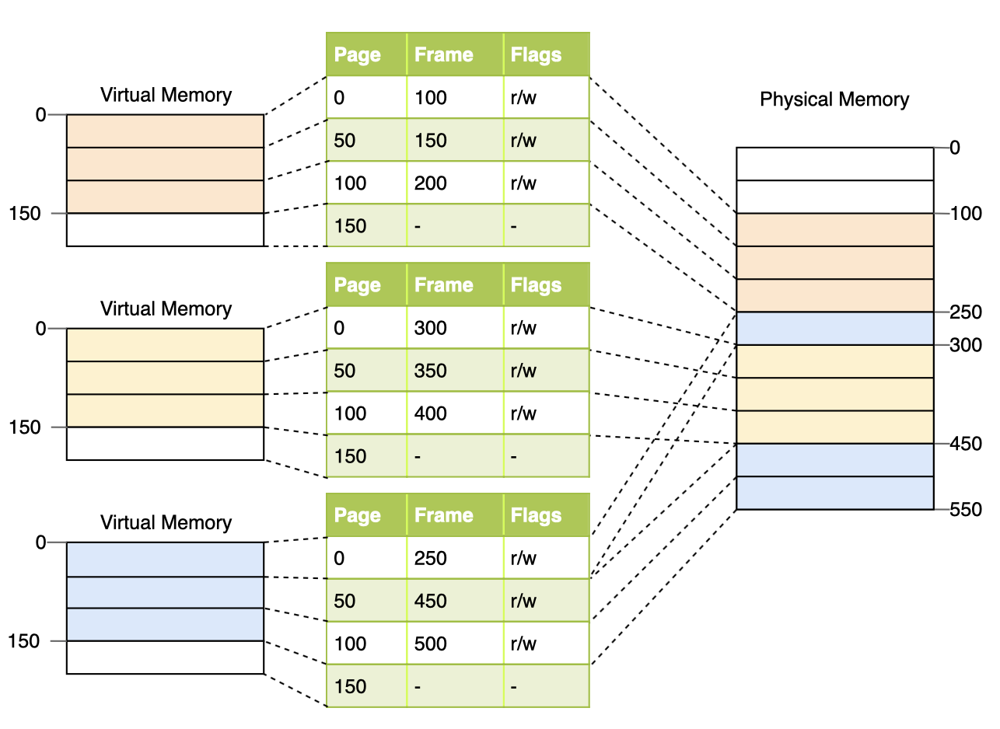

# 2021.10

## 10/1 (Fri)

### Graph

그래프 개념을 학습하고 정리했다.

* [Graph](/Algorithm/DataStructure/Graph.md)

## 10/2 (Sat)

### AWS Windows 서버 생성하기

Windows 개발 환경이 필요해서 알아보다가 AWS 프리 티어 서버를 생성했다. AWS 계정을 만들어 프리 티어용 Windows 서버를 생성하고, MAC에서 Windows 서버에 연결하고, Windows 서버 환경 설정을 진행했다. 설정 과정은 다음 페이지에 정리했다.

* [#1 AWS 무료 Windows 서버 생성하기 (AWS 프리 티어)](/Virtualization/AWS/01_Create_EC2_Server.md)
* [#2 MAC에서 AWS 서버에 접속하기](/Virtualization/AWS/02_Connect_EC2_from_MAC.md)
* [#3 Windows 서버 초기 환경 설정](/Virtualization/AWS/03_Windows_Server_Initial_Setting.md)

## 10/4 (Mon)

### COM(Component Object Model)

COM(Component Object Model)은 MS에서 내놓은 일종의 프로그래밍 표준이다. COM에 대한 자료를 찾던 중 아래 사이트가 도움이 되어 링크와 일부 내용을 남긴다.

#### 원문 링크

- [tipssoft: COM(Component Object Model)의 개념 - Step 1](http://www.tipssoft.com/bulletin/board.php?bo_table=FAQ&wr_id=762)
- [tipssoft: COM(Component Object Model)의 개념 - Step 2](http://www.tipssoft.com/bulletin/board.php?bo_table=FAQ&wr_id=763)

#### 인용

"소프트웨어 세계에서는 예전부터 이미 만들어진 소프트웨어를 재사용하지 못하고 처음부터 다시 제작해야 하는 비효율성에 대해 많은 고민을 해왔습니다. 이러한 고민을 해결하기 위해 하나의 프로그램에 모든 기능을 구현하는 것이 아닌 여러개의 컴포넌트로 분할하여 사용하는 것이 효과적이겠다는 결론을 내렸습니다. 이와 같이 구현된다면 레고블록으로 조립하듯이 필요한 기능을 담고 있는 컴포넌트를 선택하여 자신의 프로그램에 사용함으로써 타인이 구현한 코드를 재사용 할 수 있게 되는 것입니다. 
 
하지만 위와 같은 컴포넌트 개념을 사용하기에 앞서서 생각해 보아야 할 점이 있습니다. 모든 개발자가 동일한 언어로 프로그램을 개발하지 않기 때문에 재사용에 있어서 많은 제약이 생기게 됩니다. VC++ 개발자가 필요한 기능의 컴포넌트를 찾았는데 이 컴포넌트가 VB으로 작성되어 있다면 사용할 수 없습니다. 따라서 개발 언어, 개발툴에 상관없이 호환이 가능한 컴포넌트의 사용을 위해 마이크로소프트가 규정한 표준화된 방법이 바로 COM(Component Object Model)입니다. 
 
COM을 이용한 컴포넌트들은 동일한 인터페이스를 통해 VB, VC++, 델파이 등 언어나 개발툴에 상관없이 코드를 재사용할 수 있다는 점에서 이점을 띄고 있습니다."

## 10/5 (Tue)

### Paging Pool, Non-Paging Pool



#### Virtual Memory

가상 메모리는 실제 물리 메모리(RAM)을 관리하는 하나의 방법으로, 가상의 메모리 주소를 주는 방식이다.

- 가상으로 주어진 주소: 가상 주소(Virtual Address) 또는 논리 주소(Logical Address)
- 실제 메모리 상에서 유효한 주소: 물리 주소(Physical Address) 또는 실 주소(Logical Address)

가상 주소 공간은 메모리 관리 장치(MMU)에 의해 물리 주소로 변환된다.

#### Page와 Frame

- Page: 가상 메모리를 일정한 크기로 나눈 블록. 가상 메모리를 사용하는 최소 크기 단위
- Frame: 물리 메모리를 일정한 크기로 나눈 블록
- Page와 Frame의 크기는 같다.

#### Page Table

프로세스의 페이지 정보를 저장하고 있으며, 하나의 프로세스는 하나의 페이지 테이블을 가진다.

- 색인: 페이지 번호
- 내용: 해당 페이지에 할당된 물리 메모리(Frame)의 시작 주소. 시작 주소와 페이지 주소를 결합하여 물리 메모리 주소를 알 수 있다.

#### Paged Pool

실제 메모리에서 제거되어 페이징 파일에 기록될 수도 있고 (Page out), 반대로 페이징 파일에서 실제 메모리로 올라올 수도 있는(Page in) 시스템 공간의 가상 메모리 영역이다.

#### Non-Paged Pool

언제나 실제 메모리에 상주하는 공간으로, 페이지 폴트를 내지 않고 엑세스 할 수 있다고 보장된 시스템 가상 주소 영역이다. 고수준 IRQL 프로세스에서도 오류 없이 접근이 가능하고 접근 속도도 빠르다는 장점이 있다. 

실제로 커널 오브젝트의 일부와 커널 드라이버 등이 주로 이 메모리에 할당된다. 하지만 메모리 공간을 제한해서 확보한 것이기 때문에, 이 공간을 다 사용하면 할당에 실패한다. 일부 잘못된 드라이버나 프로그램이 Non-Paged Pool에 할당될 경우 문제가 발생한다.

#### Page Fault

Page를 Frame과 매칭하지 못했을 경우 발생하는 오류

#### Reference

- https://yongj.in/rust%20os/rust-os-intoduction-to-paging/

### 개발 스터디에서 배운 것

오늘 개발 스터디에서는 각자 작성한 API 구현 코드를 소개하고, 코드를 작성하며 고려한 점 또는 느낀 점을 공유했다. 추가로, 앞으로 진행할 코드 리뷰 방식을 결정하고, 개발 로드맵을 작성했다. 금일 스터디에서는 다음 것들을 배웠다.

- 지난 과제를 하며 궁금했던 점을 해결했다.
  + Python의 abstract class를 사용하여 API를 추상화할 수 있었다.
  + 디렉토리 구조는 아키텍처 구조와 일치시키는 것이 좋다.
  
- 함수를 구현하기 전 interface를 먼저 작성해 보는 과정이 필요함을 알게 되었다.
  + interface는 함수의 이름, 입력 데이터, 반환 데이터 등을 포함한다.
  + 보다 정돈된 함수 구조를 만드는 데 도움이 많이 될 것 같다.
  
- git으로 협업하는 방법(github-flow)에 대해 배웠다.
  + branch 생성부터 PR 생성, 코드 리뷰, merge까지 git을 사용하여 협업하는 전체 flow를 배우고 정리할 수 있었다.
  + github desktop 애플리케이션을 사용하면 git을 보다 편리하게 사용할 수 있음을 알게 되었다.
  
- 개발 로드맵을 작성했다.
  + 대략적인 개발 로드맵을 결정하니 스터디 계획을 세우는 것이 수월해졌다.

## 10/6 (Wed)

### 클린 아키텍처 5부 - 15,16장

클린 아키텍처 5부 중 15, 16장을 읽고 정리했다.

* [#5 아키텍처의 역할과 결합 분리 모드](/Architecture/CleanArchitecture/05_Architecture.md)

## 10/8 (Fri)

### 클린 아키텍처 5부 - 17,18장

클린 아키텍처 5부 중 17, 18장을 읽고 정리했다.

* [#6 아키텍처의 경계 해부학](/Architecture/CleanArchitecture/06_Architecture_Boundary.md)

## 10/9 (Sat)

### 클린 아키텍처 6부 - 19-22장

클린 아키텍처 5부 중 19-22장을 읽고 정리했다. 클린 아키텍처 책을 본격적으로 읽기 전, 인터넷으로 자료를 찾아보며 22장 클린 아키텍처의 원형 계층을 먼저 접한 적이 있었다. 그 때는 엔티티, 유스케이스 등의 계층과 의존성 방향 등의 개념이 생소해서 쉽게 이해하기는 어려웠다. 책을 처음부터 읽으며 22장을 다시 읽게 되니, 이제는 각 계층이 필요한 이유와 역할, 그리고 의존성 개념이 자연스럽게 이해가 되었다. 즐겁다!

* [#7 클린 아키텍처 계층과 규칙](/Architecture/CleanArchitecture/07_Clean_Architecture.md)

### Linked List 구현

Linked List 구현 시 다음과 같이 노드를 선언함으로써 노드의 생성과 삭제를 쉽게 구현할 수 있다. 

```C++
struct node {
    char ch; // data
    node* prev, * next;
    void alloc(char _ch, node* _prev, node* _next) {
        ch = _ch, prev = _prev, next = _next;
        prev->next = next->prev = this;
    }
    void pop() {
        prev->next = next;
        next->prev = prev;
    }
} * head, *tail, *cur, buf[MAX];
```

선언된 node의 alloc, pop 함수는 다음 방식으로 사용할 수 있다.

```C++
// 생성
buf[bufcnt++].alloc(str[i], cur->prev, cur);

// 삭제
if (cur->prev != head) cur->prev->pop();
```