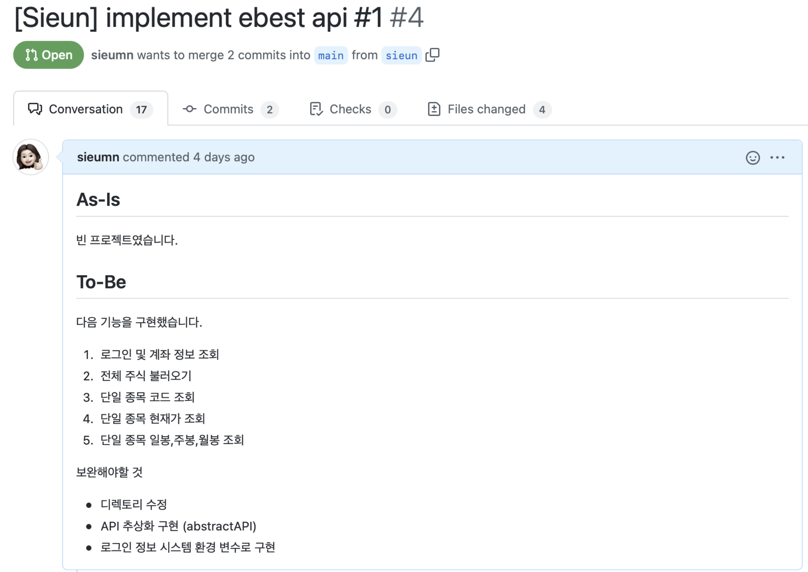
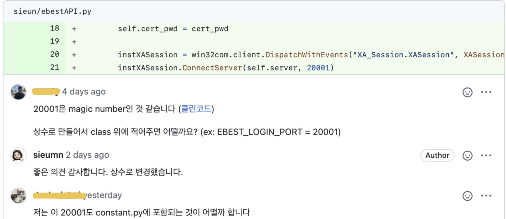
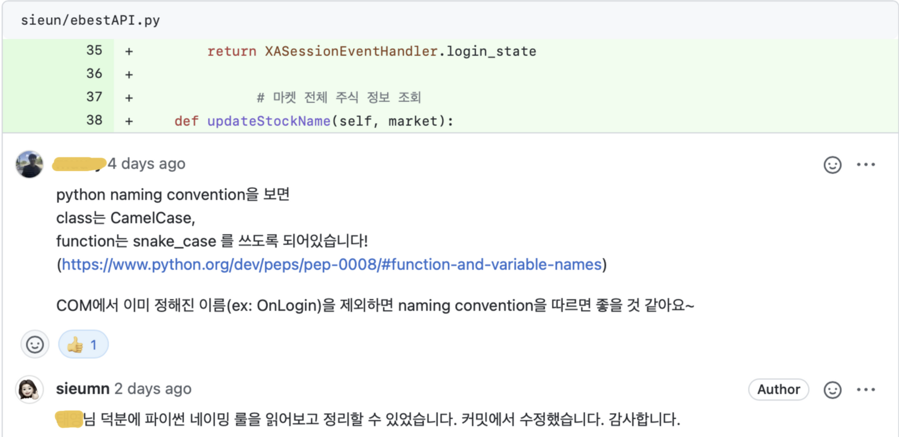
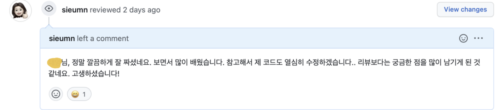
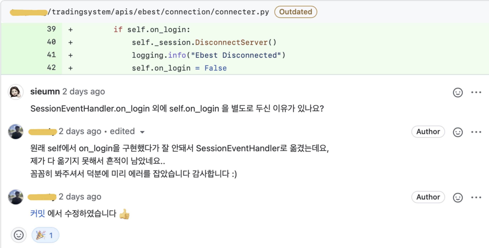
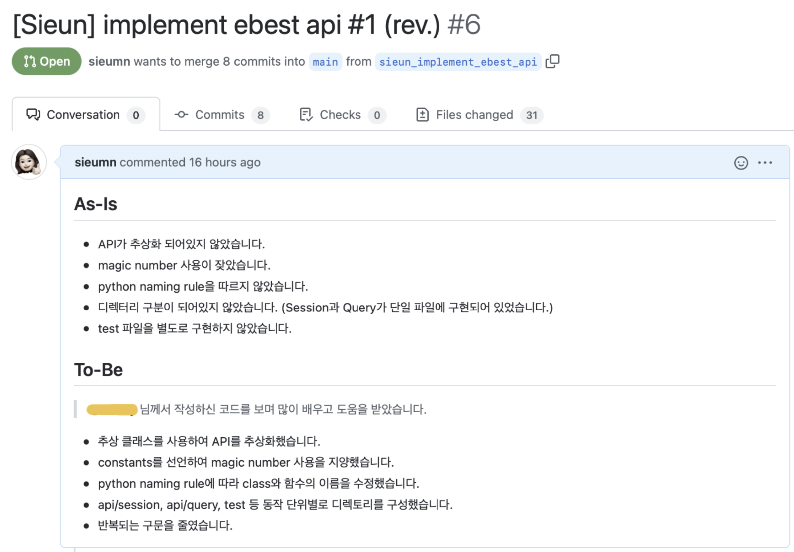

# #3 개발 스터디 첫 코드 리뷰 회고

> 시스템 트레이딩 개발 스터디 3주차 회고 (2021.10.05 - 10.11)

## 코드 리뷰, 이렇게까지 해야 하나?

코드 리뷰를 처음 접한 건 올해 초 회사에서였다. 코드 리뷰가 무엇인가 했더니, 코드 작성을 완성한 후 작성자가 아닌 제3자가 작성한 코드에 대해 리뷰를 하는 것이라고 했다. 리뷰 내용에는 기능과 오류에 대한 리뷰뿐만 아니라, 가독성, 코드 스타일, 네이밍 룰 준수 여부 등 코드 그 자체에 대한 리뷰도 포함된다고 들었다.

여러 사람이 협업하다 보면 잘못된 코드가 병합될 여지가 있기 때문에, 작성된 코드의 기능을 꼼꼼하게 검토하고 오류를 체크하는 것의 필요성에는 충분히 공감했다. 하지만 코드 스타일의 경우라면? '다른 사람이 이해할 수 있을 정도로 깔끔하게 구현하고, 코드가 정상적으로 기능하면 충분한 것 아닌가?'라는 것이 당시의 솔직한 속마음이었다. 고백하건대, 띄어쓰기 칸 수와 명명 규칙까지 똑같이 맞춰야 한다는 것은 조금 피곤하게 들리기도 했다. 불행인지 다행인지, 그동안 회사에서 직접 코드 리뷰를 하거나 받아볼 기회는 없었다.

## 클린 아키텍처와 클린 코드

코드 리뷰에 대한 생각이 완전히 바뀐 것은 클린 아키텍처를 읽기 시작하면서부터일 것이다. 클린 아키텍처를 읽으면서, 내가 얼마나 무지한 방식으로 소프트웨어를 대하고 있었는지 깨달았다. 좋은 아키텍처에 대해 고민하고, 좋은 소프트웨어를 만들기 위해 할 수 있는 일을 생각하기 시작했다. 유연한 소프트웨어를 만들기 위해서는 소프트웨어의 계층을 분리하고, 고수준 정책을 격리하고, 세부 사항을 추상화해야 한다는 사실을 배웠다. 개인 및 단체 프로젝트에서 꼭 좋은 아키텍처를 적용하겠노라 다짐했다. 그리고, 만약 여러 사람이 협업하여 하나의 소프트웨어를 만든다면, 관여하는 모든 엔지니어가 '좋은 소프트웨어'에 대한 같은 가치관과 규칙을 공유하는 것이 필요하겠다는 생각을 하게 되었다.

좋은 소프트웨어에 대한 고민과 관심은 이내 클린 아키텍처를 넘어, 클린 코드로 이어졌다. '좋은 소프트웨어'라는 이름으로 공유되는 가치관과 규칙은 아키텍처뿐만 아니라 코드 레벨에서도 적용되어야 한다는 것을 자연스럽게 받아들이게 되었다. 명명 규칙을 맞추고 띄어쓰기 수준까지 정하는 것이 더는 피곤하게 들리지 않았다. 모두가 각자 다른 방식으로 코드를 짜고 아키텍처를 구성했을 때 벌어질 결과가 분명 더 피곤할 것을 알게 되었기 때문이다.

## 우리도 코드 리뷰를 해보자.

 개발 스터디를 하면서 작성하는 코드에 클린 코드와 클린 아키텍처를 적용해보기로 다짐했다. 하지만, 마음처럼 쉬운 일이 아니었다. 깨끗한 코드를 작성해본 경험이 없으니, 막연한 느낌이 들었다. 그러던 중 스터디 멤버인 Y 님이 코드 리뷰를 제안했다. '아, 지금 나에게 필요한 게 코드 리뷰구나.' 그 순간 깨달았다. 

## 첫 PR, 첫 코드 리뷰 받기

 스터디에서는 코드 리뷰를 위해 git-flow 협업 방식을 채택했다. 지난 주, 위와 같이 첫 번째 PR을 등록했다. 스터디에서 함께 만든 규칙대로, 코드 리뷰를 요청할 때 코드의 변경 사항을 함께 기록했다.

첫 번째 코드 리뷰를 받았다. 다른 사람들이 내 코드를 읽고 의견을 남겨주는 것만으로도 정말 많이 배울 수 있는 기회가 되었다. Magic numbers 사용, Python naming convention, 클린 코드 적용 등 미처 고려하지 못했던 좋은 피드백을 많이 받았다. 피드백을 반영하여 훨씬 정돈된 코드를 작성할 수 있었고, 다음 과제부터 어떤 점을 더 신경 써야 할지 알게 되었다.

## 다른 사람의 코드를 리뷰해주기

반대로 내가 다른 스터디원이 올린 코드를 리뷰하는 시간도 가졌다. 클린 코드, 클린 아키텍처를 훨씬 잘 적용하는 스터디원의 코드를 보며 놀랐고, 정말 많이 배웠다. 

리뷰를 남기기 위해 각 변수와 함수의 기능, 이름, 구성 등을 이해하고, 작성 의도를 파악하기 위해 노력했다. 의문점이나 궁금한 점이 생기면 리뷰로 남겼다. 그러다가 실수를 잡아주기도 했는데, 내 리뷰로 도움을 줄 수 있어 기뻤다. 코드 리뷰를 하지 않았다면 다른 사람의 코드를 이렇게 자세하게 들여다볼 기회가 있었을까? 아마 없었을 것이다.

또 놀랐던 점 중 하나는, 다른 분의 코드를 보는 일이 어렵지 않았다는 것이다. 다른 사람이 작성한 코드를 볼 때, 작성자의 생각의 흐름을 따라 프로그램 구성을 이해하는 것에 어려움을 느꼈던 경험이 많이 있었다. 하지만 소프트웨어 아키텍처, 코드 스타일 등에 대한 동일한 가치관을 공유하는 사용하는 사람의 코드를 보는 일에는 불필요한 어려움이 없었다. 그저 함수와 변수의 본질 자체에만 집중하며 리뷰할 수 있었다. 코드 리뷰의 필요성에 다시 한번 공감할 수 있던 순간이었다.

## 리뷰를 기반으로 코드 수정하기

내가 받은 리뷰 내용, 그리고 다른 사람들의 코드를 리뷰하며 배운 점을 정리하여 새로운 코드를 작성했다. 일주일 전에 혼자서 작성했던 코드보다 훨씬 깨끗하고 정돈된 프로그램을 만들 수 있게 되었다.

## 코드 리뷰, 이렇게까지 해보자.

첫 코드 리뷰를 하며, 기대했던 것보다 훨씬 많은 것을 배우고 얻었다. 고작 일주일 새 한 계단을 오른 것 같은 시원한 기분을 느낀다. 주는 것에 비해 너무 많은 것을 얻고 있는 것은 아닌가, 하는 부채감도 있지만, 그럴수록 할 수 있는 일은 더 많이 공부하고 노력해서 더 큰 도움으로 갚는 것뿐이다. 더 열심히 리뷰하고, 내 코드에 더 깊은 고민을 적용해서 다른 멤버들에게도 큰 도움을 줄 수 있는 코드 리뷰 시간을 만들어 가겠다고 다짐한다. 코드 리뷰를 하면서 더 좋은 개발 습관을 만들고, 좋은 소프트웨어에 대한 더 깊은 고민을 지속하고, 더 많은 토의를 할 수 있기를 기대한다.