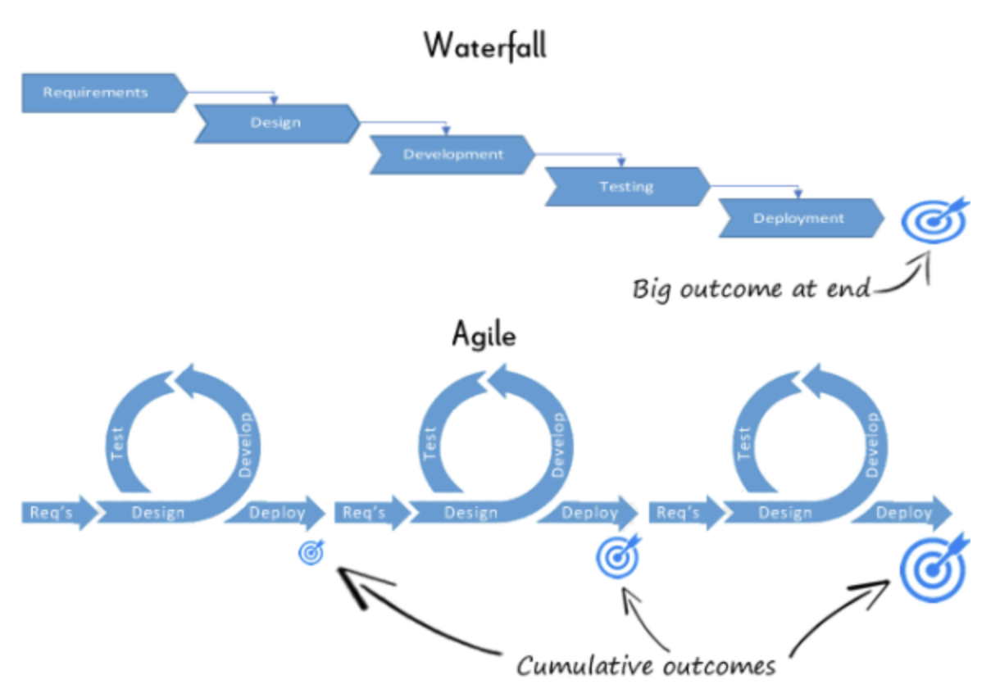
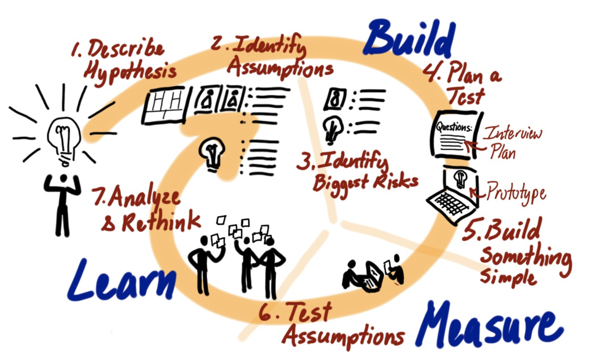

# 2021.11

## 11/1 (Mon)

### 클린 코드 시작

클린 코드를 시작했다. 1장을 읽고 정리했다. 12월까지 완독 목표!

* [#1 깨끗한 코드](/clean-code/01_clean-code.md)

## 11/2 (Tue)

### 운영체제 - 5부. 프로세스 스케줄링

운영체제 강의의 Lec 5. Process Scheduling을 듣고 다음 페이지에 정리했다.

* [#5 프로세스 스케줄링](/operating-system/course_CPA310-operating-system/05_process-scheduling.md)

### 개발 스터디에서 배운 것

오늘 개발 스터디에서는 지난 일주일간의 근황을 공유하고, 앞으로의 4주를 계획했다. 기존에는 매주 다음 일주일간 할 과제를 논의하는 방식으로 스터디를 운영했는데, 스터디 효율을 높이기 위해 조금 더 장기적인 계획을 세워보기로 했다. 오늘 스터디에서는 다음과 같은 것들을 배웠다.

- 버퍼 기간을 도입하기를 정말 잘했다.
    + 한주 쉬고 나니 에너지 충전이 되었다. 다음 4주는 더 열심히 할 수 있을 것 같다는 생각이 든다.
    + 버퍼 기간 덕분에 지금까지의 스터디 진행을 돌아보고, 방향을 새롭게 결정할 수 있었다.
- 중장기적인 목표를 세우는 것이 중요하다는 것을 알게 되었다.
    + 중기: 4주 뒤의 목표를 세우고 나니, 앞으로 무엇을 하면 좋을지 결정하는 것이 쉬워졌다.
    + 장기: 완성 본의 형태를 직접 보니, 결과물에 대한 막연함이 해소되고 동기부여가 잘 된다.
- 일부 기능은 분담해서 구현하는 것을 고려해 보기로 했다. 선택과 집중을 하는 것도 좋은 선택지라고 생각했다.

## 11/3 (Wed)

### 클린 코드 - 2장. 의미 있는 이름

클린 코드 2장을 읽고 정리했다. 공부한 것들은 코드 리뷰 시간에 잘 적용시키려고 노력해 봐야지.

* [#2 의미 있는 이름](/clean-code/02_meaningful-name.md)

## 11/7 (Sun)

### Python - schedule library

파이썬의 schedule 라이브러리는 특정 작업을 지정된 시간에 실행시킬 때 사용하는 라이브러리다. 매일 또는 지정된 요일에 주기적으로 실행하는 것도 가능하다.

- [Python | Schedule Library](https://www.geeksforgeeks.org/python-schedule-library/)

#### schedule 모듈 설치

```python
pip install schedule 
```

#### schedule.Scheduler class

- `schedule.every(interval=1)`
  + 새로운 정기 작업을 예약한다.
- `schedule.run_pending()`
  + 예약된 모든 작업을 실행한다.
- `schedule.run_all(delay_seconds=0)`
  + 실행 예약 여부에 관계없이 모든 작업을 실행한다.
- `schedule.idle_seconds()`
  + 대기 시간을 반환한다.
- `schedule.next_run()`
  + 다음 작업을 실행해야 하는 날짜/시간을 반환한다.
- `schedule.cancel_job(job)`
  + 예약된 작업을 삭제한다.

#### schedule.Job(interval, scheduler=None) class

interval과 scheduler라는 두 개의 parameter를 사용하여 특정 시간에 특정 작업을 예약한다.

- `at(time_str)`
  + 매일 특정 시간에 작업을 예약한다. 이것을 호출하는 것은 N일마다 실행되도록 예약된 작업에만 유효하다.
  + parameters: time_str (XX:YY 형식의 문자열)
  + returns: 호출된 작업 인스턴스

- `do(job_func, *args, **kwargs)`
  + 작업이 실행될 때마다 호출되어야 하는 job_func를 지정한다. 추가 인수는 작업이 실행될 때 job_func에 전달되는 값이다.
  + parameters: job_func (예약될 함수)
  + returns: 호출된 작업 인스턴스

- `run()`
  + 작업을 실행하고 즉시 다시 스캐줄링한다.
  + returns: job_func에서 반환한 반환값

- `to(latest)`
  + 불규칙한(무작위) 간격으로 작업이 실행되도록 예약한다.
  + 예를 들어 every(A).to(B).seconds는 A <= N <= B가 되도록 N초마다 작업 함수를 실행한다.

#### implementation

```Python
# Schedule Library imported
import schedule
import time
  
# Functions setup
def sudo_placement():
    print("Get ready for Sudo Placement at Geeksforgeeks")
  
def good_luck():
    print("Good Luck for Test")
  
def work():
    print("Study and work hard")
  
def bedtime():
    print("It is bed time go rest")
      
def geeks():
    print("Shaurya says Geeksforgeeks")
  
# Task scheduling
# After every 10mins geeks() is called. 
schedule.every(10).minutes.do(geeks)
  
# After every hour geeks() is called.
schedule.every().hour.do(geeks)
  
# Every day at 12am or 00:00 time bedtime() is called.
schedule.every().day.at("00:00").do(bedtime)
  
# After every 5 to 10mins in between run work()
schedule.every(5).to(10).minutes.do(work)
  
# Every monday good_luck() is called
schedule.every().monday.do(good_luck)
  
# Every tuesday at 18:00 sudo_placement() is called
schedule.every().tuesday.at("18:00").do(sudo_placement)

# 매분 23초에 job 실행
schedule.every().minute.at(":23").do(job)
# 매시간 42분에 작업 실행
schedule.every().hour.at(":42").do(job)

# Loop so that the scheduling task
# keeps on running all time.
while True:
  
    # Checks whether a scheduled task 
    # is pending to run or not
    schedule.run_pending()
    time.sleep(1)
```

## 11/8 (Mon)

### SQL vs NoSQL

다양한 데이터베이스 종류에 대해 알기 위해, SQL과 NoSQL의 차이에 대해 공부하고 정리했다. 또한 RDBMS 중 SQLite와 MySQL에 대해 공부했다.

* [SQL vs. NoSQL 비교](/database/sql-vs-nosql.md)
* [RDBMS: SQLite 알아보기](/database/sql-sqlite.md)
* [RDBMS: MySQL 알아보기](/database/sql-mysql.md)

## 11/9 (Tue)

### 운영체제 - 6부. 프로세스 동기화와 상호 배제 (1)

운영체제 6부를 정리했다. 프로세스 동기화에 대해 공부하고, 동기화를 구현하기 위한 SW, HW적 상호 배제 솔루션에 대해 학습하고 정리했다.

* [#6 프로세스 동기화와 상호 배제 (1)](/operating-system/course_CPA310-operating-system/06_process-synchronization.md)

### 개발 스터디에서 배운 것

오늘 개발 스터디에서는 지난 일주일간의 근황을 공유하고, 지난 과제였던 DB 조사 내용과 스케줄러 구현 내용을  공유했다.

- 미팅 시작할 때 체크인 시간을 갖는 것이 만족스럽다. 오늘은 체크인으로 현재 컨디션에 별점을 매겨보고 그 이유를 공유했다. 자연스럽게 근황을 알게 되고 스몰 톡을 나눌 수 있어 좋았다.
    - 체크인은 태영님이 알려주신 문화로, 미팅 시작 전 간단히 한 가지 주제에 대해 이야기하며 분위기를 푸는 과정이다.
    - 다른 미팅에서도 적용해 보고 싶다.
- 데이터베이스에 대해 공부하고 배울 수 있었다.
    - SQL과 NoSQL의 차이를 알게 되었다.
    - SQL 중에서도 server/client DB와 serverless DB의 개념과 특징에 대해 알게 되었다.
- scheduler와 program을 결합하는 여러 방법에 대해 알게 되었다.
    - scheduler 클래스 내에 시간대별(장 시작 전, 장 중, 장 마감 후) 함수를 두어, 해당 함수에서 필요한 program을 호출하는 방법
    - program 클래스를 만들고, 클래스 내에 run()이라는 함수를 두어 해당 program을 실행하는 방법
- 백테스팅할 때 과거 데이터를 사용하는 방법에 대해 알게 되었다.
    - 과거 데이터의 모든 틱을 저장하는 것에는 한계가 있기 때문에, 과거 데이터를 분봉으로 저장한 후에 해당 데이터를 틱으로 재현하는 방법을 사용할 수 있다.
    - 백테스팅을 잘 하기 위해서는 봉가정오류 등 과거 데이터를 재현하는 방법에 대한 고민이 필요하다는 것을 알게 되었다.

## 11/10 (Wed)

### 프로젝트 기획 공부하기

하나의 프로젝트를 개발하기 위한 전체 플로우와 각 단계별 필요한 내용을 조사하고 공부하고 있다. 하나의 제품을 개발하기 위해서는 정말 방대한 양의 리서치와 공부가 필요함을 알게 되었다. 공부한 내용이나 자료는 gomentum 노션 페이지에 정리하고 있다.

## 11/11 (Thur)

### 소프트웨어 개발 방법론

다양한 소프트웨어 개발 방법론에 대해 학습했다. Waterfall, Agile, Lean에 대해 공부하고 정리했다. 

- Waterfall
  + 제품을 순차적으로 개발하는 방법이다. 이 방법은 비즈니스의 요구사항을 기반으로 실제 제품이 완성될 때까지 수정을 하지 않는다. 명확하게 스케줄링이 가능하고, 고객의 요구사항과 솔루션을 제대로 파악하고 있다면 효율적이다. 하지만, 요구사항이 변경되어도 수정이 어렵고, 릴리즈 후 시장에서 실패하면 리스크가 크다.
  
- Agile
  + 고객의 요구사항이나 소비 형태가 복잡해지면서 등장한 방법론이다. 기획부터 완성까지 '스프린트'라는 소규모 단위로 진행된다. 일정한 주기를 가지고 끊임없이 프로토 타입을 만들어 내며 필요할 때마다 요구사항을 더하고 수정하여 커다란 소프트웨어를 개발해 나가는 방식이다. 고객의 요구사항/문제에 민첩하게 대응할 수 있으며, 실패하더라도 낮은 비용이 들기 때문에 리스크가 낮다.
 
  

- Lean
  + 린은 BUILD - MEASURE - LEARN 을 반복하는 방법론이다. 만들고, 결과를 측정하고, 배운 것을 반영하여 다시 만든다. 측정한 결과가 만족스럽지 않다면 과감하게 pivot(전환)한다. 온전한 소프트웨어를 완성시키기 보다는 MVP(Minimum Value Product)만 제작하여 사용자에게 피드백을 받는다. 이때 MVP는 최소한의 공수만 들임으로써 아이템이 pivot 되더라도 리스크가 없도록 한다. 소프트웨어를 바로 만들지 않는 이유는 간단한데, 그 소프트웨어가 필요하지 않을 수도 있기 때문이다. 어느 정도 필요하다고 검증이 된 기능에 대해서만 실제 구현을 하자는 방법론이다.
  
  
  
## 11/13 (Sat)

### C++ STL: Priority Queue

C++에서 Priority Queue STL을 사용할 때, 다음과 같이 compare 구조체를 선언함으로써 우선순위를 사용자화할 수 있다.

```C++
#include<queue>
using namespace std;

struct data{
    int x, y;
}

struct compare{
    bool operator(){data &left, data &right}{
        if(left.x != left.x)
            return left.x < left.x;
        return left.y < left.y;
    }
}

priority_queue<data, vector<data>, compare> pq;
```

추가로 우선순위 큐에서 (1) 일부 데이터를 수정하고 (2) 우선순위를 업데이트 하는 방법 공부가 필요하다. 돌아오는 주에 꼭 정리해보자.

## 11/16 (Tue)

### 개발 스터디에서 배운 것

오늘 개발 스터디에서는 차트 구현 및 각자 추가로 구현한 코드를 공유하고, 실시간 틱 데이터를 받는 것에 대해 이야기했다.

- 실시간 틱 데이터 수신과 관련된 주의 사항 및 의견을 공유했다.
  + 장 중에 실시간 틱 데이터를 수신하기 위해서는 while Ture 내에서 데이터를 끊임없이 받아오는 동작을 실행시켜야 한다. 만약, 데이터 수신 외에 매매, 차트 저장, 전략 확인 등 다른 함수 호출이 필요하다면, 해당 함수들 또한 동일한 while 문 내에서 호출해야 하는 구조다.
  + 실시간 데이터를 수신하는 것과 다른 기능들을 분리할 수 있는 방안이 있는지 고민과 테스트가 필요하다.
- 다른 스터디원들의 작업량에 반성했다. 더 열심히 해야지.

## 11/17 (Wed)

### 운영체제 - 6부. 프로세스 동기화와 상호 배제 (2)

운영체제 6부의 두 번째 파트를 정리했다. 프로세스 동기화와 상호배제를 구현하기 위한 OS supported SW 솔루션에 대해 학습하고 정리했다. Spinlock, Semaphore, Eventcount/sequencer에 대해 배웠다.

* [#6 프로세스 동기화와 상호 배제 (2)](/operating-system/course_CPA310-operating-system/07_process-synchronization-os.md)

